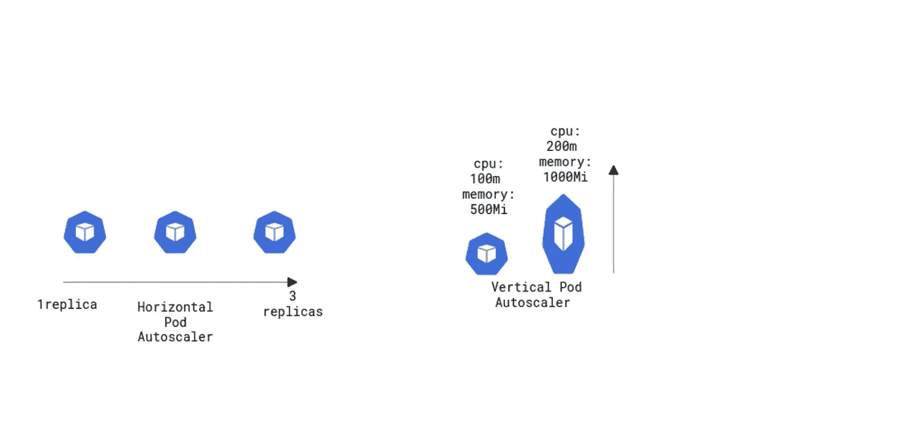
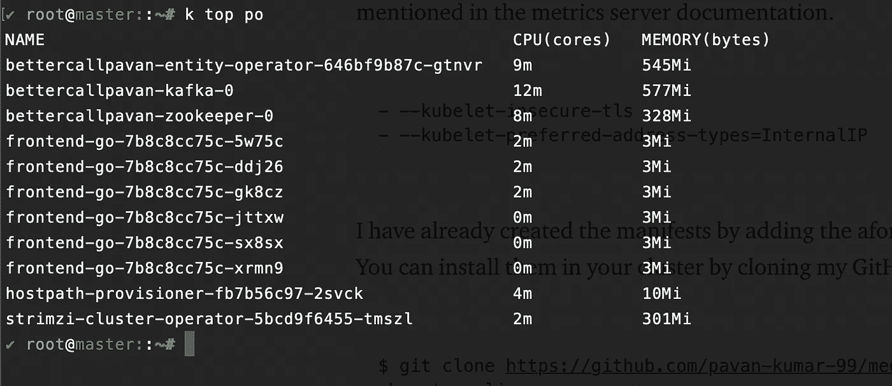
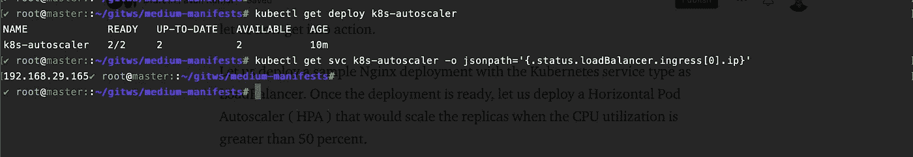
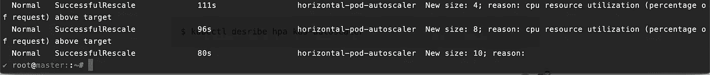
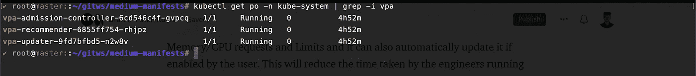
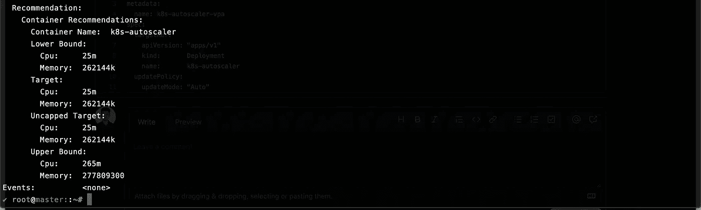
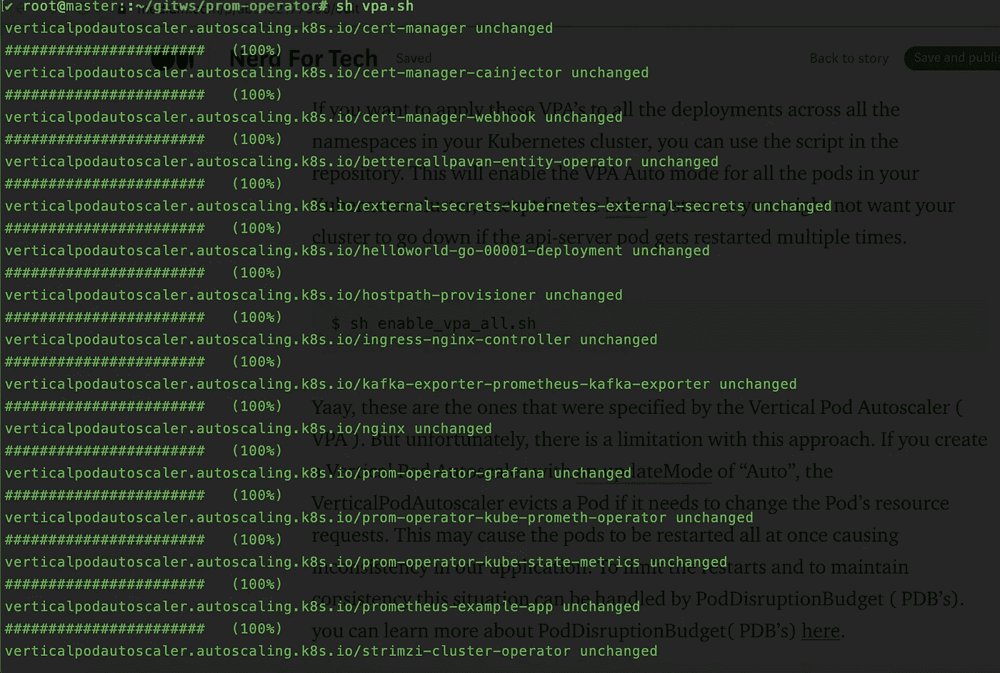

# Kubernetes 中的自动缩放(HPA / VPA)

> 原文：<https://medium.com/nerd-for-tech/autoscaling-in-kubernetes-hpa-vpa-ab61a2177950?source=collection_archive---------0----------------------->

使用垂直 Pod 自动缩放器(VPA)和水平 Pod 自动缩放器(HPA)在 Kubernetes 中自动缩放您的应用程序

什么是自动缩放？

自动缩放是一种方法，它根据应用程序的需求动态地增加/减少分配给应用程序的计算资源的数量。例如，您可能会遇到这样一种情况，即您的网站负载仅在每个月底增加。您可能需要额外的 web 服务器来处理每个月底的负载。但是在接下来的日子里，您的服务器处于闲置状态，而您每月的云账单也在增加。启用自动扩展后，可以根据负载和用户数量增加/减少服务器数量。随着世界走向 Kubernetes 时代，自动伸缩在容器化应用程序的可伸缩性中扮演着重要角色。在本文中，我们将尝试了解 Kubernetes 中可用的各种类型的自动缩放器，并尝试了解最适合 Kubernetes 应用的自动缩放器。



Kubernetes 中的自动缩放。使用 [cloudskew](https://app.cloudskew.com/) :)的图像归功于 Pavan Kumar

# 整个故事是关于什么的？(TLDR)

1.  了解 Kubernetes ( HPA / VPA)中各种类型的自动缩放。
2.  水平 Pod 自动缩放器(HPA)和垂直 Pod 自动缩放器(VPA)的现场演示。

# 先决条件

1.  Kubernetes 集群(可以是本地、AKS、EKS、GKE、Kind)。

# 故事资源

1.  GitHub 链接:【https://github.com/pavan-kumar-99/medium-manifests 
2.  GitHub 分支:自动缩放

## 正在安装度量服务器

要使水平 Pod 自动缩放器(HPA)和垂直 Pod 自动缩放器(VPA)工作，需要从 kubelet 导出指标。Metrics Server 从 Kubelets 收集资源指标，并通过 Metrics API 在 Kubernetes apiserver 中公开这些指标，供水平 Pod 自动缩放器和垂直 Pod 自动缩放器使用。你可以从[这里](https://github.com/kubernetes-sigs/metrics-server)安装度量服务器。但是如果您在本地集群(例如 Kind、自托管 Kubernetes 集群等)上安装 metrics 服务器，您必须添加 metrics 服务器文档中提到的这两个附加标志。

```
- --kubelet-insecure-tls
- --kubelet-preferred-address-types=InternalIP
```

我已经通过添加上述条目创建了清单。您可以通过克隆我的 GitHub repo 将它们安装到您的集群中。

```
$ git clone [https://github.com/pavan-kumar-99/medium-manifests.git](https://github.com/pavan-kumar-99/medium-manifests.git) \
-b autoscaling$ cd medium-manifests/ $ kubectl apply -f metrics-server.yaml $ kubectl top po ( This should now return all the metrics of your Pod ). 
```



来自度量服务器的 Pod 度量

## **水平 Pod 自动缩放器(HPA )**

水平机架自动缩放扩展部署中的机架数量。Statefulset、ReplicaSet 基于 CPU/内存利用率或应用程序公开的任何自定义指标。HPA 在控制回路上工作。每个部署、Statefulset、Replicaset 都有单独的 HPA。HPA 对象根据您指定的内存/CPU 阈值不断检查部署、状态集、副本集的指标，并不断增加/减少副本计数。通过使用 HPA，我们只需在需要时为额外的资源付费。好了，谈够了，现在让我们开始行动吧。

让我们使用 Kubernetes 服务类型作为负载平衡器来部署一个样例 Nginx 部署。部署就绪后，让我们部署一个水平 Pod 自动缩放器(HPA ),它会在 CPU 利用率超过 50%时缩放副本。

```
$ git clone [https://github.com/pavan-kumar-99/medium-manifests.git](https://github.com/pavan-kumar-99/medium-manifests.git) \
-b autoscaling$ cd medium-manifests/$ kubectl apply -f deploy.yaml $ kubectl get svc k8s-autoscaler -o jsonpath='{.status.loadBalancer.ingress[0].ip}'
```



部署和服务

部署就绪后，我们现在来创建 HPA。

因此，此 HPA 表示，部署 k8s-autoscaler 应始终具有最小副本数量 2，并且每当单元的 CPU 利用率达到 50%时，单元应扩展到 10 个副本。当 CPU 利用率低于 50%时，副本将缩减到 2。

```
$ kubectl apply -f hpa.yaml
```

现在，我们将向之前创建的服务发送一些 curl 请求。当 CPU 利用率达到 50%时，我们应该看到副本扩展到 10 个。

```
$ external_ip=$(kubectl get svc k8s-autoscaler -o jsonpath='{.status.loadBalancer.ingress[0].ip}')$ while true; do curl $external_ip ; done 
```

一旦 CPU 超过阈值(即 50%)，我们现在应该看到在 HPA 的事件中 pod 被扩大。

```
$ kubectl desribe hpa k8s-autoscaler
```



吊舱自动缩放到 10

```
$ kubectl get deploy k8s-autoscalerNAME             READY   UP-TO-DATE   AVAILABLE   AGEk8s-autoscaler   10/10   10           10          28m
```

让我们现在停止发送 curl 请求。现在，您应该会看到副本缩减为两个(即 minReplicas)。

**清理**

```
$ kubectl delete deploy k8s-autoscaler$ kubectl delete svc k8s-autoscaler$ kubectl delete hpa k8s-autoscaler
```

## **垂直 Pod 自动缩放器(VPA )**

与水平 Pod 自动缩放器(HPA)不同，垂直 Pod 自动缩放器(VPA)会自动调整 Pod 的 CPU 和内存属性。垂直 pod 自动缩放器(VPA)将自动使用合适的 CPU 和内存属性重新创建您的 Pod。这将为其他 pods 释放 CPU 和内存，并帮助您更好地利用 Kubernetes 集群。Kubernetes 工作节点得到了有效的利用，因为 Pods 使用的正是它们所需要的。垂直 Pod 自动缩放器(VPA)可以建议内存/CPU 请求和限制，如果用户启用，它还可以自动更新。这将减少工程师运行性能/基准测试来确定 CPU 和内存请求的正确值所花费的时间。好吧，现在让我们开始行动吧。

默认情况下，HPA 附带 K8s 集群。让我们在 K8s 集群中安装 VPA。

```
$ git clone [https://github.com/kubernetes/autoscaler.git](https://github.com/kubernetes/autoscaler.git)$ cd autoscaler/vertical-pod-autoscaler/$ ./hack/vpa-up.sh $ kubectl get po -n kube-system 
```



VPA 组件

现在让我们部署一个 nginx 部署示例，它需要 1GB 的 RAM 和 200m 的 CPU，限制是 50Gi 的 RAM 和 500m 的 CPU。

```
resources: limits: cpu: 500m memory: 50Gi requests: cpu: 200m memory: 1Gi
```

然而，上面的规范对于一个空闲的 nginx 部署来说太多了。让我们看看垂直吊舱自动缩放(VPA)如何帮助我们在这里。

```
$ git clone [https://github.com/pavan-kumar-99/medium-manifests.git](https://github.com/pavan-kumar-99/medium-manifests.git) \
-b autoscaling$ cd medium-manifests/$ kubectl apply -f deploy.yaml
```

上面的垂直 Pod 自动缩放器(VPA)表示使用垂直 Pod 自动缩放器(VPA)提供的 CPU/内存值在部署中自动重新创建 Pod。如果 updateMode 设置为`"Off"`，它只会给出建议，但不会自动更新(部署中的)pod。

```
$ kubectl apply -f vpa.yaml
```

现在，当您描述 VPA 时，您应该看到 VPA 已经为我们的 pod 提供了建议，并使用新的内存请求和限制重新创建了它们。



VPA 对豆荚的建议


用新的规格重新创建的吊舱

我们将通过选择其中一个副本并描述其内存/CPU 资源来验证这一点。

```
$ kubectl get po k8s-autoscaler-588f96c849-j5h4m -o jsonpath='{.spec.containers[0].resources}' | jq .{"limits": {"cpu": "62m","memory": "12500Mi"},"requests": {"cpu": "25m","memory": "262144k"}}
```

如果希望将这些 VPA 应用到 Kubernetes 集群中所有名称空间的所有部署中，可以使用存储库中的脚本。这将为您的 Kubernetes 集群中的所有 pod 启用 VPA 自动模式，除了 kube-system，因为如果 api-server pod 多次重启，您可能不希望您的集群停机。

```
$ sh enable_vpa_all.sh
```



所有名称空间和所有部署的 VPA

是的，这些是由垂直吊舱自动缩放器(VPA)指定的。但不幸的是，这种方法有一个局限性。如果您创建了一个 updateMode 为“Auto”的垂直 Pod 自动缩放器，则当需要更改 Pod 的资源请求时，Vertical Pod Autoscaler 会收回 Pod。这可能会导致 pod 立即重启，从而导致我们的应用程序不一致。为了限制重启和保持一致性，这种情况可以由 podisruptionbudget(PDB 的)来处理。你可以在这里了解更多关于 podisruptionbudget(PDB 的)[。](https://kubernetes.io/docs/concepts/workloads/pods/disruptions/)

```
$ kubectl apply -f pdb.yaml
```

这个 PDB 确保了 deploy k8s-autoscaler 的 1 个副本一直运行，没有任何重启。这将最终确保我们的应用程序在各种集群中断中的高可用性和一致性。

**清理**

```
$ kubectl delete deploy k8s-autoscaler$ kubectl delete svc k8s-autoscaler$ kubectl delete vpa k8s-autoscaler$ kubectl delete pdb k8s-autoscaler-pdb
```

## 结论

1.  水平 Pod 自动缩放和垂直 Pod 自动缩放可以一起使用，称为`MultidimPodAutoscaler` ( GKE 功能)。
2.  HPA 和 VPA 不应一起用于评估 CPU/内存。然而，理想的情况是，VPA 可用于评估 CPU 或内存，而 HPA 可用于评估外部指标(如 HTTP 请求数或活动用户数等)。

感谢阅读我的文章。希望你喜欢它。以下是我的一些其他文章，你可能会感兴趣。

直到我们再次相遇……..

# 被推荐的

[](https://www.techmanyu.com/creating-self-hosted-github-runners-in-a-kubernetes-cluster-fd05560de34a) [## 在 Kubernetes 集群中创建自托管 GitHub 运行程序

### 在您自己的 Kubernetes 集群上运行 GitHub 操作

www.techmanyu.com](https://www.techmanyu.com/creating-self-hosted-github-runners-in-a-kubernetes-cluster-fd05560de34a) [](/nerd-for-tech/introduction-to-crossplane-2f873ae0f9f3) [## 交叉平面简介

### 如何使用 Kubernetes 清单和 Crossplane 在云上创建任何资源。

medium.com](/nerd-for-tech/introduction-to-crossplane-2f873ae0f9f3) [](https://faun.pub/introduction-to-bitnami-sealed-secrets-bb5ae74d9a25) [## 比特纳米密封秘密介绍

### 如何使用 Sealed Secrets 和 Kubese 在 GitHub 中存储您的秘密

faun.pub](https://faun.pub/introduction-to-bitnami-sealed-secrets-bb5ae74d9a25) [](/nerd-for-tech/deploying-rabbitmq-on-kubernetes-using-rabbitmq-cluster-operator-ef99f7a4e417) [## 使用 RabbitMQ 集群操作器在 Kubernetes 上部署 RabbitMQ

### 在 Kubernetes 上运行 RabbitMQ，并使用一个简单的 Golang 应用程序进行测试。

medium.com](/nerd-for-tech/deploying-rabbitmq-on-kubernetes-using-rabbitmq-cluster-operator-ef99f7a4e417) 

## 参考

[](https://cloud.google.com/kubernetes-engine/docs/tutorials/autoscaling-metrics) [## 利用云监控指标自动扩展部署

### 发送反馈本教程演示了如何自动扩展您的谷歌 Kubernetes 引擎(GKE)工作负载基于…

cloud.google.com](https://cloud.google.com/kubernetes-engine/docs/tutorials/autoscaling-metrics) [](https://github.com/kubernetes-sigs/metrics-server) [## kubernetes-sigs/metrics-服务器

### Metrics Server 是一个可伸缩的、高效的容器资源度量源，用于 Kubernetes 内置的自动伸缩…

github.com](https://github.com/kubernetes-sigs/metrics-server)