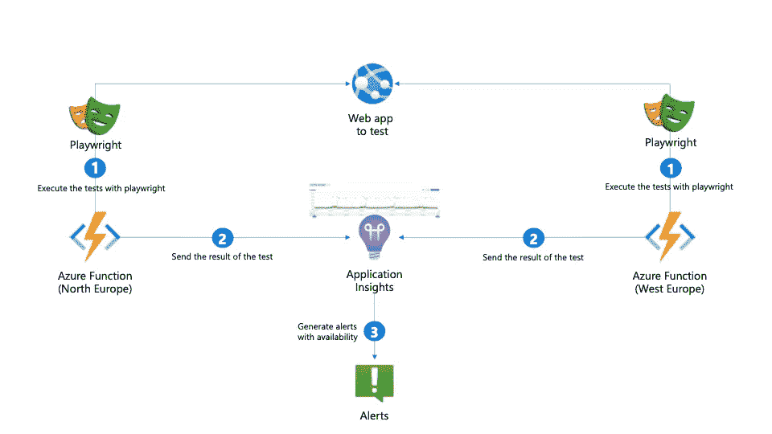
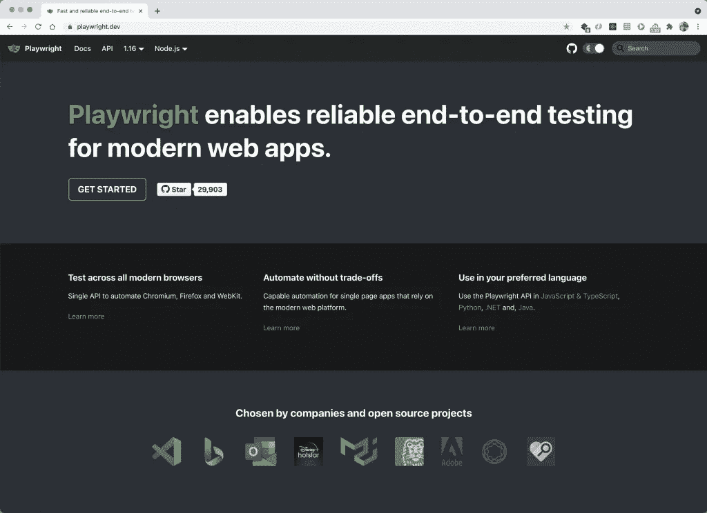
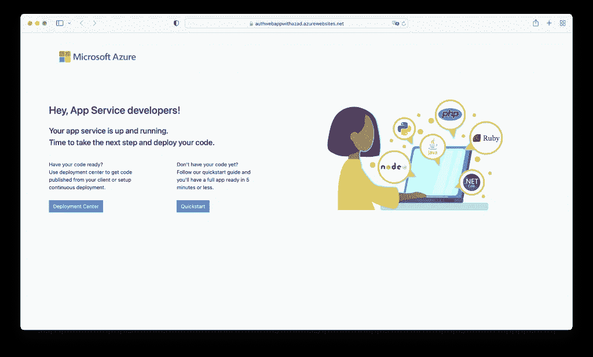
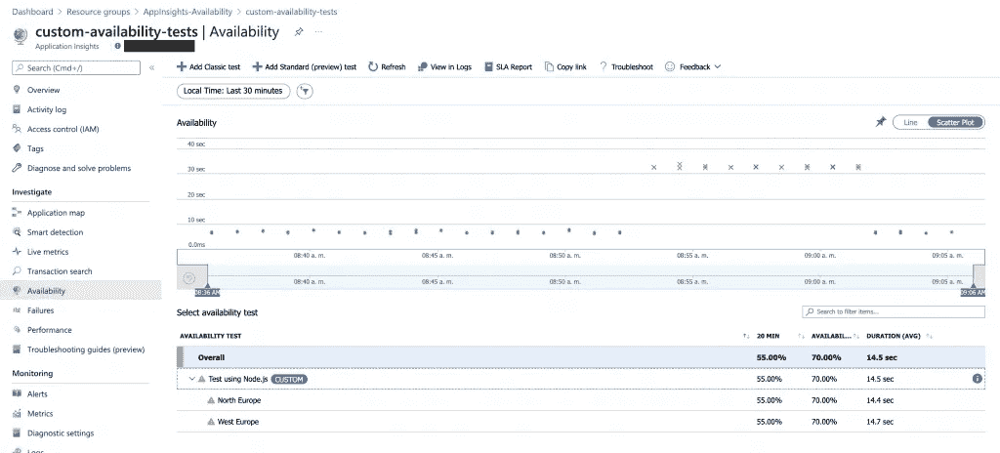
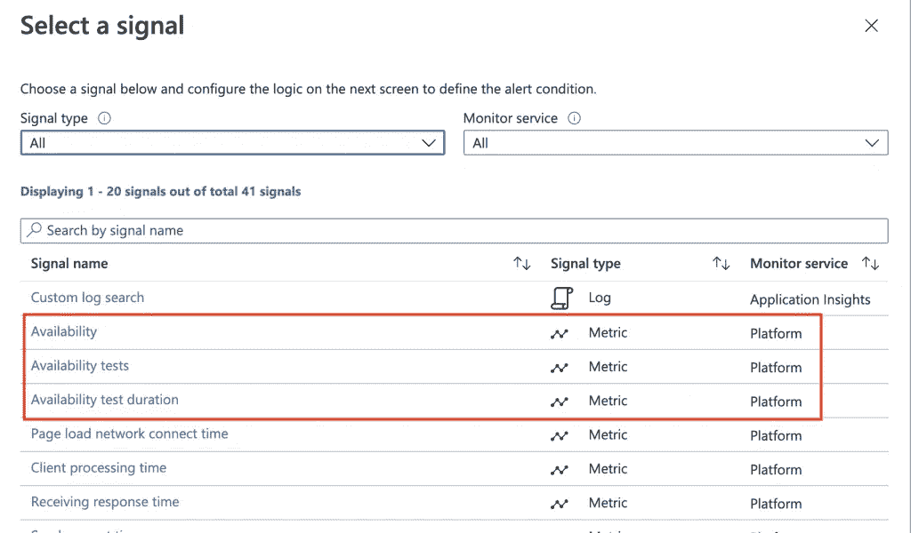

# 使用 Node.js 和剧作家进行可用性测试，以获得应用洞察

> 原文：<https://medium.com/nerd-for-tech/availability-test-with-node-js-and-playwright-for-application-insights-85a4c1d724e7?source=collection_archive---------1----------------------->


最近几天，我不得不工作的一个场景是创建个性化可用性测试，以验证一个网站仍然是活跃的，即使没有用户在周围转来转去。为了完成这项任务，我使用 Node.js 作为编程语言，并使用[剧作家库](https://playwright.dev/)来模拟必要的导航，以验证一切正常工作:



*用于概念验证的架构*

## 什么是剧作家？

剧作家是一个 API，你可以用它自动化 Chromium、Firefox 和 WebKit，从而从功能的角度测试你的应用程序。



它有用于 **Node.js、Java、Python 和。网**。在本文中，我们将使用后者。

## 使用剧作家登录 Azure 活动目录

首先需要做的是创建一个控制台应用程序:

```
*dotnet new console -n web-with-az-ad-playwright-dotnet*
```

接下来，您必须添加剧作家库:

```
dotnet add package Microsoft.Playwright
```

这是我用过的代码:

```
*//// See* [*https://aka.ms/new-console-template*](https://aka.ms/new-console-template) *for more information**using Microsoft.Playwright;**using var playwright = await Playwright.CreateAsync();
await using var browser = await playwright.Chromium.LaunchAsync(new BrowserTypeLaunchOptions { Headless = false });**//3\. Authenticate with Azure AD
Console.WriteLine("Testing authenticated web page with Azure AD");**var page = await browser.NewPageAsync();
await page.GotoAsync("<WEB_URL>");**//Interact with the login form:**//email
await page.FillAsync("input[type='email']", "<VALID_USER_EMAIL>");
await page.ClickAsync("input[type='submit']");**await page.WaitForNavigationAsync();**//password
await page.ClickAsync("[placeholder='Password']");
await page.FillAsync("input[name='passwd']", "<VALID_USER_PASSWORD>");
await page.ClickAsync("input[type='submit']");* *//Stay signed? Say no
await page.ClickAsync("text=No");**await page.WaitForNavigationAsync();**// await page.PauseAsync(); //Just for debugging**var title = await page.TitleAsync();**Console.WriteLine($"Title of the page {title}");*
```

**注意:**如果你对源代码感到惊讶，或者你认为它是缺失的东西😀，看看这个链接:[https://aka.ms/new-console-template](https://aka.ms/new-console-template)

如果用 Headless 运行它，您可以看到 Chromium 实例是如何生成的，并快速执行所有这些步骤。如果你正在做类似的事情，并且你不知道你的任何网页选择器，你可以使用*页面。PauseAsync ()* 这将停止进程，允许您浏览 web 字段，并将选择器返回给您。

有了这些信息后，如果您登录到此 web 应用程序，您将默认看到此页面:



## Node.js 和剧作家的测试

你需要做的下一件事是测试。这甚至可以位于控制台应用程序中，为此，您可以使用带有计时器类型触发器的 Azure 函数:

```
*const { chromium } = require('playwright-chromium');
const appInsights = require("applicationinsights");
const { v4 } = require('uuid');
var telemetryClient = new appInsights.TelemetryClient(process.env.APP_INSIGHTS_WEB);
const Stopwatch = require('statman-stopwatch');**module.exports = async function(context, myTimer) {
    var timeStamp = new Date().toISOString();* *if (myTimer.isPastDue) {
        context.log('JavaScript is running late!');
    }
    context.log('JavaScript timer trigger function ran!', timeStamp);* *//Create availability telemetry
    var availabilityTelemetry = {
        id: v4(),
        name: process.env.AVAILABILITY_TEST_NAME,
        runLocation: process.env.RUN_LOCATION,
        success: false
    };* *const stopwatch = new Stopwatch();
    const browser = await chromium.launch({ headless: true });* *try {
        //Create playwright flow        
        const page = await browser.newPage();
        stopwatch.start();* *context.log(`Navigating to: ${process.env.WEB_URL}`);
        await page.goto(process.env.WEB_URL);
        context.log(`Put the email ${process.env.TEST_USER_EMAIL}`);
        await page.type("input[type='email']", process.env.TEST_USER_EMAIL);
        await page.click("input[type='submit']");
        await page.waitForNavigation();* *context.log('Put the password');
        await page.click("[placeholder='Password']");
        await page.type("input[name='passwd']", process.env.TEST_USER_PWD);
        await page.click("input[type='submit']");
        await page.waitForNavigation();* *context.log('Say no');
        await page.click("text=No");
        await page.waitForNavigation();* *var title = await page.title();
        context.log('Title: ' + title);
        availabilityTelemetry.success = true;* *} catch (error) {
        context.log.error('Error: ' + error);
        availabilityTelemetry.success = false;* *//Create exception telemetry        
        telemetryClient.trackException({ exception: error });* *} finally {
        stopwatch.stop();
        var elapsed = stopwatch.read();
        context.log('Stopwatch: ' + elapsed);
        availabilityTelemetry.duration = elapsed;
        telemetryClient.trackAvailability(availabilityTelemetry);
        await browser.close();
        context.done();
    }
}*
```

每隔 1 分钟，我们使用剧作家运行这个测试，我们尝试使用从环境变量中获得的用户名和密码登录(理想情况下，它将存储在 Azure Key Vault 中)，最后我们获得页面的标题，它应该与示例页面相同。

如果您能够在没有超时的情况下完成所有步骤(例如，因为它找不到控件),这意味着一切都已顺利执行，因此测试是正常的。否则，它将在 Application Insights 本身中生成一个异常。

为了部署这个示例，我使用了 Visual Studio 代码，但是我用 Azure CLI 创建并配置了 Azure 函数，还添加了相应的应用程序设置:

```
*#Variables
#for the Azure Function
TEST_USER="<AZURE_AD_USER_EMAIL>"
TEST_SECRET="<AZURE_AD_USER_PASSWORD>"
WEB_TO_TEST="<THE_WEB_YOU_WANT_TO_TEST>"
APP_INSIGHTS_TO_REPORT="<APP_INSIGHTS_INSTRUMENTATION_KEY>"
AVAILABILITY_TEST_NAME="Test using Node.js"**#for Azure resources
RESOURCE_GROUP="Custom-Tests"
LOCATION="West Europe"
AZURE_FUNCTION_NAME="app-insights-availability-west"
AZURE_FUNCTION_PLAN="AzFuncNodejsPlan"
STORAGE_ACCOUNT_NAME="playwrightnodejswest"**#1\. Create Resource Group
az group create --name $RESOURCE_GROUP --location $LOCATION**#2\. Create Storage account
az storage account create --resource-group $RESOURCE_GROUP --name $STORAGE_ACCOUNT_NAME --location $LOCATION --sku Standard_LRS**#Get Azure Storage connection string
STORAGE_CONNECTION_STRING=$(az storage account show-connection-string --name $STORAGE_ACCOUNT_NAME --resource-group $RESOURCE_GROUP --output tsv)**#Create Azure Function Plan
az functionapp plan create --resource-group $RESOURCE_GROUP --name $AZURE_FUNCTION_PLAN --location $LOCATION --number-of-workers 1 --sku EP1 --is-linux**# Create Azure Function
az functionapp create --name $AZURE_FUNCTION_NAME --functions-version 3 --storage-account $STORAGE_ACCOUNT_NAME --resource-group $RESOURCE_GROUP --plan $AZURE_FUNCTION_PLAN  --runtime node --runtime-version 12**#Add app settings to the Azure Function
az functionapp config appsettings set --name $AZURE_FUNCTION_NAME --resource-group $RESOURCE_GROUP \
--settings WEB_URL=$WEB_TO_TEST \
RUN_LOCATION=$LOCATION \
TEST_USER_EMAIL=$TEST_USER \
TEST_USER_PWD=$TEST_SECRET \
APP_INSIGHTS_WEB=$APP_INSIGHTS_TO_REPORT \
AVAILABILITY_TEST_NAME=$AVAILABILITY_TEST_NAME \
PLAYWRIGHT_BROWSERS_PATH=0*
```

**注意** *:在这个例子中，我在 Visual Studio 代码中部署它。如果您已经创建了自己的 Azure 函数，请记住，要让剧作家在此服务中工作，您必须指明您希望在目的地完成依赖项的安装。这是通过修改* ***来实现的。vs code/settings . JSON****文件*

```
*{
    "azureFunctions.deploySubpath": ".",    
    "azureFunctions.projectLanguage": "JavaScript",
    "azureFunctions.projectRuntime": "~3",
    "debug.internalConsoleOptions": "neverOpen",    
    "azureFunctions.scmDoBuildDuringDeployment": true
}*
```

## 结果呢

如果您运行此测试一段时间，在 Application Insights 的**可用性**部分，您会看到类似这样的内容:



如你所见，绿点表示一切正常，而 Xs 表示我只是简单地停止了 web 应用程序😉意味着这个测试失败了。最重要的是，你可以设置警报，在系统停止工作时通知你。为此，在设置警报时，您会收到以下信号:

