# AWS 自动缩放|从单一位置缩放所有内容

> 原文：<https://medium.com/nerd-for-tech/aws-auto-scaling-scale-everything-from-a-single-place-5aab8ce64341?source=collection_archive---------7----------------------->

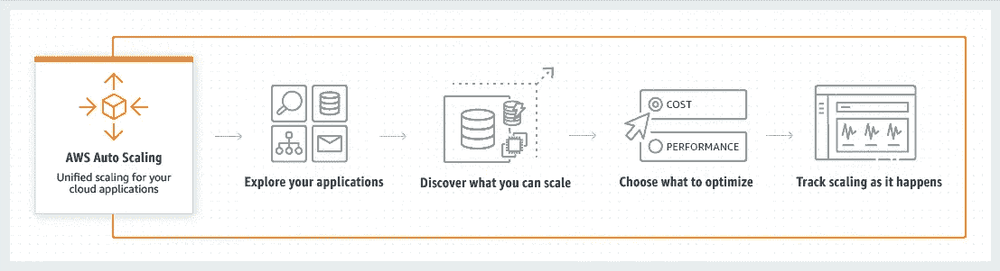

在 AWS 的最初几年，自动缩放等同于 EC2 自动缩放。但是随着时间的推移，ECS 和 DynamoDB 等支持自动伸缩的新服务出现了。在控制台的不同位置管理这些扩展策略变得越来越困难。因此，AWS 推出了集中式自动扩展服务，在单个面板中跨多个服务管理多个资源的扩展。

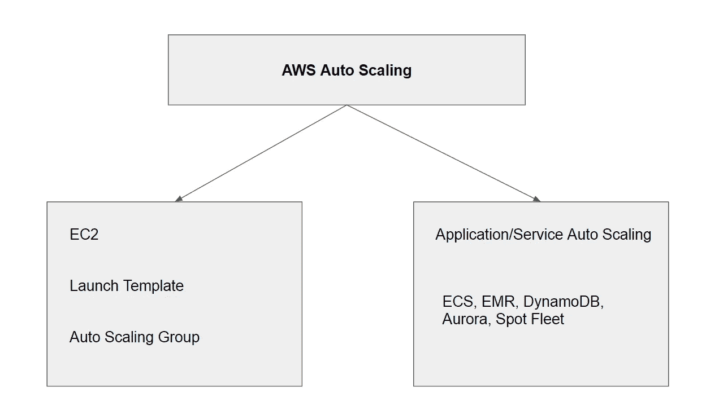

自动缩放允许您根据标准来缩放资源: **1。目标追踪 2。第三步。预定**

我们将首先看到目标跟踪。在控制台服务部分搜索自动缩放。

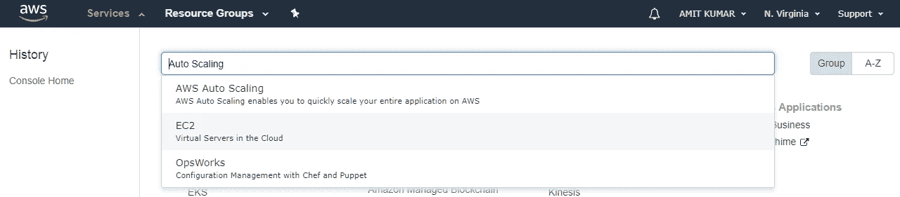

在这里，我们有四个步骤来创建新策略。 **1。查找可扩展资源 2。指定扩展策略 3。配置高级设置(可选)默认值在大多数情况下有效。4.审核并创建。**

**发现您的可扩展资源:**

***通过 Cloudformation 堆栈搜索*** *:* 提及堆栈名称，将发现所有可以自动缩放的资源。AWS Auto Scaling 只查找在提到的堆栈中定义的资源。它不会遍历嵌套的堆栈。因此，如果您在堆栈中创建了 ECS 群集，在子堆栈中创建了 ECS 服务，它将不会发现 ECS 服务。它只会发现 ECS 群集。为了能够被发现，集群和服务应该在同一个堆栈中。

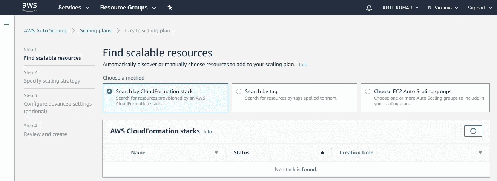

***按标签搜索:*** 如果您有嵌套堆栈，并且您想要将缩放策略应用到由子堆栈创建的资源，则不可能使用上述堆栈选项。在这种情况下，您应该使用**通过标签**进行搜索。将会发现所有具有所提到的标签关键字和值的资源。使用标签无法发现 ECS 服务和 Spot 车队请求。

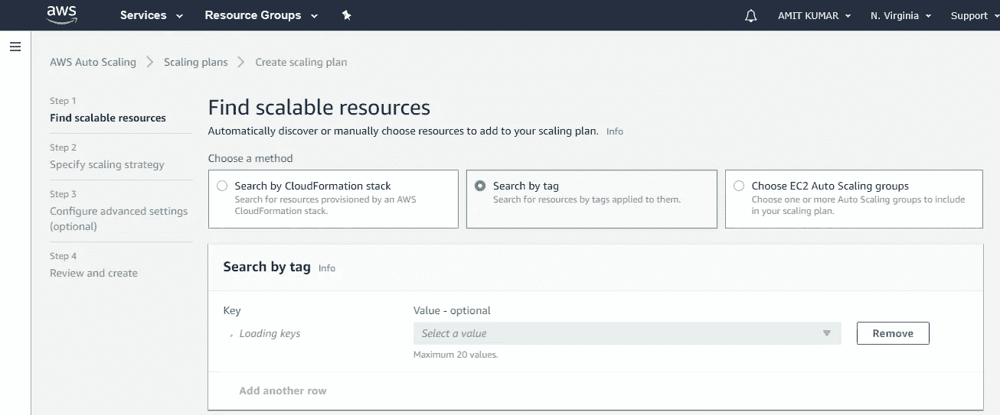

***选择 EC2 自动缩放组:*** 自动缩放是超级设置。它还包括 EC2 自动缩放。您提到自动扩展组名称，它会将扩展策略应用到相应的扩展组。

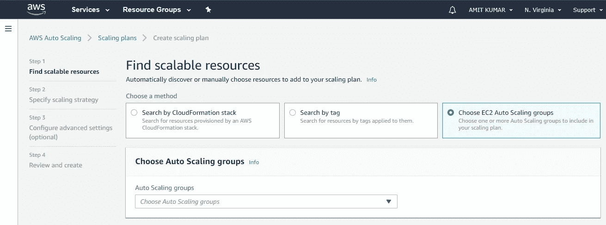

**缩放策略:**您有三种预定义的缩放策略可供使用。或者，您可以选择自定义，并使用自定义的 cloudwatch 指标提及您自己的策略。在配置详细信息中，您可以更改默认值。

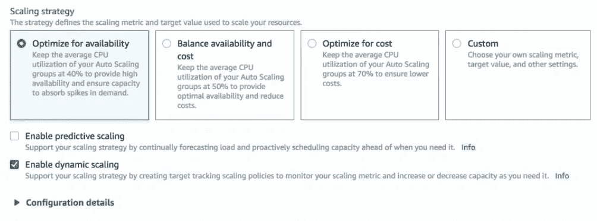

审核并创建。创建策略后，您可以进入资源并在 scaling policy 选项卡下查看应用的策略。

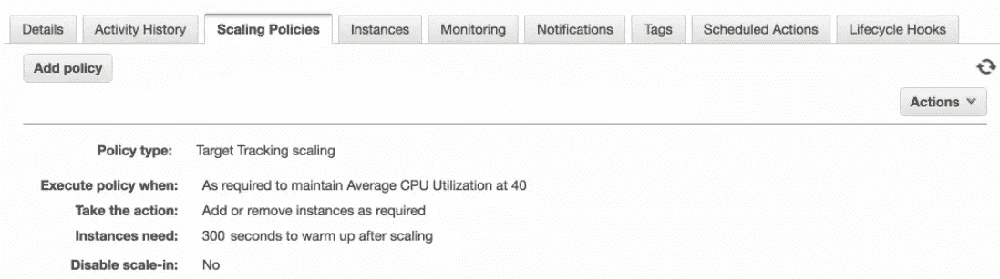

**步骤**:在这种类型的扩展中，我们需要在 cloudwatch 中创建自己的警报，并在此基础上添加步骤。例如，如果 CPU 利用率在 50–60 之间，则添加一个实例，如果超过 60，则开始添加两个而不是一个实例。

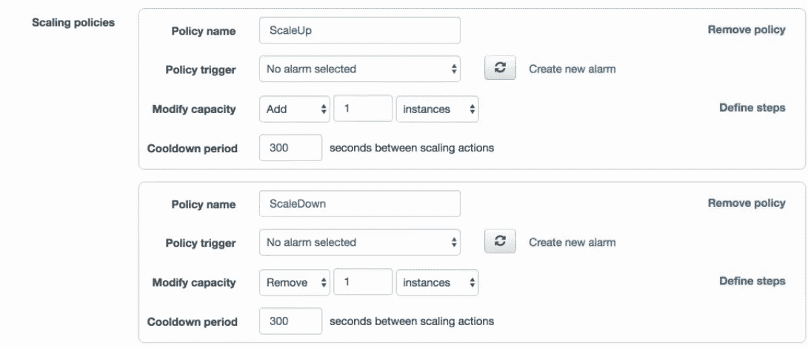

**预定**:按时间表调整资源，比如说，周一增加产能，周末减少产能。这里需要注意的一点是时间是 UTC。

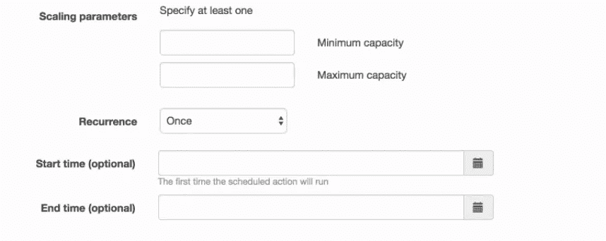

如果你想有一个自定义的时间，然后选择自定义，并输入 cron 表达式。

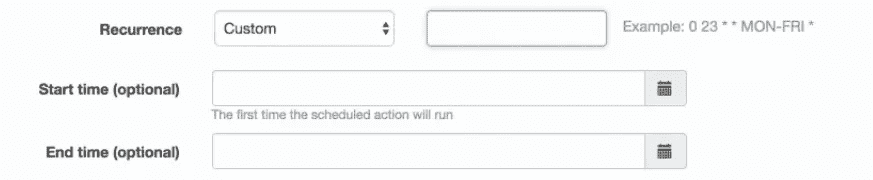

希望这对你有帮助。