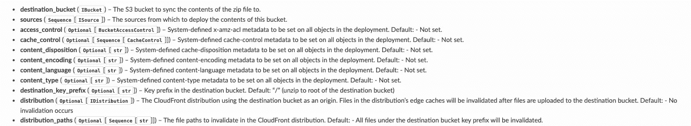

# AWS CDK BucketDeployment —您应该使用它吗？

> 原文：<https://medium.com/nerd-for-tech/aws-cdk-bucketdeployment-should-you-use-it-a4c040c64ac0?source=collection_archive---------2----------------------->

有问题的 CDK 构造是 [BucketDeployment](https://docs.aws.amazon.com/cdk/api/latest/python/aws_cdk.aws_s3_deployment/BucketDeployment.html) ，它是 S3 部署模块或包的一部分。从 constructs api 文档中，您会读到:

`**BucketDeployment**`用的内容填充 S3 桶。来自其他 S3 存储桶或本地磁盘的 zip 文件。

**用例**:由 CloudFront 服务的位于 S3 的站点。

对于那些寻求简单方法来管理该部署，然后使 CloudFront 发行版失效的人来说，这个构造看起来是一个很有吸引力的选择。你会问，有那么简单吗？是的，它是。下面是参考 api 参数的一个片段，其中的“destination_bucket”和“distribution”将是您希望与您的用例相关联的内容。

对于使用 CICD 的应用程序，当您在堆栈中包含 BucketDeployment 时，可以将构建构件传递给构造，以推送到 S3 存储桶，然后由为您提供的自定义 lambda 发出无效请求。这对我和我为之工作的客户都有效，因为我们不必处理交叉帐户权限，因为堆栈和 cdk 代码已经处理了它们。

**哪里出了问题**:

随着项目的扩大和站点的增长，我们看到了我们使用这个构造的两个好处的压力:

**S3 部署**:

*   构建工件的部署由 lambda 处理，它将所需的资产作为 zip 文件下载下来，然后提取内容以上传相关文件。看到问题了吗？
*   下载一个 zip 文件并解压。在 lambda 中，您有两倍大小的站点工件，在文件系统上可以达到 512Mb，除非您有额外的存储空间由 EFS 管理。对于非 vpc 依赖的应用程序架构，这是不必要的依赖。

**Cloudfront 失效**:

*   无效化似乎对我们很有效，但事实并非如此。[等待无效完成失败](https://github.com/aws/aws-cdk/issues/15891)谈论从 8 月 21 日起注意到的一个持续问题。
*   我们注意到多个失效并行发生，状态为“进行中”,最终定制资源超时，构建失败。在许多情况下，构建和失效可能已经生效，并且构建会被标记为失败。有人可能会说，最好提醒你注意背景中可能需要注意的任何问题。

# 我们最后得到了什么？

我们最终移除了 BucketDeployment 构造，并选择在基础设施部署后使用 aws cli 处理静态站点部署和 CloudFront 失效。

构建背后的想法是值得称赞的，随着对注意到的问题的进一步改进，从长远来看，这可以帮助许多人。