# AWS CDK:为重用而构建

> 原文：<https://medium.com/nerd-for-tech/aws-cdk-structuring-for-re-use-57ce6b90065?source=collection_archive---------1----------------------->

CDK 是一个用你选择的编程语言(从当前支持的列表中)为你的基础设施建模的框架。如今，我们都很熟悉使用某种基础设施作为代码框架来提供云基础设施的想法；Terraform、AWS CloudFormation、ARM templates、Pulumi 等等。

和往常一样，我学习或使用框架的思维过程是找到我可以移动或挤压的旋钮，使我的生活变得简单，具有内置的可重用性。混合了基础设施建模框架和编程语言的整体思想给了你很多自由去做你想做的事情。这是我的观点，你可以找到更好的选择来满足你的需求。

*   选择语言 : Python
*   **参考库**:[https://docs . AWS . Amazon . com/CDK/API/latest/python/modules . html](https://docs.aws.amazon.com/cdk/api/latest/python/modules.html)
*   参考栈:一个简单的无服务器栈，包含 Api 网关、SQS、Lambda 和 DynamoDb。

# 一些关键术语:

*   **构造:**构造是 AWS CDK 应用程序的基本构建模块。一个构造代表一个“云组件”，封装了 AWS CloudFormation 创建组件所需的一切。
*   **栈**:AWS CDK 中的部署单元称为*栈*。在堆栈范围内定义的所有 AWS 资源，无论是直接的还是间接的，都作为一个单元提供。

# 先决条件:

*   您对 AWS CloudFormation 或其他一些 IAC 框架有基本的了解。
*   您对云资源中可用的旋钮有所了解。

# 迭代 1:将所有这些混合到一个单一的构造或堆栈中

我不知道如何开始，所以就这样了。我开始引用列出的 aws_cdk 模块，并将资源一个接一个地添加到单个堆栈中。

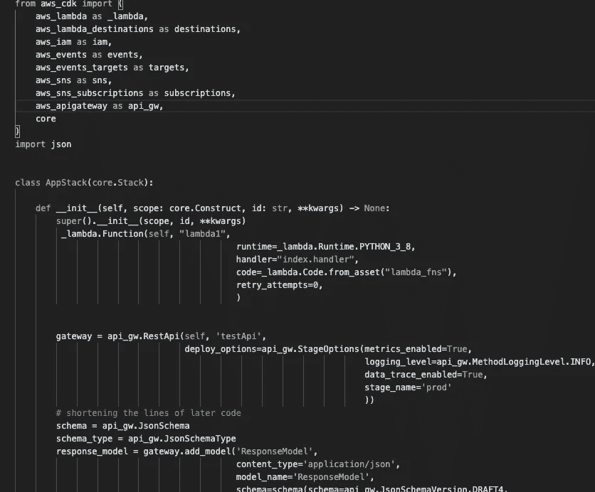

CDK 合成了我的代码，并创建了一个有效的 CloudFormation json 作为输出。

# 迭代 2:将资源分离成它们自己的构造

这里的关键词是构造。我喜欢把它们看作是您希望在应用程序堆栈中使用的资源的逻辑分组。

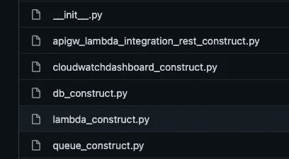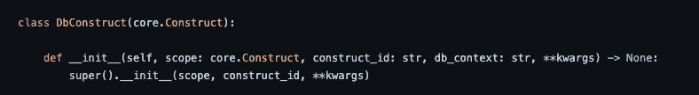

您可以将这些引用到应用程序堆栈中，就像您已经创建的 python 模块一样，从而为您提供一些灵活性。你可以反对我上面关于队列和网关之间集成的模块或结构的分离，这是正确的。我在这个过程中犯了一些错误，以为这是更简单的处理方式，结果却不是。

那么如何在堆栈中引用它们呢？

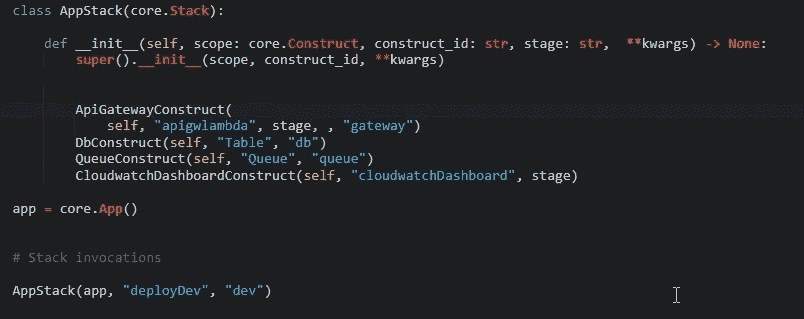

# 迭代 3:移除构造中的硬编码值

当我构建这些结构时，它们被链接到一些数据，比如函数名、函数代码的路径、要使用的标签等等。

欢迎上下文。我开始使用上下文作为向我的构造中注入数据的方式。(上面一张图中的 db_context)。在 CDK 有一些这样的网站，我开始使用“cdk.json”。我如何使用它？我可能已经陷入了我想用一个构造做的一些定制的兔子洞。

它们如何翻译回结构？CDK 提供了一个漂亮的“self.node.try_get_context()”函数来引用上下文 json 文件中的值。

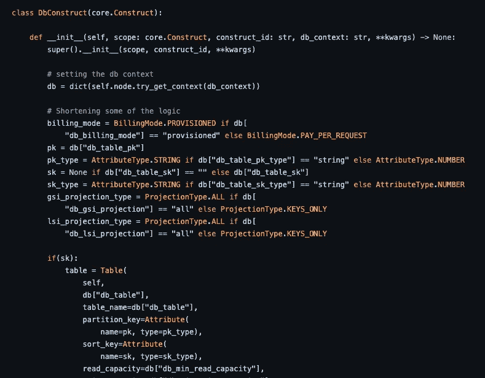

这不会给使用该模块的应用程序堆栈带来任何变化。

# 迭代 4:使构造通用化，并将它们放入 repo 中

即使使用上下文，我仍然在我的构造中使用一些集成，如 ApiGateway/Lambda 集成，我需要另一个构造来处理独立的 Lambda。简单点，好吗？

一旦你把它们分成基于资源的结构，我们如何正确的集成？您可以将它们作为属性公开，以便在 python 模块中使用。

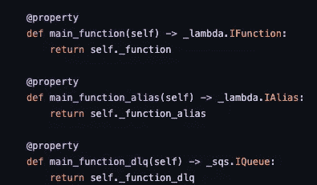

这就带来了一个问题:我如何处理所有的集成？

*   ApiGateway-> Lambda(一些临时 lambda)-> SQS -> Lambda -> DynamoDb
*   我创建了一个应用程序集成结构，将它们缝合在一起。您在下面看到的输入是来自每个构造的引用。

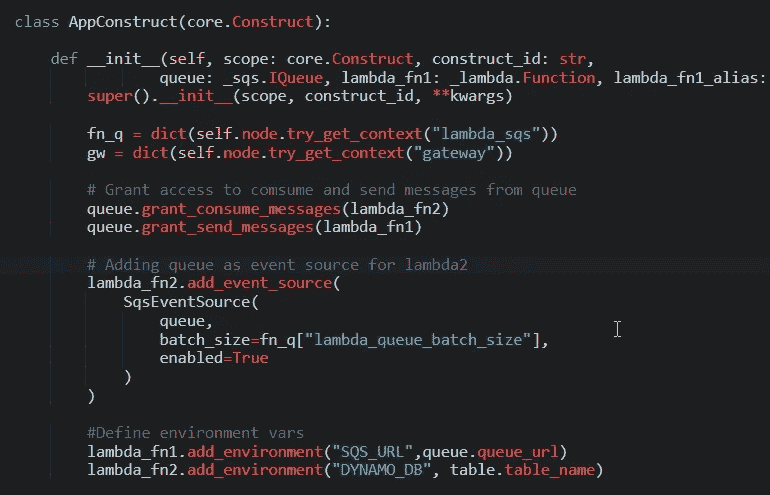

对应的 app.py

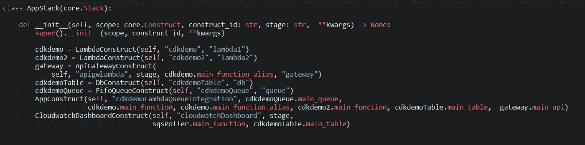

**最终变化:**在启动虚拟环境时，将您构建的构件移动到一个单独的 repo 中，并使其成为您的 requirements.txt 的一部分。

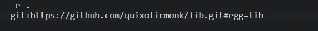

# 最终想法:

我最后得到的是:

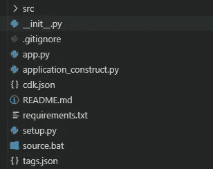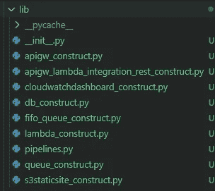

*   构造库帮助我定义了一些好的实践，当我创建这些资源时，我会包括这些实践。
*   您总是可以将构造设置为 python 模块，并通过一些工件存储使它们可用。
*   AWS 以 solution constructs 的名义发布了几个实验性的构造，可能有助于开始:【https://aws.amazon.com/solutions/constructs/patterns/? constructs-master-cards . sort-by = item . additional fields . headline&constructs-master-cards . sort-order = ASC
*   Python 文档和示例有时是不正确的，我不得不参考 typescript 变体来获得正确的前进路径。
*   AWS CDK 版进展迅速。cli 版本在两周内升级了 5-6 个次要版本。