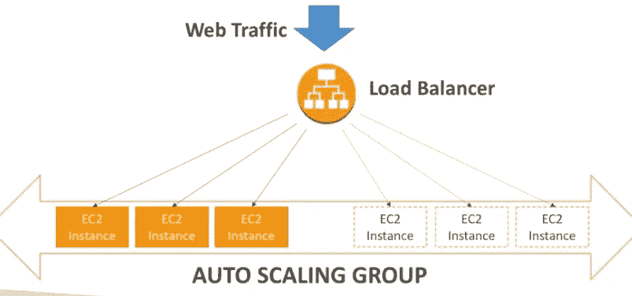
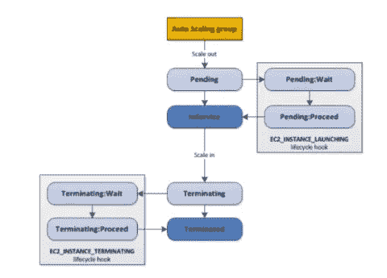

# AWS 认证解决方案架构师— ASG

> 原文：<https://medium.com/nerd-for-tech/aws-certified-solution-architect-asg-cd49d62b3f5f?source=collection_archive---------1----------------------->

大家好，在本教程中，我们将讨论自动缩放组。ASG 用于横向扩展或纵向扩展，以匹配网络负载。这有助于轻松快速地创建和删除实例。我们在上一个教程中讨论了负载平衡器。

 [## AWS 认证解决方案架构师— ELB

### 大家好，在本教程中，我们将讨论负载平衡器。在开始之前，让我们先了解一下什么是…

billa-code.medium.com](https://billa-code.medium.com/aws-certified-solution-architect-elb-32365e43b5e1) 

利用这些知识，我们知道负载平衡器如何处理网络负载。所做的是在实例之间分配负载。如果您记得我们是否有跨区域负载平衡，那么此负载将在所有实例中平均分配。但是，请想一想这些实例集不足以处理负载的情况。在这种情况下，ASG 帮了大忙。它将根据负载创建新的实例。

现在您可能会想，如果应用程序开始创建成千上万个实例，在这种情况下，我们可以为 ASG 配置自动伸缩警报。这些警报基于 cloudwatch 警报。此外，这些警报可用于创建扩大/缩小策略。

现在让我们来谈谈 ASG——动态扩展策略。有四种方法可以做到这一点，

*   目标跟踪比例——只需检查是否超出特定指标即可
*   简单/分步扩展—如果一个指标超过该值，则应创建该数量的实例，反之亦然。
*   计划的操作—在特定时间段的某一天，实例数量应该增加
*   预测缩放

以下是一些可以衡量的好指标

*   CPU 利用率
*   ResquestCountPerTarget
*   平均网络输入/输出
*   任何自定义指标

ASG 违约终止政策如下:

1.  找到实例数量最多的可用区域(AZ)
2.  如果 AZ 中有多个实例可供选择，请删除具有最早启动配置的实例

默认情况下，ASG 试图平衡 AZ 中的实例数量。以下是 ASG 实例的生命周期。

您可以配置自动伸缩组，根据应用程序负载平衡器运行状况检查而不是 EC2 状态检查(默认)来确定 EC2 实例的运行状况。当 EC2 实例未通过 ALB 运行状况检查时，它会被标记为不正常，并将在 ASG 启动新的 EC2 实例时终止。

对于每个自动缩放组，每次缩放活动后都有一个冷却期。在此期间，ASG 不会启动或终止 EC2 实例。这给了指标稳定下来的时间。冷却时间的默认值是 300 秒(5 分钟)。