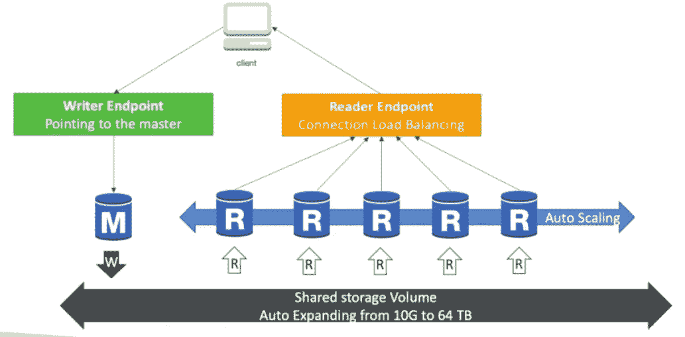
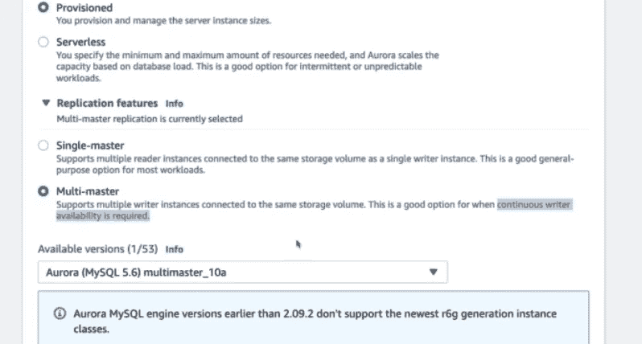
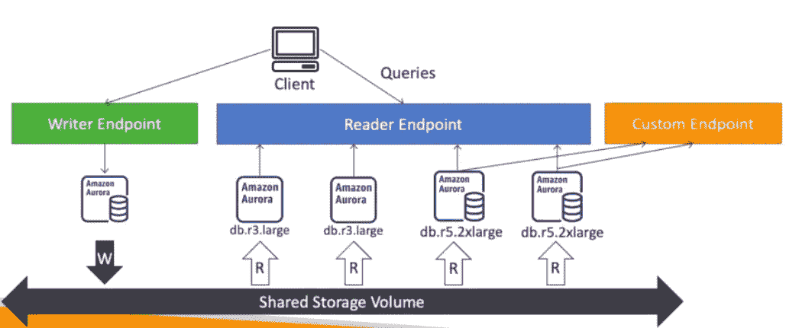

# AWS 认证解决方案架构师— Aurora

> 原文：<https://medium.com/nerd-for-tech/aws-certified-solution-architect-aurora-b672e0435787?source=collection_archive---------2----------------------->

大家好，在我们的上一个教程中，我们讨论了 AWS RDS，并讨论了很多关于如何创建和管理 RDS 实例的内容。

 [## AWS 认证解决方案架构师— RDS

### 大家好，在本教程中，我们将讨论关系数据库服务。该服务允许用户…

billa-code.medium.com](https://billa-code.medium.com/aws-certified-solution-architect-rds-1c80bfc6b387) 

在本教程中，我们首先将了解 Aurora DB，它是 AWS 拥有的数据库类型。这同时支持 PostgresSQL 和 MySQL，从性能角度来看，这确实是一个很好的选择。以 10GB 为增量，sorag 可以扩展到 128TB。此外，在部署 Aurora 时，它创建了一个集群，而不是只有一个读取副本的实例，复制过程也更快。主要缺点是它的成本比我们在普通 RDS 上花费的成本高 20%,但从效率角度来看，这是最好的。

为了实现我之前提到的高可用性和可扩展性，Aurora cluster 提供了多达 15 个读取副本，这些副本可以跨多个可用区域(AZ)分布。

查看该图，我们可以看到一个写入端点和多个读取副本，后者可以扩展到 15 个，最酷的功能是读取副本通过负载平衡端点连接。如果您需要多个 writer 实例，在创建名为 multi master 的数据库时还有一个选项。

以下是极光的特征，

*   自动故障转移
*   备份和恢复
*   隔离和安全
*   行业合规性
*   按钮缩放
*   零停机自动修补
*   高级监控
*   日常保养
*   回溯—无需备份即可恢复任意时间点的数据

由于使用了相同的 RDS 引擎，所有的安全特性都与我们在 [RDS 教程](https://billa-code.medium.com/aws-certified-solution-architect-rds-1c80bfc6b387)中讨论的相同。

如果我们需要在一些读取副本上运行分析查询。然后，可以为这些副本提供大型实例，然后创建一种特殊类型的端点，称为自定义端点。

Aurora 甚至提供了按秒付费的无服务器选项，对于不频繁、间歇或不可预测的工作负载来说，这是一种经济高效的方式。数据库实例化是自动化的，自动扩展基于实际使用。

此外，我们还有 Aurora multi master 和 Aurora global 等功能。这些确实有助于灾难恢复和高可用性。Aurora 还提供了将基于 AWS 的 ML 模型包含到数据库数据中的选项。支持亚马逊 SageMaker 和亚马逊领悟。