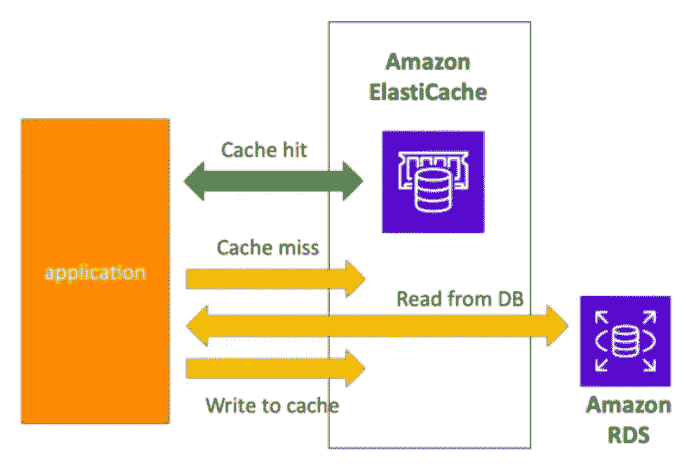

# AWS 认证解决方案架构师—elastic cache

> 原文：<https://medium.com/nerd-for-tech/aws-certified-solution-architect-elasticache-20bbb9769b8b?source=collection_archive---------3----------------------->

嗨，伙计们，缓存在内存数据库中，具有超快的性能。在之前的教程中，我们讨论了 RDS。

 [## AWS 认证解决方案架构师— RDS

### 大家好，在本教程中，我们将讨论关系数据库服务。该服务允许用户…

billa-code.medium.com](https://billa-code.medium.com/aws-certified-solution-architect-rds-1c80bfc6b387) 

就像 RDS 管理关系数据库一样，ElastiCache 管理 Redis 或 Memcached。对于读取密集型工作负载，这有助于减少负载。这使得应用程序成为无状态的。

通常在应用程序中，我们使用缓存来存储经常使用的数据。在直接从数据库中读取之前，它首先检查缓存。缓存应该有更好的失效技术，以确保缓存中的数据与数据库同步。

既然是用 ElastiCache 来管理 Redis 和 Memcached，那我们就来看看两者的区别。Redis 有点类似于 RDS，它使用复制来支持可伸缩性和高可用性，但 Memcached 使用分片来将数据放入多个节点中，由于没有使用复制，因此不存在高可用性。虽然 Redis 支持持久性，但 Memcached 不支持。Redis 有备份，Memcached 没有。

为了安全起见，Redis 有 redis Auth，它支持 SSL 动态加密。Memcached 支持基于 SASL 的身份验证。可以添加安全组来控制访问。

ElastiCache 有 3 种模式，

*   延迟加载—读取的数据被缓存，因为没有更新发生，数据可能是陈旧的
*   直写—将数据写入数据库时，在缓存中添加或更新数据
*   会话存储—将临时会话数据存储在缓存中。

在游戏排行榜等用例中，可以使用 Redis 排序集，因为它具有唯一性和元素排序。

这是关于 AWS 如何支持缓存的，非常感谢您阅读本教程。