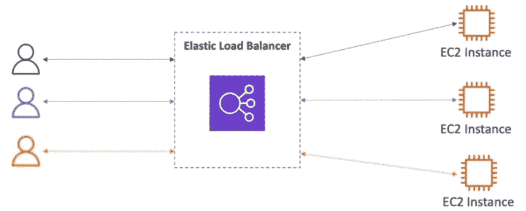
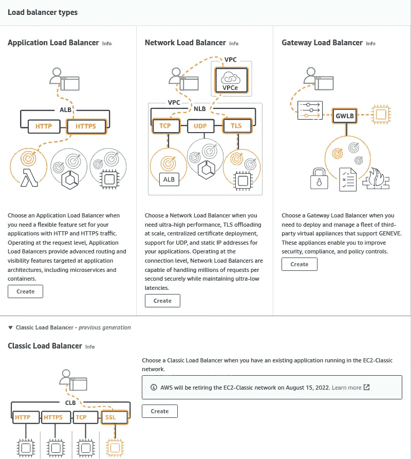

# AWS 认证解决方案架构师— ELB

> 原文：<https://medium.com/nerd-for-tech/aws-certified-solution-architect-elb-32365e43b5e1?source=collection_archive---------1----------------------->

大家好，在本教程中，我们将讨论负载平衡器。在深入探讨之前，让我们先了解一下什么是可伸缩性。可伸缩性意味着应用程序或系统可以通过适应来处理更大的负载。有两种类型的可伸缩性，

*   垂直可伸缩性—增加应用程序实例的大小
*   水平可伸缩性—增加应用程序的实例数量

现在我们来讨论一下什么是负载均衡。负载均衡是将流量转发到多个下游服务器的服务器。

负载平衡器，

*   将负载分散到多个下游实例
*   向您的应用程序提供单点访问(DNS)
*   处理下游实例的故障
*   对实例进行定期运行状况检查
*   为您的网站提供 SSL 终端(HTTPS)
*   用 cookies 增强粘性
*   跨区域的高可用性
*   将公共交通与私人交通分开

ELB 的意思是弹性负载平衡器，这是一个**管理负载平衡器**。这个负载平衡器由 AWS 管理，他们保证它将使用最新的升级、高可用性和易维护性。对下游实例进行健康检查，以检查可用性。如果一个实例不正常或正在执行另一个任务，则会发生连接耗尽。

AWS 中有 4 种类型的负载平衡器，

*   CLB —经典负载平衡器(支持 TCP、HTTP 和 HTTPS，运行状况检查基于 TCP 或 HTTP，固定主机名)
*   ALB —应用负载平衡器(HTTP、目标组、容器、支持 HTTP/2 和 WebSocket、重定向)—非常适合 docker 和 Amazon ECS 等基于微服务和容器的应用。端口映射功能，用于重定向到 ECS 中的动态端口。跨区域负载平衡始终开启。
*   NLB —网络负载平衡器(将 TCP 和 UDP 流量转发到您的实例，延迟更少，每秒数百万次请求，每个 AZ 有一个静态 IP)
*   GWLB —网关负载平衡器(在网络层 IP 数据包上运行。透明网络网关、负载平衡器、端口 6081 上的 GENEVE 协议

网络负载平衡器每个 AZ 有一个静态 IP 地址，您可以为其附加一个弹性 IP 地址。应用程序负载平衡器和传统负载平衡器有一个静态 DNS 名称。

要创建负载平衡器，请转到 EC2 服务，在页面左侧，您可以看到一个名为负载平衡的部分。单击它，并在屏幕中单击“创建负载平衡器”按钮。

您可以在这里选择您需要的负载平衡器。接下来，您可以将创建的负载平衡器添加到 EC2 实例中。

虽然我们不能在负载平衡器中选择哪个客户端将与哪个实例连接，但有一种方法可以确保一个客户端只与一个实例连接。这被称为粘性会话。这里使用了基于应用程序的 cookie。因为只有 CLB 和 ALB 执行基于 HTTP 的平衡，所以只有这两个与粘性会话兼容。

当使用应用程序负载平衡器将流量分配给 EC2 实例时，您将从其接收请求的 IP 地址将是 ALB 的私有 IP 地址。为了获得客户端的 IP 地址，ALB 添加了一个名为“X-Forwarded-For”的附加头，其中包含客户端的 IP 地址。

作为另一个功能，我们可以使用 SSL 证书来允许客户端和负载平衡器之间的流量在传输过程中被加密。使用 SSL 套接字层可以加密，使用 TLS 是一个较新的版本，其中传输层安全性提供同样可以做到。实现这一点时，负载平衡器中可以有多个 SSL 证书。SNI 解决了这个问题，为正确的目标找到了正确的证明。SNI 只支持 ALB 和 NLB。

根据我们目前掌握的知识，假设您在一个弹性负载均衡器前运行一个 10 EC2 实例的网站。您的用户抱怨说，当他们在网站页面之间移动时，网站总是要求他们重新认证。您感到困惑，因为它在您的机器上和带有 1 个 EC2 实例的开发环境中工作得很好。原因可能是什么？

在这里，您可以看到不同的请求最有可能进入不同的实例。因此，要将客户端连接到一个特定的实例，必须启用粘滞会话。在这种情况下，它可能已被禁用。

希望你能学到一些关于 ELBs 的知识。下节课再见。再见:)