# AWS 认证解决方案架构师— IAM

> 原文：<https://medium.com/nerd-for-tech/aws-certified-solution-architect-iam-8930ce442515?source=collection_archive---------7----------------------->

IAM 的意思是身份和访问管理服务。在前面的教程中创建 AWS 帐户时，我们为 AWS 帐户创建了 Root 帐户。如果我是一个组织，将会有不同的团队和不同的人。所以 IAM 是用来给这些人权限的。在 IAM 中，用户是人，他们可以分组，组只包含用户，不包含其他组。一个用户可以属于不同的组。可以将用户或组分配给策略。这些策略被写成 JSON 文档。策略用于授予权限，在授予权限时，您应该遵循“最小特权原则”，这意味着我们不会授予用户超出其需求的权限。

下面显示了上一个教程的链接。

[](https://billa-code.medium.com/aws-certified-solution-architect-intro-2eb2942d11e7) [## AWS 认证解决方案架构师—简介

### 大家好，这是新的教程系列，希望是您在 AWS 认证解决方案架构师中的主要助手…

billa-code.medium.com](https://billa-code.medium.com/aws-certified-solution-architect-intro-2eb2942d11e7) 

要访问 IAM 服务，请转到 AWS 控制台中的搜索栏，键入 IAM，然后单击 IAM 按钮。

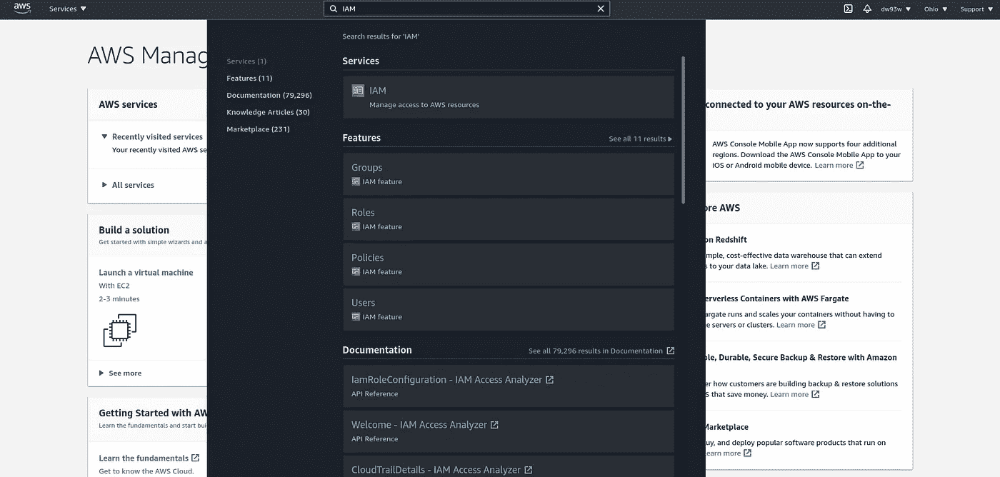

点击后，您将进入 IAM 控制面板。


首先，让我们创建一个用户组。单击屏幕左侧的用户组，然后给出一个名称。

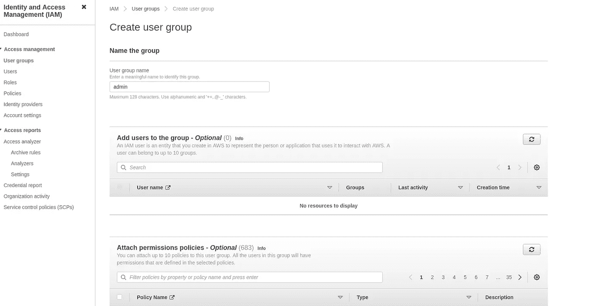

现在，在附加权限策略中有一个搜索栏，在其中键入 admin，找到管理访问策略集并选择它。

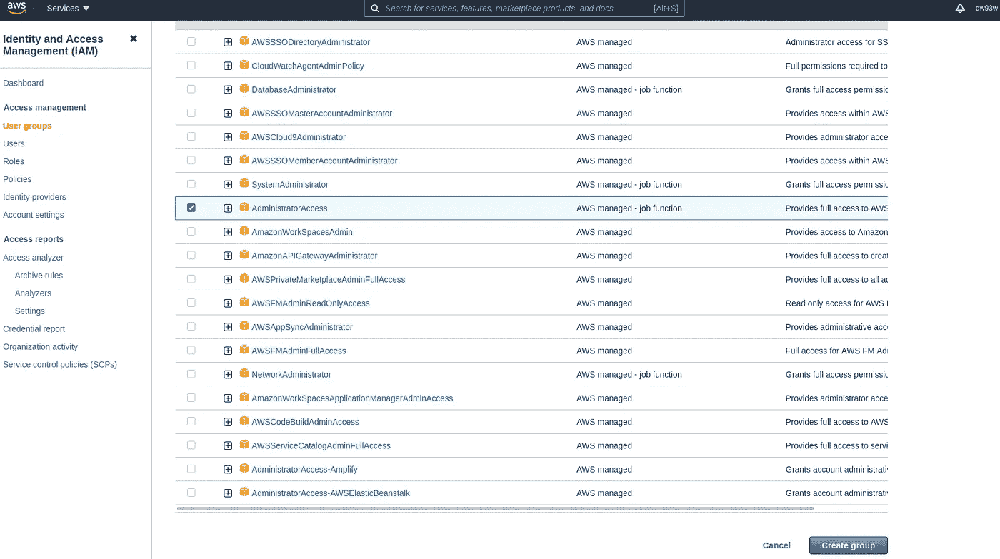

如果我们单击策略中的+按钮，我们将看到这样的策略文档。

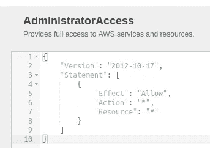

这里的版本是 AWS 策略版本，作用是允许还是拒绝。动作表示此策略适用的动作列表，资源表示此策略允许的资源列表。看到这里，我们可以了解管理员用户可以访问所有资源和所有操作。

现在按下创建组按钮。现在，我们已经成功创建了 admin 用户组，下一步将创建一个用户添加到该组中。为此，请转到仪表板中的用户选项卡，然后按下它。在出现的屏幕中，按添加用户按钮。添加如下详细信息。

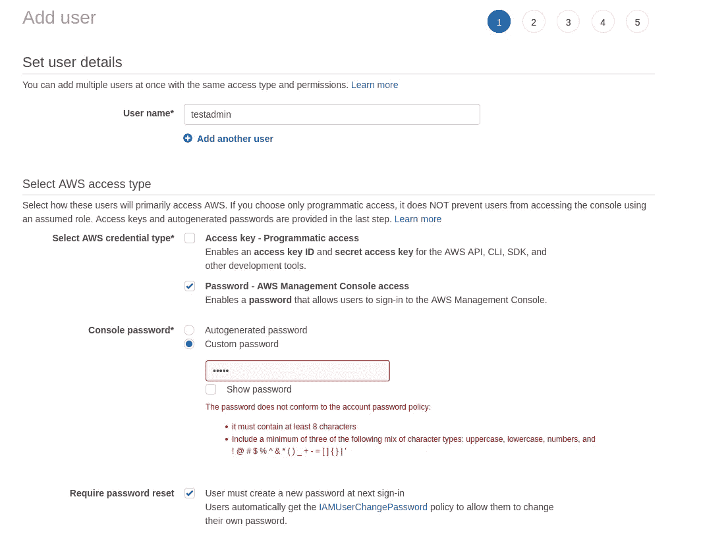

在这里，如果我们选择凭证类型访问密钥，我们将获得一个访问密钥 id 和一个密钥，以便使用 AWS API。这是大多数使用 AWS 服务的软件公司的首选方法。在下一个屏幕中，我们必须将该用户添加到组中。因此，我们将 testadmin 用户添加到 admin 组。在下一个屏幕中，我们将看到一个为用户添加标签的选项。所以这只是提供一些关于用户的信息，所以我不会添加任何标签。最后一步，单击创建用户按钮。

在登录之前，使用创建的用户将改变帐户别名，以获得一个 IAM 帐户名容易记住。为此，请转到 IAM 仪表板，在右上角，您会看到“帐户别名”旁边的“创建”按钮。点击创建按钮后，给你的帐户一个唯一的名字。

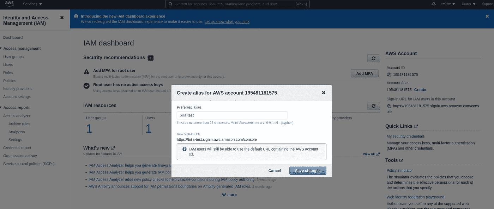

现在让我们从 IAM 管理员用户注销和登录。在登录界面中，点击作为 IAM 用户登录，并给出我们创建的帐户别名。然后输入用户名和密码，在下一个屏幕中，我们必须更改密码。之后，我们将被重定向到 AWS 管理控制台。

IAM 的另一个主要特点是我们可以更改密码策略，甚至可以添加多因素身份验证机制。为此，请转到 IAM 控制面板，在左侧角落，我们有“帐户设置”选项卡。点击它，在新的屏幕中，我们将有一个按钮来更改密码策略。

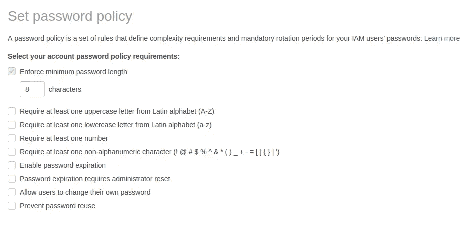

要添加多因素身份认证，请单击菜单栏中的用户名，然后单击我的安全凭据选项卡

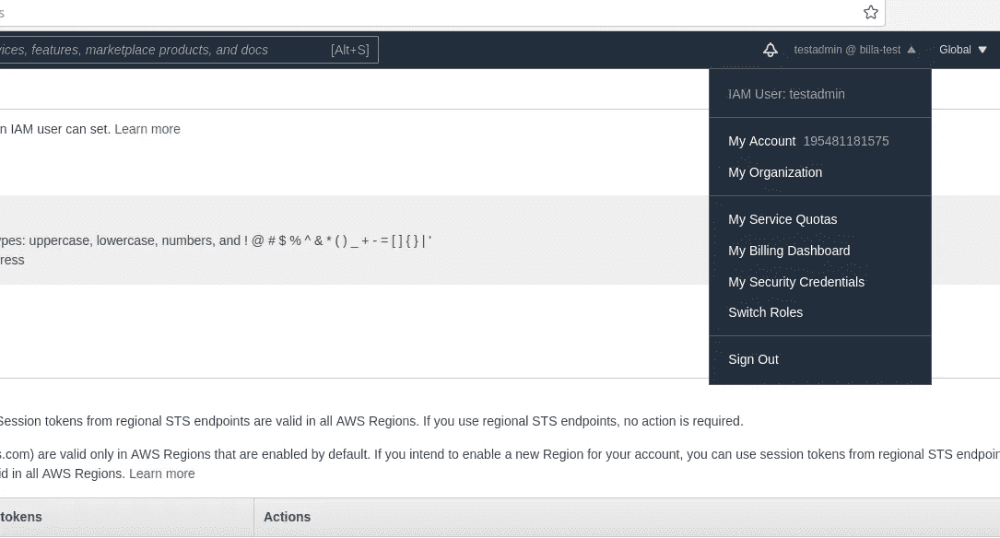

在接下来的屏幕中，我们可以选择添加 MFA。

接下来将学习 AWS IAM 中的**访问键。访问密钥与密码一样。这里我们有类似用户名的访问密钥 Id 和类似密码的秘密访问密钥。访问键主要用于访问 AWS CLI 和 AWS SDK。让我们看看如何创建访问键。**

*   首先转到 IAM 中的 Users 部分，单击已创建的用户，然后在下一个屏幕中单击 Security credentials 部分。


**在这里按下创建访问键按钮。下载带有凭据的 csv 文件。测试访问密钥将使用 ASW CLI** 。通过访问以下链接，我们可以安装 AWS CLI。

 [## 安装、更新和卸载 AWS CLI 版本 2

### 在您的系统上安装 AWS 命令行界面版本 2 (AWS CLI 版本 2)。

docs.aws.amazon.com](https://docs.aws.amazon.com/cli/latest/userguide/install-cliv2.html) 

安装后得到一个终端，并在那里键入。

```
aws configure
```

然后会提示您输入访问密钥的详细信息。这些详细信息在您之前下载的 csv 文件中。对于地区名称和输出格式，只需按回车键。现在在终端中键入以下命令。

```
aws iam list-users
```

在这里，您应该可以获得已创建用户的详细信息。因此，我们已经使用 aws 从我们的终端没有密码，只使用访问密钥。

接下来将看到如何在 IAM 中创建用户角色。IAM 角色用于向 AWS 服务分配权限。为此，请转到 IAM 仪表板，然后点击角色。现在点击添加新角色。

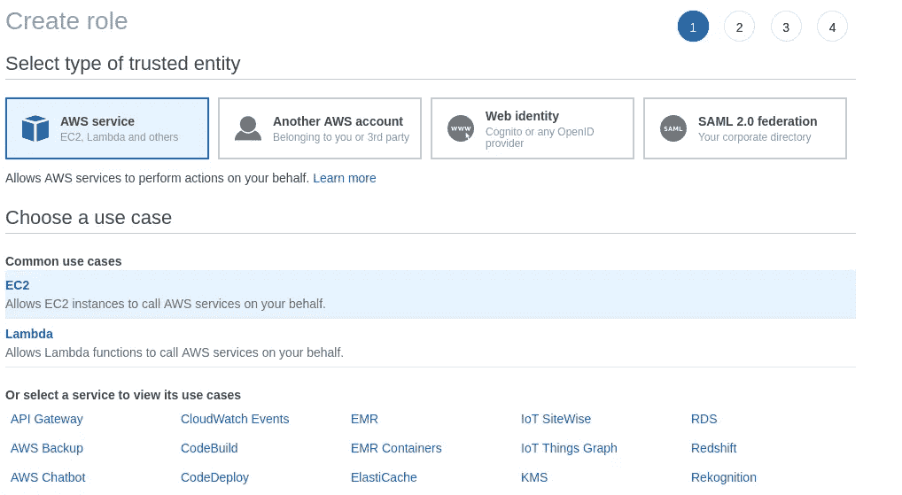

在这里选择 EC2，然后在下一个视图中，我们将必须为此角色提供策略。在这里，我们将为搜索 IAM 提供只读访问权限，并在建议的策略中选择 IAMReadOnlyAccess。

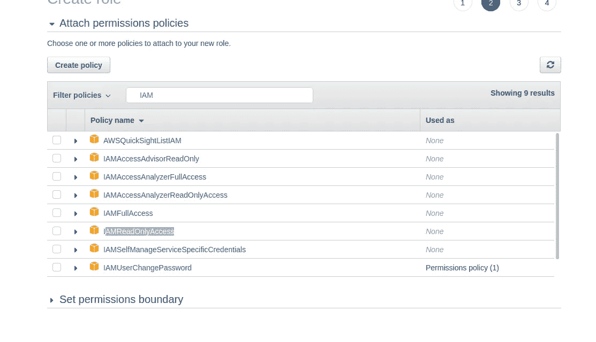

现在，在下一个视图中，我们可以添加标签，但我跳过它。因此，在最终视图中，我们必须给出角色名称。

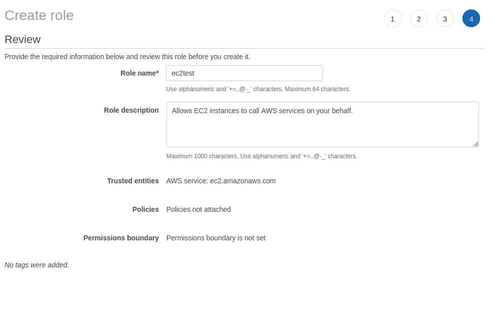

您可以从角色描述(这是一个自动生成的描述)中看到，角色的目的是允许代表您的服务。

这些是使用 IAM 时的最佳实践。

*   除非创建 AWS 帐户，否则不要使用 root 帐户
*   不要为 1 个物理用户创建多个用户
*   将权限分配给组，然后将用户分配给组
*   创建强密码策略
*   使用 MFA —多因素身份认证
*   向服务授予权限时，使用 IAM 角色
*   对于 AWS CLI，不要使用密码，使用访问键—类似于其他程序

因此，在本教程中，我们将了解 AWS 中的 IAM 服务。这是一项基本服务。在下一个教程中使用这些知识将学习如何管理 EC2 服务。快乐的编码伙计们！！！