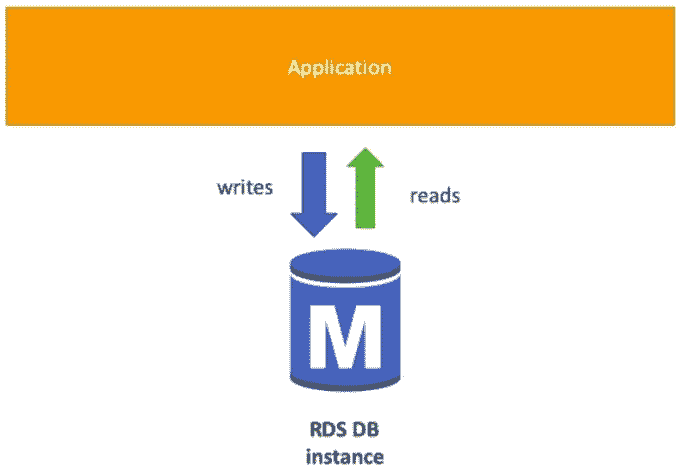
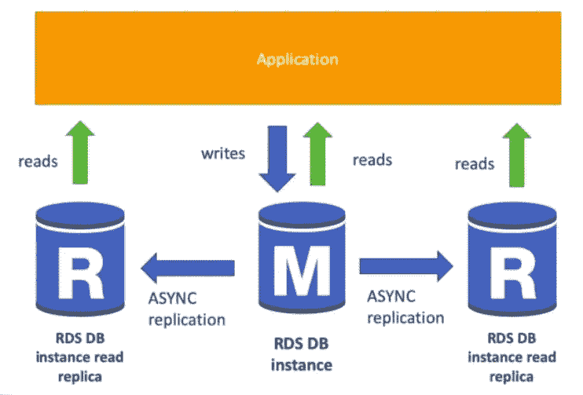
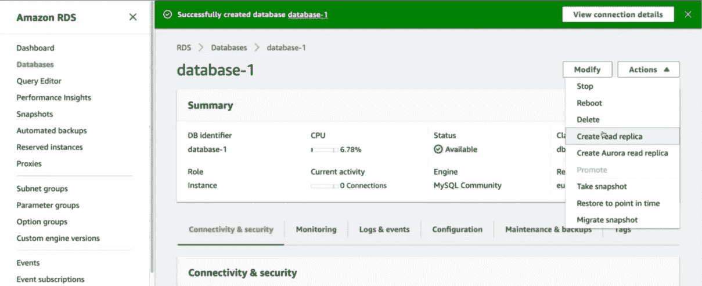
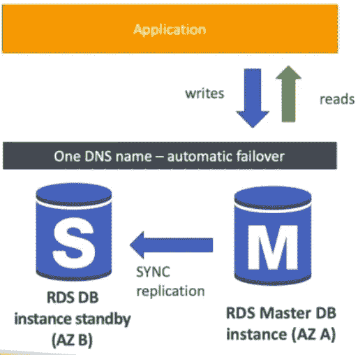
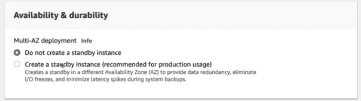
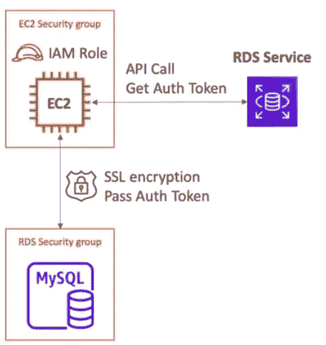

# AWS 认证解决方案架构师— RDS

> 原文：<https://medium.com/nerd-for-tech/aws-certified-solution-architect-rds-1c80bfc6b387?source=collection_archive---------1----------------------->

大家好，在本教程中，我们将讨论关系数据库服务。该服务允许用户在云中创建 AWS 托管关系数据库(SQL)。以下是我们可以使用 RDS 创建的数据库，

*   Postgres
*   关系型数据库
*   MariaDB
*   神谕
*   Microsoft SQL Server
*   奥罗拉

现在您可能会想，如果您已经阅读了下面的教程，

 [## AWS 认证解决方案架构师— EC2 和 AMI

### 大家好，在本教程中，我们将关注最受欢迎的 AWS 服务之一，EC2(弹性计算云)。在…

billa-code.medium.com](https://billa-code.medium.com/aws-certified-solution-architect-ec2-ami-4540126117bb) 

我们不需要一些关系数据库来创建数据库。相反，我们可以手动将数据库安装到 EC2 中并进行管理。但是使用 RDS 有很多好处。由于 RDS 是一种受管理的服务，

*   自动配置、操作系统补丁
*   连续备份和恢复到特定时间戳
*   监控仪表板
*   读取副本以提高读取性能
*   用于灾难恢复(DR)的多可用区域(AZ)设置
*   升级的维护窗口
*   扩展能力
*   EBS 存储备份(gp2 或 io1)

一个主要的缺点是我们不能 SSH 到 DB 实例。

正常 RDS 实例

现在我们来谈谈 RDS 备份。RDS 中启用了自动备份。这是数据库的每日完整备份。事务日志每 5 分钟备份一次。通常有一个 7 天的保留期，可以延长到 35 天。这些备份存储为自动创建的快照。但是我们也可以手动触发快照。这些手动快照和自动快照的区别在于，当删除数据库实例时，自动快照也会被删除，但手动创建的快照会保留。

RDS 的另一个很酷的特性是它具有存储自动扩展功能。在本教程的开始，我告诉你存储是在 EBS 之上完成的。EBS 具有自动缩放功能，因此 RDS 也具备这种功能。我们仍然可以设置一个最大存储阈值。如果工作负载不可预测，这种方法非常有用。

当我们在应用程序中使用关系数据库时，总是会有性能问题。主要是因为有太多的读写请求来到数据库。AWS RDS 有一个很酷的功能，称为 RDS 读取副本，它提高了读取可伸缩性并避免了性能问题。

复制是异步的，这使得读取一致。甚至这些副本也可以更新到它们自己的数据库中。要使用读取副本，主应用程序必须更新连接字符串。示例用例是在生产应用程序之上运行报告应用程序。如果这些副本停留在同一个 AZ，那么创建读取副本没有成本，但是如果跨区域，那么我们必须付费。以下屏幕显示了我们如何启用读取副本。

我们已经看到读取副本为我们的数据库增加了可扩展性，现在让我们看看 RDS 如何增加高可用性。为此，我们有一个名为 RDS multi AZ 的功能。

与读取复制副本不同，这是一个同步复制，此复制副本不用于扩展。当主数据库自动出现故障时，它会重定向到袖手旁观实例。现在，您可能会问，我们是否可以使用读取副本来实现高可用性。如果我们使用跨区域读取副本设置(这需要成本)，我们可以将其用于灾难恢复。我们可以从单个 AZ 升级到多个 AZ，而不会停机。过程真的很简单。他们拍摄 RDS DB 实例的快照，然后将其恢复为另一个实例。然后它创建一个链接来建立同步。以下是我们使用多 AZ 必须启用的设置。

当我们需要增加数据库的安全性时，RDS 非常有用。在此过程中，主要有两种方式添加加密。

*   静态加密—使用 AWS KMS-AES-256 加密，我们可以加密主数据库并读取副本。对于 Oracle 和 SQL server，我们可以使用透明数据加密。
*   动态加密— SSL 证书可用于加密传输到 RDS 的数据。这在连接到数据库时为 SSL 选项提供了信任证书。PostgreSQL:rds . force _ SSL = 1，MySQL: GRANT USAGE ON *。*要“MySQL user”@“%”需要 SSL。

要加密未加密的 RDS 实例，我们必须首先创建该实例的快照，然后拷贝快照，对于拷贝，我们必须启用加密。然后我们可以恢复这个加密的拷贝并删除旧的实例。

由于 RDS 数据库实例通常部署在私有子网内，这保证了数据库的网络安全。安全组也可以用来确保网络安全。

使用 IAM 策略可以管理 RDS 用户的权限，这在控制访问管理时非常方便。虽然可以使用传统的用户名和密码登录数据库，但是我们也可以使用基于 IAM 的身份验证。但这只适用于 MySQL 和 PostgresSQL。

在 IAM 认证中，我们不需要密码。这里可以使用通过 IAM 和 RDS API 调用获得的身份验证令牌。这些身份验证令牌生命周期为 15 分钟。这样做的好处是，

*   网络输入/输出必须使用 SSL 加密
*   IAM 代替 DB 集中管理用户
*   可以利用 IAM 角色和 EC2 实例配置文件轻松集成

摘要:使用 RDS 时，请检查数据库安全组中的端口/IP/安全组入站规则，并尝试通过 IAM 管理数据库用户权限。使用参数组尝试允许 SSL 连接。