# AWS CI/CD 101:创建一个到 S3 托管的静态网站的简单管道

> 原文：<https://medium.com/nerd-for-tech/aws-ci-cd-101-create-a-simple-pipeline-to-an-s3-hosted-static-website-8ea0e44541e5?source=collection_archive---------0----------------------->

## 使用 AWS 控制台创建到用于托管静态网站的 S3 存储桶的管道的分步指南

在这篇博客文章中，我将使用 AWS 控制台演示如何使用 AWS CodePipeline 创建一个简单的管道，将代码文件部署到用于托管静态网站的 S3 存储桶。代码文件将来自 S3 桶。

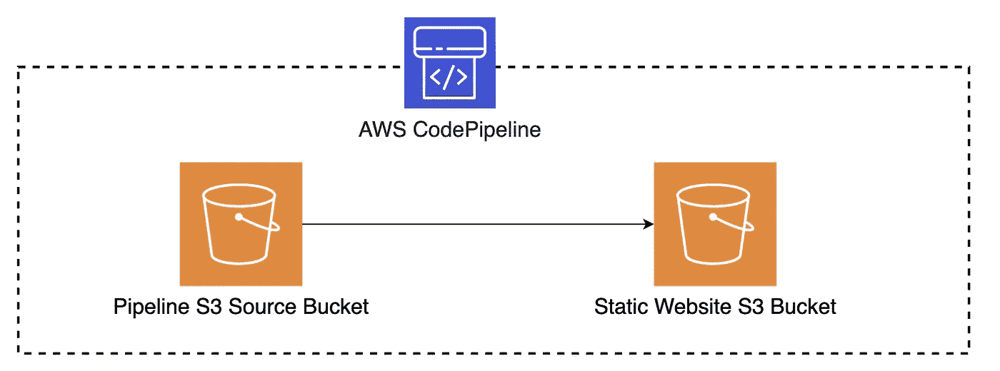

带有 AWS 代码管道的 S3 管道

**需求** 一个拥有管理员权限的 AWS 账户和 IAM 用户

**主要步骤概述
-** [创建一个 S3 桶托管一个静态网站并部署网站的 v 1.0](#86d9)
-[创建一个 S3 桶用于管道的源阶段](#21e2)
- [创建一个管道并通过 AWS CodePipeline](#ce0d) 部署网站的 v2.0

我们开始吧！🍿

## [1。创建一个 S3 桶来托管网站](#5210)

要在 S3 上托管静态网站，S3 存储桶应*可公开访问，并且必须在存储桶上启用*和*静态网站托管。*请注意，S3 时段名称必须是全局唯一的。

通过在 AWS 服务控制台上进行如下导航来创建 S3 存储桶。
- *S3 →创建存储桶*
- **存储桶名称**:静态-网站-11111 *(提供全球唯一名称)*
- **区域**:选择您选择的区域
- **取消选中** : *阻止所有公共访问* -确认之前的选择以启用公共访问
-接受其余默认设置并

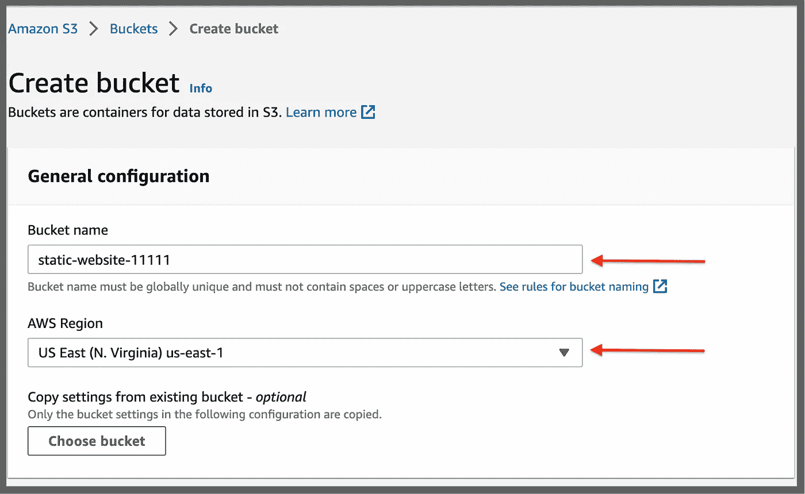

创建 S3 桶来托管静态网站

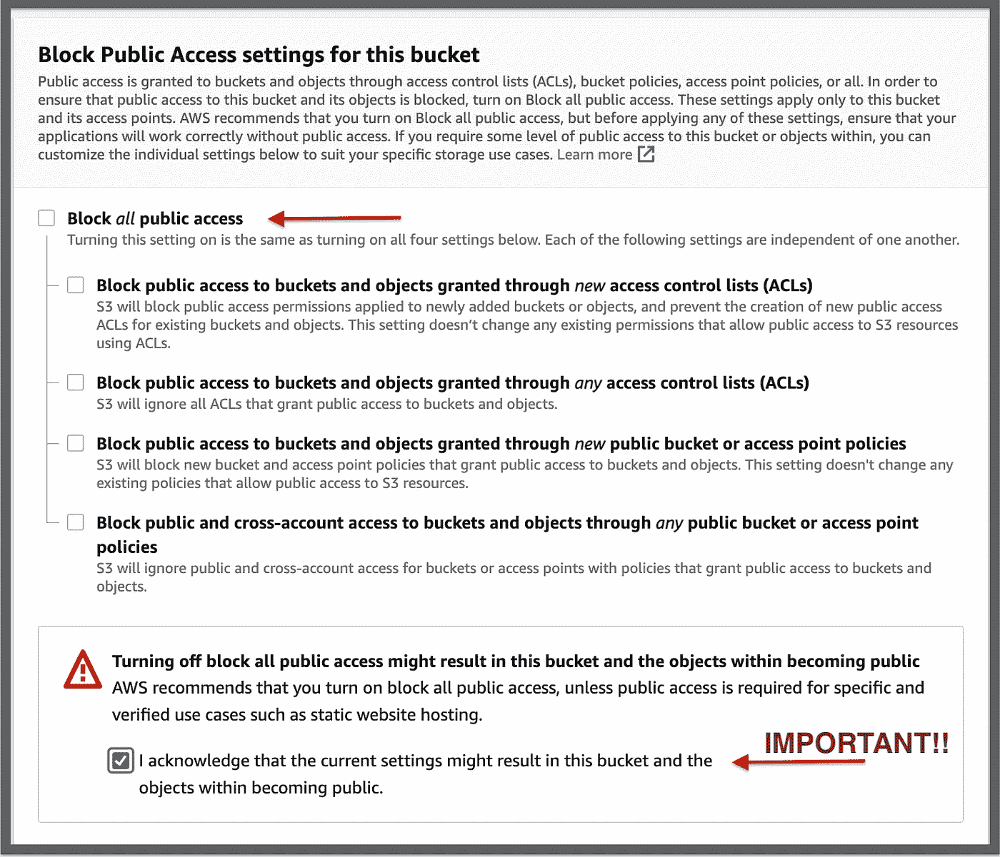

启用桶的公共访问

创建桶后，进入*属性→静态网站托管→编辑*。进入以下设置:
- **静态网站托管**:启用
- **托管类型**:托管一个静态网站
- **索引文件**:index.html
-**错误文件**:Error.html
-保存修改

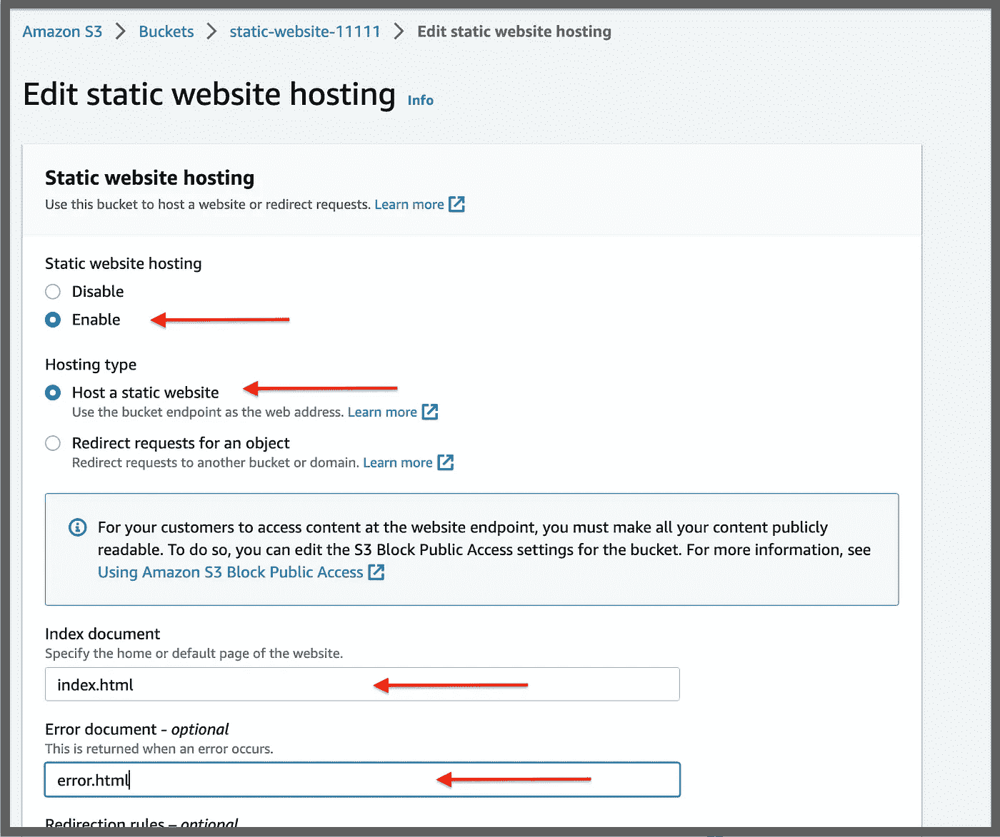

启用静态网站托管后，请注意静态网站托管部分下的 URL。此 URL 将用于查看网站。

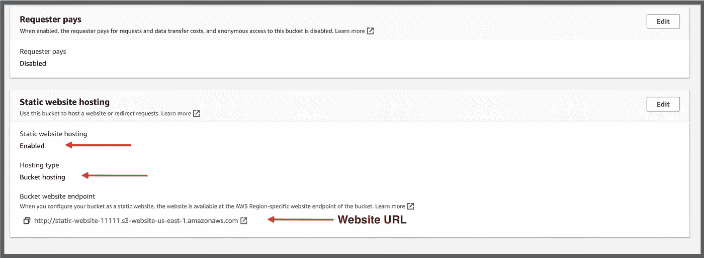

在 S3 上启用静态网站

通过导航到:
*权限→存储桶策略→编辑*并在下面粘贴存储桶策略，启用 S3 存储桶的公共读取权限。将下面策略中的`BucketName`替换为您的存储桶名称。

见下面截图，供参考。

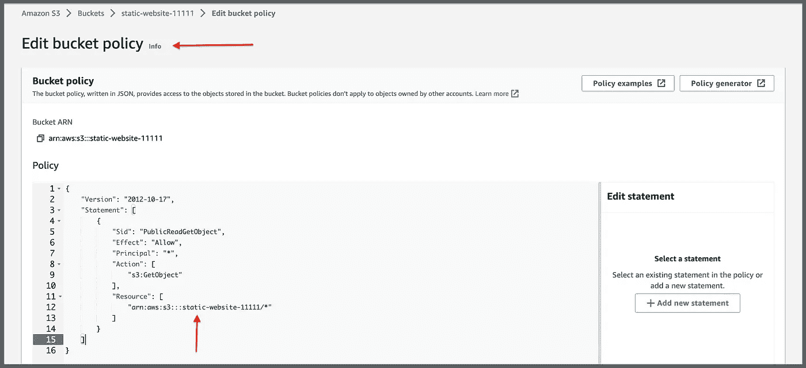

木桶策略

用下面的内容创建两个名为*index.html*和*error.html*的文件。

index.html

error.html

将*index.html*和*error.html*文件上传到 bucket。

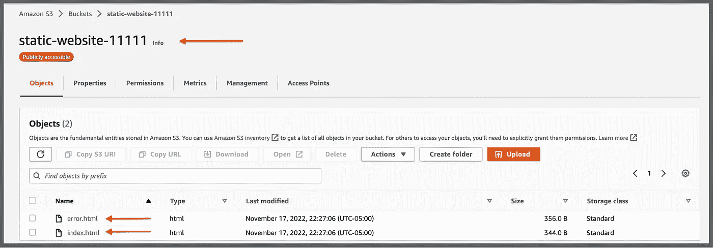

转到 web 浏览器，粘贴之前记录的网站端点 URL。验证访问您现在托管在 S3 的静态网站。到目前为止干得不错🙌

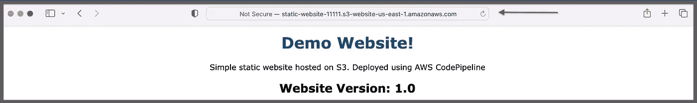

## [2。为管道的源阶段创建桶](#5210)

要使用 S3 存储桶作为管道
的源阶段，存储桶*必须与您要创建的管道
位于同一个区域*，存储桶上必须启用版本控制

*通过在 AWS 服务控制台上进行如下导航来创建存储桶。
- *S3 →创建桶*
- **桶名**:source-Bucket-demos 3-pipeline*(全局唯一名)*
- **区域**:选择一个区域
- **桶版本化:**启用
-接受剩余默认值**创建桶***

**

*用于管道源级的桶*

*您必须在存储桶上启用版本控制，因为管道使用 S3 对象的版本 id 来标识源文件的不同修订。*

*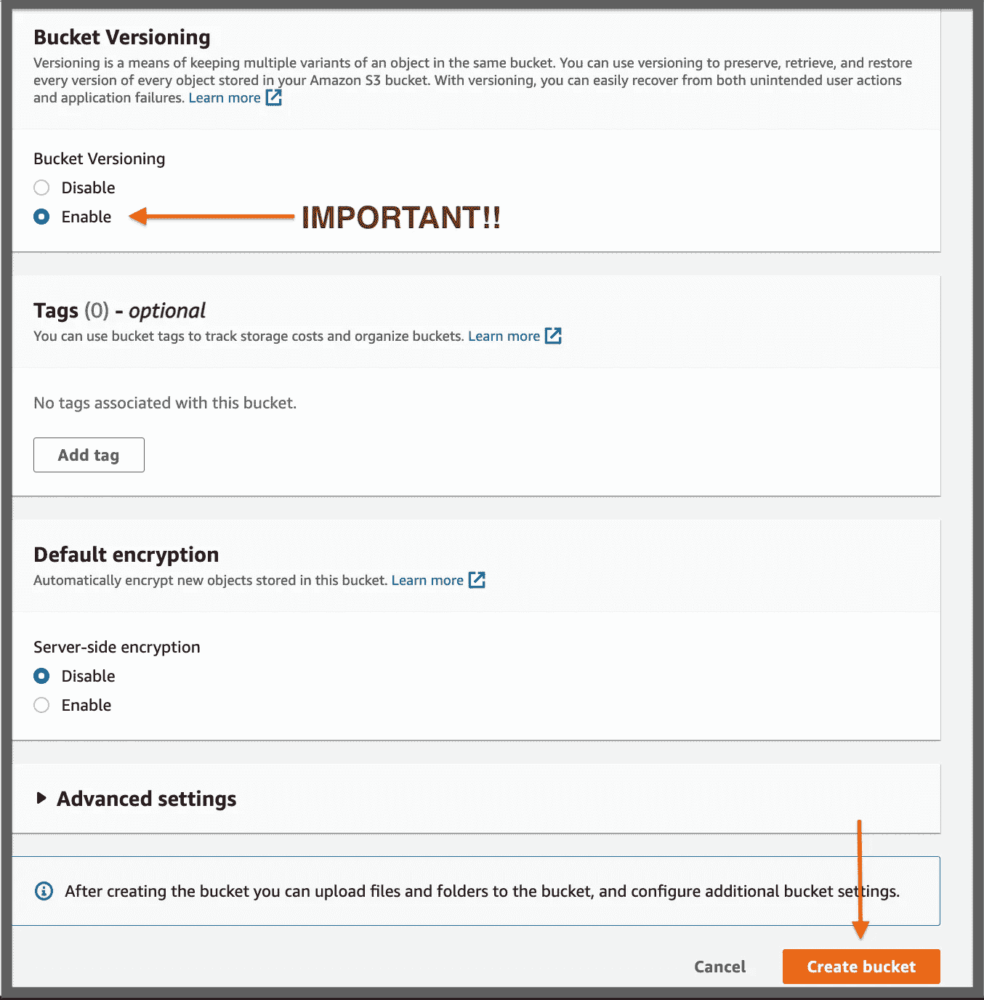*

*为管道的源阶段在存储桶上启用版本控制*

*将`index.html`文件的第 8 行从“*网站版本:1.0* ”更新为“*网站版本:2.0* ”，如下图所示。将两个文件压缩成一个名为`website.zip`的文件*

*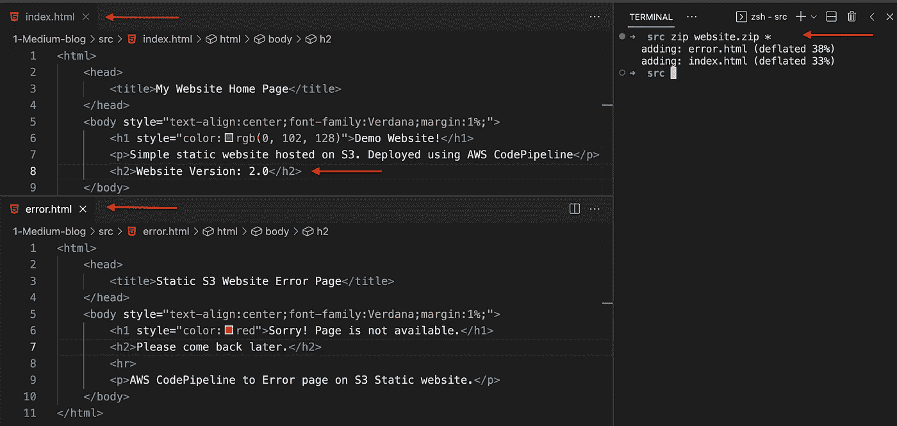*

*将 Index.html 更新至 2.0 版*

*将`website.zip`文件上传到新创建的桶中。*

*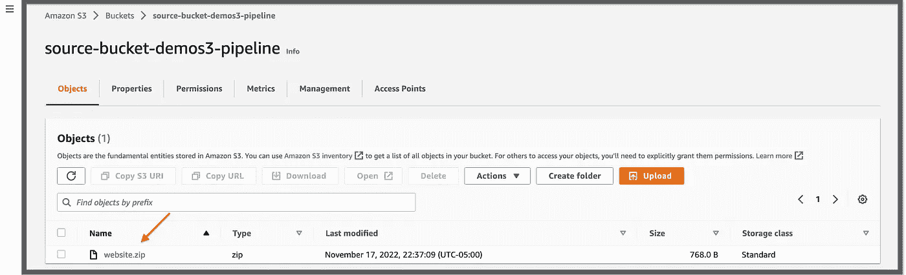*

*管道源阶段存储桶中的 Zip 文件*

## *[3。使用 AWS 代码管道](#5210)创建管道*

*您必须在与步骤 2 中的 S3 存储桶相同的区域中创建管道。通过在 AWS 服务控制台上进行如下导航来创建代码管道。
- *代码管道→管道→创建管道
-* **管道名称** : 演示 3 管道- **服务角色**:新服务角色
-在**高级设置**下:接受默认值**点击下一步***

*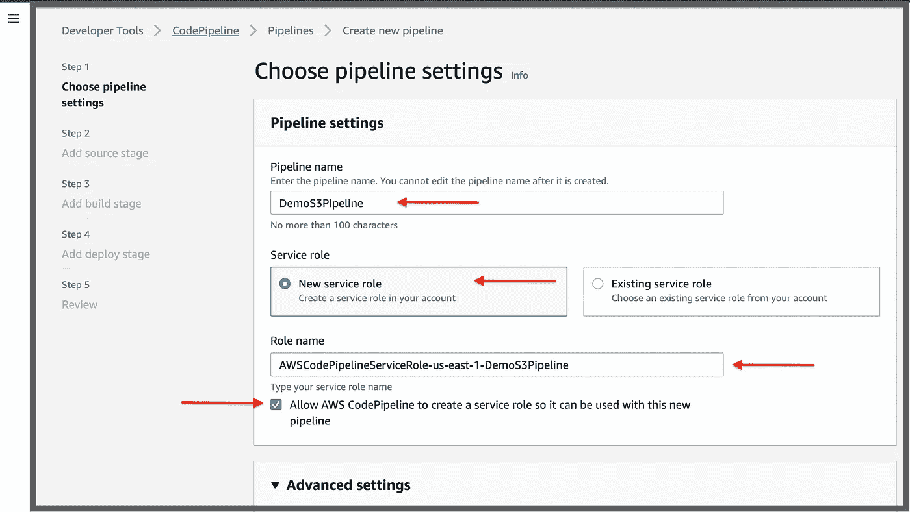*

*步骤 1 —选择管道设置*

*使用高级设置部分下的设置和默认值:
-将在与管道相同的区域创建一个 S3 存储桶，并将其用作从管道生成的工件的存储位置
-将添加一个存储桶策略，以确保只有传输中的加密和使用 AWS KMS 的服务器端加密用于 S3 对象。
-还将为 Codepipeline 创建一个新的服务角色，该角色具有获取对象和将对象放入工件和网站桶所需的权限。*

*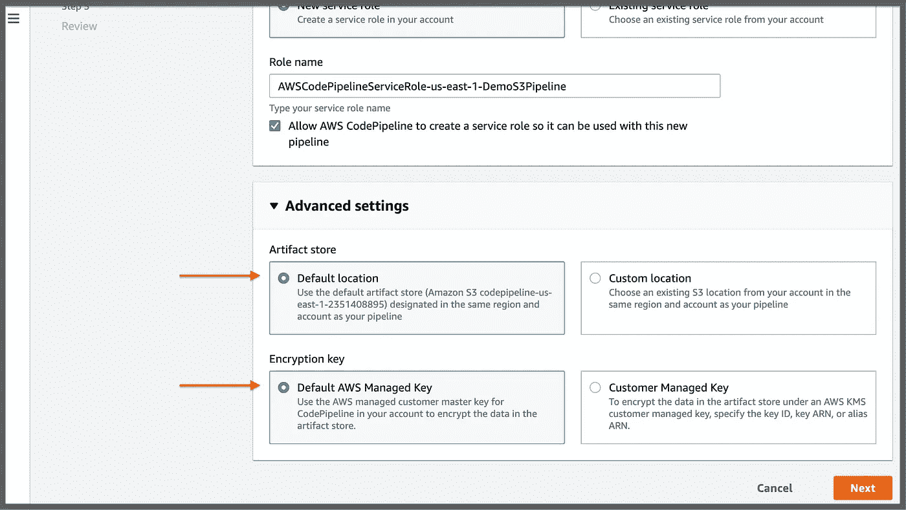*

*默认工件位置*

*为源阶段选择以下内容:
- **源提供者**:亚马逊 S3
- **桶**:选择步骤 2 中创建的桶
- **S3 对象键**:输入之前上传的 zip 文件名*(website . zip)*-**更改检测选项**:亚马逊 CloudWatch 事件
-点击下一步*

*上述设置将启用以下功能:
-将自动创建一个 Cloudtrail 踪迹，或者更新现有的踪迹，以记录指定存储桶和 zip 文件的数据事件。
-还将创建一个 Eventbridge 规则，以便在指定的 zip 文件上传到 bucket 时启动管道。*

*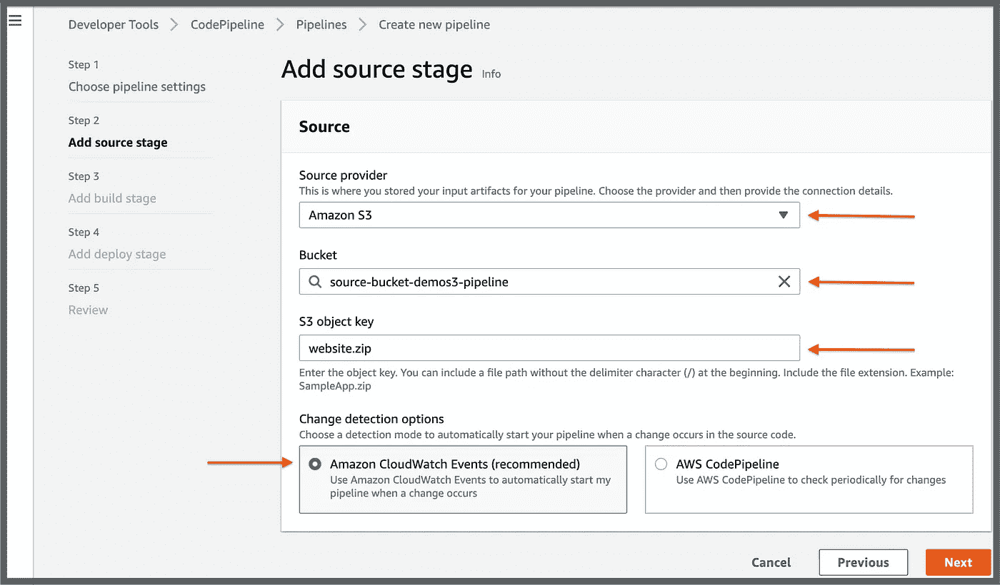*

*管道的源级*

*跳过构建阶段，因为不需要构建 HTML 源文件。*

*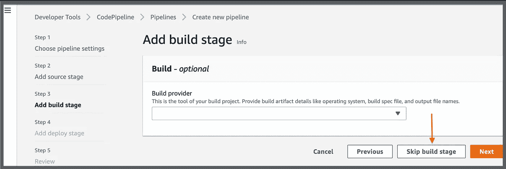*

*跳过构建阶段*

*为部署阶段选择以下内容。
- **部署提供商**:亚马逊 S3
- **地区**:创建静态网站 S3 桶的地区
- **桶名**:选择用于托管静态网站的桶名。
- **勾选**框:部署前提取文件*

**重要的是，您要选中下面的复选框*以确保源阶段的输出工件(压缩文件)被提取到您用来托管网站的 S3 存储桶中。*

*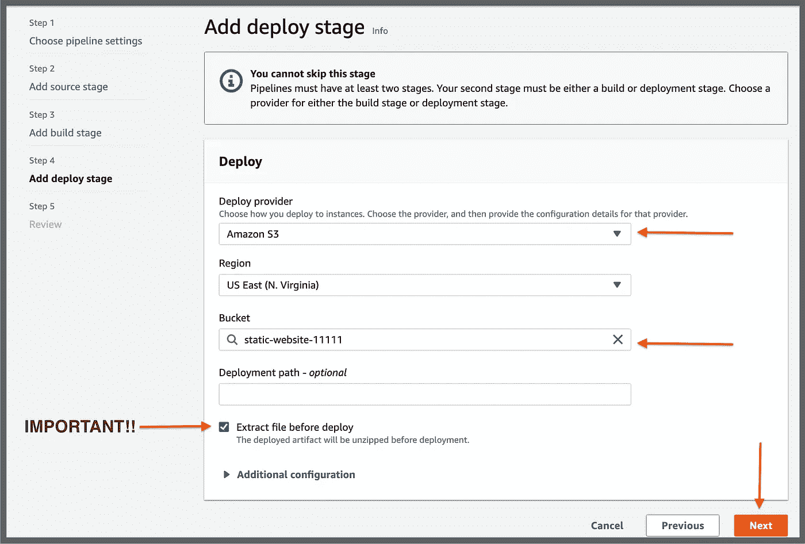*

*管道部署阶段*

*在查看页面上查看管道设置并点击**创建管道**。*

*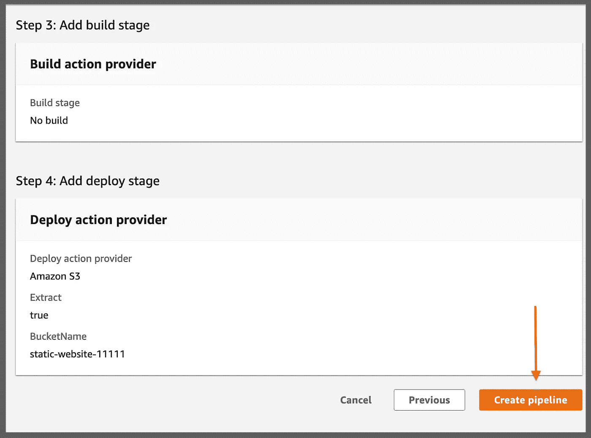*

*创建管道之前，请检查设置*

## *4.观察执行的管道和新的网站版本*

*一旦创建了管道，就会使用`website.zip`文件作为管道的输入来自动触发。部署阶段成功后，文件将被解压缩并部署到用于托管静态网站的 bucket 中。*

*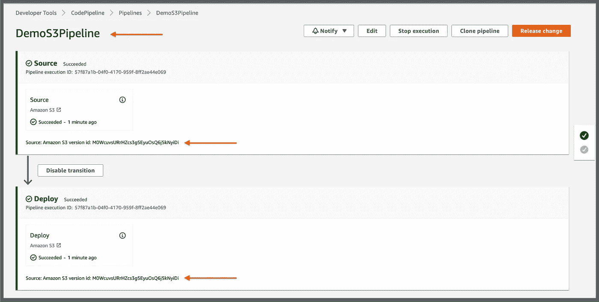*

*管道已执行*

*使用相同的 URL 刷新您的浏览器，并查看您网站的更新版本 2.0🙌*

*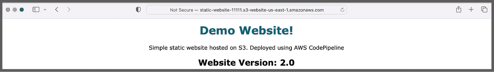*

*通过管道部署更新的网站*

*恭喜🎉👏使用 AWS CodePipeline 为 S3 托管的静态网站构建管道。这和 123 一样简单！*

*在我的下一篇文章中，我将引用阿尔伯特·爱因斯坦的话。*

> *"不要试图成为一个成功的人，而要成为一个有价值的人."——阿尔伯特·爱因斯坦*