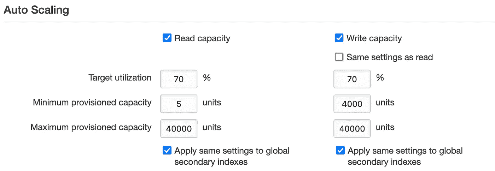
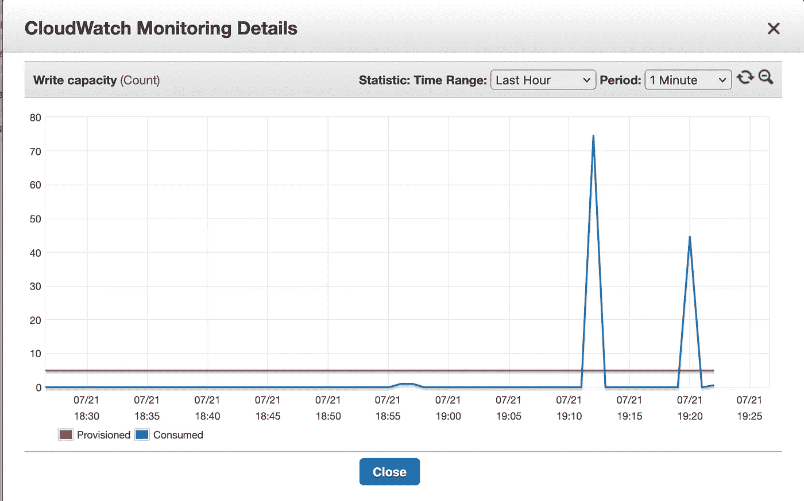
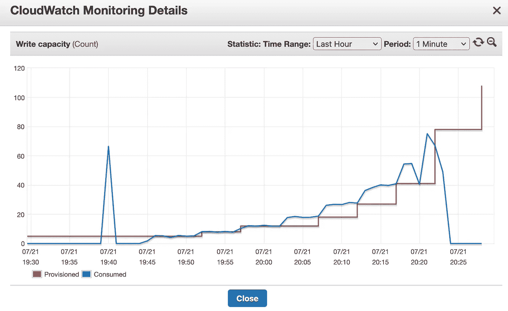
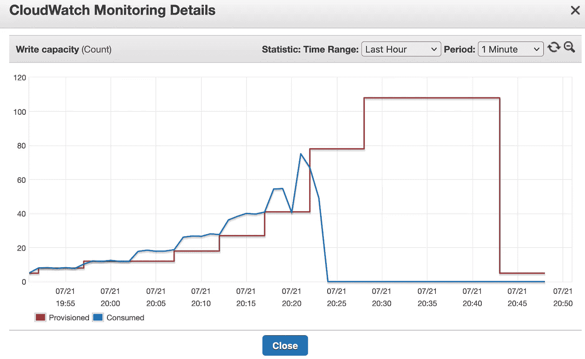
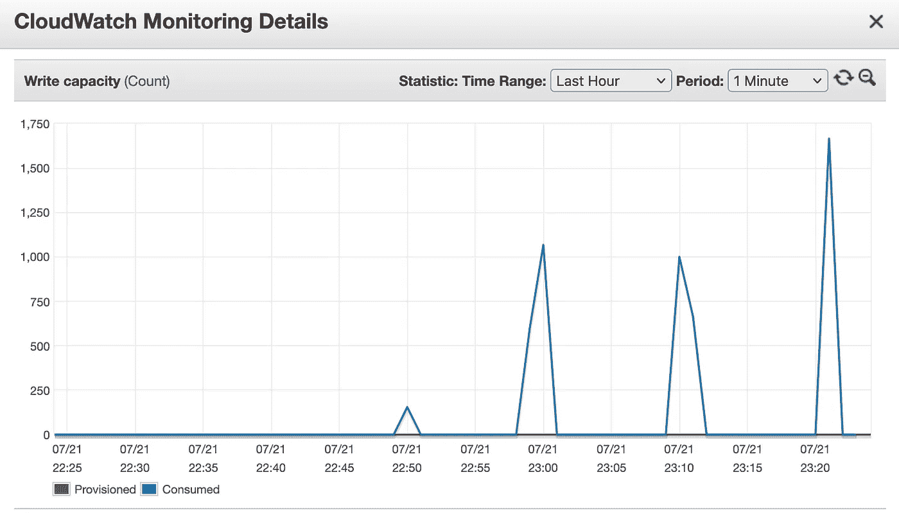

# AWS DynamoDB 自动缩放不是灵丹妙药

> 原文：<https://medium.com/nerd-for-tech/aws-dynamodb-auto-scaling-is-not-a-magic-bullet-25b2fdc50e5a?source=collection_archive---------6----------------------->

AWS 为 DynamoDB 容量规划提供了两种模式。按需供应。随着时间的推移，将相同数量的记录输入或输出数据库，按需定价大约要贵 7 倍。为简单起见，我们只考虑写操作的定价。如果我们调配 3000 WCU 的容量，这意味着我们可以在一秒钟内推送 3000 次写入。在某些亚洲 AWS 地区，这种写入资源调配每月将花费我们大约 1650 美元。如果我们有一个稳定的流量(这是从来没有的情况)，我们每个月可以向这个数据库推送大约 80 亿条记录。为了推动按需定价的相同数量的记录，我们将花费超过 11，250 美元。

这种计算的问题是，我们在现实生活中从来没有稳定的流量。为了避免峰值容量的供应，AWS 提供了一个自动扩展的供应模型。这是配置屏幕的外观:

看起来我可以拥有一个非常低的 5 WCU 的调配容量(每月仅花费 3 美元),并且随着需求的增加，让它一直扩展到 40k WCU/RCU 的限制。*非常误导:)*我用这种配置在桌子上做了一个小小的加载实验。结果是，只要 DynamoDB 停止运行，它就会允许短时间的过载超过所提供的容量。像这样:

发电机容量过小爆发 DB

我现在尝试从一个系统中以最高的速度加载这个表。一个多线程程序在全速下抽取少量的写操作。DynamoDB 通过“provisionedthroughputexceedexception”开始限制大多数请求。有趣的是，在这个异常失败之前，请求会等待将近 50 秒。任何成功的请求都有 20 到 300 毫秒的延迟。

## 自动缩放发生了什么变化？

自动扩展确实有效，但它无法处理突发流量。从该图中可以明显看出，扩展需要一段时间:

DynamoDB 自动纵向扩展吞吐量图

请注意，每一次扩大的数量都在增加。当面临持续过载时，使用某种指数放大算法。在我运行了大约 45 分钟的测试中，我一直得到 provisionedthroughputexceedexception。*在 45 分钟的时间里，尽管每秒钟大约有 1000 个请求，但总共只有大约 100 个 WCU！*

## 这个怎么缩小？

缩小规模没有扩大规模来得快，但一旦扩大规模，规模就会变得很大。我在图中的 20:25 左右停止了测试。

DynamoDB 自动缩放吞吐量图

## 按需扩展看起来如何，延迟如何？

我现在将该表切换为按需扩展。我花了大约 8 分钟在控制台上切换到按需容量。这很聪明—如果立即切换到按需分配容量，我们可以一直保持资源调配状态，一旦看到请求激增，就切换到按需分配:)

在我切换到随需应变之后，我不再有例外。吞吐量如下图所示(针对多次测试尝试)。但是请注意:平均延迟仍然保持在 100 到 150 毫秒左右。我在一台机器上可以达到的最大吞吐量大约是 1500

按需 DynamoDB 吞吐量

## 有出路吗？

按需定价的问题在于它有点吓人。您需要为插入的记录付费。代码中的一个小错误或者一个粗心的新变化都会给你一个巨大的账单冲击。有没有其他不支付按需定价但仍能得到的想法？有一种方法可以考虑是否可以让您的应用程序逻辑绕过它:

*   创建两个表。一个为您的稳态负载调配容量，另一个按需提供容量。始终使用预配的数据库，当检测到节流异常时，开始向按需表发送一些数据。查询必须处理这种两表设计。

## 在 DynamoDB 前面用 SQS 怎么样？

DynamoDB 最常见的设计模式之一是在其前面使用 SQS 来缓冲写操作，并将 DB 保持在较低的配置容量。如果这种方法适用于您的应用程序，那太好了。然而，请记住，SQS 成本也很高。对于我们开始时做的比较，通过点播抽取 80 亿条记录需要 1.1 万英镑。但是如果我们使用在 3000 WCU 配置的 SQS + DynamoDB，它现在将花费大约 5k(dynamo db 1.6k+SQS 3.2k)

希望这个分析能帮助那些试图用 DynamoDB 设计大型系统的人。如果你们中的任何人看到了任何不同的东西，或者对突发流量的经济高效的扩展有其他想法，请在评论中分享。