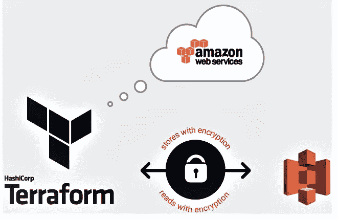

# AWS EC2 实例、EBS、密钥对、SG、S3、云前端、使用单个 CMD 创建快照！！

> 原文：<https://medium.com/nerd-for-tech/aws-ec2-instance-ebs-key-pair-sg-s3-cloud-front-snapshot-creation-using-one-single-cmd-8d45982f494d?source=collection_archive---------0----------------------->



***在本文中，您将了解如何使用 Terraform 通过一个 CMD 创建 AWS EC2 实例、EBS、密钥对、安全组、S3、云前端、快照。***

> 如果你想看完整设置的演示视频，你可以在我的 LinkedIn 上看到:

[](https://www.linkedin.com/posts/raktim00_worldrecordhlder-vimaldaga-cloudtraining-activity-6678624342059958272-SYlB) [## LinkedIn 上的 rak Tim Midya:# AWS cloud # terraform # cloud training

### 加油....💯经过许多努力，终于成功了....😊刚刚完成 AWS 和 Terraform 集成…

www.linkedin.com](https://www.linkedin.com/posts/raktim00_worldrecordhlder-vimaldaga-cloudtraining-activity-6678624342059958272-SYlB) 

# 什么是云计算自动化？？？

简而言之，无论我们在任何云上创建什么，我们都可以使用 Terraform 创建整个基础设施。但 Terraform 的最大优势在于，我们只需创建一次 Terraform 代码，下次只需一个 CMD 和 Terraform 就能为我们创建完整的基础架构。此外，创建一个基础设施的最佳方式是保留一份该原因的文档，将来我们可能需要跟踪一些东西。现在，我们创建了一个 Terraform 代码，因此它作为一个文档工作，我们不需要担心丢失任何东西或我们以前做过的任何步骤。

> 如果你没有 Terraform 的基本概念，我建议你先阅读我下面提到的这篇文章，在这篇文章中，我解释了如何使用 Terraform 的基本概念。

[](/@raktimmidya00/getting-started-with-aws-terraform-293e9125dff) [## AWS & Terraform 入门。

### 如何入门使用 Terraform 在 AWS 中构建基础设施？

medium.com](/@raktimmidya00/getting-started-with-aws-terraform-293e9125dff) 

# 所以，首先让我们看看问题陈述:

> **这是世界纪录保持者 Vimal Daga Sir 先生在混合云计划**下给的任务。

任务 1:必须使用 Terraform 创建/启动应用程序

1.创建允许端口 80 的密钥和安全组。
2。启动 EC2 实例。
3。在这个 Ec2 实例中，使用我们在步骤 1 中创建的密钥和安全组。
4。启动一个卷(EBS)并将该卷装入/var/www/html
5。开发人员已经将代码上传到 GitHub repo 中，该 repo 也有一些图像。
6。将 GitHub repo 代码复制到/var/www/html
7 中。创建一个 s3 存储桶，将 GitHub repo 中的映像复制/部署到 S3 存储桶中，并将权限更改为 public readable。
8 使用 s3 bucket(包含图像)创建一个 CloudFront，并使用 CloudFront URL 更新/var/www/html 中的代码

可选
1)熟悉 Jenkins 或处于开发阶段的人必须在您认为可以整合的任何地方将 Jenkins 整合到此任务中
2)创建 ebs 的快照

上述任务应使用 terraform 完成

# **让我们直接深入研究 Terraform 代码，并尝试理解代码的每一位:**

> 我正在以这样的方式进行，首先我将从问题陈述中选择一个步骤，然后我将展示代码，接下来我将告诉代码正在做什么以及如何做。在每次讨论中，我还提供了官方文档链接。

## 步骤 1:创建允许端口 80 的密钥和安全组。

***创建 RSA 密钥:***

*   在这里，我创建了一个 tls 私钥，下一步我们将把它推送到 AWS。我用了一种叫做 RSA 的算法作为 AWS 的支持。如果你想了解更多，你可以去官方的 Terraform 文档[创建 tls 私钥](https://www.terraform.io/docs/providers/tls/r/private_key.html)。另外，你可以在亚马逊 Linux 上看到关于 [TLS 的官方 AWS 文档。](https://docs.aws.amazon.com/AWSEC2/latest/UserGuide/SSL-on-amazon-linux-ami.html)

***创建 AWS 密钥对:***

*   这里，我使用之前创建的 tls 密钥创建了一个 AWS 密钥对。这里是关于使用 Terraform 创建 [AWS 密钥对的官方文档链接。](https://www.terraform.io/docs/providers/aws/r/key_pair.html)

***创建安全组:***

*   这里我使用了“依赖”,因为我希望 Terraform 在创建这个 AWS 密钥对之后创建安全组。因为有时候我们必须告诉 Terraform 我们想怎么做管道。在这个安全组代码中，两个关键字“ingress”和“egress”表示我们希望为实例提供哪种类型的网络入站和出站。这里，在入口中，我允许两个端口 22 和 80，因为使用 22 端口，我将使用 SSH 连接我的实例，以便在实例内部传递命令。由于我正在配置一台 web 服务器，所以我公开了 80 端口，以便我的 web 服务器可以接收请求。在出口中，我们允许所有端口，因为我们需要在实例中安装任何软件，为此，我们需要从互联网上下载它们。对于文档，可以看 Terraform 的这个 [AWS 安全组。](https://www.terraform.io/docs/providers/aws/r/security_group.html)

## 步骤 2:启动 EC2 实例。在这个 Ec2 实例中，使用我们在步骤 1 中创建的密钥和安全组。

***启动 EC2 实例:***

*   在这里，我通过提供所需的信息，如 AMI id、instance_type、key_name、security_groups 等，创建了一个 ec2 实例。在 key_name 中，我提供了我在前面的代码中创建的键的名称。在 security_groups 中，我传递了我在前面的代码中创建的 security_group 的名称。[官方 AWS 资源平台文档](https://www.terraform.io/docs/providers/aws/r/instance.html)。

**安装所需程序:**

*   接下来，我使用我创建的私钥在我的容器中进行 SSH 登录，并安装运行 webserver 所需的软件。在安装后的同时，我启动了 web 服务器。此外，我启用了 web 服务器，这意味着如果由于任何原因服务器停止，它将自动启动服务器。 [SSH 登录 Terraform 文档](https://www.terraform.io/docs/provisioners/connection.html)。[远程执行器平台文件](https://www.terraform.io/docs/provisioners/remote-exec.html)。

## 步骤 3:启动一个卷(EBS ),并将其附加到 EC2 实例。

***创建 EBS 卷:***

*   在 AWS 中，只有当两个实例位于同一个可用性区域时，才能将卷附加到实例。这就是为什么在启动 EC2 实例后，我将它的可用性区域传递给 EBS 创建代码。我选择了 1GB 的大小。 [EBS 体积创建地形文档](https://www.terraform.io/docs/providers/aws/r/ebs_volume.html)。

***附卷:***

*   接下来，我将该卷附加到我的实例。这里，我从创建的卷变量中给出了卷 id，从实例创建变量中给出了实例 id。这种强制分离意味着当我使用 Terraform 销毁我的环境时，它将首先强制分离卷，否则 Terraform 将无法销毁卷。EBS 卷附地形文件。

## 步骤 4:将该卷装入/var/www/html，并将 GitHub repo 代码复制到/var/www/html。

***远程运行几条命令:***

*   接下来，我再次在实例内部进行远程 SSH 登录，首先，我格式化附加的 EBS 卷，然后将该卷装载到我的 web 服务器上。httpd web 服务器将其 html 文件存储在一个名为“/var/www/html”的文件夹中，因此为了使该文件夹中的数据持久，我将该卷挂载到该位置，并将我的 HTML 代码从 GitHub 克隆到该文件夹中。空资源地形文档。

## 步骤 5:创建一个 s3 存储桶，复制/部署 S3 存储桶中的映像，并将权限更改为公共可读。

***创建一个 S3 桶，并在其中添加一张图片:***

*   接下来，我创建了一个 S3 存储桶，并授予它公共读取权限。接下来，我用 Terraform 放了一些 S3 当地的图片。同样在这里，我使用了一个桶作为我刚刚创建的桶。最后，我给了我的 bucket 文件公共读取权限。 [S3 铲斗地形文件](https://www.terraform.io/docs/providers/aws/r/s3_bucket.html)。[将对象放入 S3 铲斗 Terraform 文档](https://www.terraform.io/docs/providers/aws/r/s3_bucket_object.html)。

## 第六步:创建云锋分布。

***配置 CDN :***

*   这里我只提供三条信息。第一个局部变量意味着我创建了一个局部变量，可以在很多地方使用。我只创建了一个包含我的 S3 id 的变量。我提供了我的 S3 桶的域名，以便我可以将我的云锋与我的 S3 桶连接起来。在原点 id 中的第三个，我提供了包含 S3 桶 id 的局部变量。 [AWS CDN 地形文件](https://www.terraform.io/docs/providers/aws/r/cloudfront_distribution.html)。
*   你可能会考虑其他选择。是的，我们可以在 CDN 上定制许多选项，但这些设置是默认的，我从 Terraform 网站文档中复制了这段代码。

## 步骤 7:将云前端 URL 添加到我的 HTML 代码中:

***使用 SSH 更改 Html 代码:***

*   在这里，我修改了我的 git 从 GitHub 克隆的 HTML 代码。我主要做 SSH 登录，在 HTML 代码里加一行。这一行包含了我的 S3 文件的 CDN URL。现在，每次我创建一个新的基础设施 CDN URL 都会改变，这就是我在这里使用变量的原因。

## 步骤 8:创建快照:

*   此后，我更改了代码，为我连接的 1GB 卷创建了一个快照。我创建了这个，以便将来我可以得到我以前的代码。此外，它不仅仅总是关于代码。有时，我可能会在我的 EBS 中添加一些重要的文件，所以这是一种备份。[快照地形文件](https://www.terraform.io/docs/providers/aws/r/ebs_snapshot.html)。

## 步骤 9(最后一步):打开本地浏览器:

*   最后，这是一个本地资源调配。在这里，我打开了我的本地机器浏览器，也直接跳转到我的实例的 IP 地址，并打开了 HTML 页面。[当地执行者 Terraform 文档](https://www.terraform.io/docs/provisioners/local-exec.html)。

# 干杯…终于完成了…..

## 这是你可以轻松运行的最终代码。现在，如果你想看看当我们运行代码时会发生什么，或者如何运行代码，我做了一个视频。你可以在下面提到的 LinkedIn 链接上查看这个视频。

[](https://www.linkedin.com/posts/raktim00_worldrecordhlder-vimaldaga-cloudtraining-activity-6678624342059958272-SYlB) [## LinkedIn 上的 rak Tim Midya:# AWS cloud # terraform # cloud training

### 加油....💯经过许多努力，终于成功了....😊刚刚完成 AWS 和 Terraform 集成…

www.linkedin.com](https://www.linkedin.com/posts/raktim00_worldrecordhlder-vimaldaga-cloudtraining-activity-6678624342059958272-SYlB) 

我还在想在 AWS 中创建所有这些基础设施的那条命令是什么。下面是命令。

```
terraform apply -auto-approve
```

## 以下是最终代码:

[](https://github.com/raktim00/AWS_Terraform_Integration) [## rak Tim 00/AWS _ Terraform _ Integration

### 这里是 GitHub 的链接，我有这个任务的完整代码。…

github.com](https://github.com/raktim00/AWS_Terraform_Integration) 

好了，非常感谢大家的阅读，我希望你能从中学到一些东西。如果你评论一下，告诉我你对这个任务的看法，那将是一个很大的帮助。😊

