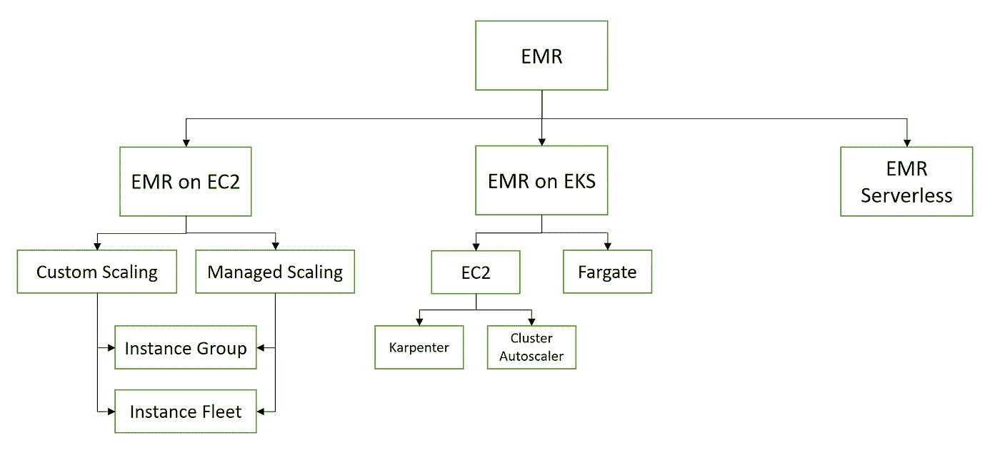
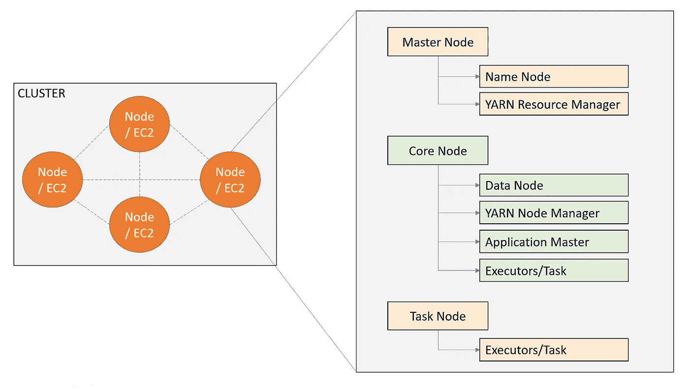
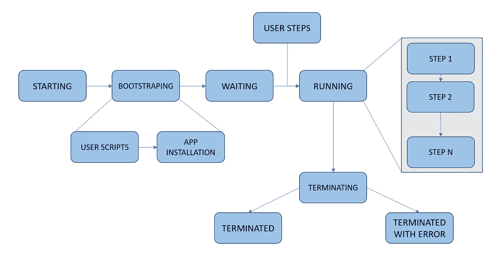
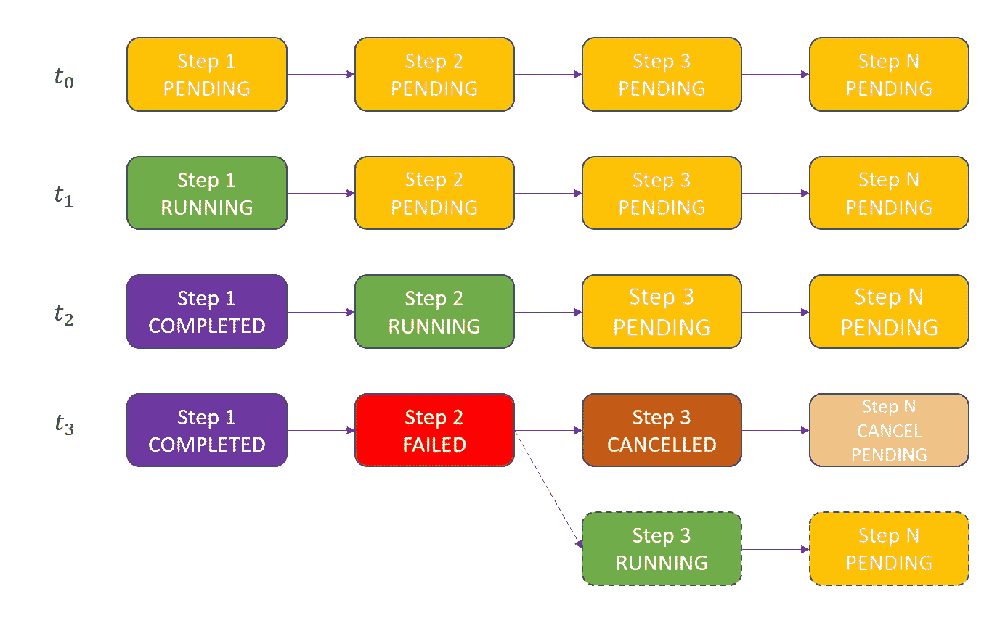
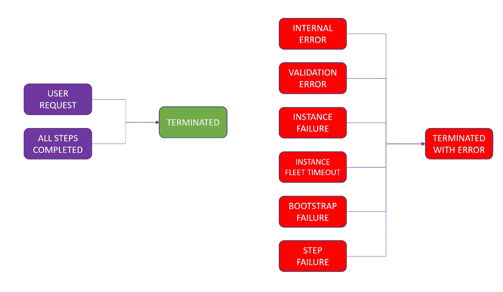

# AWS 弹性贴图减少—简介！

> 原文：<https://medium.com/nerd-for-tech/aws-elastic-map-reduce-intro-55206fd47c85?source=collection_archive---------0----------------------->

EMR 是一个托管集群平台，可简化在 AWS 云上运行大数据框架，如 Hadoop、Spark、Presto。

EMR 有多种部署选项。下图总结了所有这些部署模型。



EMR 部署选项

# EMR 组件—群集和节点



EC2 上的 EMR

**集群:**集群只是一个称为节点的 EC2 实例的集合。根据节点的角色，它们分为三种类型。主节点、核心节点和任务节点。

**主节点:**管理&监控集群，协调其他节点之间的数据和任务分配。它还跟踪任务的状态。每个

**核心节点:**保存数据和执行任务的节点。

任务节点:提供额外的计算能力。不保存任何数据。

# EMR 架构

Amazon EMR 服务架构由四个基本层组成。

## 存储层

在决定存储层时，AWS 提供了三个选项。

1.  使用 EBS 的 HDFS(HDFS://主 ip 地址/数据路径)
2.  使用 S3 的 emrf(S3://bucket-name/path-to-file-in-bucket)
3.  HDFS 使用实例存储

## 资源管理

默认情况下，EMR 使用 YARN 作为资源管理器。在最近的版本中，EMR 还支持在 Kubernetes 上运行工作负载。

## 数据处理框架

EMR 开箱即用支持 Hadoop、Spark 和 Presto 框架。

## 应用框架:

EMR 支持 Spark Streaming、Hive、Hbase、Presto、Flink、Pig 等应用。

# 集群状态

EMR 集群在其生命周期中会在多个状态之间转换。下图列出了所有这些状态及其软血统。



1.  当我们创建启动群集创建时，它将进入开始状态。在这种状态下，AWS EMR 服务根据我们提供的硬件配置提供 EC2 实例组。
2.  一个 EC2 实例被提供，引导状态开始。在这种状态下，我们提供的任何脚本都在实例上执行。
    —bootstrap-actions Path = " S3://my bucket/filename "，Args=[arg1，arg 2]
    [{ ' class ification ':'<conf-type>'，' Properties ':{ ' key ':' value ' }]
3.  执行脚本后，EMR 服务会安装我们选择在集群上运行的应用程序。
4.  安装完所有应用程序后，集群进入等待状态。在这种状态下，集群正在等待任何需要执行的步骤。
5.  一旦我们向集群提交了一个作业或任务，状态就会转变为正在运行。在此步骤中，集群运行我们提交的任何作业。
6.  一旦所有任务完成，集群或者可以返回等待状态，或者可以进入终止状态。在这种状态下，EMR 会删除实例。
7.  根据终止的原因，最终状态可能被终止或以错误状态终止。

# **步骤状态**

在上图中，我们看到在运行模式下，集群正在处理任务。任务/步骤遵循它们自己的生命周期。



1.  因此，任务从挂起状态开始。
2.  当它被执行时，它进入运行状态。
3.  根据成功或失败，任务会转换到已完成或失败状态。
4.  我们可以选择忽略上一步中的错误并继续下一步，或者取消剩余的状态。
5.  万一我们忽略了下一步就进入运行状态了。
6.  如果我们不忽略这个错误。所有剩余状态进入取消状态。

我们有多种方式向集群提交作业。

> *使用控制台添加步骤，同时创建集群或通过修改运行集群。*
> 
> *使用 cli 或 API。*
> 
> *通过 SSH 连接到主节点直接使用应用程序。*

在集群状态转换中，我们看到终止或以错误状态终止。由于以下原因，这两种状态可以转换到它们的状态。



在上面的错误中，除了前两个之外，大多数都是不言自明的。验证错误主要发生在相关 API 应用的约束不满足时。内部错误主要是由于服务问题和服务访问问题。

# 高可用性:

在单主节点部署中，主节点的故障将导致集群无法正常工作。EMR 也支持多主机模式。在这种情况下，EMR 启动 3 主节点。应用程序和服务在(1 或 2 个额外节点)中复制。例如，资源管理器在所有节点中复制(1 个活动节点 2 个备用节点)，而名称节点复制到 1 个额外节点(1 个活动节点 1 个备用节点)。Flink、Ganglia、JupyterHub 和 Zeppelin 等应用程序安装在所有三个主节点上。

**注意:** Sqoop、Hive、Phoenix、HBase、Hue、Oozie 和 Presto 需要外部数据库，因此在多主机设置中需要特别注意。

# 安全功能

**IAM** — AWS EMR 支持服务角色与各种 AWS 服务进行交互，如 KMS(加密)、SQS(调试)和其他 AWS 服务。

> **服务角色—**EMR 服务访问 AWS 资源所承担的 IAM 角色
> 
> **JobFlowRole —** 由集群的 C2 实例承担的 IAM 角色
> 
> **自动缩放角色—** 我是一个角色，通过自动缩放来管理实例组中的实例。可以组合成服务角色本身。

**安全组—** EMR 使用安全组来控制节点之间的网络流量。默认情况下，它创建两个安全组，一个用于主节点，另一个用于核心或任务节点。我们可以创建并附加我们自己的安全组，以便更好地控制网络流量。

**加密—** EMR 支持数据加密。在使用 EMRFS 时，我们也可以使用服务器端加密。

**EC2 密钥对—** EMR 节点可以使用密钥对启动，这样我们就可以验证并获得对节点的服务器级访问。

**VPC —** EMR 集群在 VPC 启动，因此所有与 VPC 相关的网络概念(包括 VPC 流量日志)都可用于 EMR。

# 审计和日志记录功能

日志记录— EMR 日志存储在主节点上，也可以发送到 s3。

```
/mnt/var/log/hadoop/steps//mnt/var/log/hadoop-[hdfs|httpfs|yarn]/mnt/var/log/hadoopmapreduce/mnt/var/log/bootstrap-actions//mnt/var/log/instance-state/
```

它还可以与云监控日志集成，以获取警报和指标。

**云轨迹—** EMR 记录对云轨迹的控制平面 API 调用。

快乐学习！！