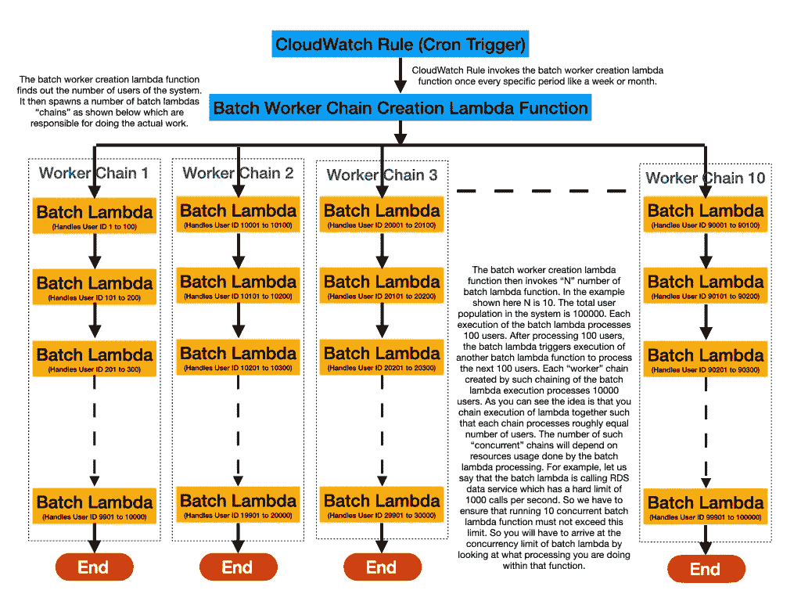
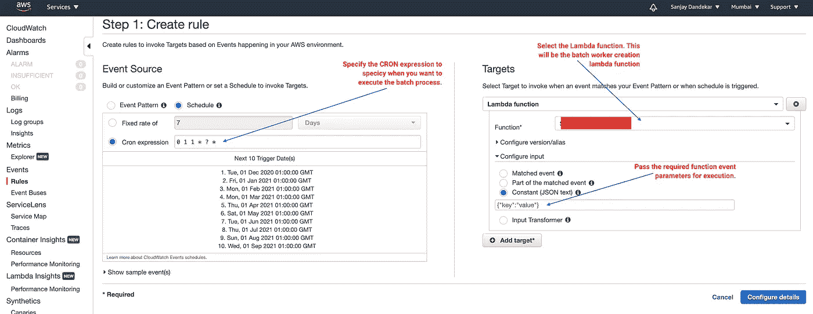

# AWS 知识系列:使用 AWS Lambda 进行批处理

> 原文：<https://medium.com/nerd-for-tech/aws-knowledge-series-batch-processing-using-aws-lambda-6683fe1a6817?source=collection_archive---------1----------------------->

在本文中，我们将讨论如何利用 AWS CloudWatch 规则和 AWS Lambda 来构建可靠、灵活、低成本和无服务器的批处理。通常，批处理涉及运行调度引擎和 AWS EC2 实例。AWS Batch 提供了一个很好的抽象，允许您大规模地进行批处理。然而，它并不完全是“无服务器”的。AWS batch 启动 EC2 实例来运行您的批处理作业。大多数情况下，即使您没有进行任何批处理，也可能必须在运行状态下保留 EC2 的最小容量。这实际上意味着即使你没有做任何工作，你也在花钱。所以 AWS Batch 并不是真正的无服务器。我今天要演示的是如何使用 AWS Lambda 这样的无服务器技术进行批处理。我们将使用 AWS CloudWatch 规则作为我们的调度引擎。

**批量用例**

在我上一篇关于 SES 的文章中，我谈到了如何使用 SES 和 AWS Lambda 向用户群定期发送电子邮件。

 [## AWS 知识系列:简单的电子邮件服务

### AWS 简单电子邮件服务(SES)是亚马逊对 Mailchimp 等服务的回应，让您可以有效地管理您的…

sanjay-dandekar.medium.com](https://sanjay-dandekar.medium.com/aws-knowledge-series-simple-email-service-6d38d69b5265) 

我们将在本文中查看一些代码，并了解如何使用 AWS Lambda 进行批处理。所以问题陈述如下:

*   你有一个庞大的用户群，你想向他们发送每周/每月的电子邮件
*   您希望使用用户特定数据对发送的电子邮件进行个性化设置，因此在发送电子邮件之前，您需要获取将用于对电子邮件进行个性化设置的用户特定数据
*   为了简单起见，我们将假设用户具有从 1 到 N 数字标识符，其中 N 是足够大的数(> 100K)。

**高层进场**

下图高度概括了如何使用 AWS Lambda 实现批处理。

**云观察规则**

批处理执行是通过 CloudWatch 规则安排的。要创建新规则，请打开 AWS 控制台并导航到 CloudWatch。从左侧面板中选择规则，然后热创建规则。将显示以下屏幕。

**批处理工人创建 Lambda 函数**

下面的清单给出了批处理工作器创建 lambda 函数应该做什么的要点。

**批量λ功能**

下面的清单给出了批处理 lambda 函数应该做什么的要点。

如你所见，只需实现两个 Lambda 函数，我们就可以创建一个可配置、可扩展的批处理“引擎”。使用这种方法，不需要增加昂贵的 EC2 实例。

**你应该知道的几个“陷阱”**

*   测试——测试——测试——我怎么强调都不为过。您必须确保您的所有“工作链”都到达了执行的终点，而不管它在执行过程中遇到了什么样的错误。
*   捕获并分析导致“未处理”项目的错误，以了解如何使执行更加稳健。
*   使用不同数量的并发工作链进行测试。更多的工作链意味着您的批处理将更快地完成，但也将导致限制异常和其他错误的实例增加，以及对您的生产流量的影响。您必须确保即使在生产环境最繁忙的时候，您的批处理也不会失败。此外，批处理执行不应对运行的生产系统产生负面影响。
*   确保“BatchLambda”异步调用下的“重试尝试”设置为零。这是一个非常重要的设置。这个值的默认值是 2。因此，对于一些未处理的异常，如果“BatchLambda”失败，它将被执行两次以上！你不希望这种情况发生，因为它会做同样的工作三次，例如，发送相同的电子邮件给相同的用户三次！
*   测试关于工作链结束的边缘情况，特别是如果您没有使用如上所示的整数索引。错误的边缘情况条件将导致工作链根本不结束或者不处理整个链，这两种情况都是不好的。
*   这种方法最可怕的问题之一是有一个“失控”的工人链，由于错误编程的边缘条件(例如工人链中的无限循环)而拒绝结束。在这种情况下,“BatchLambda”的处决只会继续发生。这与设置为默认值的重试尝试相结合，是导致“高 AWS 账单”的原因！那么解决办法是什么呢？答案很简单——在函数末尾注释掉“BatchLanbda”异步调用，并重新部署函数。在部署后的几分钟内，理智将返回，所有执行将停止。

本文到此为止。如果您有使用 AWS Lambda 的批处理执行的替代方法，请告诉我。