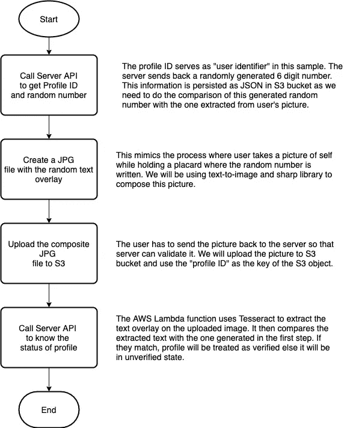
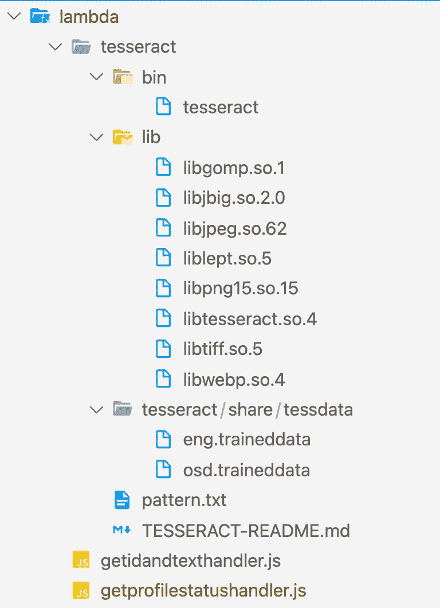

# AWS 知识系列—带 AWS Lambda & Tesseract 的 OCR

> 原文：<https://medium.com/nerd-for-tech/aws-knowledge-series-ocr-with-aws-lambda-tesseract-b0daeb2fd8fa?source=collection_archive---------3----------------------->


当今世界，你的平台/服务/应用拥有正版注册用户很重要。当人们知道平台上的其他用户也是像他们一样的真正用户时，它会增加你的产品的信任度。虽然有许多方法可以确保清除机器人和冒名顶替，但一种流行的方法是确保用户在手持包含随机文本的标语牌时给自己拍照。这种随机文本会在用户登录或个人资料验证过程中显示给用户。重要的是，只允许用户使用他们当前设备的相机拍照，而不要从设备磁盘或相册中选择图片。这大大减少了伪造的机会。如果你曾经用 Zerodha 创建了一个投资者账户，你会在注册过程中上传你的个人资料图片，并附上一张随机数字的海报。为了验证个人资料，后端服务需要检查用户拍摄和上传的照片是否包含在入职/个人资料验证工作流程中向用户显示的随机文本。这需要后端服务对上传的图片进行光学字符识别。AWS 提供了一个非常易于使用的 OCR APIs，作为 AWS Rekognition 服务的一部分。然而，AWS 重新识别的成本非常高——处理 100 万张图像将花费您 1000 美元！在本文中，我将向您展示如何在 AWS Lambda 中使用 Google 的开源 OCR 库 Tesseract 来执行 OCR。

# **什么是宇宙魔方？**

宇宙魔方(【https://opensource.google/projects/tesseract】T2)是一个用于各种操作系统的光学字符识别引擎。它由惠普开发，并于 2005 年开源。它的开发一直由谷歌赞助。它可以识别 100 多种语言。它为各种支持的语言提供了两种语言训练模型——FAST 和 BEST。Tesseract 是一个可执行文件，可以读取各种图像文件类型(JPEG，PNG，TIFF 等。)并读取图像文件中的文本。

# **剖面验证工作流程**

我们将构建以下工作流。本练习的目的是展示如何在 AWS Lambda 中使用 tesseract，而不是获得一个功能完善的概要文件验证工作流！



# **获取 AWS Lambda 的宇宙魔方**

AWS Lambda 虚拟机在 AWS Linux 上运行，因此我们需要一个为 AWS Linux 构建的 Tesseract 可执行文件/库。幸运的是，Benjamin Genz(GitHub:[https://github.com/bweigel,](https://github.com/bweigel,)Twitter—【https://twitter.com/dreigelb】T2)已经完成了这项艰巨的工作，可以在 GitHub 上下载。他还记录了如何使用 Docker 为 AWS Linux 创建 Tesseract 版本。从这里下载预建的 Tesseract 二进制文件和库—[https://github . com/bweigel/AWS-lambda-tessera CT-layer/tree/master/ready-to-use/Amazon Linux-2](https://github.com/bweigel/aws-lambda-tesseract-layer/tree/master/ready-to-use/amazonlinux-2)

# **Tesseract、NodeJS 和 AWS Lambda VM**

我们的 Lambda 将为 NodeJS 12.x 运行时构建。Node-tesserac-ocr NodeJS 模块使用子流程 NodeJS 模块包装 tesserac 可执行文件，并公开一个易于使用的节点 API，我们可以在 lambda 函数中使用它。然而，node-tesseract-ocr 模块期望在 NodeJS 代码执行的环境中安装并使用 tesseract。因此，我们需要能够在执行 Lambda 代码的虚拟机中执行 tesseract 可执行文件。那么如何从 Lambda 执行可执行文件呢？嗯这是在这里描述的—[https://AWS . Amazon . com/blogs/compute/running-executables-in-AWS-lambda/。我们必须将 tesseract 可执行文件及其库与 Lambda 函数代码捆绑在一起。默认情况下，Lambda VM 可执行文件位于/opt/bin 中——但是我们打包的 tesseract 没有 Lambda 代码，那么我们如何使可执行文件和库在 PATH 中可用，以便它可以被执行呢？答案很简单——修改环境变量！这里有一篇文章描述了 Lambda VM 的各种环境变量是什么—](https://aws.amazon.com/blogs/compute/running-executables-in-aws-lambda/.)[https://docs . AWS . Amazon . com/Lambda/latest/DG/configuration-env vars . html .](https://docs.aws.amazon.com/lambda/latest/dg/configuration-envvars.html.)有两个感兴趣的环境变量:

**PATH** —我们必须修改 PATH 环境变量，以便 tesseract 可执行文件在 VM 路径中可用。

**LD_LIBRARY_PATH** —这是指向可以动态加载的库模块的路径。所以我们必须修改它，以确保 tesseract 可执行文件使用的所有同步模块都可以在这个路径中使用。

# **λ函数**

我们需要写两个 Lambda 函数。第一个用于生成我们需要显示给用户的随机 6 位数。在这个示例中，所有的 API 都是未经认证的，但是在生产中，您将只允许注册用户调用这个 API 函数。

## **Lambda 函数—生成配置文件 ID 和随机数**

该功能执行以下任务:

*   生成要用作配置文件 ID 的 UUID。在实际应用中，这将是用户的身份 ID。
*   生成一个随机的 6 位数
*   将配置文件 ID 和随机数字作为 JSON 对象保存在 S3 桶中，以备将来使用。在实际应用中，根据您的架构，您可以将它存储在 S3、DynamoDB 或 RDS DB 中。我们的想法是，当用户给我们发送图片时，我们应该能够检索这些信息，以便我们可以进行比较。
*   向客户端发送配置文件 ID 和随机数。

## **Lambda 函数—获取配置文件验证状态**

这个函数做了一些假设:

*   用户必须调用生成配置文件 ID 和随机数 API
*   用户必须已将带有随机数的个人资料图片上传到 S3 桶
*   配置文件图片文件的名称必须是配置文件 ID，以便我们可以定位和加载它

这个函数需要访问为 AWS Linux 编译的 Tesseract 可执行文件和库模块。因此，Lambda 的文件夹结构必须配置如下:



您可以在上面看到，宇宙魔方二进制文件位于子文件夹“宇宙魔方”中。

**bin** —这个文件夹包含宇宙魔方可执行文件

**lib** —该文件夹包含 tesseract 使用的动态库

**tesseract/share/Tess data**—该文件夹包含 tesserac t 使用的训练模型数据。我们将使用快速版本的训练数据模型，因为它的大小更小，对于我们的用例来说足够准确。

下面的代码确保 VM 环境变量按照上面“Tesseract，NodeJS 和 AWS Lambda VM”一节中的讨论进行修改。

```
// Inspired by [https://aws.amazon.com/blogs/compute/running-executables-in-aws-lambda/](https://aws.amazon.com/blogs/compute/running-executables-in-aws-lambda/)
// to make sure that tesseract executable and libraries are available
// in pathconst lambdaPath = process.env["LAMBDA_TASK_ROOT"];
const libPath = process.env["LAMBDA_TASK_ROOT"] + "/tesseract/lib";
const binPath = process.env["LAMBDA_TASK_ROOT"] + "/tesseract/bin";const dataPath = process.env["LAMBDA_TASK_ROOT"] + "/tesseract/tesseract/share/tessdata";// Add the tesseract in pathprocess.env["PATH"] = process.env["PATH"] + ":" + lambdaPath + ":" + binPath + ":" + libPath;// Add path to libraries required by teserract
process.env["LD_LIBRARY_PATH"] = process.env["LD_LIBRARY_PATH"] + ":" + lambdaPath + ":" + binPath + ":" + libPath;// Path where the training data is located - "fast" training data for english is used in this sample.
process.env["TESSDATA_PREFIX"] = dataPath;
```

lambda 函数加载用户上传的图像文件以及包含从 S3 发送到客户端的随机代码的 JSON 文件。使用 node-tesseract-ocr 模块，我们调用 tesseract 识别从图像文件中提取文本，并将其与发送给客户端的内容进行比较，以确定用户配置文件的验证状态。

# **提高文本识别的速度/准确性**

您可以做各种事情来提高文本识别的准确性。

*   按照这里的建议执行图像处理—[https://tesserac-ocr . github . io/Tess doc/improve quality . html #图像处理](https://tesseract-ocr.github.io/tessdoc/ImproveQuality.html#image-processing)。您可以使用 sharp 库执行一些图像处理功能。
*   因为我们知道我们发送的是一个随机的 6 位数字，这就是我们期望出现在图像文件中的数字，所以我们可以提供一个模式文件，指示我们应该寻找 6 位数字。参见 Lambda 代码库中的 pattern.txt 文件和本文—[https://tesserac-ocr . github . io/Tess doc/improve quality . html # dictionary-word-lists-and-patterns](https://tesseract-ocr.github.io/tessdoc/ImproveQuality.html#dictionaries-word-lists-and-patterns)
*   为了提高准确性，您还可以使用最佳训练模型，而不是快速训练模型。然而，这将增加 Lambda 代码包的大小，并且识别速度将比使用 FAST 慢。

# **实现&测试**

完整的样本可以在 GitHub 这里找到——https://github.com/santhedan/ocrsample

可以使用 testprofile.js NodeJS 脚本测试整个工作流。它使用文本到图像的 sharp NodeJS 模块来合成带有随机 6 位数的图像。