# AWS 知识系列—使用 Neptune 数据库

> 原文：<https://medium.com/nerd-for-tech/aws-knowledge-series-working-with-neptune-database-802415735a8?source=collection_archive---------11----------------------->

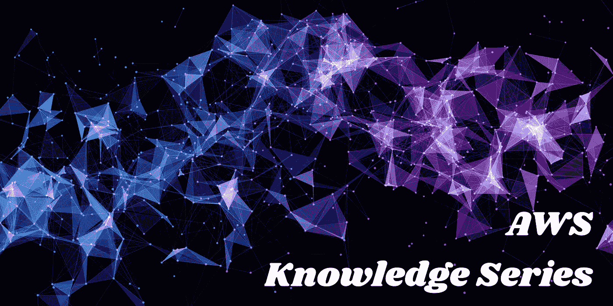

AWS 提供了许多专门构建的数据库来满足不同的业务需求。Neptune DB 是他们的[图数据库](https://en.wikipedia.org/wiki/Graph_database)解决方案。构建图形数据库是为了高效地存储和查询高度关联的数据。数据以顶点和连接这些顶点的边的形式存储。每个顶点代表一个实体，如用户、产品、地点，每个边代表两个顶点之间的关系，例如，人“Sanjay Dandekar”是地点“Bangalore”的居民。


图形数据库中的数据

在本文中，我们将探讨以下主题:

*   如何设置 Neptune DB 的实例
*   使用 Jupyter 笔记本填充数据。
*   写一个简单的 Lambda 函数查询海王星图 DB。

# **创建一个新的 Neptune DB 的无服务器实例**

要创建 Neptune DB 的实例，请登录 AWS 控制台并导航到 Neptune 服务。单击主页上的 Launch Neptune 实例，启动一个向导来创建 Neptune 实例。

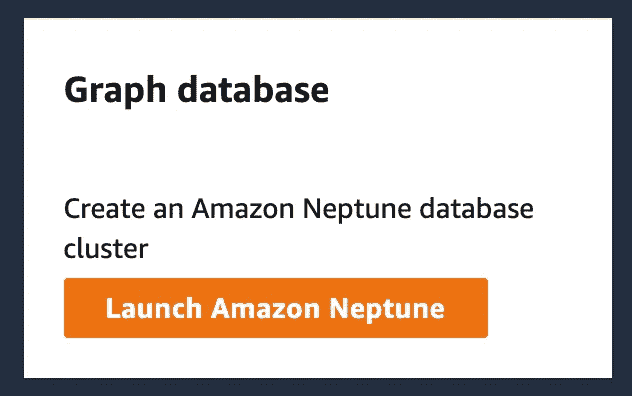

选择要使用的数据库引擎版本。建议使用最新版本。

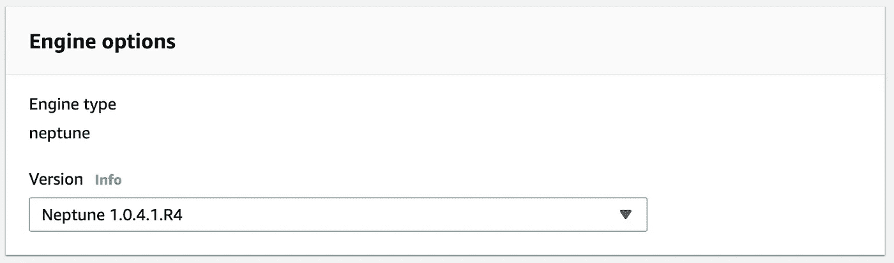

选择数据库引擎版本

指定数据库的名称。

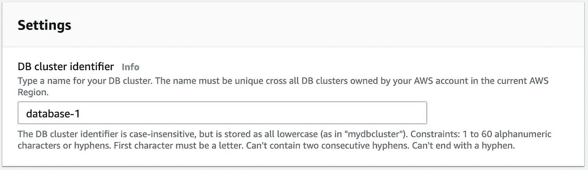

命名您的数据库

指定是出于生产还是开发目的启动实例。

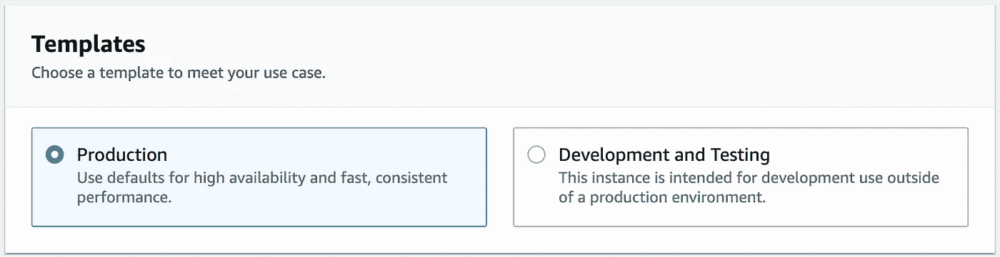

指定服务器的计算规模参数(CPU、RAM、网络)。配置越高，你的成本就越高。具有所选配置的服务器将一直运行，因此运行 Neptune DB 实例有一个固定成本。

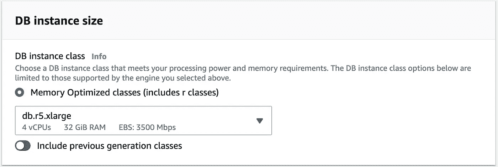

如果需要高可用性数据库实例，请选择多可用性区域选项。这将允许您创建跨越多个可用性区域的读取器和写入器实例，从而提供更好的故障恢复能力。

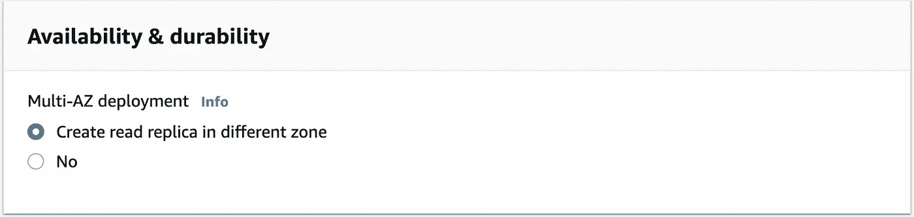

为 Neptune DB 服务器的部署选择网络配置。创建一个专用的 VPC 会将 Neptune DB 实例与 Internet 隔离开来。为了从 EC2 或 Lambda 访问这样的 Neptune DB 实例，您必须使用适当的 VPC 子网配置来配置 EC2 / Lambda 实例。Lambda 函数还需要特定的权限来创建网络接口，以便它可以连接到 Neptune DB。Neptune DB 可以连接的缺省 post 号是 8182——如果愿意，您可以指定不同的端口。

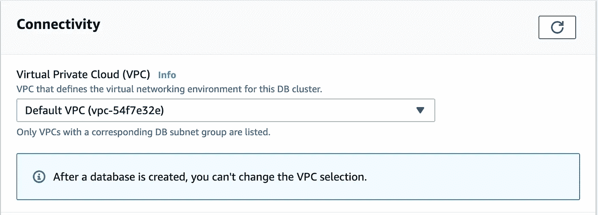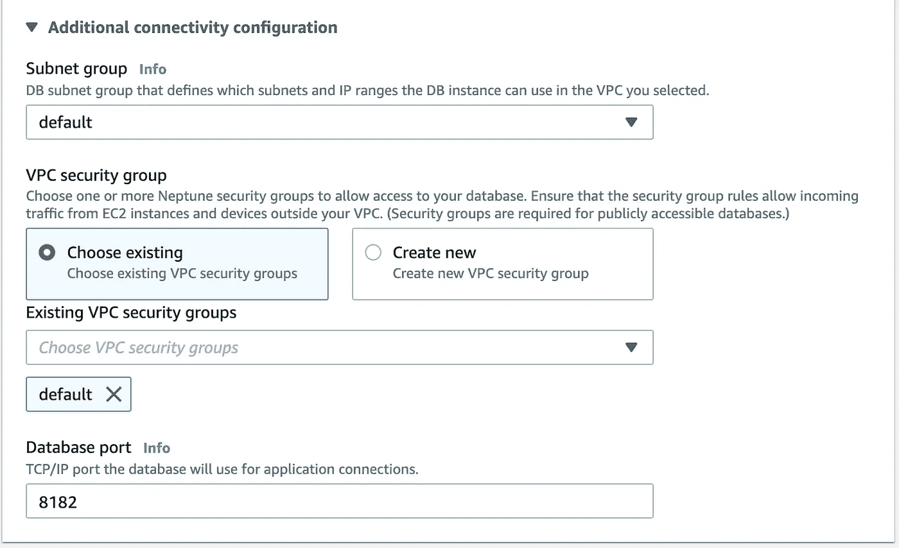

还可以创建一个 Jupyter notebook 的实例，该实例连接到 Neptune 实例。这允许您针对 Neptune DB 连接和执行专门的 gremlin 查询。请记住，运行 Jupyter 笔记本实例也有固定成本。强烈建议在开发阶段创建一个笔记本。由于我们将使用 Jupyter notebook 创建数据，请选中“创建笔记本”复选框。

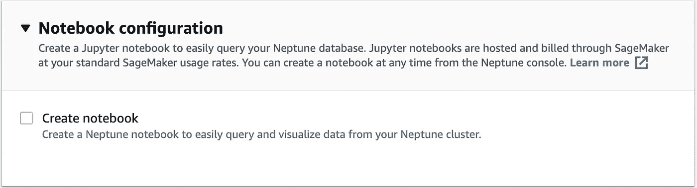

canoe 通过提供定制的 DB 参数组来启用/禁用各种配置标志和特性。有关各种标志/功能的更多详细信息可在以下链接中找到。

[https://docs . Amazon AWS . cn/en _ us/Neptune/latest/user guide/parameters . html](https://docs.amazonaws.cn/en_us/neptune/latest/userguide/parameters.html)

如果您想要定制 DB 参数组，那么您首先需要创建新的或修改现有的参数组，并根据您的要求启用/禁用各种标志/特性，然后将该参数组用于这个 Neptune DB 实例。

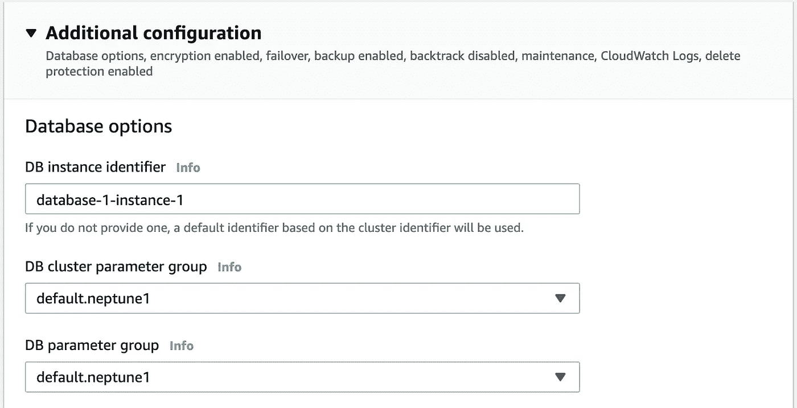

参数组中最重要的标志之一是 *neptune_enable_audit_log* 标志。默认情况下，审计日志是禁用的。这意味着您不会看到 Neptune DB 的任何 cloudwatch 日志。我强烈建议您启用这个标志——至少在开发阶段——因为它支持通过 CloudWatch 快速访问 Neptune DB 日志。一旦数据库集群启动并运行，就不能切换审计日志标记。要关闭或打开审计日志，需要重新启动数据库。

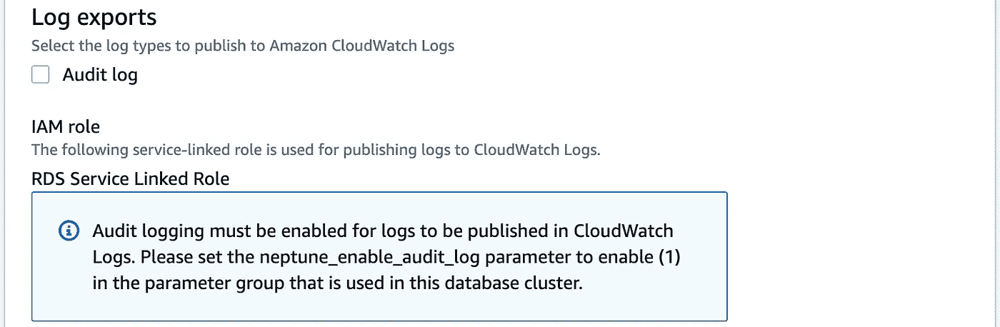

为您的数据库实例指定备份和静态加密配置。

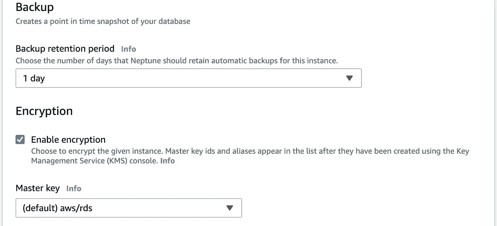

如果希望在维护窗口期间自动应用数据库引擎的次要修补程序版本，请选中“启用自动次要版本升级”框。

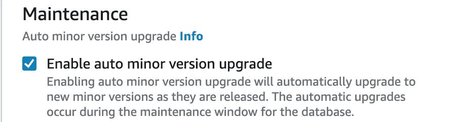

您还可以指定一个维护窗口，或者让 AWS 根据实例的使用情况选择相同的窗口。最后，不要忘记选中删除保护框。这将防止任何意外删除您的数据库。

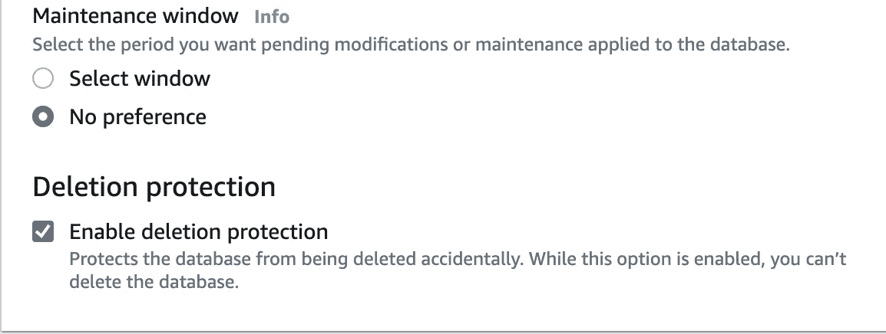

单击“Create Database”按钮开始创建 Neptune DB 集群。该集群将有一个具有“写入者和读取者”角色的数据库节点。如果您想要向集群添加额外的“reader”实例，您可以通过选择集群实例并从 Actions 下拉列表中选择“Add reader”操作来实现。

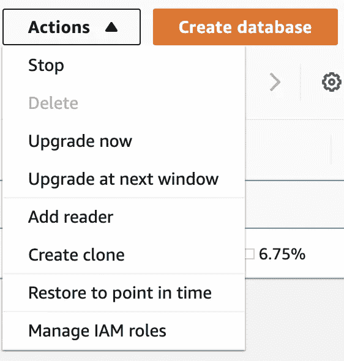

# **使用 Jupyter 笔记本填充海王星图数据库**

连接到 Neptune DB 集群的 Jupyter notebook 是针对图形数据库执行 gremlin 查询的一种非常方便的机制。要访问 Jupyter 笔记本，请导航到 AWS 控制台中的 Neptune 仪表盘。选择“笔记本”选项，列出当前的笔记本。如果您在创建 Neptune DB 实例时选择了创建一个 Jupyter 笔记本，它将会被列出。如果您尚未创建笔记本，则可以通过单击“创建笔记本”按钮快速创建一个。在向导中选择要访问的 Neptune DB 集群。

请记住，运行 Jupyter 笔记本有固定的相关成本，因此在创建笔记本时请记住这一点。

单击笔记本链接，然后单击“打开笔记本”按钮打开笔记本文件夹结构。单击带有“.”的文件。ipynb”扩展来启动基于 web 的界面。

在工作簿单元格中复制以下 gremlin 命令，然后单击“运行”执行它。

```
%%gremlin
g.addV("Person")
.property(id, '10a2a0c0-4642-446e-9862-2e60f1bf20ff')
.property('firstName', 'Sanjay')
.property('lastName', 'Dandekar')
.property('designation', 'Developer')
.addV("Person")
.property(id, 'f7f37040-ae72-4c04-b754-3fac331d26b9')
.property('firstName', 'Sanjay')
.property('lastName', ‘Kulkarni’)
.property(‘favouriteColor’,’Blue’)
.addV("Person")
.property(id, '9b802a76-552d-43c1-856a-a0787932e535')
.property('firstName', 'Ajay')
.property('lastName', ‘Gupta’)
.property('hobby', ‘Ice Skating’)
.next();
```

上面的命令将创建三个“Person”类型的顶点。每个人顶点都有一个唯一的标识符，即 GUID。每个顶点有两个公共属性，即名和姓。

在下一个单元格中，复制下面的命令并单击“Run”来执行它。

```
%%gremlin
g.V().hasLabel(‘Person').valueMap()
.with(WithOptions.tokens).toList();
```

这将列出我们刚刚创建的所有三个顶点。

现在让我们创建“地点”顶点。在工作簿单元格中复制以下 gremlin 命令，然后单击“运行”执行它。

```
%%gremlin
g.addV("Place")
.property(id, '898c62f5-e0cb-4aee-b347-69a0f6dcb639')
.property('name', ‘Bangalore')
.property(‘state’, ‘Karnataka’)
.addV("Place")
.property(id, 'cceee371-e26b-4802-9b0d-02003c5a7455')
.property('name', ‘Mumbai')
.property('alternateName', ‘Bollywood')
.next();
```

上面的命令创建了两个类型为“Place”的顶点。每个地点顶点都有一个唯一的标识符，即 GUID。每个顶点都有一个属性—名称。

像前面一样，执行下面的命令来检查是否已经创建了两个地点顶点。

```
%%gremlin
g.V().hasLabel('Place').valueMap()
.with(WithOptions.tokens).toList();
```

所以现在我们有两种类型的顶点——人和地点。如您所见，顶点没有“模式”。在我们的示例中，Person 和 Place 类型的所有顶点都有一些公共属性(firatName、lastName for Person 和 name for Place ),还有一些是顶点特有的。每个顶点都有两个强制属性——label(在我们的例子中是 Person 和 Place)和 ID——每个顶点的唯一标识符(为此我们使用了 GUID)。

现在让我们用“边”来连接顶点。让我们在人和地点顶点之间创建一个标签为“resident_of”的边。我们需要以下连接:

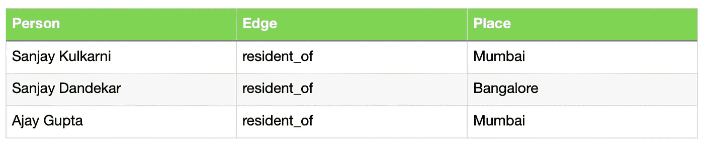

在工作簿单元格中复制以下 gremlin 命令，然后单击“运行”执行它。

```
%%gremlin
g.V(‘f7f37040-ae72-4c04-b754-3fac331d26b9')
.hasLabel('Person').as('person1')
.V(‘cceee371-e26b-4802-9b0d-02003c5a7455')
.hasLabel('Place').as('place1')
.addE("resident_of")
.property(id, 'f7f37040-ae72-4c04-b754-3fac331d26b9_cceee371-e26b-4802-9b0d-02003c5a7455')
.from('person1')
.to('place1')
.V(‘10a2a0c0-4642-446e-9862-2e60f1bf20ff')
.hasLabel('Person').as('person2')
.V(‘898c62f5-e0cb-4aee-b347-69a0f6dcb639')
.hasLabel('Place').as('place2')
.addE("resident_of")
.property(id, '10a2a0c0-4642-446e-9862-2e60f1bf20ff_898c62f5-e0cb-4aee-b347-69a0f6dcb639')
.from('person2')
.to('place2')
.V('9b802a76-552d-43c1-856a-a0787932e535').hasLabel('Person').as('person3')
.V(‘cceee371-e26b-4802-9b0d-02003c5a7455')
.hasLabel('Place').as('place3')
.addE("resident_of")
.property(id, '9b802a76-552d-43c1-856a-a0787932e535_cceee371-e26b-4802-9b0d-02003c5a7455')
.from('person3')
.to('place3')
.next();
```

使用顶点的标识符和标签，我们正确地识别顶点，然后添加连接两个顶点的边。执行以下命令，查看是否创建了边。

```
%%gremlin
g.E().hasLabel('resident_of').valueMap()
.with(WithOptions.tokens).toList();
```

这是一个如何使用 Jupyter notebook 在 Neptune DB 中快速创建顶点和边的快速示例。也可以通过将数据格式化为 CSV 格式来批量插入数据，上传到 S3，然后要求 Neptune DB 启动导入作业以到达 CSV，从而在数据库中创建顶点和边。

# **从 Lambda 函数中查询 Neptune】**

我们现在将看到如何从 Lambda 函数中查询我们上面创建的数据。有两种方法可以访问数据——1)针对 Neptune DB 的 gremlin 端点执行 HTTPS POST 请求，其中有效载荷是 gremlin 命令；2)使用与任何 Lambda 运行时(例如 nodejs 或 Python)兼容的 gremlin 库，并通过 web 套接字连接执行 gremlin 查询。我将在本文中演示第二种方法，作为非常简单的第一种方法。

**创建 Gremlin 节点λ层**

我将使用 NodeJS 环境作为 Lambda 的运行时，所以我们要做的第一件事是下载 Gremlin NodeJS 包。打开一个命令 shell，创建一个名为“neptune_gremlin_layer”的文件夹。在其下创建名为“nodejs”的文件夹，并执行以下命令来下载 gremlin nodejs 包。

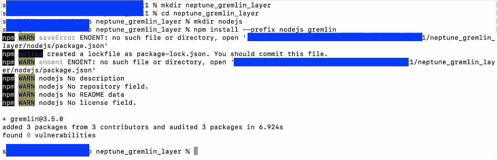

使用以下命令压缩 nodejs 文件夹:

```
zip -r9 ./gremlin_layer.zip ./nodejs
```

导航到 Lambda AWS 控制台，并从左侧菜单列表中选择层。单击创建图层按钮并指定图层属性。上传我们上面创建的 zip 文件。单击创建按钮创建图层。

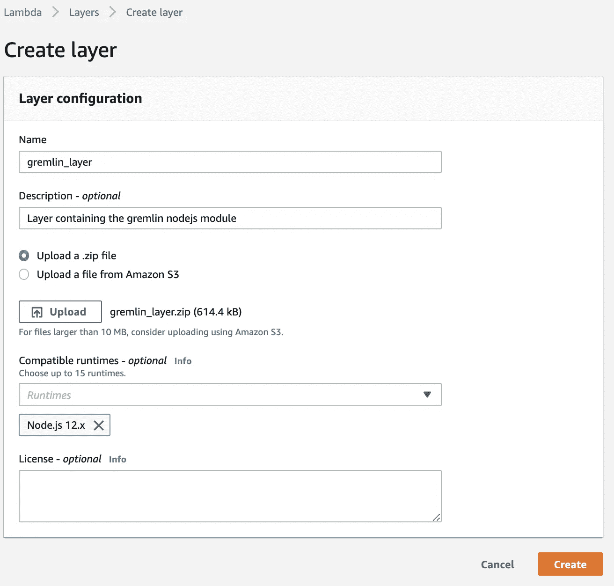

**创建λ函数**

导航回 Lambda 仪表板，单击“创建函数”按钮创建一个新函数。输入如下所示的数据:

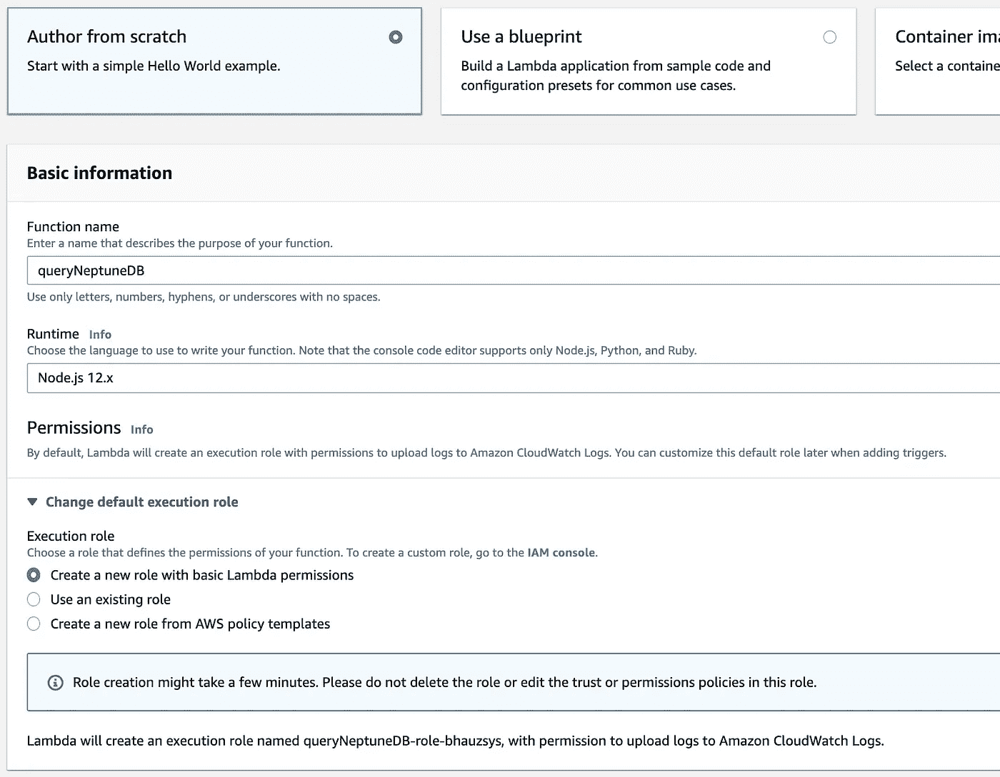

如果您在专用 VPC 中创建了 Neptune 实例，那么您必须选择适当的 VPC、子网和安全组，以便 Lambda 函数能够访问 Neptune DB 集群。

单击“创建函数”按钮创建函数。我们现在必须将上面创建的 gremlin 层与这个 Lambda 函数关联起来。导航到 Lambda 函数的图层配置面板，点击“添加图层”按钮。

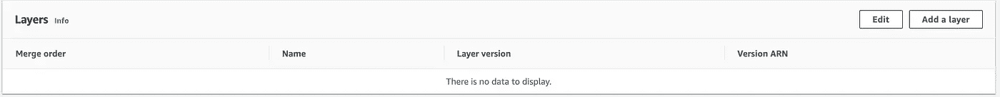

在出现的表单中，选择自定义层，然后选择我们刚刚创建的 gremlin 层。

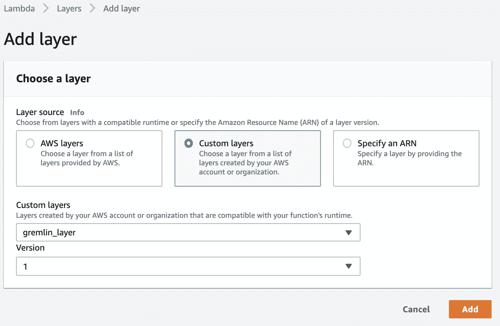

单击添加将图层添加到函数中。编辑函数代码，并将以下代码粘贴到函数定义中。

```
const gremlin = require('gremlin');// functions / definitions from gremlin js library
const DriverRemoteConnection = gremlin.driver.DriverRemoteConnection;
const Graph = gremlin.structure.Graph;
const withOptions = gremlin.process.withOptionsfunction getNeptuneWSURL(neptuneHost, neptunePort) {
  var url = "wss://" + neptuneHost + ":" + neptunePort + "/gremlin";
  return url;
}exports.handler = async (event) => { // Create connection to Neptune
  var dc = new DriverRemoteConnection(getNeptuneWSURL('<<Replace with your Neptune Cluster Name>>','8182'), {}); var graph = new Graph(); var g = graph.traversal().withRemote(dc); // How many person vertexes are there in the Neptune graphdb?
  var graphResult = await g.V().hasLabel('Person').count().next();
  console.log("Number of person vertexes: ", graphResult); // How many place vertexes are there in the Neptune graphdb?
  graphResult = await g.V().hasLabel('Place').count().next();
  console.log("Number of place vertexes: ", graphResult); // How many person vertex having "Sanjay" as first name?
  graphResult = await g.V().hasLabel('Person').has('firstName', 'Sanjay').count().next();
  console.log("Number of person fn = Sanjay: ", graphResult); // Details of person vertex having "Sanjay" as first name?
  graphResult = await g.V().hasLabel('Person').has('firstName', 'Sanjay').valueMap()
  .with_(withOptions.tokens).toList();
  console.log("Details of person fn = Sanjay: ", graphResult); // Places of person vertex having "Sanjay" as first name?
  graphResult = await g.V().hasLabel('Person').has('firstName', 'Sanjay').outE('resident_of').inV().valueMap().with_(withOptions.tokens).toList();
  console.log("Places of person fn = Sanjay: ", graphResult); // Number of people who are resident of Bangalore
  graphResult = await g.V().hasLabel('Place').has('name', 'Mumbai').inE('resident_of').count().next();
  console.log("Number of residents of Mumbai: ", graphResult); // Details of persons staying in Mumbai?
  graphResult = await g.V().hasLabel('Place').has('name', 'Mumbai').inE('resident_of').outV().valueMap().with_(withOptions.tokens).toList();
  console.log("Details of residents of Mumbai: ", graphResult); // Close the websocket connection
  await dc.close(); // Response from lambda
  const response = {
    statusCode: 200,
    body: JSON.stringify('Hello from Lambda!'),
  }; return response;};
```

以下是 Lambda 执行的日志。

```
Number of person vertexes:  { value: 3, done: false }Number of place vertexes:  { value: 2, done: false }Number of person fn = Sanjay:  { value: 2, done: false }Details of person fn = Sanjay:  [Map {'firstName' => [ 'Sanjay' ],
'lastName' => [ 'Kulkarni' ],
'favouriteColor' => [ 'Blue' ],
EnumValue { typeName: 'T', elementName: 'label' } => 'Person',
EnumValue { typeName: 'T', elementName: 'id' } => 'f7f37040-ae72-4c04-b754-3fac331d26b9'},Map {'firstName' => [ 'Sanjay' ],
'lastName' => [ 'Dandekar' ],
'designation' => [ 'Developer' ]
EnumValue { typeName: 'T', elementName: 'label' } => 'Person',
EnumValue { typeName: 'T', elementName: 'id' } => '10a2a0c0-4642-446e-9862-2e60f1bf20ff'}]Places of person fn = Sanjay:  [Map {'name' => [ 'Mumbai' ],
'alternateName' => [ 'Bollywood' ],
EnumValue { typeName: 'T', elementName: 'label' } => 'Place',
EnumValue { typeName: 'T', elementName: 'id' } => 'cceee371-e26b-4802-9b0d-02003c5a7455'},Map {'name' => [ 'Bangalore' ],
'state' => [ 'Karnataka' ],
EnumValue { typeName: 'T', elementName: 'label' } => 'Place',
EnumValue { typeName: 'T', elementName: 'id' } => '898c62f5-e0cb-4aee-b347-69a0f6dcb639'}]Number of residents of Mumbai:  { value: 2, done: false }Details of residents of Mumbai:  [Map {'firstName' => [ 'Sanjay' ],
'lastName' => [ 'Kulkarni' ],
'favouriteColor' => [ 'Blue' ],
EnumValue { typeName: 'T', elementName: 'label' } => 'Person',
EnumValue { typeName: 'T', elementName: 'id' } => 'f7f37040-ae72-4c04-b754-3fac331d26b9'},Map {'firstName' => [ 'Ajay' ],
'lastName' => [ 'Gupta' ],
'hobby' => [ 'Ice Skating' ]
EnumValue { typeName: 'T', elementName: 'label' } => 'Person',
EnumValue { typeName: 'T', elementName: 'id' } => '9b802a76-552d-43c1-856a-a0787932e535'}]
```

如您所见，gremlin node js 库提供了直接在 Neptune DB 上执行原生 gremlin 查询的能力。

关于 Lambda 函数代码需要注意的最重要的一点是，一旦我们完成了对 Neptune DB 的查询，就调用关闭 websocket 连接。如果你不这样做，网络插座将保持开放几个小时。Neptune DB 的每个节点都有数量有限的 websocket 连接，因此在工作完成后立即关闭 web socket 非常重要。打开和关闭 websocket 连接的开销是你必须忍受的，直到 AWS 为 Lambda 环境提供了一个很好的“连接池”解决方案。如果不能正确地做到这一点，可能会在生产环境中产生灾难性的后果！