# 应用程序负载平衡器后面的 AWS Lambda

> 原文：<https://medium.com/nerd-for-tech/aws-lambda-behind-application-load-balancer-75f71413c9e6?source=collection_archive---------0----------------------->

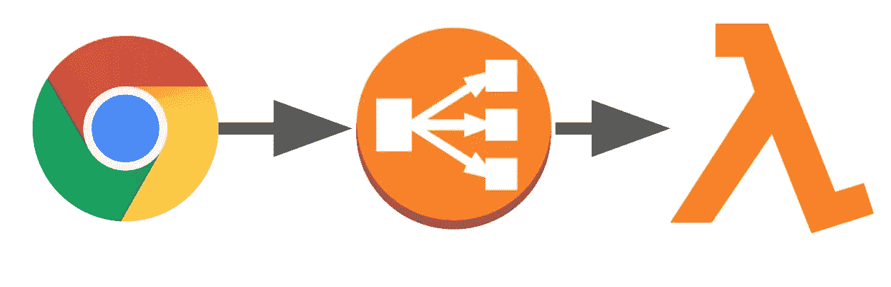

对于包括 Lambda 在内的所有集成类型，API Gateway 的集成超时硬限制为 29 秒。另一种方法是在后面使用 lambda 和 ALB。通过这种方式，我们可以直接从 lambda 获得一个页面应用程序。此外，这种方法为我们提供了从同一个 ALB 提供多个域和服务的选项。在某种程度上，我们可以将 EC2(较大的应用程序)、ECS(微服务)、内部部署(传统)和 lambda(SPA 或即席查询)都绑定到一个端点。路由将由 ALB 完成。现在让我们看看如何在 ALB 后面提供 lambda 的内容。

让我们首先创建一个 lambda 函数来服务内容。为此，我选择了 AWS 的一个预建的无服务器应用程序(ALB-Lambda-Target-WhatisMyIP)。这个模板创建了一个 lambda 函数和一个必要的 IAM 角色。

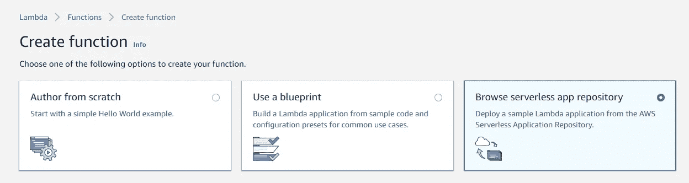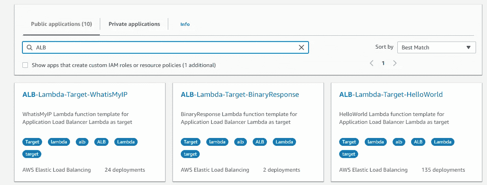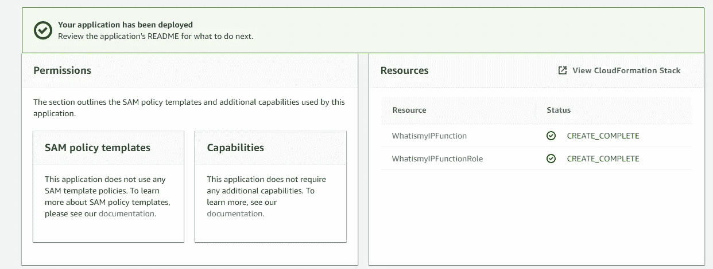

一旦 lambda 被创建，我就开始从 EC2 控制台提供 ALB。在此之前，只是一个快速参考如何 ALB 工程。

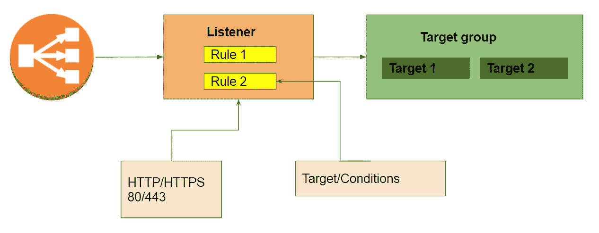

主要的变化是路由和注册 lambda。因此，在目标类型中创建目标组时，我选择了最后一个选项(Lambda 函数)。

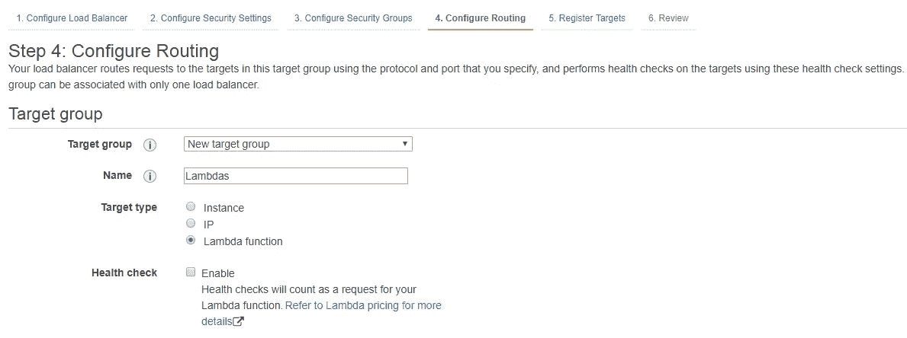

现在我需要向目标组注册我的 lambda 函数。很简单。我从下拉列表中选择了之前创建的函数。

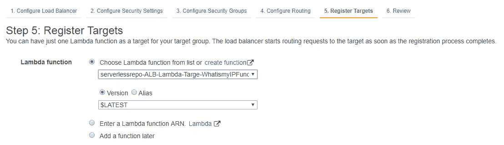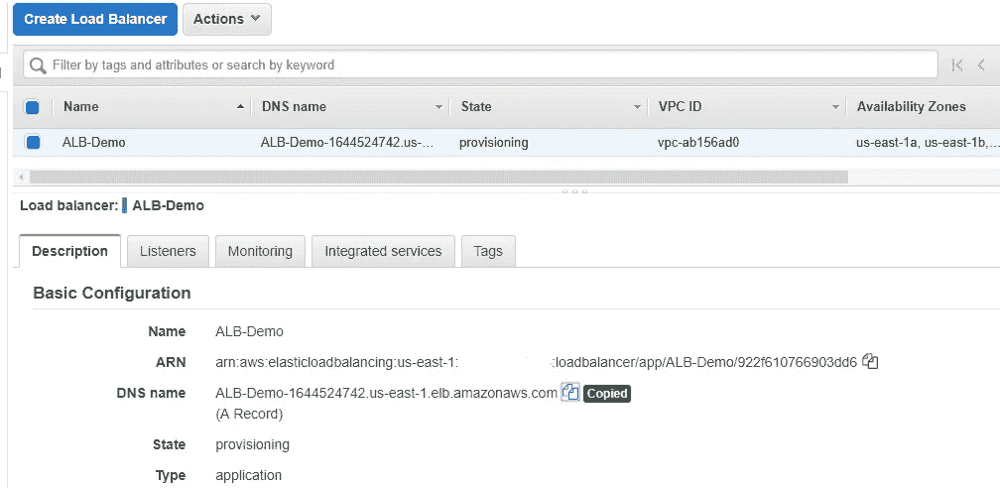

创建 ALB 后，我复制了 URL 并在浏览器中打开它。瞧，来自 lambda 的内容呈现出来了。

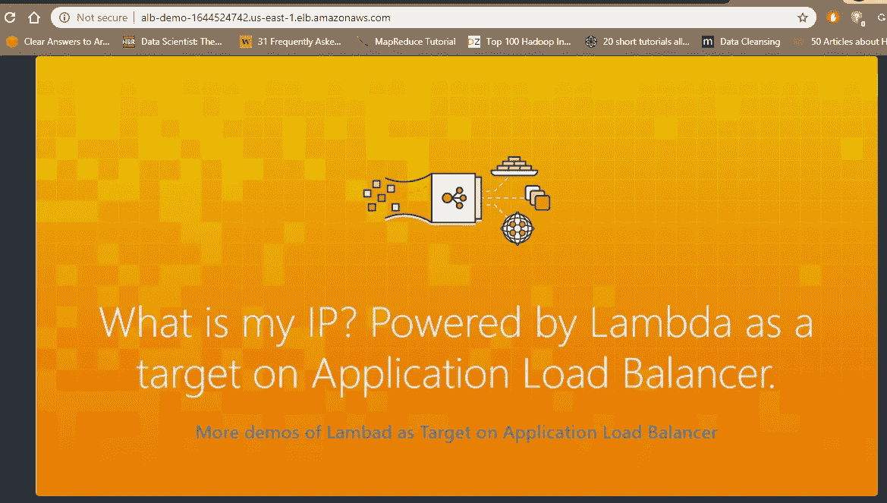

只是为了看看基于路径的路由如何与 lambda 一起工作，这次我从示例中创建了一个 Lambda(al b-Lambda-Target-hello world)。创建了一个与前一个类似的新目标(Hello)组。注册了第二个λ。之后，我编辑了如下的监听器规则。

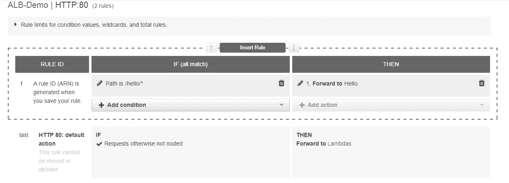

再次完成后，我复制了 ALB 的网址并附加了/hello/

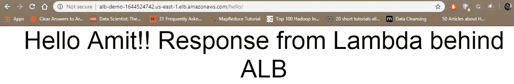

这就是我们如何将 lambda 注册到 ALB 并提供内容。

希望这有用。