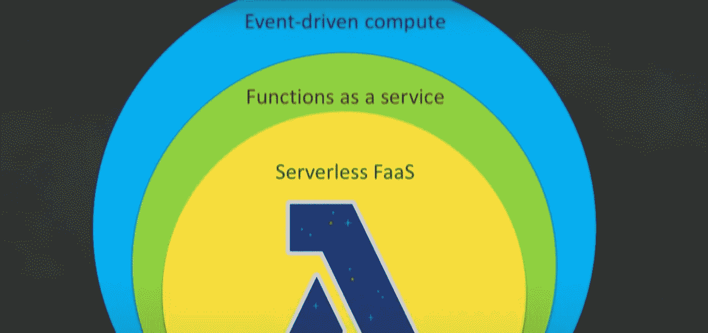
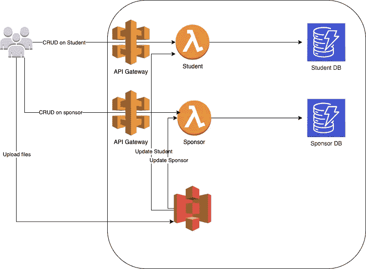

# AWS Lambda(慈善网络应用)-简介

> 原文：<https://medium.com/nerd-for-tech/aws-lambda-charity-web-app-intro-b775c94ca563?source=collection_archive---------2----------------------->

目前我正在做一个项目，需要存储与奖学金基金相关的学生和赞助商数据。由于这是一项没有任何利润的慈善工作，该组织首先关心的是成本。我考虑了各种选项，如 AWS EC2 免费层、AWS ECS、Heroku 等。但当我遇到 AWS Lambda 时，我就停在了那里。原因是 AWS Lambda 在某个阈值后开始计算成本，以我现在正在做的工作的规模，我敢肯定它永远不会超过那个阈值。

自从决定使用 AWS Lambda 以来，我的脑海中出现了许多问题。我为什么要去无服务器。我的决定是否正确。所以我查阅了上百份相关文件和视频。从普通客户的角度来看，这些是我看到的优势。

*   更高的灵活性
*   开销更少
*   更好的聚焦
*   规模增大
*   更多灵活性
*   更快上市

从更深入的开发或技术角度来看，以下是我看到的优势:

*   没有要调配或管理的服务器
*   随使用情况扩展
*   物有所值
*   可用性和容错是内置的

现在，我对选择 Lamda 的决定的准确性很有信心。在项目中使用它之前，我们先了解一下。

随着微服务成为流行的选择，事件驱动计算也变得流行起来。因此，基本上我们分离出应用程序的工作流，并使用事件将它们连接到不同的微服务之间。这些事件可以在更微观的层次上与某个功能保持一致。因此，作为服务的无服务器功能变得流行起来。在众多选择中，AWS Lambda 已经成为无服务器的流行选择。下面是 Lambda 本身处理的一些功能。

*   负载平衡
*   自动缩放
*   处理故障
*   安全隔离—(执行策略和功能策略管理 lambda 安全性)
*   操作系统管理
*   管理利用率

甚至工作流程也可以使用逐步升级功能进行管理。关于 Lambda 函数，我们可以讨论很多东西，但作为我未来工作的参考，我将回到我的用例，我需要它来存储学生和奖学金基金的赞助商信息。

以下是我的申请要求:

*   能够创建，删除，更新，停用学生和赞助商
*   为学生和赞助商上传文件
*   为赞助商分配学生

下面是我们将用来解决这些需求的 AWS 服务。S3 免费层仅存在 1 年。

*   AWS Lambda(总是免费的)—带有学生和赞助商处理程序的函数
*   AWS API 网关(12 个月免费层)
*   AWS S3 (12 个月免费层)—存储上传的文件(上传文件时将触发 Lambda 功能，它将更新数据库中的文件条目)
*   AWS 发电机数据库(始终免费)
*   前端托管在 [Github 页面](https://billa-code.medium.com/react-with-typescript-series-charity-web-app-deploying-to-github-pages-ab86a1888fab)中。

下面是我们应用程序的高级架构。

现在我们的项目我的重点是使用自动气象站 CDK 云的形成的东西。这将有助于我们在不使用 terraform 或其他库的情况下部署功能。首先，我们将创建学生处理程序和数据库。下节课再见。快乐编码:P