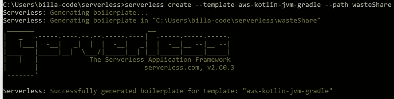
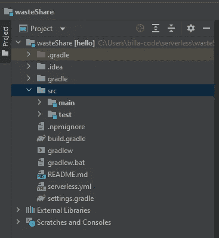
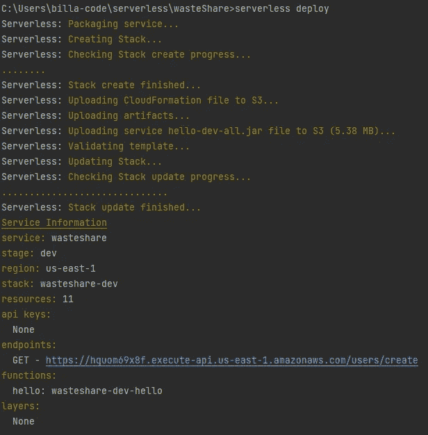
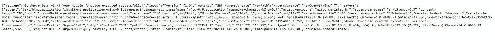
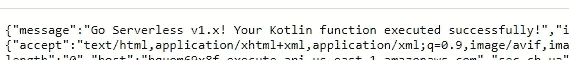

# AWS Lambda +无服务器+ Kotlin 废物共享应用程序系列—简介

> 原文：<https://medium.com/nerd-for-tech/aws-lambda-serverless-kotlin-waste-share-app-series-intro-ef3adc8f0d57?source=collection_archive---------0----------------------->

因此，在开始创建应用程序之前，我只是想让你们知道，我们正在使用这些技术栈实现这个应用程序的后端。对于前端应用程序，我希望使用 React，这将是另一个系列。好了，这是我在开始教程之前需要做的主要声明。现在让我们深入到技术层面。

世界上许多公司现在都在使用 AWS 来托管他们的应用程序，因为现在这样更方便。你不必维护物理服务器，你只需要有一个 AWS 帐户，许多托管解决方案就在你家门口。作为软件工程师，我们应该想出具有成本效益的方法来托管这些应用程序。在这种情况下，AWS lambda 是用于后端开发的一个很好的服务。以下是 AWS 给 AWS lambda 的定义。

“AWS Lambda 是一种无服务器计算服务，让您无需配置或管理服务器、创建工作负载感知集群扩展逻辑、维护事件集成或管理运行时即可运行代码。”

Lambda 自动精确地分配计算执行能力，并根据传入的请求或事件运行您的代码，适用于任何规模的流量。现在我们不需要 ELB(弹性负载平衡器)、EC2 服务器等来托管我们的应用程序。只有当我们的 lambda 函数被触发时，AWS 才会充电。

现在，我们使用无服务器框架而不是直接将代码上传到 AWS lambda 的原因是，无服务器框架提供了 AWS Lambda 包和部署流程的简单有效的抽象。因此，我们可以在本地对配置进行编码，然后在 AWS 中使用命令应用程序。

为什么是 Kotlin 而不是 Java？。Kotlin 是一种静态类型的编程语言，运行在 JVM 上，也可以编译成 JavaScript 源代码以及使用 LLVM 编译器基础设施。它还通过实现解决方案解决了一些 Java 问题，如**消除了这些空引用的危险**、**不变数组、函数类型、lambda 表达式或匿名函数可以访问外部作用域中声明的变量等等。尽管这并不比 Java 好，但已经相当不错了，语法也很简单。现在你准备好开始了吗？如果没有，请再读一遍😜。**

对于这个项目，我使用的是 **Node 12.16.0，Java 11(OpeJDK)，Intellij 2021 社区版(免费)。**

首先让我们在电脑上安装无服务器。我假设你们知道如何安装 NodeJS。(我使用的是 nvm，所以我可以有多个节点版本来了解它)。我们只需要打开一个 CMD 或者一个终端，输入这个。

```
npm install -g serverless
```

还有其他方法可以做到这一点，但这是我更喜欢的。在那之后，我们还有一次工作要做。它的配置**无服务器**到我们的 AWS 账户。为此，我需要 AWS 帐户的访问密钥和秘密密钥。请访问此链接，了解如何找到该密钥。

[](/nerd-for-tech/aws-certified-solution-architect-iam-8930ce442515) [## AWS 认证解决方案架构师— IAM

### IAM 的意思是身份和访问管理服务。当我们在之前的教程中创建 AWS 帐户时，我们…

medium.com](/nerd-for-tech/aws-certified-solution-architect-iam-8930ce442515) 

获得密钥详细信息后，在终端中输入以下命令

```
**serverless** config credentials **--provider** aws **--key** ***AWSACCESSKEY* --secret** ***AWSSECRETKEY***
```

现在让我们使用下面的命令创建一个支持 Kotlin 和 AWS 的新项目。

```
**serverless** create --**template** aws-kotlin-jvm-gradle **--path** wasteShare
```

如果创建成功，您应该在终端中得到这样的响应。



现在我们将得到一个名为 **wasteShare** 的文件夹，其中包含所需的代码。使用 intellij 打开它，你会得到一个类似这样的文件夹结构。



在部署和测试这个项目之前，让我们更改并清理 serverless.yml 文件。最初有许多注释行，但我们真正需要的只是下面的代码。

```
service: wasteshare
frameworkVersion: '2'

provider:
  name: aws
  runtime: java11
  lambdaHashingVersion: 20201221

package:
  artifact: build/libs/hello-dev-all.jar

functions:
  hello:
    handler: com.serverless.Handler
    events:
      - httpApi:
          path: /users/create
          method: get
```

这个函数的作用是，当我们发出 GET 请求时，它会调用 Handler.kt 文件。在这个示例代码中，它打印一条带有响应数据的消息。负责人的代码 kt。

```
package com.serverless

import com.amazonaws.services.lambda.runtime.Context
import com.amazonaws.services.lambda.runtime.RequestHandler
import org.apache.logging.log4j.LogManager

class Handler:RequestHandler<Map<String, Any>, ApiGatewayResponse> {
  override fun handleRequest(input:Map<String, Any>, context:Context):ApiGatewayResponse {
    LOG.info("received: " + input.keys.toString())

    return ApiGatewayResponse.build **{** statusCode = 200
      objectBody = HelloResponse("Go Serverless v1.x! Your Kotlin function executed successfully!", input)
      headers = *mapOf*("X-Powered-By" *to* "AWS Lambda & serverless")
    **}** }

  companion object {
    private val LOG = LogManager.getLogger(Handler::class.*java*)
  }
}
```

现在让我们构建和部署它。为此，我们必须输入以下命令。

```
gradlew clean build (Windows) | ./gradlew clean build (Linux)serverless deploy
```

现在，该功能将被上传到一个 S3 桶，功能将准备测试。部署后，我们将在终端中得到类似这样的响应。



您可以看到在 endpoint 部分有一个 URL，我们可以用它来测试我们的功能。点击链接，在浏览器中你会得到这样的回应。



这是我们的回应。让我给你看我们需要看到的放大版。



该消息值是从 Handler.kt 文件中设置的。现在让我们来研究代码。当我们向这个函数发出 GET 请求时，它将触发 Handler.kt 文件。那么 handler 将返回这个，

```
return ApiGatewayResponse.build **{** statusCode = 200
      objectBody = HelloResponse("Go Serverless v1.x! Your Kotlin function executed successfully!", input)
      headers = *mapOf*("X-Powered-By" *to* "AWS Lambda & serverless")
    **}**
```

这里我们发送 statusCode = 200，然后在 ApiGatewayResponse.kt 文件中创建消息和其他细节。我想你已经对如何使用这三种技术有了基本的了解。然后将在我们的下一个教程开始真正的应用程序开发。在那之前，快乐的编码伙计们！！！😎