# AWS-Lambda-触发器 _ 自动化

> 原文：<https://medium.com/nerd-for-tech/aws-lambda-trigger-automation-38b2f4ac928a?source=collection_archive---------11----------------------->

用 Lambda 和 Dynamo DB 设置 S3 触发器。在这里，我们将通过使用 AWS lambda 函数获取/触发 S3 存储桶中添加的新文件来更新 dynamo DB，这将是完全自动化的。

**步骤 1:**
创建一个 IAM 角色(拥有访问 AWS 服务的特定权限)。
转到角色>创建角色> AWS 服务> lambda 并选择策略。
在这里，我们附加到我们的角色是“AmazonDynamoDBFullAccess”并向前移动一步以完成进一步的配置。
添加角色名称，角色名称可以是任意的，点击创建。
遵循以下输出。

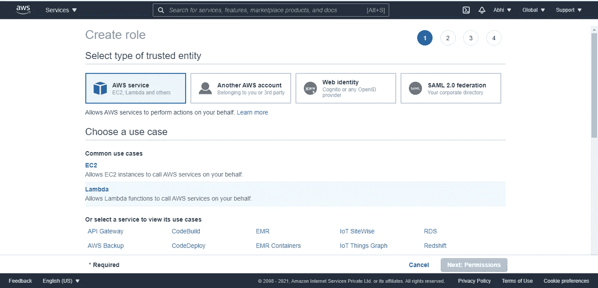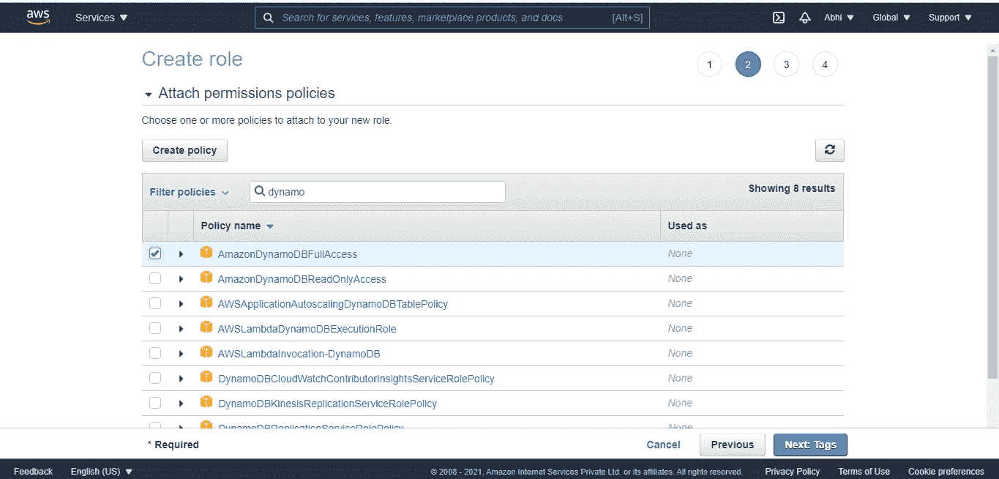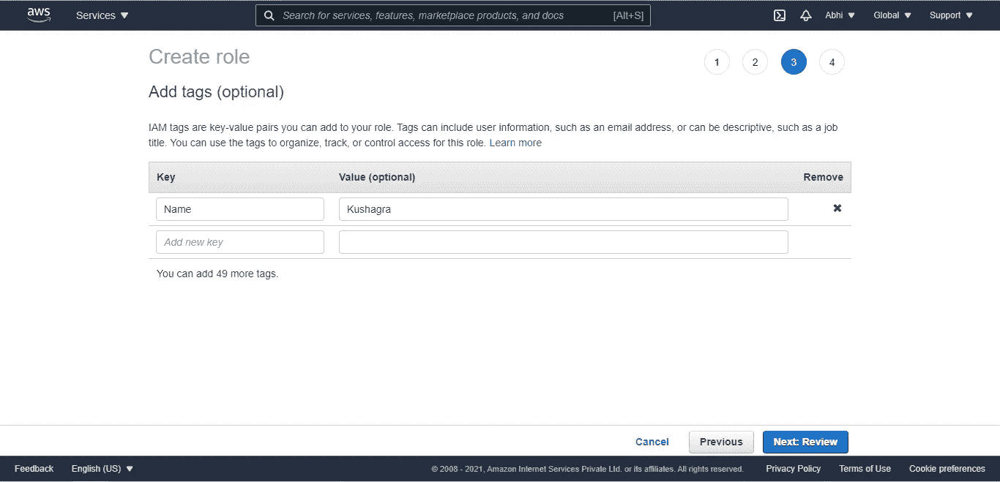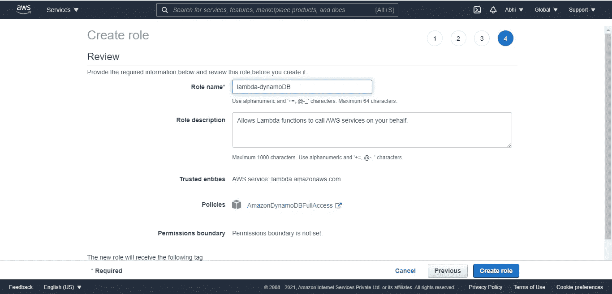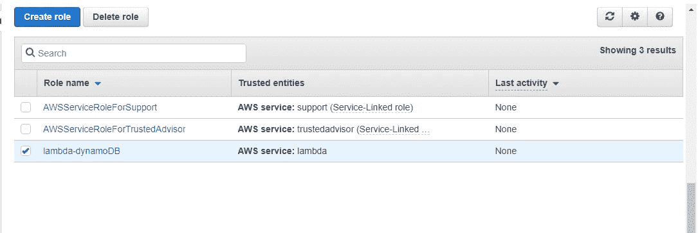

**步骤 2:**
创建一个 Lambda 函数(这个函数将被进一步用来触发 S3 桶服务)。
这里，我们将使用 python 3.6 版本集成 dynamo DB。
必须选择在步骤 1 中创建的角色。

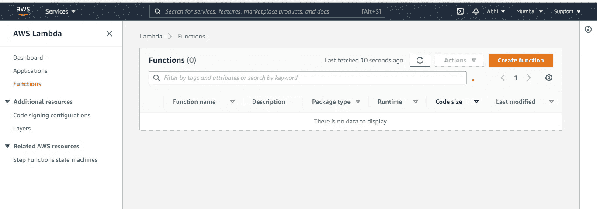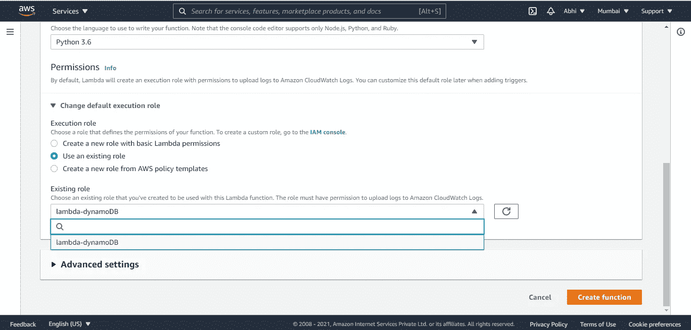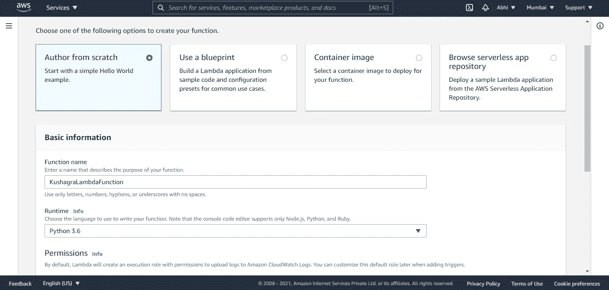

lambda 函数的名称可以是任何名称。


在这里的配置中，您可以看到该功能所访问的服务的权限。

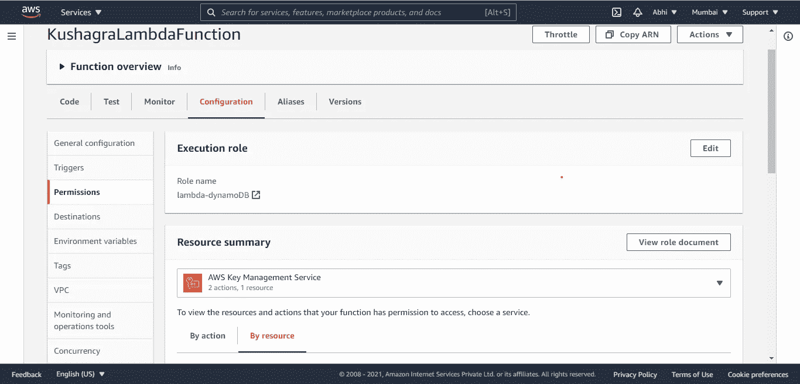

在代码源代码中，实现了一个 Python 脚本来与 Dynamo DB 交互。

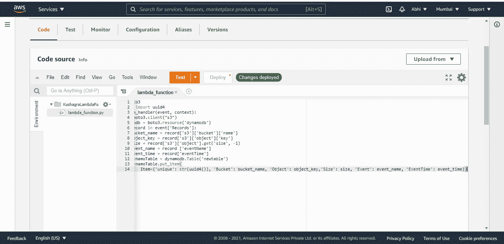

```
import boto3 
from uuid import uuid4 
def lambda_handler(event, context):
    s3 = boto3.client("s3")
    dynamodb = boto3.resource('dynamodb')
    for record in event['Records']:
        bucket_name = record['s3']['bucket']['name']
        object_key = record['s3']['object']['key']
        size = record['s3']['object'].get('size', -1)
        event_name = record ['eventName']
        event_time = record['eventTime']
        dynamoTable = dynamodb.Table('newtable')
        dynamoTable.put_item(
            Item={'unique': str(uuid4()), 'Bucket': bucket_name, 'Object': object_key,'Size': size, 'Event': event_name, 'EventTime': event_time})
```

**步骤 3:**
创建一个 S3 桶，从 Lambda 函数触发。
现在，存储桶和区域的名称可以是任意的。
允许所有公共访问，因为这是学习阶段。
最后，桶创建完成。

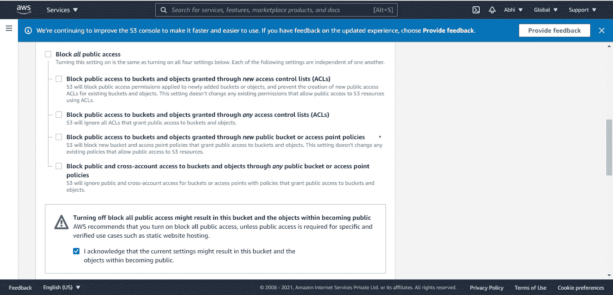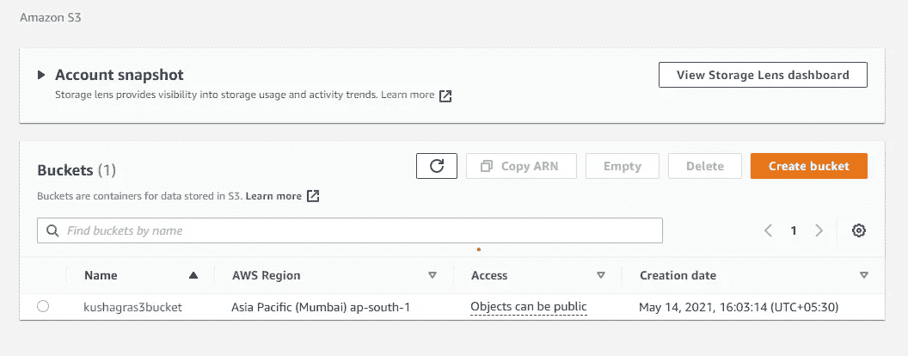

**步骤 4:**
现在我们将设置 S3 桶，通过使用 lambda 函数来触发它。
转到“添加触发器”,添加我们之前创建的 S3 存储桶。
事件类型基本上是一种我们想要的功能类型，如上传删除等。在这里，我们将选择“所有对象创建事件”。
如果我们想添加一个任何扩展名的特定文件，需要使用前缀和后缀。
S3 铲斗准备使用 Lambda 函数触发。

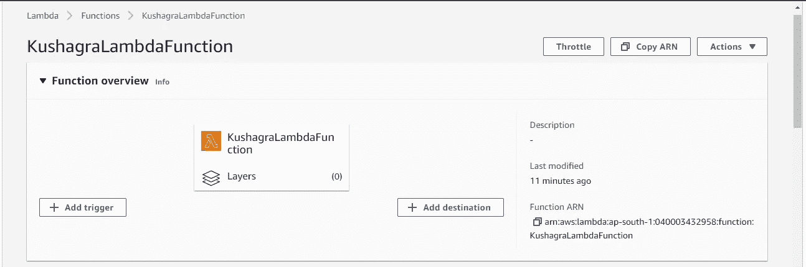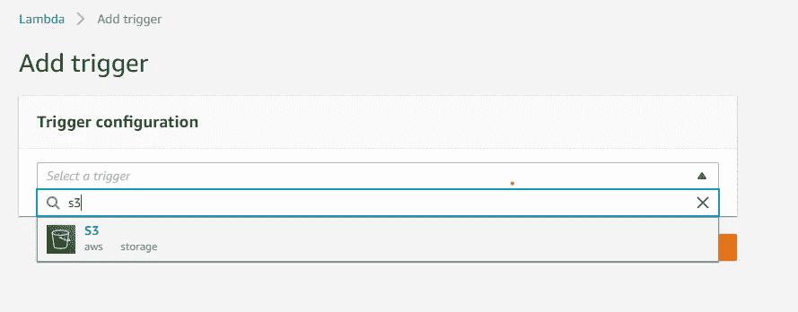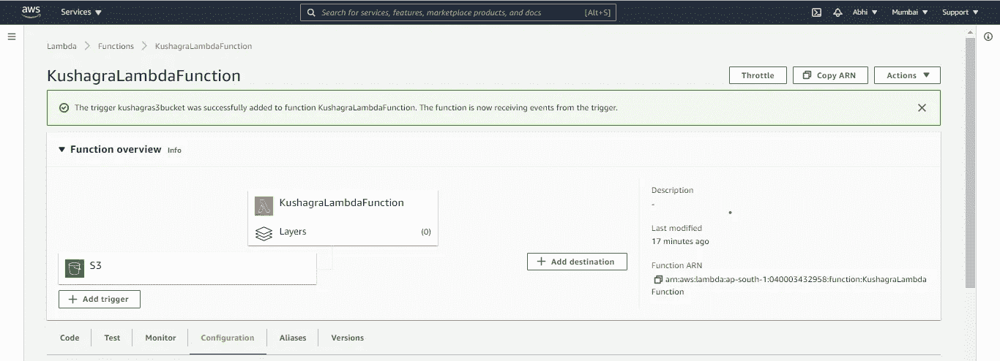

**步骤 5:**
DynamoDB 将用于存储来自 S3 存储桶的数据的输入和输出。
转到数据库服务并选择 Dynamo DB。
这里我们取表名，即“newtable”和分区键“unique”。这个值可以在我们用来集成 dynamo DB 的代码中更改。起初，你会看到迪纳摩数据库项目列表是空的。

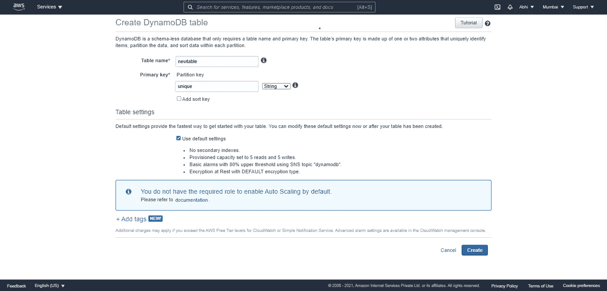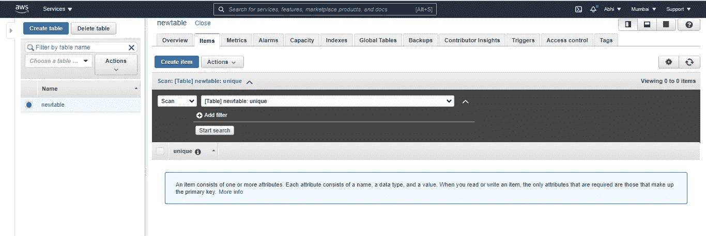

转到 S3 桶尝试手动添加文件/文件夹到你的桶中，我们将看到 lambda 函数触发器并更新 dynamo DB 数据库。

首先，下面的输出显示文件已经在 S3 桶中更新。

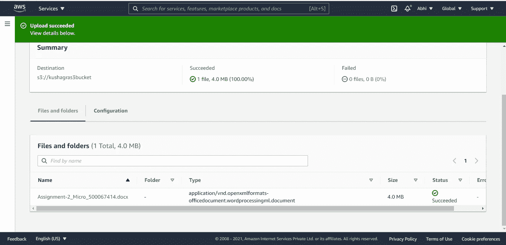

第二，通过触发 S3 桶，使用 aws lambda 更新 DynamoDB。

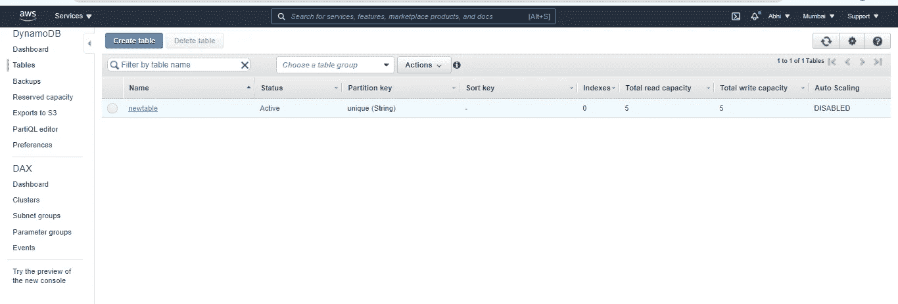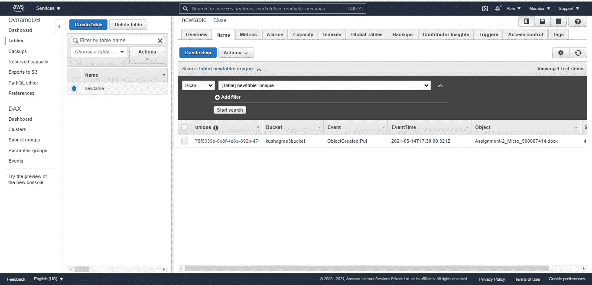

*原载于*[*https://github.com*](https://github.com/kushagra67414/AWS-Lambda-Trigger_Automation/blob/main/README.md)*。*