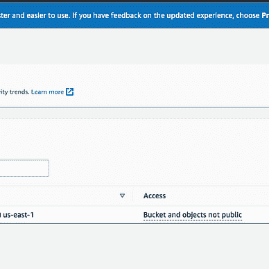
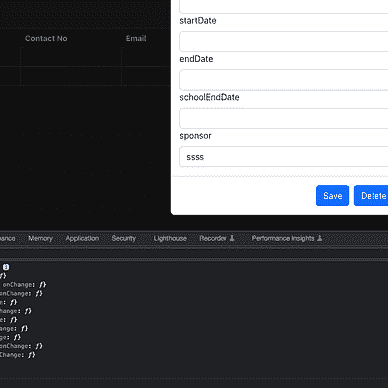
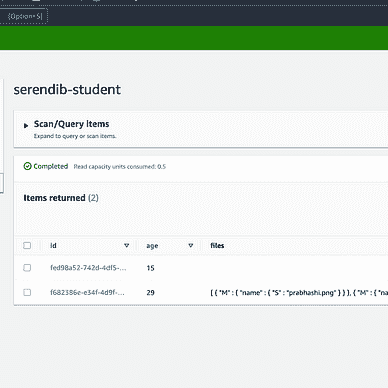
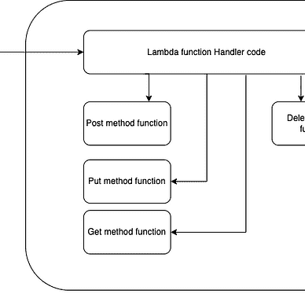
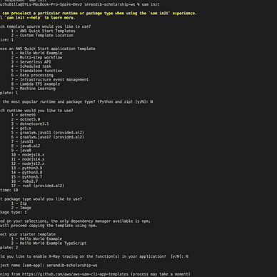
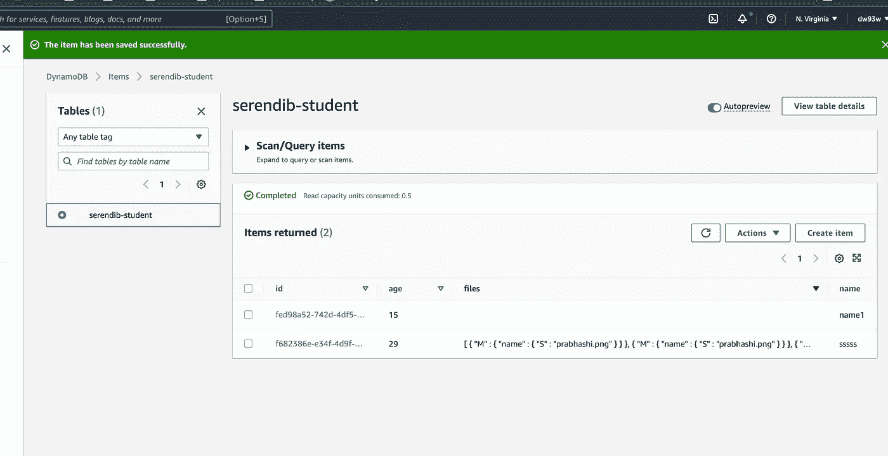

# AWS Lambda Typescript(Charity Web App)-从 Lambda 函数处理 S3 文件上传事件

> 原文：<https://medium.com/nerd-for-tech/aws-lambda-typescript-charity-web-app-handling-s3-file-upload-event-from-lambda-function-58b154c04bed?source=collection_archive---------1----------------------->

嘿伙计们！！！，这将是我的慈善网络应用程序的最后一个教程。为了完成整个项目，下一步将是实施赞助商细节部分。那将是许多重复的工作，所以我不会让你厌烦的。如果你很好奇，可以去项目相关的 Github 链接，查看整个实现。到目前为止，我们已经涵盖了与 React、AWS Lambda、AWS SAM、AWS DynamoDB 和 AWS S3 相关的许多领域。事不宜迟，让我们直接跳到 Lambda 函数中 S3 文件上传事件处理的实现。使用以下链接查看与此项目相关的以前教程。


迪穆图·维克拉马那亚克

## 用 Typescript 系列作出反应(慈善网络应用)

[View list](https://billa-code.medium.com/list/react-with-typescript-seriescharity-web-app-6f45ca471f54?source=post_page-----58b154c04bed--------------------------------)7 stories

[迪姆图·维克拉马那亚克](https://billa-code.medium.com/?source=post_page-----58b154c04bed--------------------------------)

## AWS Lambda(慈善网络应用)系列

[View list](https://billa-code.medium.com/list/aws-lambda-charity-webapp-series-cd878238f932?source=post_page-----58b154c04bed--------------------------------)5 stories

作为第一步，让我们致力于与 S3 桶相关的基础设施。与之前的教程类似，我们更新了 template.yml 文件中的基础结构细节。在添加了 S3 存储桶细节和与之相关的事件细节之后，文件应该是这样的。

```
AWSTemplateFormatVersion: '2010-09-09'
Transform: AWS::Serverless-2016-10-31
Description: serendib-scholarship-ws
Globals:
  Function:
    Timeout: 3

Resources:
  StudentFunction:
    Type: AWS::Serverless::Function
    Properties:
      CodeUri: student/
      Handler: app.lambdaHandler
      Runtime: nodejs16.x
      Architectures:
        - x86_64
      Policies:
        - DynamoDBCrudPolicy:
            TableName: !Ref SampleTable
        **- S3CrudPolicy:
            BucketName: !Ref FileBucket**
      Environment:
        Variables:
          SAMPLE_TABLE: !Ref SampleTable
          **FILE_BUCKET: !Ref FileBucket**
      Events:
        Student:
          Type: Api
          Properties:
            Path: /student
            Method: get
        **FileUpload:
          Type: S3
          Properties:
            Bucket: !Ref FileBucket
            Events:
              - 's3:ObjectCreated:*'**

    Metadata:
      BuildMethod: esbuild
      BuildProperties:
        Minify: true
        Target: "es2020"
        EntryPoints: 
        - app.ts

  **FileBucket:
    Type: 'AWS::S3::Bucket'**

  SampleTable:
    Type: AWS::Serverless::SimpleTable
    Properties:
      PrimaryKey:
        Name: id
        Type: String
      ProvisionedThroughput:
        ReadCapacityUnits: 2
        WriteCapacityUnits: 2

Outputs:
  WebEndpoint:
    Description: "API Gateway endpoint URL for Prod stage"
    Value: !Sub "https://${ServerlessRestApi}.execute-api.${AWS::Region}.amazonaws.com/Prod/"
```

您可以看到，我们正在捕捉 S3 的对象创建事件。现在让我们在 env.json 文件中定义 **FILE_BUCKET** 环境变量。

```
{
    "StudentFunction": {
        "SAMPLE_TABLE": "serendib-student",
        "FILE_BUCKET": "serendib-ui"
    }
}
```

现在让我们开始实现。所以在 app.ts 文件中，我将检查触发 Lambda 函数的事件是否有 httpMethod。如果有，它将被视为正常的 API 网关实现，否则它将被视为 S3 事件触发器。现在我要做的是捕捉新创建的文件的名称，这是事件对象中的键。除此之外，我需要与该文件相关的学生的 ID。现在我将硬编码这个，但我会给你一个可能的解决方案。这样做之后，我将为学生调用 DynamoDB 更新。在调用 update 之前，我将首先获取该项，然后为它更新文件数组。我这样做是因为文件可以有多个值。以下是手柄的操作部分。

```
} else if (event['Records'][*0*]['s3']) {
    const key = event['Records'][*0*]['s3']['object']['key'];
    const id = "f682386e-e34f-4d9f-b6f4-9398fb6a131d";
    results = await updateStudentFileName(key, id);
}
```

下面是 updateStudentFileName 函数。

```
const updateStudentFileName = async (key: string, id: string) => {
    console.log(key);

    try {
        const paramsGet = {
            TableName: tableName,
            Key: marshall({ id: id })
        };

        const { Item } = await client.send(new GetItemCommand(paramsGet));
        const item = unmarshall(Item);
        console.log(item.files);
        const files = item.files ? [...item.files, {name: key}] : [{name: key}]

        const params = {
          TableName: tableName,
          Item: {
            id: id,
            files: files,
            name: item.name,
            age: item.age
          }
        };

        const docClient = DynamoDBDocumentClient.from(client);

        let res = await docClient.send(new PutCommand(params));
        console.log(res)

        return res;
    } catch(e) {
        console.error(e);
        throw e;
    }
}
```

您可能会看到 updateStudents 函数与此函数之间的区别。我使用了另一个函数中的一个新函数来展示另一种方法。为了适应这一点，我必须更新 package.json 文件以包含依赖关系。DynamoDBDocumentClient 和 PutCommand 就是来自这个依赖关系。

```
{
  "name": "student",
  "version": "1.0.0",
  "description": "Student service for serendib scholarship ws",
  "main": "app.js",
  "repository": "https://github.com/deBilla/serendib-scholarship-ws/student",
  "author": "SAM CLI",
  "license": "MIT",
  "dependencies": {
    "@aws-sdk/client-dynamodb": "3.194.0",
    "@aws-sdk/util-dynamodb": "3.194.0",
    "@aws-sdk/lib-dynamodb": "3.194.0",
    "esbuild": "^0.14.14"
  },
  "scripts": {
    "unit": "jest",
    "lint": "eslint '*.ts' --quiet --fix",
    "compile": "tsc",
    "test": "npm run compile && npm run unit"
  },
  "devDependencies": {
    "@types/aws-lambda": "^8.10.92",
    "@types/jest": "^27.4.0",
    "@types/node": "^17.0.13",
    "@typescript-eslint/eslint-plugin": "^5.10.2",
    "@typescript-eslint/parser": "^5.10.2",
    "esbuild-jest": "^0.5.0",
    "eslint": "^8.8.0",
    "eslint-config-prettier": "^8.3.0",
    "eslint-plugin-prettier": "^4.0.0",
    "jest": "^27.5.0",
    "prettier": "^2.5.1",
    "ts-node": "^10.4.0",
    "typescript": "^4.5.5"
  }
}
```

好👌。现在差不多结束了，让我们看看 app.ts 中的全部代码。

```
import { APIGatewayProxyEvent, APIGatewayProxyResult } from 'aws-lambda';
import { DynamoDBClient,  ScanCommand, PutItemCommand, GetItemCommand, DeleteItemCommand, UpdateItemCommand } from "@aws-sdk/client-dynamodb";
import { DynamoDBDocumentClient, PutCommand } from "@aws-sdk/lib-dynamodb";
import { marshall, unmarshall } from "@aws-sdk/util-dynamodb";
import { v4 as uuidv4 } from 'uuid';

const tableName = process.env.SAMPLE_TABLE;
const client = new DynamoDBClient({ region: "us-east-1" });

export const lambdaHandler = async (event: APIGatewayProxyEvent): Promise<APIGatewayProxyResult> => {
    let results: any;
    let response: APIGatewayProxyResult;

    try {
        if (event.httpMethod) {
            switch (event.httpMethod) {
                case 'GET':
                    if (event.pathParameters.id != *null*) {
                        results = await getStudent(event.pathParameters.id);
                    } else {
                        results = await getStudents();
                    }

                    break;
                case 'POST':
                    results = await createStudents(event);
                    break;
                case 'PUT':
                    results = await updateStudents(event)
                    break;
                case 'DELETE':
                    results = await deleteStudents(event.pathParameters.id)
                    break;
                default:
                    throw new Error('Unidentified event!!!');
            }
        } else if (event['Records'][*0*]['s3']) {
            const key = event['Records'][*0*]['s3']['object']['key'];
            const id = "f682386e-e34f-4d9f-b6f4-9398fb6a131d";
            results = await updateStudentFileName(key, id);
        }

        response = {
            statusCode: *200*,
            body: JSON.stringify({
                message: results,
            }),
        };
    } catch (err: unknown) {
        console.log(err);
        response = {
            statusCode: *500*,
            body: JSON.stringify({
                message: err instanceof Error ? err.message : 'some error happened',
            }),
        };
    }

    return response;
};

const getStudents = async () => {
    try {
        const params = {
            TableName : tableName
        };
        const { Items } = await client.send(new ScanCommand(params));

        return Items;
    } catch (e) {
        throw e;
    }
}

const getStudent = async (studentId: string) => {
    try {
        const params = {
            TableName: tableName,
            Key: marshall({ id: studentId })
        };

        const { Item } = await client.send(new GetItemCommand(params));

        return (Item) ? unmarshall(Item) : {};
    } catch(e) {
        throw e;
    }
}

const createStudents = async (event: APIGatewayProxyEvent) => {
    try {
        const student = JSON.parse(event.body);
        const studentId = uuidv4();
        student.id = studentId;

        const params = {
            TableName: tableName,
            Item: marshall(student || {})
        };

        return await client.send(new PutItemCommand(params));
    } catch(e) {
        throw e;
    }
}

const updateStudents = async (event: APIGatewayProxyEvent) => {
    try {
        const requestBody = JSON.parse(event.body);
        const objKeys = Object.keys(requestBody);   

        const params = {
          TableName: tableName,
          Key: marshall({ id: event.pathParameters.id }),
          UpdateExpression: `SET ${objKeys.map((_, index) => `#key${index} = :value${index}`).join(", ")}`,
          ExpressionAttributeNames: objKeys.reduce((acc, key, index) => ({
              ...acc,
              [`#key${index}`]: key,
          }), {}),
          ExpressionAttributeValues: marshall(objKeys.reduce((acc, key, index) => ({
              ...acc,
              [`:value${index}`]: requestBody[key],
          }), {})),
        };

        return await client.send(new UpdateItemCommand(params));
    } catch(e) {
        console.error(e);
        throw e;
    }
}

const updateStudentFileName = async (key: string, id: string) => {
    console.log(key);

    try {
        const paramsGet = {
            TableName: tableName,
            Key: marshall({ id: id })
        };

        const { Item } = await client.send(new GetItemCommand(paramsGet));
        const item = unmarshall(Item);
        console.log(item.files);
        const files = item.files ? [...item.files, {name: key}] : [{name: key}]

        const params = {
          TableName: tableName,
          Item: {
            id: id,
            files: files,
            name: item.name,
            age: item.age
          }
        };

        const docClient = DynamoDBDocumentClient.from(client);

        let res = await docClient.send(new PutCommand(params));
        console.log(res)

        return res;
    } catch(e) {
        console.error(e);
        throw e;
    }
}

const deleteStudents = async (studentId: string) => {
    try {
        const params = {
          TableName: tableName,
          Key: marshall({ id: studentId }),
        };

        return await client.send(new DeleteItemCommand(params));
    } catch(e) {
        throw e;
    }
}
```

现在，要在本地触发这一点，我们必须有一个由我们创建的 S3 事件。以下是取自 AWS 示例代码库的一个官方事件。将该文件保存为 events 文件夹中的 s3event.json。

```
{
    "Records": [
        {
            "eventVersion": "2.0", 
            "eventName": "ObjectCreated:Put", 
            "eventTime": "1970-01-01T00:00:00.000Z", 
            "userIdentity": {
                "principalId": "EXAMPLE"
            }, 
            "eventSource": "aws:s3", 
            "requestParameters": {
                "sourceIPAddress": "127.0.0.1"
            }, 
            "s3": {
                "configurationId": "testConfigRule", 
                "object": {
                    "eTag": "1c43a0c9dcc31572b5e49c0b42f8b17f", 
                    "key": "prabhashi.png", 
                    "sequencer": "0A1B2C3D4E5F678901", 
                    "size": 1024
                }, 
                "bucket": {
                    "ownerIdentity": {
                        "principalId": "EXAMPLE"
                    }, 
                    "name": "serendib-ui", 
                    "arn": "arn:aws:s3:::serendib-ui"
                }, 
                "s3SchemaVersion": "1.0"
            }, 
            "responseElements": {
                "x-amz-id-2": "EXAMPLE123/5678abcdefghijklambdaisawesome/mnopqrstuvwxyzABCDEFGH", 
                "x-amz-request-id": "EXAMPLE123456789"
            }, 
            "awsRegion": "us-east-1"
        }
    ]
}
```

最后一步，调用 SAM invoke 来运行该事件。

```
sam local invoke StudentFunction --event events/s3event.json --env-vars env.json
```

现在你应该得到这样的东西。

```
START RequestId: 22d0b73e-25cf-42b4-a661-ca095f297ca5 Version: $LATEST
2022-10-26T12:31:46.694Z        22d0b73e-25cf-42b4-a661-ca095f297ca5    INFO    prabhashi.png
2022-10-26T12:31:47.879Z        22d0b73e-25cf-42b4-a661-ca095f297ca5    INFO    [ { name: 'prabhashi.png' }, { name: 'prabhashi.png' } ]
} ItemCollectionMetrics: undefined4BGVP83BVV4KQNSO5AEMVJF66Q9ASUAAJG',  INFO    {
END RequestId: 22d0b73e-25cf-42b4-a661-ca095f297ca5
REPORT RequestId: 22d0b73e-25cf-42b4-a661-ca095f297ca5  Init Duration: 0.21 ms  Duration: 1616.00 ms    Billed Duration: 1616 ms        Memory Size: 128 MB     Max Memory Used: 128 MB
{"statusCode":200,"body":"{\"message\":{\"$metadata\":{\"httpStatusCode\":200,\"requestId\":\"0IVRUNGTHVDDH5C32G4BGVP83BVV4KQNSO5AEMVJF66Q9ASUAAJG\",\"attempts\":1,\"totalRetryDelay\":0}}}"}%
```

如果您转到 DynamoDB 表，应该会看到更新后的列，如下所示。



很酷吧。现在如果你做一个`sam deploy`。这将是去云，你的应用程序将完全功能。之前我告诉过你我有一个从文件名中获取学号的方法。

*“我将把 studentId 添加到文件名中，当在这里检索它时，我将添加从它那里获取 Id。”*

我想这已经完成了。如果你有任何问题，请在这里留言。我会回答任何问题。感谢你们阅读这些，并希望在未来与你们见面，有另一个很酷的项目。直到那时快乐编码！！！。