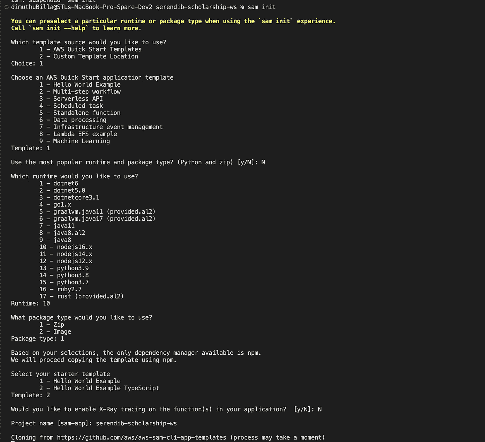
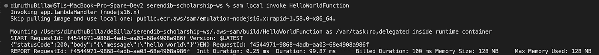

# AWS Lambda 类型脚本(慈善网站应用程序)SAM 和 Lambda 简介

> 原文：<https://medium.com/nerd-for-tech/aws-lambda-typescript-charity-web-app-start-using-event-driven-server-less-computing-198288f13342?source=collection_archive---------1----------------------->

嘿，伙计们，这是我们正在建设的慈善网络应用程序的延续。如果你们可以回去看看，我们已经在之前的教程中浏览了 UI 和一些关于后端的介绍。以防我在这里提到它们供你参考。


迪穆图·维克拉马那亚克

## 用 Typescript 系列作出反应(慈善网络应用)

[View list](https://billa-code.medium.com/list/react-with-typescript-seriescharity-web-app-6f45ca471f54?source=post_page-----198288f13342--------------------------------)7 stories[](https://billa-code.medium.com/aws-lambda-charity-web-app-intro-b775c94ca563) [## AWS Lambda(慈善网络应用)-简介

### 目前我正在做一个项目，需要存储与奖学金基金相关的学生和赞助商数据。作为…

billa-code.medium.com](https://billa-code.medium.com/aws-lambda-charity-web-app-intro-b775c94ca563) 

在本教程中，我们的重点是使用 NodeJS 和 Typescript 创建一个 Lambda 函数。

作为第一步，我们必须安装 AWS SAM。安装前，确保启动**对接服务**。你应该事先安装好 docker。

[](https://docs.docker.com/get-docker/) [## 获取码头工人

### Docker Desktop 条款 Docker Desktop 在大型企业中的商业用途(超过 250 名员工或超过 10 美元…

docs.docker.com](https://docs.docker.com/get-docker/) 

AWS SAM 是用于构建无服务器应用程序的框架。安装细节将在下面的链接。

[](https://aws.amazon.com/serverless/sam/) [## AWS 无服务器应用模型——Amazon Web Services

### 用简单明了的语法构建无服务器应用程序 AWS 无服务器应用程序模型(SAM)是一个开源的…

aws.amazon.com](https://aws.amazon.com/serverless/sam/) 

安装后，转到终端(命令提示符、power shell 等)键入以下命令

```
sam init
```

当你输入这个，你会被问几个问题，直到你得到你的项目与 Typescript。下面给出截图。



现在将生成一个 hello world 应用程序。现在转到创建的文件夹，输入以下命令来构建项目。

```
sam build
```

这将构建 Lambda 函数，我们不必担心为 Node JS 应用程序安装依赖项。构建完成后，输入以下命令在本地环境中测试应用程序。

```
sam local invoke HelloWorldFunction
```

现在你会得到这样的回应。



您可以看到我们的响应是状态代码 200。很酷吧。你不必有一个 AWS 帐户来尝试这个，这是最好的部分。所以在开始任何工作之前，让我们试着了解一下这些文件都是什么。在我们完成 sam 初始化之后，我们得到几个文件夹和文件。**事件文件夹**包含了**事件**，我们可以用它来进行本地函数调用，然后我们有了 **hello-world** 文件夹，它包含了与我们的 **HelloWorld Lambda 函数**处理程序相关的所有文件。然后我们有了 **template.yaml** 文件。这是用于创建与我们的 Lambda 函数相关的云堆栈的蓝图。在我为我们的用例更改文件之后，我将对此进行更多的描述。

现在让我们回到我们的用例。我们必须为学生实现一个 Lambda 函数。作为第一步，我将 hello-world 文件夹重命名为 student。接下来，我更改了 package.json 文件。

```
{
  "name": "student",
  "version": "1.0.0",
  "description": "Student service for serendib scholarship ws",
  "main": "app.js",
  "repository": "https://github.com/deBilla/serendib-scholarship-ws/student",
  "author": "SAM CLI",
  "license": "MIT",
  "dependencies": {
    "esbuild": "^0.14.14"
  },
  "scripts": {
    "unit": "jest",
    "lint": "eslint '*.ts' --quiet --fix",
    "compile": "tsc",
    "test": "npm run compile && npm run unit"
  },
  "devDependencies": {
    "@types/aws-lambda": "^8.10.92",
    "@types/jest": "^27.4.0",
    "@types/node": "^17.0.13",
    "@typescript-eslint/eslint-plugin": "^5.10.2",
    "@typescript-eslint/parser": "^5.10.2",
    "esbuild-jest": "^0.5.0",
    "eslint": "^8.8.0",
    "eslint-config-prettier": "^8.3.0",
    "eslint-plugin-prettier": "^4.0.0",
    "jest": "^27.5.0",
    "prettier": "^2.5.1",
    "ts-node": "^10.4.0",
    "typescript": "^4.5.5"
  }
}
```

然后我把 template.yaml 文件改成这样。

```
AWSTemplateFormatVersion: '2010-09-09'
Transform: AWS::Serverless-2016-10-31
Description: serendib-scholarship-ws
Globals:
  Function:
    Timeout: 3

Resources:
  StudentFunction:
    Type: AWS::Serverless::Function
    Properties:
      CodeUri: student/
      Handler: app.lambdaHandler
      Runtime: nodejs16.x
      Architectures:
        - x86_64
      Events:
        Student:
          Type: Api
          Properties:
            Path: /student
            Method: get
    Metadata:
      BuildMethod: esbuild
      BuildProperties:
        Minify: true
        Target: "es2020"
        EntryPoints: 
        - app.ts

Outputs:
  StudentApi:
    Description: "API Gateway endpoint URL for Prod stage for Student function"
    Value: !Sub "https://${ServerlessRestApi}.execute-api.${AWS::Region}.amazonaws.com/Prod/student/"
  StudentFunction:
    Description: "Student Function ARN"
    Value: !GetAtt StudentFunction.Arn
  StudentIamRole:
    Description: "Implicit IAM Role created for Student function"
    Value: !GetAtt StudentFunctionRole.Arn
```

在继续之前，让我们试着理解这个 template.yaml 文件。从顶部开始，前 3 个配置是一些常规的东西。但是超时是我们可以改变的。现在它被设置为 **3 秒**。这可以增加到 **900 秒(15 分钟)**，超过那是不可能的。

然后，在资源配置下，我们有我们的函数，在它里面，我们有我们的应用程序运行所需的配置。

最后，在输出下，我们定义了运行 lambda 函数所需的某些其他服务。StudentApi 是 Api 网关端点 URL，然后我们定义了 lambda 函数所需的 AWS IAM 角色，如果需要，可以更改权限。

在下一个教程中，让我们正确地创建学生服务，并尝试完成我们的项目。直到那时快乐编码。与这个项目相关的代码将在下面的 Github 链接。

[](https://github.com/deBilla/serendib-scholarship-ws) [## GitHub-deBilla/serendib-scholarship-ws

### 此时您不能执行该操作。您已使用另一个标签页或窗口登录。您已在另一个选项卡中注销，或者…

github.com](https://github.com/deBilla/serendib-scholarship-ws) 

编码快乐！！！！🙏