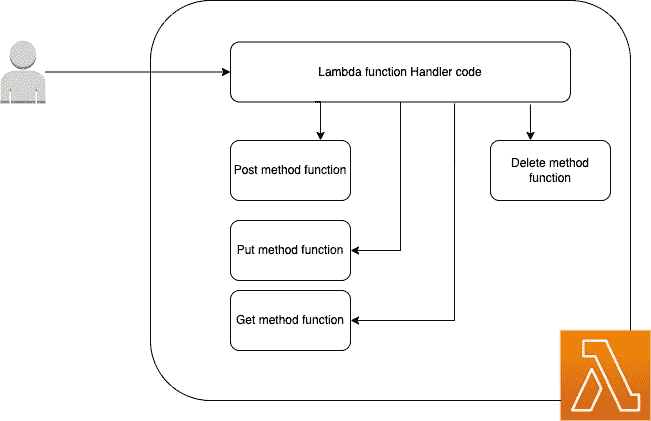

# AWS Lambda Typescript(慈善网络应用程序)—具有事件驱动的无服务器计算的学生服务

> 原文：<https://medium.com/nerd-for-tech/aws-lambda-typescript-charity-web-app-student-service-with-event-driven-server-less-computing-cd7f20fe97ef?source=collection_archive---------2----------------------->

嘿，伙计们，到目前为止，我们已经使用 typescript 和 NodeJS 成功地创建了一个 Hello World 应用程序。


迪穆图·维克拉马那亚克

## AWS Lambda(慈善网络应用)系列

[View list](https://billa-code.medium.com/list/aws-lambda-charity-webapp-series-cd878238f932?source=post_page-----cd7f20fe97ef--------------------------------)5 stories

在本教程中，让我们创建学生服务。在此之前，我们将花一分钟时间讨论一下我们的使用案例。所以如果我们去函数层，每个操作都应该有 Lambda 函数。例如，创建一个学生，一个 Lambda 更新一个学生，另一个 Lambda 也是如此。所以你可以看到，如果我们继续这样下去，将会造成混乱。因此，作为一种补救措施，我们有了事件驱动计算。这里我们做的是，我们创建一个 Lambda 函数，它将处理 http 事件，并使用我们在请求中使用的 http 方法，它将触发不同的功能。所以用一个函数，我们可以覆盖学生的所有 CRUD 操作。



现在我们对实现已经很清楚了，到目前为止我们已经创建了一个 [Hello World 应用程序](https://billa-code.medium.com/aws-lambda-typescript-charity-web-app-start-using-event-driven-server-less-computing-198288f13342)。因此，当我们从与 Lambda 函数相关的 URL 发出请求时，API Gateway 将捕获我们的请求，然后基于此创建一个事件。这个事件将触发 Lambda 函数。**💡好了**现在你应该明白我们要做什么了。我们将读取该事件并找到 httpMethod，根据该方法，我们将调用 app.ts 文件中的不同函数。到目前为止，我们还没有集成任何数据库，所以在本教程中，我将只使用带有硬编码响应的伪方法。转到 student 文件夹中的 app.ts 文件，像这样更改代码。

```
import { APIGatewayProxyEvent, APIGatewayProxyResult } from 'aws-lambda';

/**
 *
 * Event doc: https://docs.aws.amazon.com/apigateway/latest/developerguide/set-up-lambda-proxy-integrations.html#api-gateway-simple-proxy-for-lambda-input-format
 * @param {Object} event - API Gateway Lambda Proxy Input Format
 *
 * Return doc: https://docs.aws.amazon.com/apigateway/latest/developerguide/set-up-lambda-proxy-integrations.html
 * @returns {Object} object - API Gateway Lambda Proxy Output Format
 *
 */

export const lambdaHandler = async (event: APIGatewayProxyEvent): Promise<APIGatewayProxyResult> => {
    **let results: any;**
    let response: APIGatewayProxyResult;

    try {
        **switch (event.httpMethod) {
            case 'GET':
                if (event.pathParameters.id****!= *null*) {
                    results = await getStudent(event.pathParameters.id);
                } else {
                    results = await getStudents();
                }

                break;
            case 'POST':
                results = await createStudents(event);
                break;
            case 'PUT':
                results = await updateStudents(event.pathParameters.id)
                break;
            case 'DELETE':
                results = await deleteStudents(event.pathParameters.id)
                break;
            default:
                throw new Error('Unidentified event!!!');
        }**

        response = {
            statusCode: *200*,
            body: JSON.stringify({
                **message: results,**
            }),
        };
    } catch (err: unknown) {
        console.log(err);
        response = {
            statusCode: *500*,
            body: JSON.stringify({
                message: err instanceof Error ? err.message : 'some error happened',
            }),
        };
    }

    return response;
};

**const getStudents = async () => {
    return ['james', 'john'];
}

const getStudent = async (studentId: string) => {
    return studentId;
}

const createStudents = async (event: APIGatewayProxyEvent) => {
    return event;
}

const updateStudents = async (event: APIGatewayProxyEvent) => {
    return event;
}

const deleteStudents = async (studentId: string) => {
    return studentId;
}**
```

好了，现在你应该有如何创建这些事件的问题了。当我们执行 sam init 时，我们得到了一个名为 events 的文件夹，在 events 文件夹中，我们有文件 events.json。如果您稍微看一下，就会看到这几个重要的字段。

*   身体
*   httpMethod
*   路径参数

其他的都是通用字段。为了我们的用例。我正在为创建、获取全部、获取一个、更新和删除创建 5 个不同的事件。转到下面的链接，你可以看到这 5 个文件。

[](https://github.com/deBilla/serendib-scholarship-ws/tree/main/events) [## seren DIB-奖学金-ws/main deBilla/seren DIB 的活动-奖学金-ws

### 奖学金。在 GitHub 上创建一个帐户，为 deBilla/seren DIB-scholarship-ws 开发做贡献。

github.com](https://github.com/deBilla/serendib-scholarship-ws/tree/main/events) 

现在留给我们的是引发这些事件。无需部署到 AWS，我们可以在本地环境中使用 SAM 来实现这一点。

```
sam local invoke StudentFunction --event events/student_get_one.json
```

同样，您也可以尝试调用其他 4 个事件。现在我们有一个打工学生服务。剩下的就是把这个和数据库连接起来。让我们在下一个教程中尝试一下。直到那时快乐编码！！！:p