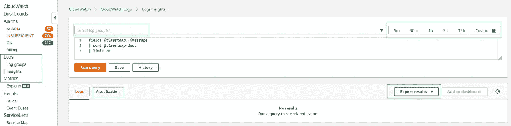
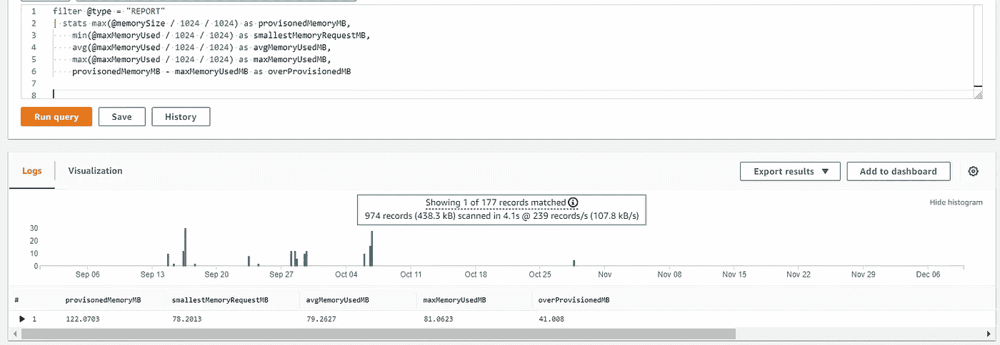
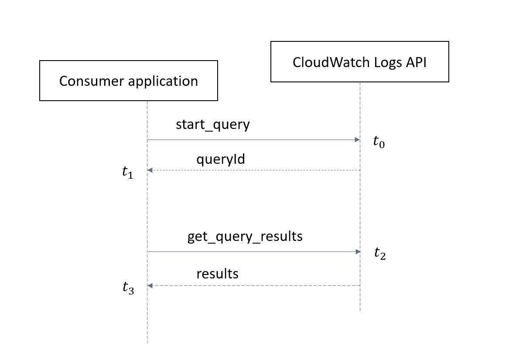
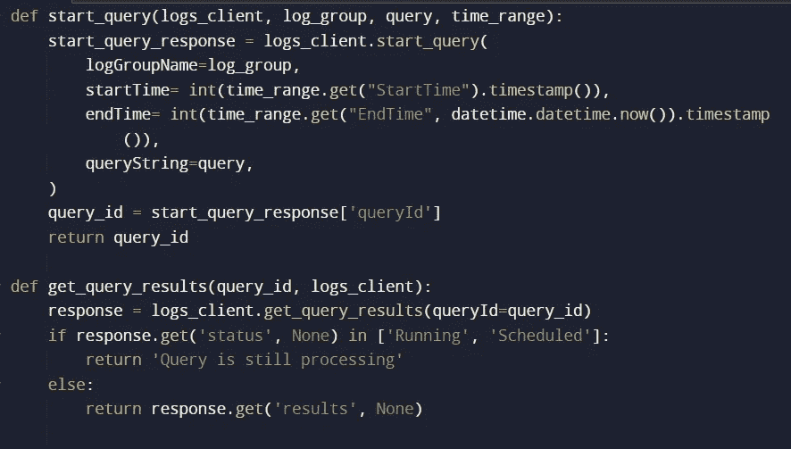
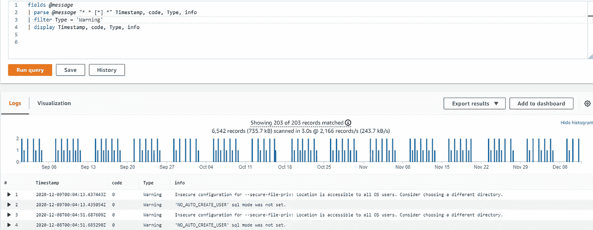

# AWS 日志洞察

> 原文：<https://medium.com/nerd-for-tech/aws-logs-insights-384d1fcf2786?source=collection_archive---------0----------------------->


斯蒂芬·菲利普斯-Hostreviews.co.uk 在 [Unsplash](https://unsplash.com/s/photos/insights?utm_source=unsplash&utm_medium=referral&utm_content=creditCopyText) 上的照片

*AWS CloudWatch Logs Insights 是一个类似 SQL 的交互式解决方案，用于查询、分析&来自 CloudWatch 的可视化日志数据。Cloudwatch 日志可以是 VPC 流日志、cloudTrail 日志、联系流日志、RDS 日志、服务规范日志或自定义应用程序日志。*



Log insights 有一个定制的查询语言，非常类似于 SQL

> *显示→选择
> 字段→可显示的属性/列
> 过滤→ where
> 统计→分组依据
> 排序→排序依据
> 限制→限制*

与 SQL 中的 select … From … where …是单个命令不同，log insights 将它们分成单独的命令。要组合它们，我们需要使用 unix 风格的管道(|)。

默认情况下，我们得到四个字段@log、@timestamp、@message、@logstream。

让我们看一个基本的查询。

```
fields @log, @logStream, @timestamp, @message
| sort @timestamp desc
| limit 100
```

在上面的查询中，我们将获得 100 条记录，每条记录都有日志组名、日志流名、日志的时间戳和实际消息，按照时间戳的降序排列。

AWS 服务生成的日志是 JSON 格式的，您可以直接访问各个属性。

```
fields eventName, eventSource, errorCode, userIdentity.arn
|filter @message like /(?i)(Exception|error|fail)/ 
|filter eventSource ='sagemaker.amazonaws.com'
|limit 200
```

## 从语法上分析

如果日志是 JSON 格式的，那么我们可以直接得到消息的单个属性，否则我们需要使用**‘PARSE’**。Parse 接受全局表达式和正则表达式。

假设您在日志中有一个字符串字段。

```
config_rule_name: AWS-007-EBSEncryption
```

如果您想要从名称中提取单个元素，那么查询将是:

```
fields @message| PARSE Details.config_rule_name "*-*-*" Scope, RuleId, RuleName
| filter Scope = 'AWS'
| DISPLAY @log*,* @logStream,Scope, RuleId, RuleName| limit 20
```

**使用 API 查询:**

使用控制台查询日志是一个好的开始。但是通常我们应该通过 API 调用来实现自动化。让我们看看如何使用 insights API。



从上图可以明显看出，查询日志是一个两步过程。首先开始查询，一旦完成，然后得到结果。用 python 实现同样的功能，如下所示。



注意:查询结果不是实时的。事件和日志被推送到 CloudWatch 之间存在延迟。此外，随着查询扫描越来越多的数据，它可能会花费一些时间。

让我们看看不同类型日志的一些日志查询。

**RDS 日志:**



**CloudTrail 日志:**

```
fields eventSource, errorCode
| filter errorCode =~ /^(?i)\w/
| stats count(*) as eventCount by eventSource, errorCode
| sort eventCount desc
```

> 默认情况下，CloudTrail 中根本不会记录数据层事件(例如调用 lambda、s3 get、Cloudwatch put metric)。S3 和 Lambda 数据平面事件可以通过专门启用它来捕获。
> 
> 所有通过 VPC 端点执行并被拒绝的 API 调用都不会被记录到 CloudTrail 中。

**VPC 流量日志:**

```
filter interfaceId =~ /<eni-id1>|<eni-id2>|<eni-id3>/
| filter dstPort = 443
| fields @timestamp, dstAddr, srcAddr, dstPort
| stats count(srcAddr) by srcAddr
```

寻找快乐！！

参考资料:

*   [洞察查询语法](https://docs.aws.amazon.com/AmazonCloudWatch/latest/logs/CWL_QuerySyntax.html)
*   [样本查询](https://docs.aws.amazon.com/AmazonCloudWatch/latest/logs/CWL_QuerySyntax-examples.html)