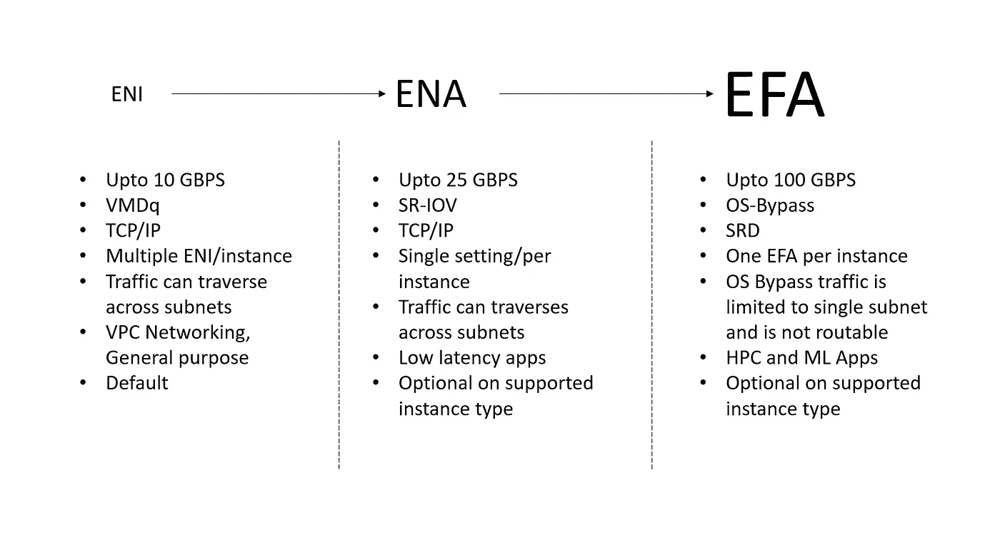
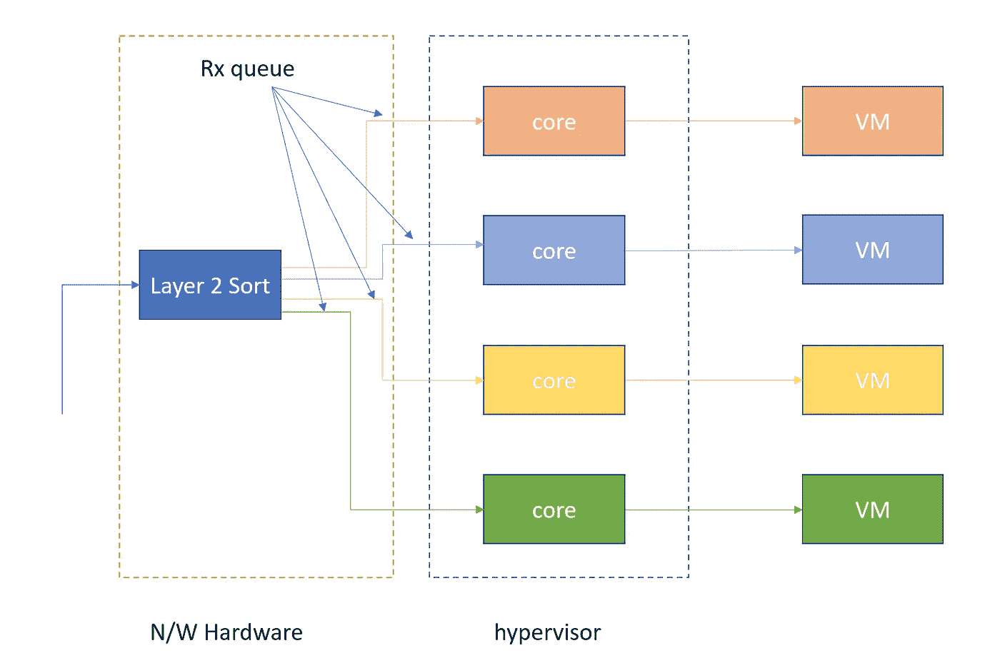
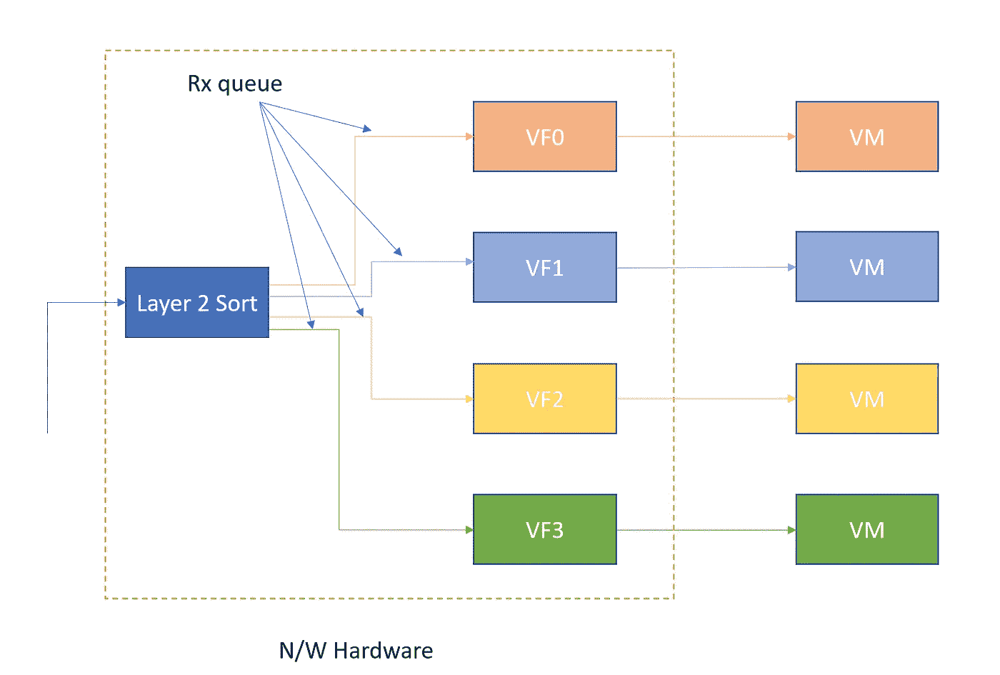
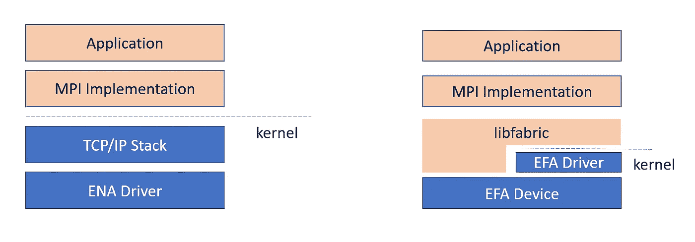

# 自动气象站网络— ENI、ENA 和全民教育

> 原文：<https://medium.com/nerd-for-tech/aws-networking-eni-ena-efa-2db316fdbf85?source=collection_archive---------0----------------------->

AWS 在提高 EC2 实例的网络吞吐量的过程中取得了长足的进步。目前我们在这方面有三种选择。让我们在某种程度上探索这三个。

**弹性网络接口(ENI)** 是 VPC 中的逻辑网络组件，代表虚拟网卡。下面是基于 VMDQ 的 ENI 的工作原理。

在上图中，我们看到在一个包被发送到 VM 之前有一个内核中断。管理程序将数据包分配给相应的虚拟机。

**弹性网络适配器(ENA)** 是一个定制的网络接口，经过优化可提供高吞吐量和每秒数据包数(PPS)性能，并在 EC2 实例上保持低延迟。它使用 SR-IOV 来实现同样的目的。下图描述了 SR-IOV 相对于 VMDQ 的基本工作原理。

在上图中，我们看到排序和队列分配发生在网络设备上，虚拟机直接获取消息。这不涉及虚拟机管理程序切换。此外，所有虚拟机都并行处理来自其专用队列的数据包。因此速度高达 25 Gbps。

这可以通过以下命令来实现:

> **aws ec2 修改-实例-属性-实例-id <实例 id>-ENA-支持**

有关说明，请访问此链接。

**Elastic Fabric Adapter(EFA)**是一种网络设备，您可以将其连接到您的 Amazon EC2 实例，以加速高性能计算(HPC)和机器学习应用程序。

EFA 使用可伸缩的可靠数据报(SRD ),它又基于 Infiband RD。参见第[页](https://docs.aws.amazon.com/AWSEC2/latest/UserGuide/efa.html#efa-instance-types)了解支持的实例类型。在使用 EFA 之前，我们需要创建一个安全组，它允许来自自身的全部出站和入站规则。然后使用以下命令下载 efa 软件:

> curl-O[https://EFA-installer . Amazon AWS . com/AWS-EFA-installer-1 . 9 . 5 . tar . gz](https://efa-installer.amazonaws.com/aws-efa-installer-1.9.5.tar.gz)

解压并运行下面的命令。

> 须藤。/EFA _ 安装程序. sh -y

禁用 ptrace 保护。

希望这有用！！