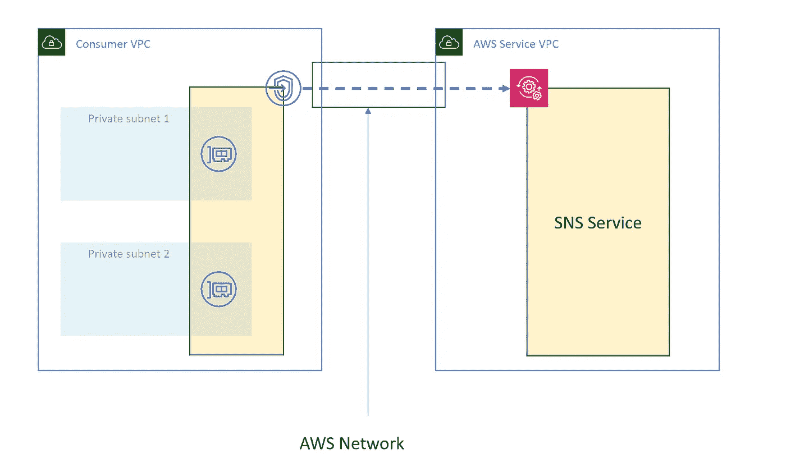
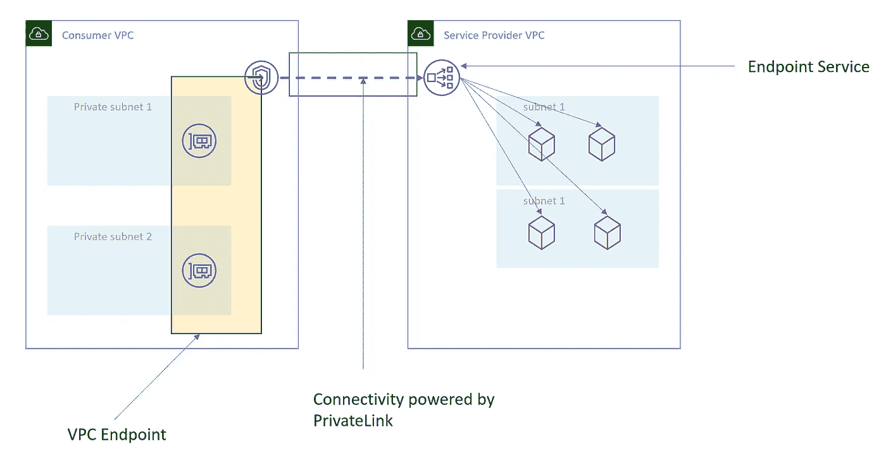
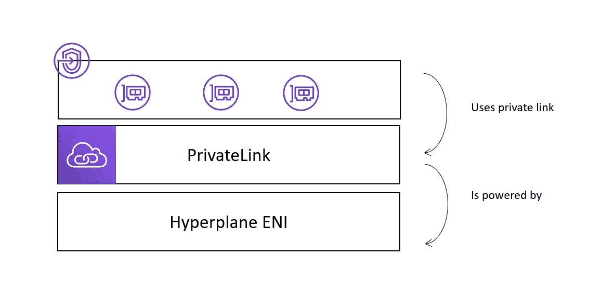

# AWS 专用链接—简介

> 原文：<https://medium.com/nerd-for-tech/aws-private-link-an-introduction-e017fe1ca52e?source=collection_archive---------2----------------------->

> 无需穿越互联网即可从专用网络使用服务。

这就是私有链接的核心。它允许 VPC 私有子网中的应用程序连接到不在当前 VPC 中的服务，而无需离开 AWS 网络。VPC 对等允许我们做同样的事情，但是它建立的连接范围太大。同样，对等也有不重叠 CIDRs 的限制。专用链接允许我们只连接我们需要的服务。它在两端(即服务提供商端和消费者端)提供控制。此外，专用链路不实施非重叠 CIDRs。

> 访问我的服务而不是我的 VPC

在下图中，我们可以看到私有子网中的资源和 SNS 服务 API 之间的连接。我们使用的是 SNS 服务端点，内部由专用链路供电。



在上图中，我们有 VPC 端点(接口和网关)，这是一个逻辑网络组件，是 ENI 的集合。每当我们调用服务时，+2 DNS 解析器会覆盖服务名并返回 ENI 的私有 ip。在我写作时，AWS 通过 interface endpoint 支持 90 多种服务。

在下图中，我们有一个消费者 VPC 和一个服务提供商 VPC(假设是一个 SaaS 提供商)。这里，服务提供者中的资源使用 VPC 端点和端点服务向消费者公开其资源。还要注意我们使用的是 NLB。我们只能使用 NLB 作为基于 TCP 的专用链路。



如果您希望将基于 ALB 的应用程序公开为专用链接的服务。你需要在它前面放一个 NLB。→ NLB → ALB →听众

> 专用链路是一种支持消费者发起的、基于 TCP 的单向状态流的技术

驱动专用链路的技术是超平面 ENI。



1.  创造你的 NLB
2.  转到端点服务，单击**创建端点服务**，选择在上一步中创建的 NLB 选择子网并创建。
3.  转到端点，点击**创建端点**，选择**按名称查找服务**，输入上一步创建的端点服务名称，点击验证。
4.  切换到端点连接并接受连接请求。

## 表演

专用链路提供 10 Gbps 的持续吞吐量和高达 40Gbps 的突发容量。

注意:在多 AZ 资源中使用端点服务时，请注意跨区域负载平衡。

## 利益

安全。由于数据包从不穿过互联网，中间人攻击的机会就减少了。

它支持类似 IAM 的端点策略。使用它您可以控制谁可以在什么条件下访问什么。

```
{
  "Statement": [
    {
      "Action": ["sns:Publish"],     
      "Effect": "Allow",     
      "Resource": "arn:aws:sns:us-east-2:123456789012:YourTopic"
      "Principal": {
        "AWS": "arn:aws:iam:123456789012:user/AllowedUserName"
       }   
    }
  ] 
}
```

它还支持安全组。因此，作为提供商，您可以控制服务的内容。

在 PrivateLink 上进行的 VMWare 炭黑性能测试显示，延迟降低了 70%。

## 局限性:

端点是区域性的。服务和 VPC 应该在同一地区。

## 用例

共享服务架构。创建一个单独的帐户，并在那里保存所有端点。集中管理。允许其他帐户通过此帐户终结点使用服务。