# AWS 重新开始课程——失业人员从事云计算职业的机会。

> 原文：<https://medium.com/nerd-for-tech/aws-re-start-course-opportunity-for-unemployed-individuals-for-cloud-careers-4ab2c54c96cc?source=collection_archive---------0----------------------->

# (技术背景不是强制性的)

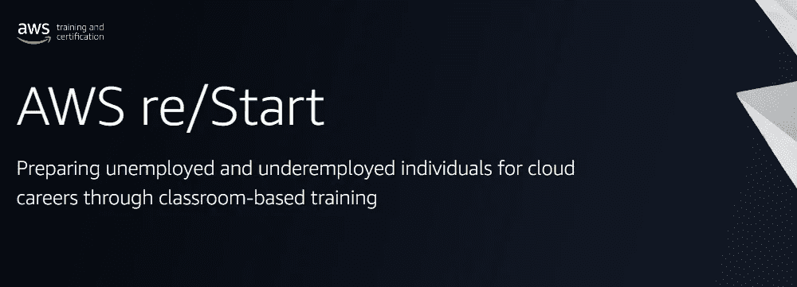

我参加了这个 **AWS 重启项目**(批次**2022 年 3 月/4 月—2022 年 7 月**)，所以我有资格解释这个项目的细节。我会和你分享我的经历，让你可以有效地利用你的时间和机会。如果你喜欢这篇文章，请鼓掌并分享给你的朋友。查看我的网站 [**点击**](https://www.clickaws.com/) 查看**详细项目。**

如果您有任何疑问，请通过我的社交资料评论或给我发消息。

## **你为什么要参加这个课程？**

1.  **无需**向**支付**任何**费用**(可退还保证金)。
2.  那些失业的人将通过**安置机会**获得安置的机会。
3.  在完成为期 3 个月的课程后，获得一次免费参加 **AWS 云从业者认证考试的**机会**。**
4.  **不需要**任何**技术背景**。

5.另外**通过了**培训机构**的**认证，你参加了这个项目。(许多培训中心提供)

6.**机会**到**打造**你的**软技能**。所以请参与讨论和发言，不要犹豫。试着克服你的恐惧，培养你的沟通技巧。

7.**提供基于场景的学习、动手实验和课程作业**。(类似类型的仪表板)

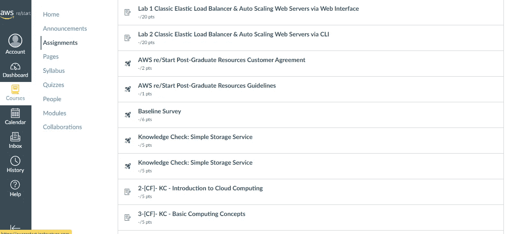

8.除了 AWS Cloud，你还有机会学习很多技能，比如 **Linux、Git、Python、计算机网络、SQL、脚本、**等等。

9.**帮助和指导**准备你的**简历**和**培训你**参加**面试。**

10.该计划以**的价格向学习者免费提供**。

11.**兴奋地开始云计算生涯。**

12.**完成本课程的**后，至少 **3 个月以上**您将获得 AWS 重启**仪表板的新权限，以练习**，其中**动手实验室**可用。

13.项目持续时间: **12 周**。

14.这是**非官方的**但是在课程结束后，我的培训机构还提供了一些 DevOps 和高级 Linux 技能的额外课程，这样候选人可以在面试中表现得更好。

# 检查你的资格-

1.  你**没有全职工作**或者**每周正常工作**超过 **16 小时。**
2.  您目前没有接受**教育或培训**。
3.  您可以接受连续 **12 周**(全天；周一至周五上午 9 点到下午 5 点半)。
4.  您**需要**一台**笔记本电脑**和**互联网**连接。
5.  你的**出勤率**应该比**多**80****个百分点**。**
6.  没有**超龄**限制标准(并非所有培训机构都是如此，有些机构也做了限制)。
7.  高中文凭或者 GED 同等学历你得查，在印度，这可能是毕业。
8.  根据培训机构的不同，课程分为线下和线上。矿山研究所在线进行。

# 工作机会

1.  IT 支持— AWS 云

2.IT 云从业者

3.小网络管理员

4.AWS 云管理员

5.云 DNS 专家

6.云安全专家

7.云工程师。

# 如何申请 AWS re/Start？

*   *你的选择取决于对你的简历、能力分数和英语交流的综合评估。所以试着做好每一件事。

1.  首先去这个 [**网站**](https://aws.amazon.com/training/restart/) 选择你所在的地区和国家。

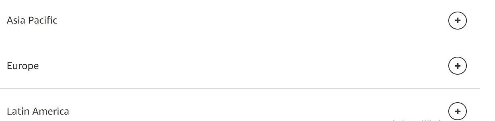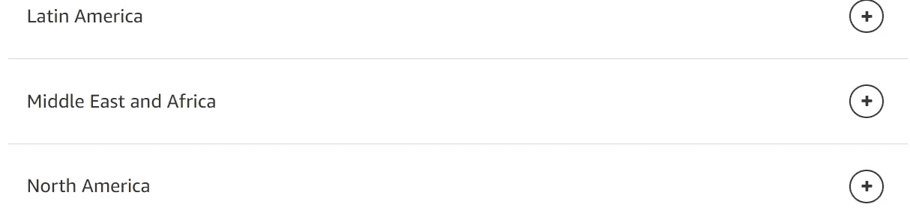

2.我来自**印度，**所以我选择**亚太(印度-太平洋)**，然后我选择我的国家“**印度**”。

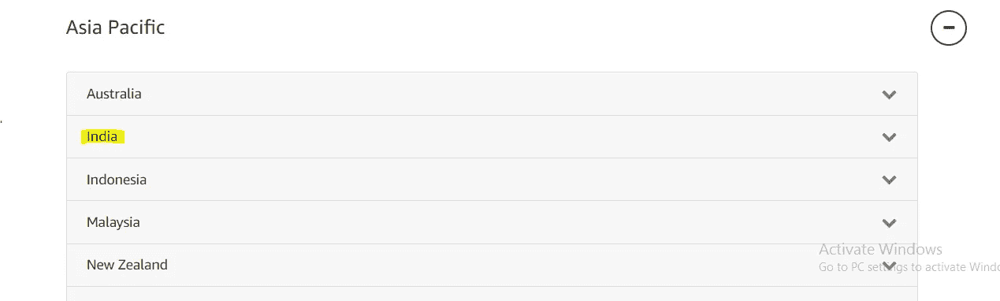

3.选择并点击任何**组织/机构**。

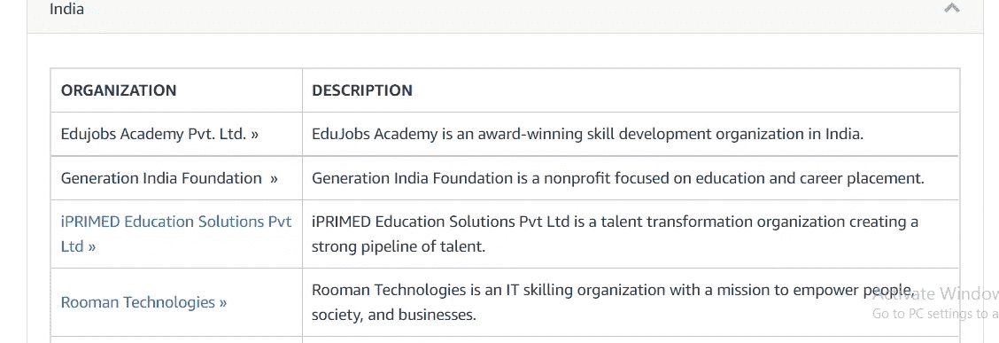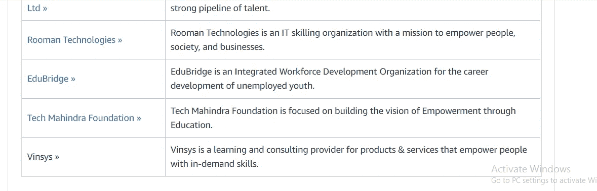

4.一个新的网页打开，然后点击**立即申请**。

**我的建议或我做的事情**——申请所有的培训机构(有些回复了，有些没有。)我申请了第一家培训机构没有回复，第二家培训机构回复了但是面试后他们没有选择我，最后第三家培训机构回复了然后**选择了我**。

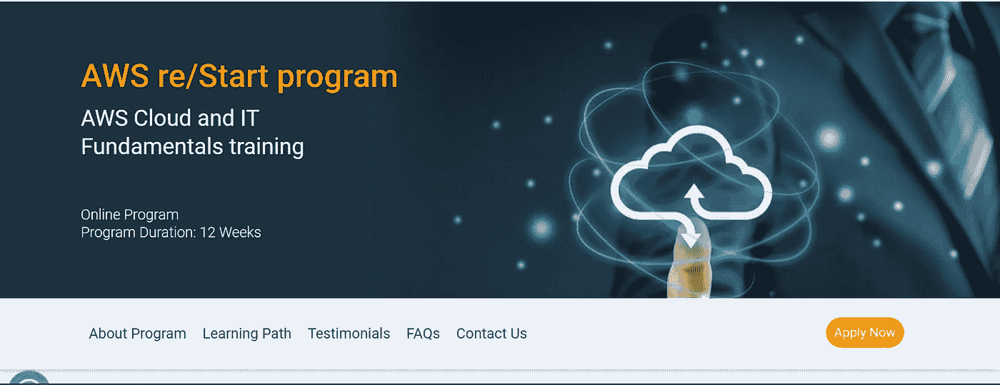

5.**填写表格**然后**提交**它。

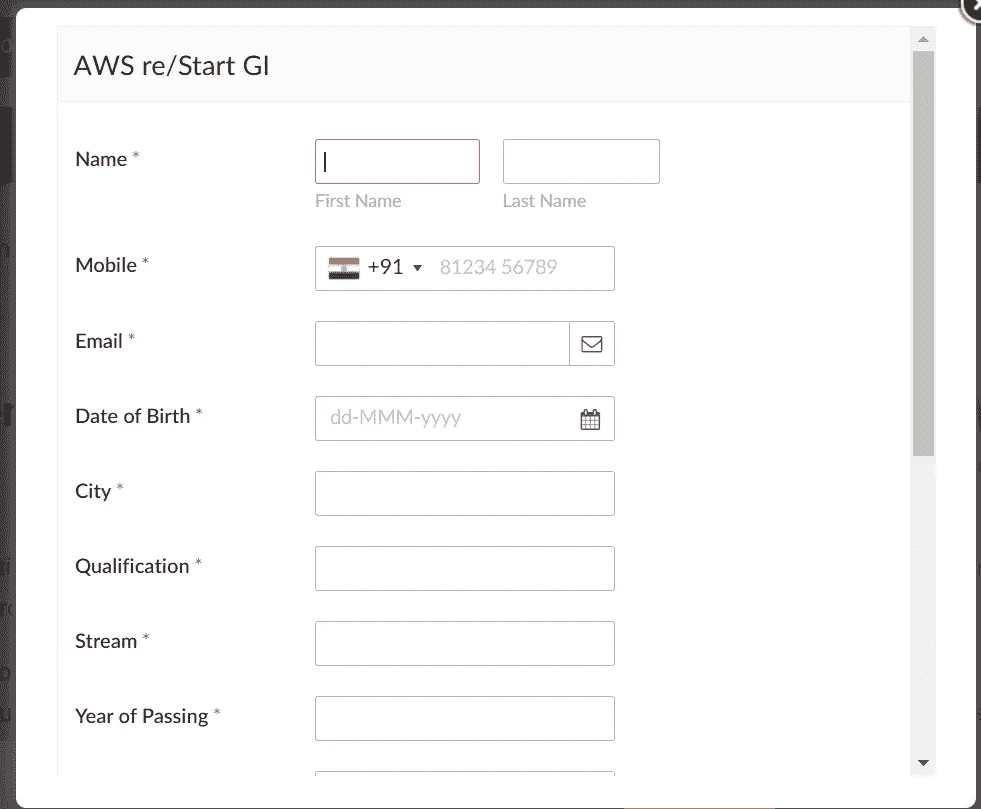

6.之后，他们会给你发电子邮件进行能力测试，如果你的表现很好，他们会给你打电话，然后他们会给你发电子邮件，然后参加你的面试。

**面试很简单**他们只检查基本的沟通技巧，他们会问简介，你为什么想加入这个课程？，你从上午 9 点到下午 5 点有空吗？等等。

总体评估后，如果你被选中，他们会给你发邮件。

## **选择后:**

他们要求我发送一些文件，并支付保证金(在我的培训学院 5000 卢比)。填写表格及其手续。

现在开始上课。

*   *如果你面临任何问题，给他们打电话或发电子邮件，他们一定会解决你的问题。不要犹豫或等待，询问他们如果出现任何问题该怎么做。我面临一些电子邮件问题，所以我问他们(培训机构)，他们提出了解决方案。

**完成后**:

我通过了 AWS 云从业者认证。这是我的 [**AWS 云从业者证书**](https://www.credly.com/badges/873d1bef-3b28-4475-8848-6512d3d4c246/linked_in?t=rftul1) 和 [**AWS re/Start 研究生**](https://www.credly.com/badges/db9bd0c8-363e-40c6-9f1c-52b0278b16ef/linked_in?t=rha0pt) 证书。我也是实习后做云工程师的。

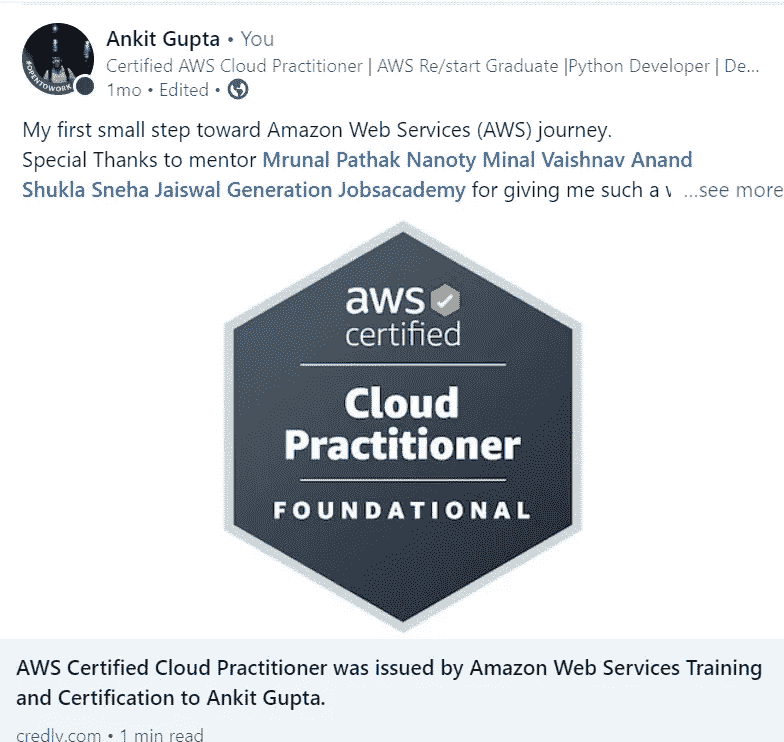

[**AWS 云从业者证书**](https://www.credly.com/badges/873d1bef-3b28-4475-8848-6512d3d4c246/linked_in?t=rftul1)

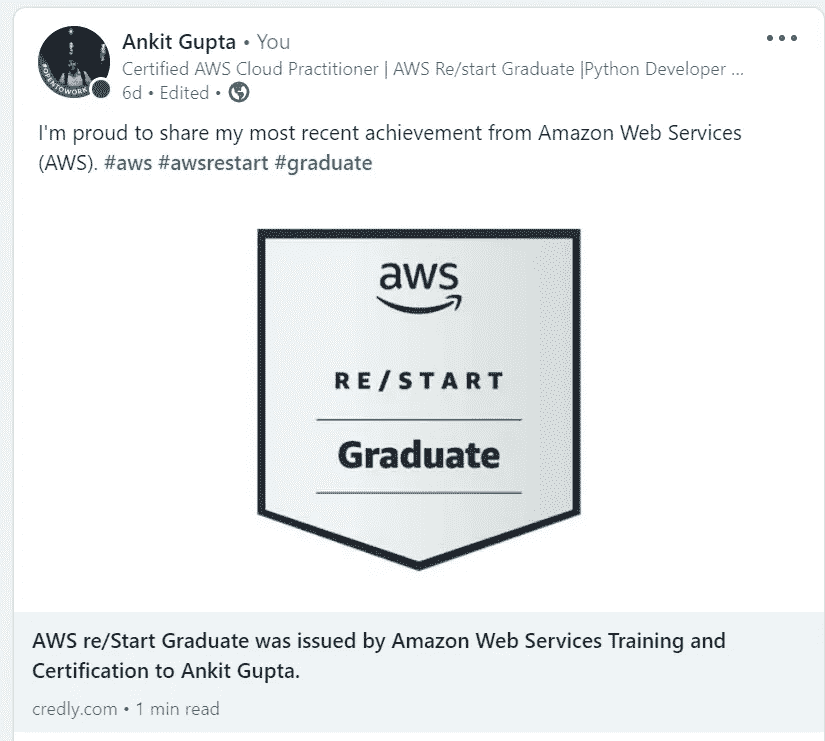

[Ankit AWS 重新开始毕业](https://www.linkedin.com/posts/ankit-gupta2_aws-restart-graduate-was-issued-by-amazon-activity-6969287879562833920-Z_sJ?utm_source=share&utm_medium=member_desktop)

**要点**:

1.  在 Naukri.com 和 Linkedin 上创建个人资料。从申请工作的课程开始(当完成这个课程时，你会了解 Naukri 和 Linkedin 是如何工作的，一般来说，在招聘人员积极查看简历和进行入围的时候，你的个人资料会被招聘人员点击，所以你获得电话和面试的机会会增加，所以会发生很多事情。).
2.  从课程开始**制作你的简历**和**定期或几天后更新**。
3.  **经常参加 BSM 会议**(软技能课程)，发言并展示你的创造性思维，参与讨论以克服你对发言和交流的恐惧。这是每个人来学习和尝试找工作的三个月。

4.请**尽量不要缺课**。至少这三个月要真诚。

5.如果你有什么不明白的，总是**问问题**。老师总是试图消除你的疑虑。

6.如果你知道一点点，每当老师提问时，**总是试着说并说出答案**。在这里不要考虑别人，你只是来学习的。

7.**联系其他考生，分享你的知识，提出你的疑惑。**

8.按时完成你的**作业、KC(知识检查——MCQ)和作业**。准时准备你的陈述。

9.做**简短笔记，记下**必要的要点。

10.尝试用你的策略每天**和每周**复习笔记。

11.**尽可能多地练习动手实验室**并且**在面试时做一些展示和解释的项目。**

对于项目，请关注我的网站 [**。**](https://www.clickaws.com/)

12.始终以尊重的态度向导师或老师确保课程完成速度良好。务必确保不给 BSM 的会议或任何课程加班。

13.完成本课程 45 天后，您将获得保证金。

欢迎提出建议、改进和疑问。

我希望这个博客能帮助和节省你的宝贵时间，这样你就可以和你爱的人一起度过了。保持微笑，展现爱心！！！

**下面是 AWS Lightsail 上 WordPress 网站托管详细的一步一步系列的链接:**

**第一部分:** [如何在 AWS LightSail 上托管一个 WordPress 网站。](https://aws.plainenglish.io/how-to-host-a-wordpress-website-on-aws-lightsail-8808b70f7f7c)

**第二部分:** [查找 WordPress AWS Lighstail 的仪表盘登录凭证。](https://www.clickaws.com/find-wordpress-password-in-aws-lightsail/)

**第 3 部分:** [从动态 IP 地址设置一个 Lightsail 静态 IP 地址。](/@ankitgupta_974/setting-up-a-lightsail-static-ip-address-from-dynamic-ip-address-4a0628f63c52)

**第 3.1 部分:**[AWS light sail 中实例的动态 IP 地址。](/nerd-for-tech/the-dynamic-ip-address-of-instances-in-aws-lightsail-b3dfb1562171)

**第四部分:** [如何向亚马逊 Web 服务注册域名|使用 AWS Route53 注册域名。](https://aws.plainenglish.io/how-to-register-a-domain-name-with-amazon-80a1bf809859)

**第 4.1 部分:**将 Route53 注册域连接到 AWS Lightsail 实例。(以上文章)

**第五部分:** [在 WordPress AWS Lightsail 上设置免费 SSL 证书。](https://www.clickaws.com/how-to-setup-or-enable-free-ssl-certificate-on-your-wordpress-aws-lightsail-instance/)

# 其他博客:

 [## 亚马逊推出 Re: Skill Program 2021 |免费亚马逊 t 恤|免费亚马逊课程

### AWS re:技能——赚取奖励。

medium.com](/nerd-for-tech/amazon-launched-re-skill-program-2021-free-amazon-t-shirts-free-amazon-courses-88c4b95c9752)  [## 免费培训、课程和证书——谷歌云技能提升。

### 谷歌将免费为 4000 万新生提供云计算培训。

medium.com](/nerd-for-tech/free-training-course-and-certificates-google-cloud-skill-boost-6ee61548f915)  [## 一次登录多个 AWS 帐户

### 就凭这一招！

medium.com](/analytics-vidhya/login-to-multiple-aws-accounts-at-once-c78144bd25d9) 

# 在 Linkedin 上联系我:

[https://www.linkedin.com/in/ankit-gupta2/](https://www.linkedin.com/in/ankit-gupta2/)

**如果你喜欢以上博客系列请通过**[**Buymeacoffee**](https://www.buymeacoffee.com/AnkitGupta1)**支持我。**

感谢您的阅读，如果您喜欢，请点击拍手按钮并分享。

关注我们了解更多内容。

***更多内容尽在书呆子理工。***