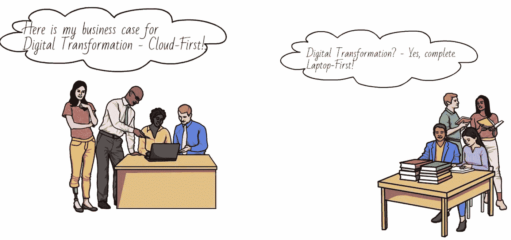
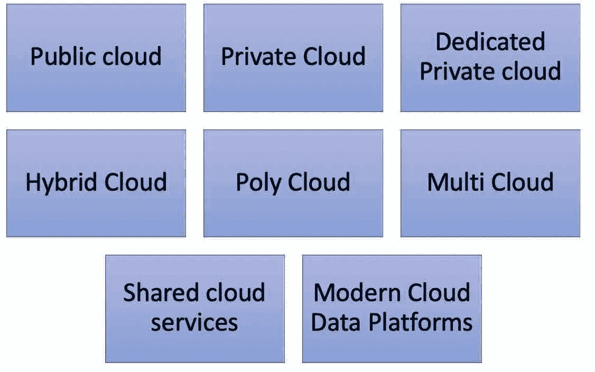
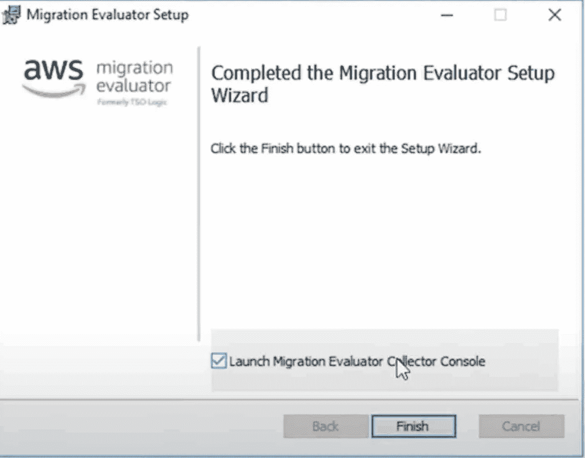
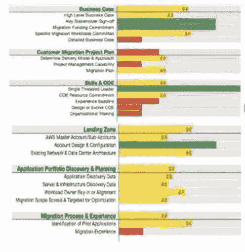

# AWS 系列#1:云业务案例—如何向您的管理层推介，为什么它很重要？

> 原文：<https://medium.com/nerd-for-tech/aws-series-1-business-case-for-cloud-how-to-pitch-to-your-management-and-why-is-it-important-pa-8c6d42b30a8b?source=collection_archive---------7----------------------->

# 哪种云模式适合您的组织—如何让企业在云决策上达成一致？

假设技术管理团队已经决定转向云计算。你如何让企业在你的决策上达成一致？回答以下关键问题很重要。

注意:在下面的问题中，我/我的代表组织的 IT 管理团队，而不代表个人，但是所有关键个人都必须知道这些问题的答案，并且所有人都必须在开始讨论业务之前就此达成一致。it 团队应该将此决策作为一个整体来推进，因为在云实施中的失败，这个整体的失败不是针对个人甚至是 IT 团队，而是针对整个组织，这取决于您处于云的哪个阶段。

1/我的目标是什么？我试图通过用内部部署替代云来解决什么问题？—成本|维护|性能优化？

2/我是否希望在不久的将来将所有基础架构|数据|应用程序|消费层都放在云上，并关闭物理数据中心以进行应用程序开发？我知道需要什么吗？

3/如果云，我想做的第一个 POC 是什么，哪个云？始终在多云上执行 POC。

4/什么是服务战略——IAAS 优先| PAAS 优先| SAAS 优先？回答这些问题将揭示许多重要的事实。

5/牢记终点和结束日期。

首先，你必须确定你的组织想要什么。通常它不是一个尺寸适合所有人，没有必要重新发明轮子。

**对于 SME:** 在开始之前问这些问题

*   如果云项目是成本优化(降低)项目或维护优化(降低)项目
*   如果产品是从头开始制造的，那么你必须在 IAAS 和 PAAS 之间做出选择。

**对于创业公司:**

*   毫无疑问，如今云已经成为许多创业公司诞生之地。无论是视频/音频流即服务、医疗保健物联网、资产跟踪还是智能建筑等，MVP 都不可能比现在更快实施。没有技术债务，也没有像去年的企业家那样的巨额贷款。
*   如果是一家产品公司和初创公司，你需要多大的灵活性，如果你创造的产品是你提供的服务/服务范围，如果你没有重新发明轮子，解决方案可以是 IAAS | PAAS | SAAS 组合。

**大型/全球性组织**:

*   向云的大规模迁移以及企业级采用和企业云架构。
*   从一个项目接一个项目的模式转变为平台/产品模式。
*   从传统技术迁移到模型云原生平台并减少技术债务。
*   它从来都不是单一的产品。无论是服务器、存储、数据库还是监控服务，每个堆栈中的单个解决方案都不足以满足所有需求。而且不同的部门设计原则和要求也会不同。它将是来自几家云提供商的 PASS | SAAS | IAAS 的组合。
*   它可能是多帐户、多云，
*   你正在解决的问题可能是一个
*   性能优化问题或
*   网络流量优化问题或
*   全局优化问题或
*   成本优化问题或
*   维护或管理优化问题等。,
*   对于对多云的整体监控，DataDog 或 IBM 或 RackSpace 等服务提供了多云管理平台和功能。
*   对于全球组织而言，能够访问最接近运营区域的数据和应用程序，并节省网络和数据传输成本，是云能够提供的最佳服务。

# 说服管理层和/或董事会的商业案例？—进还是不进！

1.  **it 对企业有什么好处:**it 对企业有什么好处，以及它将如何为您的业务领域带来好处。

> - **弹性需求:**满足 Web 应用程序的弹性需求，前提是您的组织拥有仅用于预订/报告的外部网站。谈论新业务增长的可能性。
> 
> - **客户困扰**:某些企业可能有多个级别的客户，使用云和架构解决方案不仅可以照顾直接业务的客户，还可以导航到最后一个客户。
> 
> - **快速**:根据客户访问网站的地区，为客户提供低延迟。
> 
> - **数据保留:**需要保留更长时间的业务关键数据可以以经济高效的方式存储在档案存储中。
> 
> - **备份和恢复:**使用云进行多次备份
> 
> - **适合用途:**任何需要每月运行一次或不频繁运行的具有大量数据的业务关键型应用程序都可以使用临时服务器运行，并且可以在报告提交后关闭。
> 
> - **数据共享:**需要跨多个下游(内部/外部)共享数据的业务—借助现代云数据提供商，可以轻松实现最大安全性和可移植性的轻松共享(例如，使用 DataBricks 的增量共享)。
> 
> - **快速创新**:对于那些不断创新和推广或者想要尝试的组织来说，云是快速创新和推广的最佳方式。如果一种方法/想法不起作用，能够以低得多的成本轻松实现转变。

2.**叙述:**先有内部部署，后有云，再有云适合的组织。

**3。同类最佳云服务:**使用同类最佳的高级 SAAS /纯云工具/服务产品。

**4。在竞争中保持领先:**在竞争中保持领先，而不会因为没有采用先进技术而落后几年。

**5。资本支出与 OPEX:** 我们试图优化什么——成本(资本支出与 OPEX) |维护。谈论以折旧为主要方面的成本节约的可能性。

**6。成本|维护:**在内部部署和几个云选项之间建立一个成本/维护经济图表。商业云计算的投资回报率。虽然成本方面很重要，但谈论利润方面和生产率的提高以及关注新项目和新收入是一个非常重要的焦点。

7.**主要优势:**卓越的运营、快速上市的业务敏捷性和运营弹性。对“什么都不做，沿袭传统”与“缓慢而稳定的转型”和“完全迁移到云”进行对比分析和成本效益分析，在谈论关键效益时要实事求是。

作为发起人的管理层了解组织对云的需求并让他们参与进来是非常重要的。“云优先”可能不是一项业务计划，但是，云可以为组织提供的可能性是巨大的。它使企业能够进入新的市场，更可扩展的处理，敏捷，灵活和快速上市。与其直接向管理层提出业务案例并在整个公司推广云应用，不如预先与业务团队取得联系，采取循序渐进的方式，首先要求赞助商和预算来建立云探索团队，尝试多种云模型、解决方案和提供商，并发布相关文章和结果。利用云解决组织中在该时间点存在的最关键的利基问题，该组织具有明显的技术趋势变化和商业美元价值。通过清楚地强调什么可行，什么不可行，让管理层了解真相。这将在你的团队和管理层之间建立信任，从而打开机会之窗

一个花费 5 亿美元、营业额达 500 亿美元的组织，你无法说服他们只进行成本优化。它是几个因素的组合，如成本、维护、最新技术的使用等。但是，在说服管理层云如何为业务带来优势之前，我们必须提出的最初主张是给出业务陈述——它对业务有什么好处？然后提供关于转变和趋势的清晰叙述(比如，从本地到云)。或者适合云，而不是云优先，或者业务运行在最先进的技术之上)。强有力的叙述是推动策略，有可能引导关于云采用策略、清晰的迁移计划以及快速上市等所有优势的讨论。

# 采用云的障碍是什么，我们如何应对？

*   **迁移:**传统应用向新平台的迁移——纸面架构可能从重构开始，但在可用资源和成本的情况下，只有提升和转移才是可能的。
*   **数据:**公司和业务中分散和/或冗余的数据忙于职能项目，没有时间进行数字化转型项目。
*   **不要修理没坏的东西。**

> 请注意，数字化转型本质上不是一个技术项目，也不是成本中心的一部分。这是一个利润中心项目/计划，因为数字化转型带来了新的商业机会和进入新市场的机会。

*   **对第三方的担忧:**由于云中存在明显的安全威胁，并且不太愿意将公司的关键资源放入不由他们管理的基础架构中，所以不要使用基础架构。

> 虽然我们喜欢认为我们在内部环境和云环境中拥有控制权，但我们可能会失去控制权，我们需要理解(1)数据中心(尤其是二级数据中心)通常不是由我们运营或不在我们自己的大楼中，它已经是一个类似云的环境。(2)我们使用的所有软件，无论是付费的还是开源的，都不是我们自己开发的，我们使用第三方软件。所以，所有的基础设施和软件都是第三方的。云只是另一个第三方软件！

*   **云的总拥有成本(TCO)** 可能高于内部部署的 TCO。

> 虽然如果我们比较 7 年、10 年或 15 年的云与内部部署，这可能是正确的，但我们需要将折旧周期考虑在内。大多数组织的折旧周期为 3 年。如果您比较云与本地三年的总拥有成本，如果所有架构都正确，对于同类工作负载，成本将与本地相当或更低。

*   **对 As-is 架构没有清晰的了解:**在跳到云迁移和设计 As-is-To-Be 架构之前，了解 As-Is 架构是必不可少的。
*   **糟糕的云战略和迁移计划:**迁移前最重要的第一步是制定一个涵盖业务、系统、数据、数据库、接口、API、软件等所有方面的复杂而清晰的迁移计划。一个完整的项目迁移计划，包括时间、资源和需要做的事情，必须清晰地绘制出来，并在技术和业务方面达成一致。
*   **赞助商和预算:**缺乏值得信赖的赞助商和合作伙伴是云的主要障碍之一。当务之急是获得一个非常现实的预算以及缓冲，以避免成本意外和从财务角度拒绝创新。
*   **底线在哪里:**一些技术团队太兴奋了，以至于不能迁移几乎所有的东西并构建一个巨大的架构。云迁移必须分阶段进行，适当的测试和生产必须与适当的并行运行、明确定义的验收标准和用户签署的自动测试结果一起进行规划。

> -你不可能满足所有人的所有要求——要清楚分阶段方法的范围和要做的事情。
> 
> -让企业和管理层了解哪些事情可以做，哪些事情不可以做，并就何时、做什么以及如何做设定现实的期望和时间表。
> 
> -不要向月亮许诺送冰块。通过构建成功的试验项目，缓慢而稳定地建立信任。请记住，就像首席信息官或任何技术总监角色的前 90 天是如何处理的一样重要，组织级别的云计划也不例外。

*   **领导者与落后者:**大多数对数据敏感的顶级公司，如金融和医疗保健公司，害怕成为领导者，而继续做落后者或跟随者，并试图遵从政府/监管机构的要求。
*   客户、地区和管辖限制

# 仅内部部署的组织战略？

某些组织是基础架构驱动的，或者作为一种管理策略，只要组织存在，它就只能是一个内部组织。虽然拥有这一部分是组织的选择，但同样重要的是要注意，云不是永远不要的问题，它只是一个时间问题。因此，即使没有云的政策，对多个云产品和业务部门进行持续的 POC 也是势在必行的。为云概念验证分配预算。

不要只采用本地策略，而是要灵活，使其成为“本地优先”策略，以便在有机会时为“云第二”或“混合”策略留有余地。

# 云和敏感数据？

当您选择云作为您的敏感业务数据或信息的家时，重要的是您必须计划

*   如何存储数据
*   您将如何检索数据和
*   你将如何移动数据。

根据垂直行业的类型，我们存储在云上的数据点或信息可能会有所不同

**云部署模式**

## 此外，为了提出一个好的商业案例，使用 **AWS 服务**

*   **业务案例:** [AWS 迁移评估员](https://aws.amazon.com/migration-evaluator/)

参考:AWS。安装迁移评估器安装程序。

*   **就绪** : [AWS 迁移就绪评估](https://docs.aws.amazon.com/whitepapers/latest/aws-migration-whitepaper/assessing-migration-readiness.html)。6 个因素——业务、人员、治理、平台、安全性、运营和通过大约 70 个问题。在提出商业案例之前这样做，因为这将有助于回答管理层正在寻找的所有问题。

参考:AWS

**未来文章**:云部署模型；云战略和迁移计划。