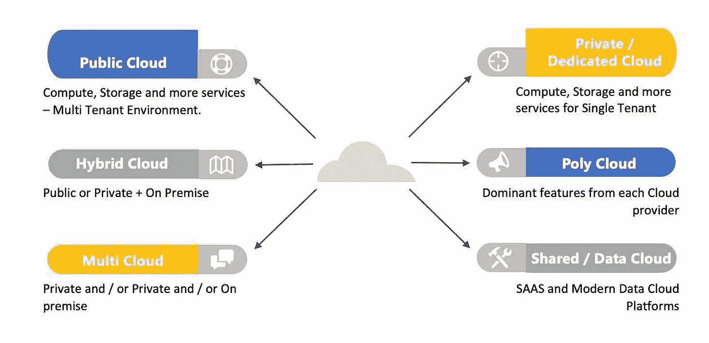
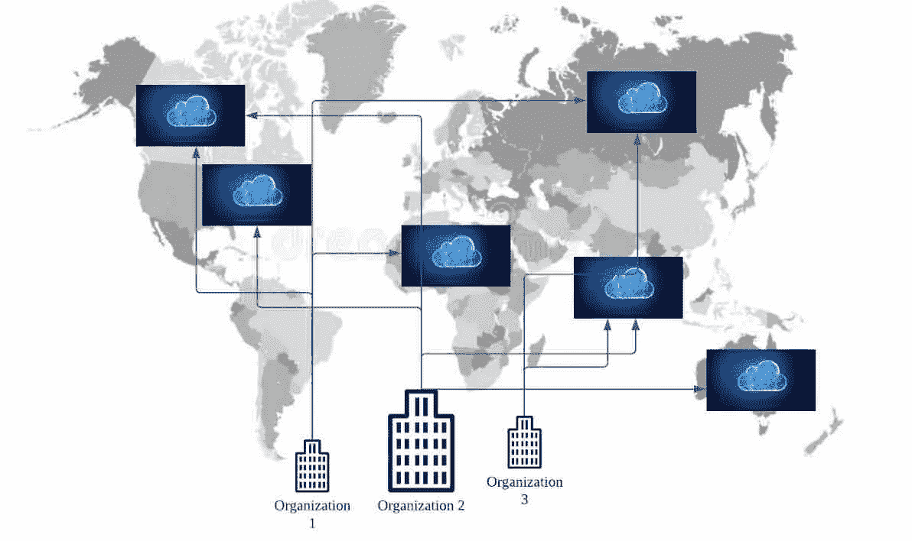
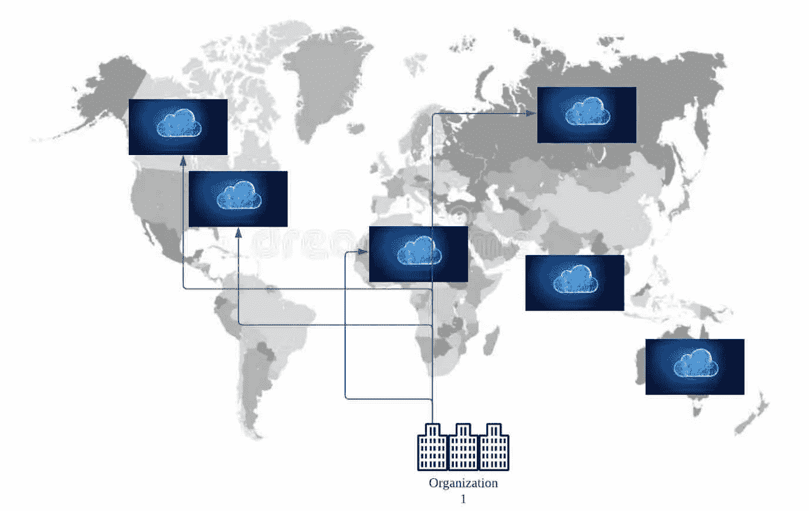
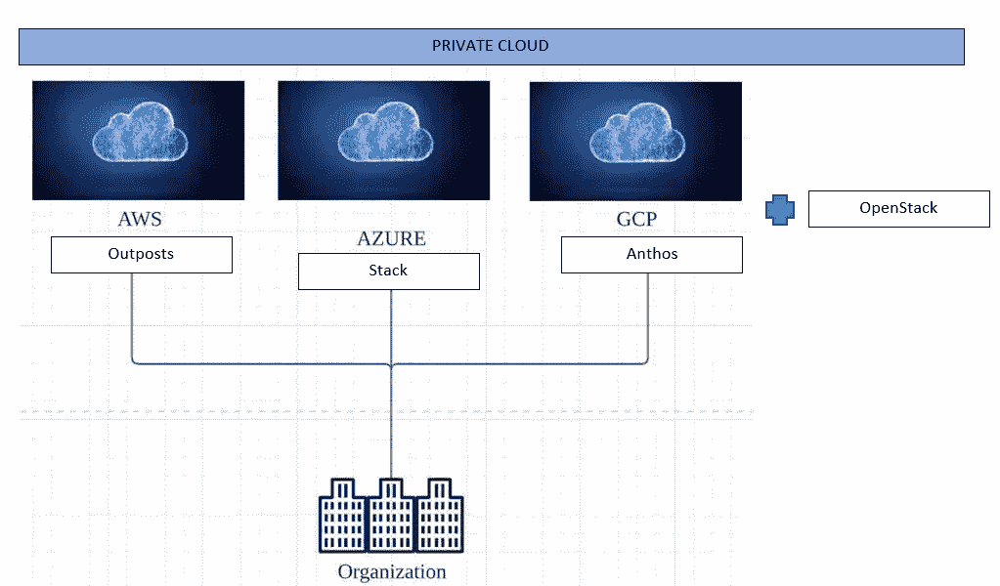

# AWS 系列:排名第一的云部署模式(公共云、私有云、聚合云和多云)—第 1 部分

> 原文：<https://medium.com/nerd-for-tech/aws-series-1-cloud-deployment-models-public-private-poly-multi-cloud-part-1-d405a94d5d1a?source=collection_archive---------12----------------------->

介绍了云部署模型，以及哪种方案可能更适合您的组织。虽然 IAAS、PAAS、SAAS 和无服务器是由解决方案提供商提供的基于云的云模式，但这取决于各个组织以及审查和设计部署模式的需求。

云部署模型

通常，较大的组织不能只使用一种模式的公共云或私有云，它通常是几种云模式和云提供商的组合，以便

(1)使用这些云提供商提供的同类最佳产品— **聚云**

(2)为了导航客户端/区域限制采用私有云+公有云模式— **混合云**

(3)不同地使用多个云合作伙伴进行生产和备份，或者由于基于区域/客户的限制而使用多个云合作伙伴— **多云**

(4)使用不同的云模式，如共享服务(SAAS)、PAAS、IAAS 或无服务器

(5)组织还可以选择由公共云提供商提供的专用私有云，以便将维护和管理任务移交给云提供商，并可以更好地关注业务需求。安全性和延迟— **私有/专用私有云。**

(6)从传统数据库迁移到现代云数据库。没有一家大公司会使用单一的数据库模型。它将始终是关系/非关系/图形的多种组合，因为它将包含大量各种数据，如结构化、半结构化和非结构化数据。此外，随着数据湖和增量湖的出现，无论组织的规模如何，从一开始就构建小型数据湖对组织的发展和采用都很有用。— **现代云数据平台。**

# 公共云:

***什么事？*** 它像一个提供空间和服务的公寓，为公寓和所有附加设施如健身房、游泳池、网球场、活动室等提供严密的安全防护。每个公寓将根据谁是其目标受众以及它想要提供什么样的生态系统来提供差异化的功能。虽然伞状共管公寓的安全服务是提供每一个街区和每一个单位进一步安全围栏，在某种程度上，这是一个共同的责任。

**公有云**

同样，公共云提供最低限度的计算和存储服务，以及附加服务，如安全性、基础架构、网络、采购、流、服务器、数据库、文件存储、容器、负载平衡、机器学习、大数据和分析、监控、消息传递、备份和恢复等。根据云提供商的不同，他们提供基于服务器和无服务器的产品。这取决于组织是否希望将所有鸡蛋放在同一个篮子里，或者希望将鸡蛋分布在不同的云提供商之间。此外，不同的云提供商也会提供旗舰服务。使用这些服务会使最终产品更加高效和有效。

在众多云提供商中，**亚马逊网络服务(AWS)、微软 Azure** 和**谷歌云提供商(GCP)** 是主要的公共云。还有其他云提供商，如**甲骨文云、雪花、IBM、阿里巴巴**等。其提供典型的服务。此外，云服务和专业知识必须是组织的云堆栈的一部分，以便随时使用，因为使用它的需求可能随时出现，包括但不限于客户/组织区域存在的合规性和监管原因。

它是如何工作的？公共云提供存储、计算和其他服务，其工作基于订阅模式。

**它解决什么问题？**对于较大的组织来说，内部部署和云之间没有太大的区别。从安全到覆盖所有 OSI 层，类似的事情也需要在云上完成。但是，内部部署和云之间有几个关键区别因素。对于规模较小的初创企业来说，云是一个福音，他们可以快速起步，快速向市场推广他们的 MVP，而他们的投资只占内部部署的一小部分。

*基础设施:*

(1)所有权模式到订阅模式(2)托管在可共享的数据中心，并了解公共云的基础架构。

*对于应用开发:*

(1)应用程序开发安全第一(2)共享架构和可能的嘈杂邻居(3)同类最佳的纯云资源(4)更多托管服务的使用，这将为交付功能需求提供更多时间。

*办理业务:*

(1)可能更快上市，因为服务器可以更快获得，并且水平可伸缩性是可能的。

*财务/运营:*

(1)公司对 OPEX 的资本支出。某些架构仍可能是资本支出。(2)折旧周期维护和方法不同。

# 私有云:

**什么事？**拥有自己的私有数据中心，创建类似公共云的架构，包括可扩展性、弹性和容错能力，以及服务器的自动修复和连续可用性，这与公共云的承诺是一致的。对于那些不想将所有/部分数据和资源放在公共云上的非常敏感的组织来说，私有云为他们提供了存放这些数据和资源的条件，同时还拥有私有云的所有设施。组织还将私有云作为一个重构机会，并在将工作负载迁移到公共云之前，将其用作 2-3 年的试运行环境。这对以下群体有何影响？

**私有云**

*基建团队:*

支持私有云不会减轻基础架构团队的负担。事实上，从内部迁移到私有云模式有很多优势，并且增加了基础架构的日常维护，因为必须确保额外的容器化和自动恢复、自动修复层，从而确保可靠性、弹性和 100%可用性。内部部署到私有云之间的工作有所重叠。

*对于应用开发团队:*

对于应用程序开发团队来说，由于基础架构和配置是由 infra 团队实现的，因此与内部部署相比，他们的工作或多或少是相同的。但是，如果采用私有云是为了摆脱传统应用程序并使用现代应用程序堆栈，那么在重新构建解决方案、重构等方面会有大量工作要做。，基于要采用的迁移方法。这些项目需要几年时间才能完成，因此需要在内部环境中并行运行，并且在此期间成本会翻倍。特别是从内部部署到私有云模式，服务器将不得不购买/租赁，因此如果大型组织选择这种模式，将会产生额外的沉重成本。但是许多组织更喜欢私有云方法，因为他们能够有效地调整他们的策略，并为应用程序的高效重构提供带宽和跑道。

它是如何工作的？要构建私有云，组织可以使用自己的服务器或公共云提供商来构建专用私有云。此外，Redhat 的 [Openstack](https://www.googleadservices.com/pagead/aclk?sa=L&ai=DChcSEwiM-Jr49ozxAhWDVWAKHXb0DycYABADGgJ0bQ&ohost=www.google.com.sg&cid=CAESQOD2KGyGEuwFT-ZmdLGpDkhdvJjo9m0J0FOFqJ_iJsr6t2O7cJ45vRX9llDYgvAwu7x3Eszr8Bvdi5QRFUXqedI&sig=AOD64_34KETWC1CEQhlk0ltTIQkRIKu3Og&q&adurl&ved=2ahUKEwiR6ZH49ozxAhWCbysKHfztDVEQ0Qx6BAgCEAE) 有助于构建和管理虚拟环境池，并提供可靠性、可用性和弹性。这是一个虚拟化管理平台。还有其他提供商，如 [HPE](https://www.hpe.com/sg/en/solutions/cloud/private-cloud.html?jumpid=ps_r6iuctqvay_aid-520042860&ef_id=Cj0KCQjw8IaGBhCHARIsAGIRRYrLMzg6b3LifoHPf0JiAwCwxPD2M8Zp2Pv7M0QJ31zg1Pguz6trw84aAjnyEALw_wcB:G:s&s_kwcid=AL!13472!3!513153694032!p!!g!!private%20cloud!12705329654!124218055161&gclid=Cj0KCQjw8IaGBhCHARIsAGIRRYrLMzg6b3LifoHPf0JiAwCwxPD2M8Zp2Pv7M0QJ31zg1Pguz6trw84aAjnyEALw_wcB&gclsrc=aw.ds) 私有云支持组织对私有云的管理。

它解决了什么问题？许多组织拥有不想迁移到公共云的敏感数据。对于组织而言，还可能存在区域限制，即私有环境优于公共环境，或者可能存在与客户相关的限制，即他们希望自己的数据在私有环境中呈现。所有问题都可以通过全部或部分使用私有云来解决。私有云也越来越被视为迁移到公共云之前必不可少的第一步，因为它为重构/回购/淘汰系统提供了更多的迁移时间和选择。当对安全性、法规和延迟需求有强烈需求时，私有云是最佳选择。

# 专用私有云:

**什么事？**私有云可以自行建立，也可以由公共云提供商提供自己的服务器和资源，为公司建立专用的私有云。它涉及网络、交换、服务器、完整的基础设施、完整的安全协议等。，由公共云提供商为组织调配。与公共云相比，这也相当昂贵。然而，服务器可以由公共云提供商管理，公共云提供商可以提供更多带宽来专注于新的业务需求，并将遗留应用程序重构为更好的现代平台。所有关于私有云的讨论都适用于专用私有云。

它是如何工作的？ Major 提供构建专用私有解决方案的解决方案，如 AWS Outposts、Azure Stack、Google Anthos、VMWare 的 VMConSAWS 等。这些公共云提供商使您能够基于他们提供的服务器和服务构建私有云。

*AWS 前哨*:你将能够使用 [AWS 前哨](https://aws.amazon.com/outposts/)在本地运行 AWS 产品和服务。完全托管的服务，提供相同的基础架构、服务、工具、API 等。当您在 AWS 公共云中使用它时。提供一致、可靠和弹性的混合方法。

Azure stack :像 AWS Outposts 一样，Azure stack 使组织能够从内部访问 Microsoft Azure 产品和服务。

参考: [AWS 前哨 vs Azure 栈](https://www.cloudmanagementinsider.com/aws-outposts-vs-azure-stack-comparing-the-hybrid-cloud-technology/)。

*GCP Anthos*:[Anthos](https://cloud.google.com/anthos/?utm_source=google&utm_medium=cpc&utm_campaign=japac-SG-all-en-dr-bkwsrmkt-all-all-trial-e-dr-1009882&utm_content=text-ad-none-none-DEV_c-CRE_442390883017-ADGP_Hybrid%20%7C%20BKWS%20-%20EXA%20%7C%20Txt%20~%20Hybrid%20and%20Multi-cloud%20~%20Anthos_anthos-KWID_43700054967367154-kwd-677601662522&userloc_9062524-network_g&utm_term=KW_google%20anthos&gclid=Cj0KCQjwk4yGBhDQARIsACGfAeurjK_W3Kh0lkSKDyQSLn75K_tADfoPG-mNRVNuIN49fGWirVYWYewaAor6EALw_wcB&gclsrc=aw.ds)是一个托管平台，它将谷歌云服务扩展到您自己的内部环境。

参考:[AWS outpost vs Azure Stack vs Google Anthos](https://searchcloudcomputing.techtarget.com/tip/Compare-hybrid-clouds-AWS-Outposts-vs-Azure-Stack-vs-Google-Anthos)

*Azure Arc* :最近一段时间，微软专注于多云和集成。Azure Arc 已经存在一段时间了。 [Azure Arc](https://azure.microsoft.com/en-us/services/azure-arc/) 为多云提供简化的管理和轻松的开发环境。提供从 AWS 到 Azure 到 GCP 的简单能力。

它解决了什么问题？它解决了私有云能够解决的所有问题。此外，它还解决了服务器、网络、交换机的管理和共享安全等问题。

故事的第 2 部分涵盖了[***云部署模型—第 2 部分***](https://luxananda.medium.com/aws-series-1-cloud-deployment-models-public-private-poly-multi-cloud-part-2-995f9a03c9e) 。

