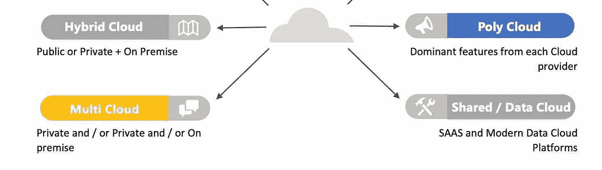
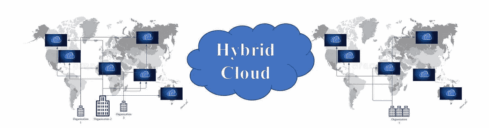
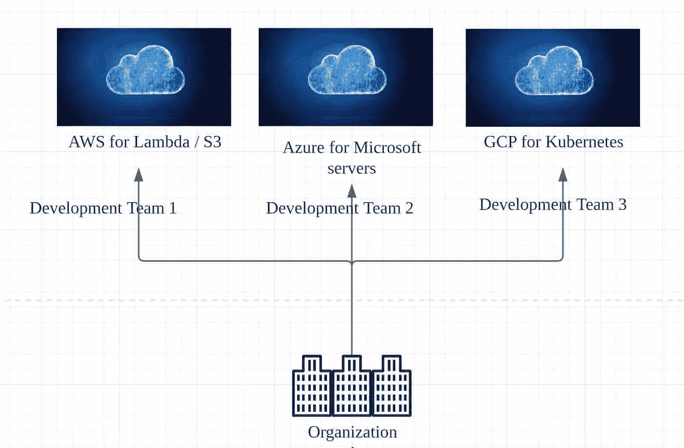
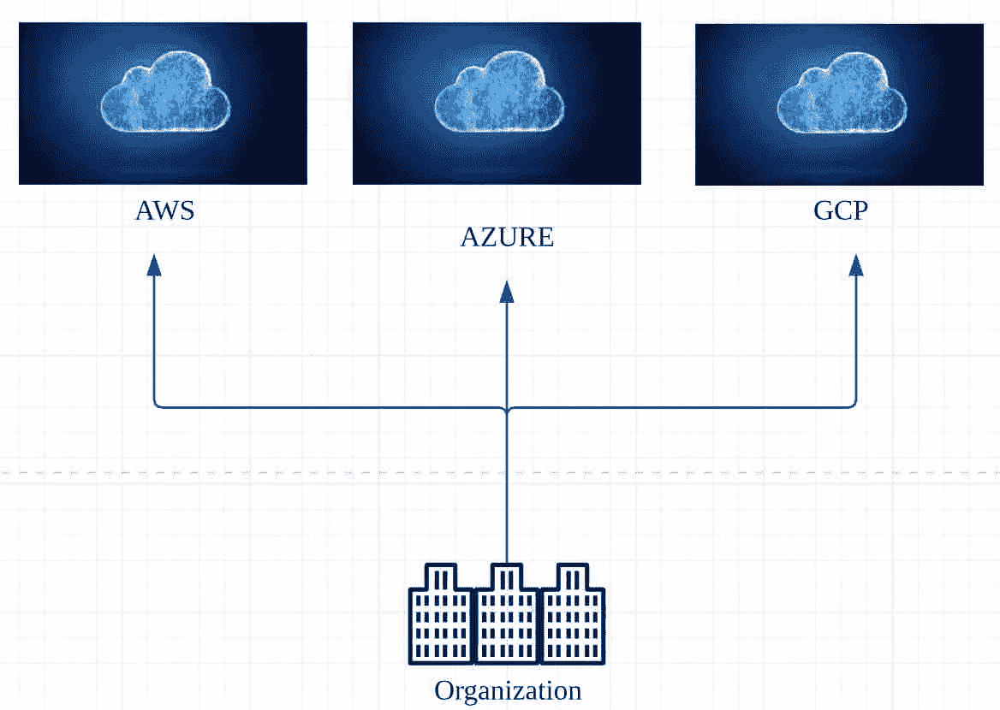
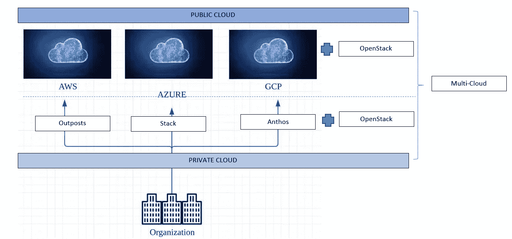
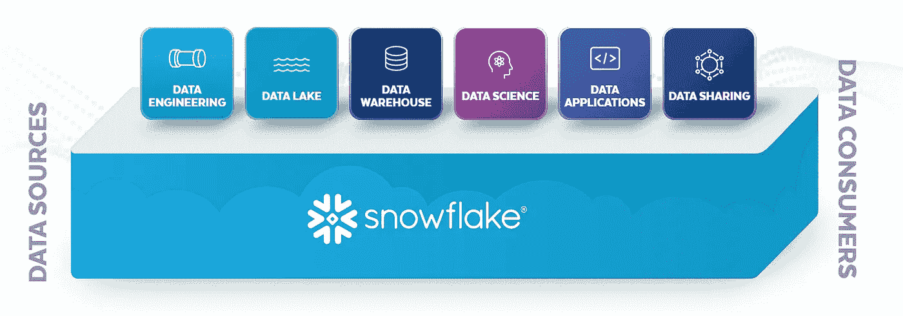
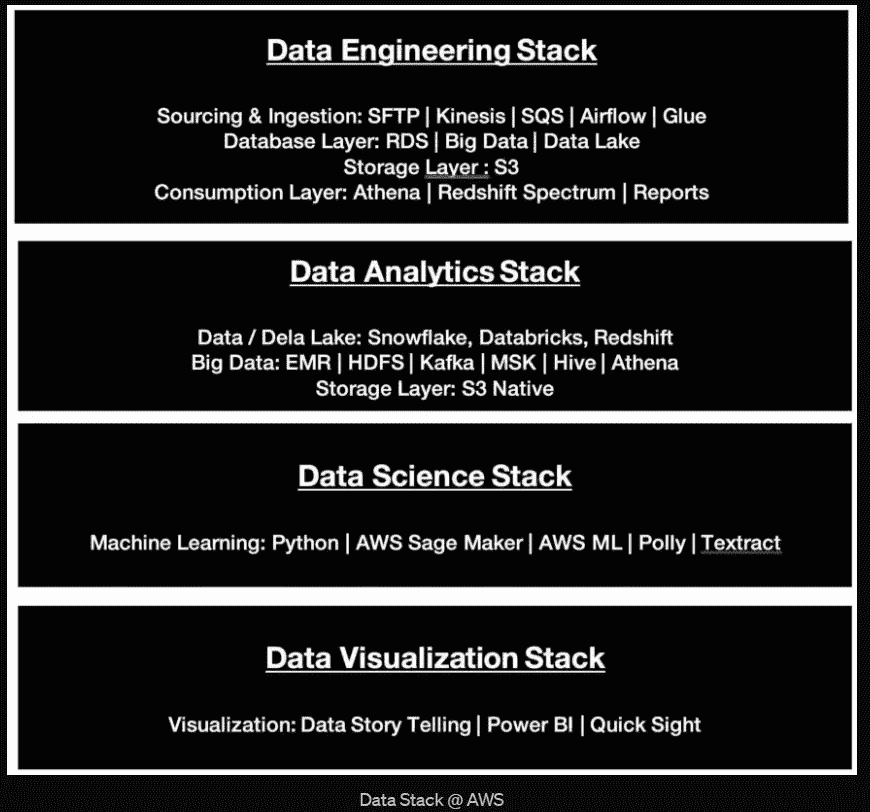
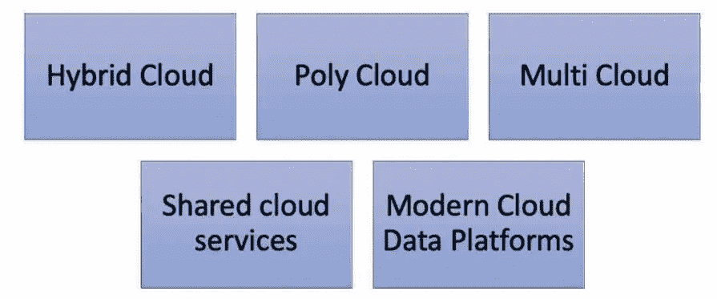

# AWS 系列:排名第一的云部署模式(公共云、私有云、多云和多云)-第 2 部分

> 原文：<https://medium.com/nerd-for-tech/aws-series-1-cloud-deployment-models-public-private-poly-multi-cloud-part-2-995f9a03c9e?source=collection_archive---------14----------------------->

文章的这一部分涵盖了混合云、聚合云、多重云、共享云服务和现代云数据平台。参考本系列第 1 部分@ [***云部署模型第 1 部分***](/p/d405a94d5d1a) ***。***

# 混合云:

**什么事？**混合云平台是私有/内部和公共云的组合。并非所有组织的地区/客户/国家法规都允许将所有工作负载和数据放入云中。此外，在需要重新架构和重构的情况下，并不是所有的工作负载都可以直接迁移到公共云。无论是在迁移到公共云之前还是由于任何安全/监管/延迟限制，这种工作负载分离都是任何组织中混合云的诞生。

混合云

**它是如何工作的？**与多云不同，混合云更加同质。通常是私有云，也可以选择公共云。对于任何这些混合云，AWS Outposts、Azure Stack、Google Anthos、VMWare 的 VMConSAWS 等解决方案。适用于混合云模型。

**它解决什么问题？**主要是法规、安全和延迟需求是拥有独立私有云以及拥有公共云的主要原因。

# 聚云:

**什么事？**如果我们拥有由每个主要参与者提供的超过 100 种服务的最佳云，那么还有什么必要拥有聚云呢？聚合云是一种架构模式，旨在从每个公共云提供商那里挑选最佳/主导资源，并构建一个聚合云环境。为此目的而选择的云朵不是随机的，而是主要的特性，或者在团队独立性和提供高效工作环境方面最适合公司的特性。通常聚云是偶然的，不是战略途径。良好实践适用于任何采用单一或多种云方法的公司，包括将多种云作为架构的一部分。

*AWS:* 虽然有 200 多种产品和服务可以作为 AWS 的订阅模式，但很少有旗舰产品可以让您的架构成为顶级。服务，如大多数无服务器产品，如用于处理/应用程序的 Lambda、用于 ETL 的 Glue、用于数据库的 DynamoDB 和用于数据仓库的 Redshift。使用 S3 的存储很受欢迎，因为它是数据湖的基础，并提供了广泛的存储可能性。

Azure:Azure 还提供了几种服务作为订阅模式。微软服务器是主要的旗舰产品。虽然其他云提供商也提供微软服务器，但从 Azure 提供更好。此外，Azure 正在为物联网提供商提供和投资更多解决方案。

*GCP* : GCP 的主要关注点是 ML / AI 和容器。他们已经扩展了容器的概念，特别是 Kubernetes，这几年来使它成为 Google 的一个主导产品。

**它是如何工作的**？识别与众不同的功能，并选择适合您的组织和适合应用程序或平台的功能是关键。没有一刀切。如果您正在构建一个以存储为中心的应用程序 ML 特定应用程序或高性能应用程序，该应用程序支持低延迟或支持分布式访问的多区域访问，这取决于您的应用程序的中心焦点是什么，它应该驱动应用程序/平台，这是选择主要功能的关键。

**聚合云**

**它解决了什么问题**？基于每个云提供商提供的最佳或主流解决方案的架构，也使开发团队能够独立有效地工作。如果聚合云不是事后想法，效果最好。

# 多重云:

**什么事？**组织拥有异构云模型(多个私有云或公共云)是一件非常正常的事情，尤其是较大的组织为了提供更高的可靠性、弹性、备份和可用性，拥有多云选项是一种常态。此外，客户和其他几个地区的法规基于组织的限制，或者作为一种备用策略，组织支持多云。此外，为了避免供应商锁定，使用其他云提供商(PolyCloud)的主要功能，ever regions 拥有 CDN 的多区域支持也是选择多云解决方案的一个原因。

**它是如何工作的？**创建多重云有两个选项。

*选项 1:* 多公共云

*选项 2:* 多公共云+私有云

参考“专用私有云”阅读 AWS 前哨、Azure Stack 和 GCP Anthos。

**它解决什么问题？**来自不同公共云提供商的不同旗舰产品，避免供应商锁定、基于区域的边缘服务器、客户/组织使用特定云的区域限制，例如仅使用阿里巴巴或 GCP。

# 共享云服务:

**什么事？** SAAS 主要是共享云服务模式。SAAS 模式，如 Salesforce、Microsoft PowerBI、Tableau、Monday、监管应用程序、财务数据提供商，如彭博、路透社等。是具有多租户架构的共享云服务。

它是如何工作的？它是一个多租户架构，在内部基于不同的数据库/商店，或者通过模式或低级别隔离或锁进行隔离。

**它解决了什么问题？**订购在线军事级解决方案，而不是在内部安装或构建应用，可以节省时间和精力，并且易于管理。

# 现代云数据平台

**什么事？**

*雪花*:存储和计算分离的集成数据仓库和数据科学平台。存储可以是 AWS 或 Azure，并直接在查询级别进行计算，输出可以存储回数据湖，供机器学习算法的进一步分析和应用。

参考:snowflake.com

*Amazon* :由于本系列主要关注 AWS，所以分离数据堆栈。

栈中的每个元素将在 AWS 系列的后续部分中讨论。相关链接将在未来进行修改。

*Azure* : Azure 数据工厂，Cosmos，SQL Server，数据管道。

*GCP* : GCP 大查询&数据湖。

*甲骨文云*:甲骨文云、数据库云服务器和甲骨文云热浪。

数据块:[三角洲湖](https://databricks.com/try-databricks?utm_medium=cpc&utm_source=google&utm_campaign=2073787418&utm_offer=try-databricks&utm_content=trial&utm_term=data%20bricks&gclid=Cj0KCQjwk4yGBhDQARIsACGfAesUET_rj1WvrEKO9jefYI4MkSQcRZYXmvCTEN4t8M959pNKVgGD5GMaAm-5EALw_wcB)和开源湖屋架构。

**它是如何工作的？**大多数现代云平台不仅提供 PAAS 和托管数据库，还集成了完整的平台解决方案，如分析、商业智能和报告。这使组织能够构建具有最高安全性、可靠性、弹性和容错能力的复杂数据平台。

它解决了什么问题？管理数据库是一项复杂的任务。使用已定义的 SLA 进行维护和管理，解决数据块损坏问题，以及进行备份/恢复，这些都非常复杂，而且需要大量时间。为了让组织专注于业务功能和构建现代数据平台/产品/服务的能力，现代数据云平台是您的朋友。

**下一篇文章**是关于 [AWS 云模型](/p/3244fc60bc55)管理、AllOps(数据操作、m 操作、AIOps、BaseOps 等)。

