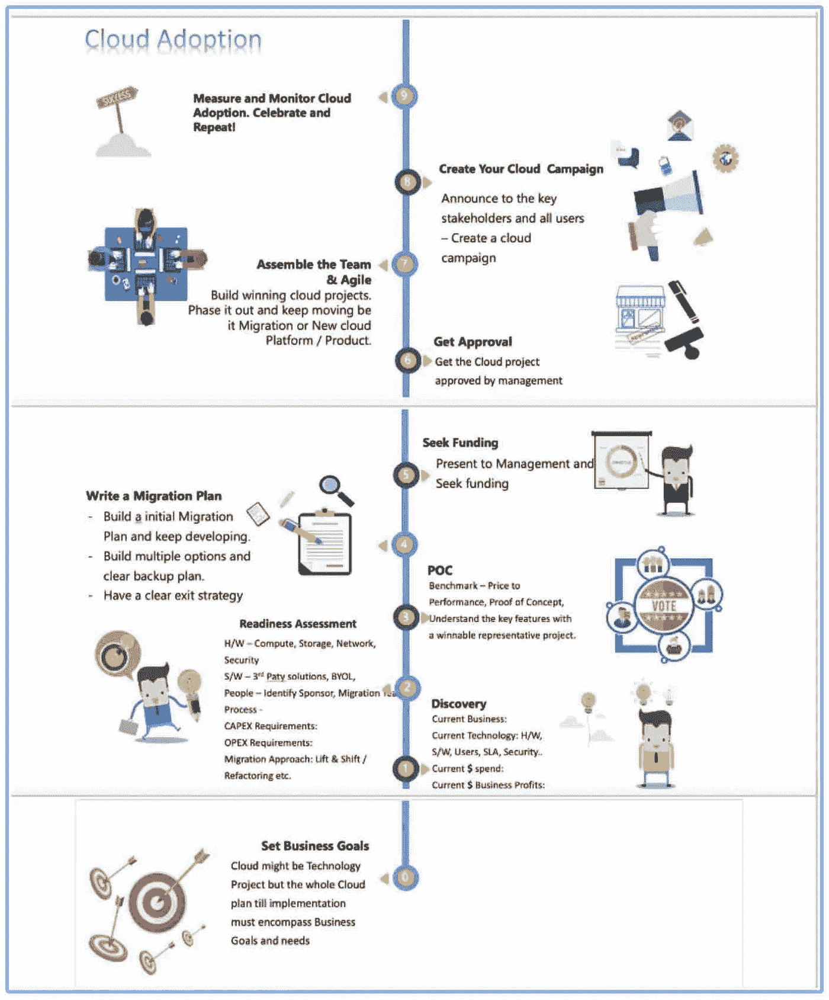
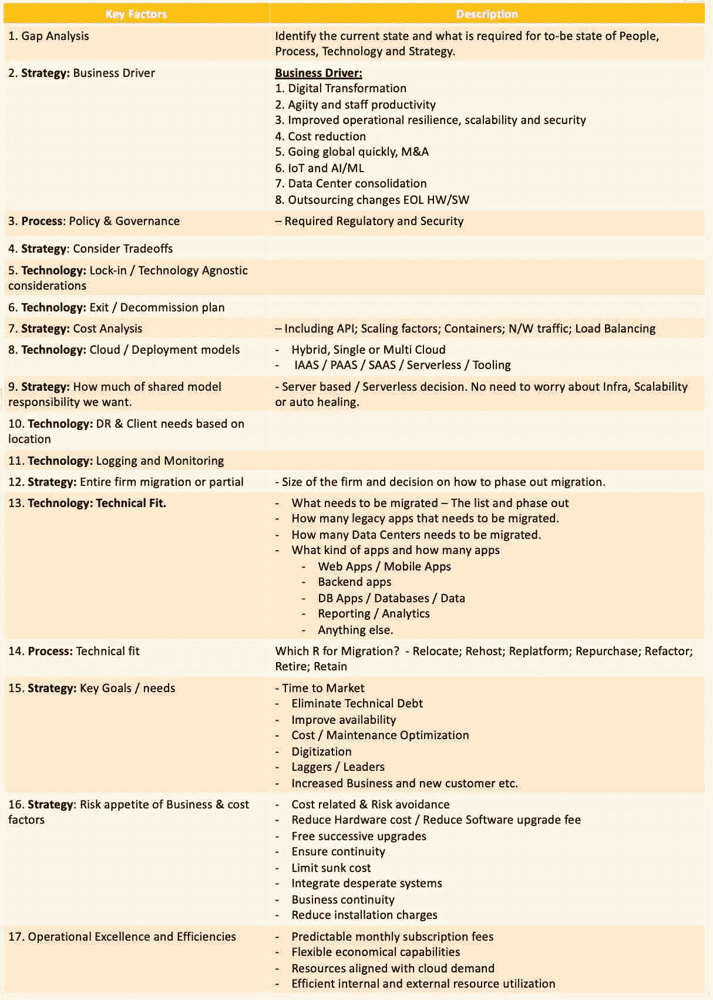
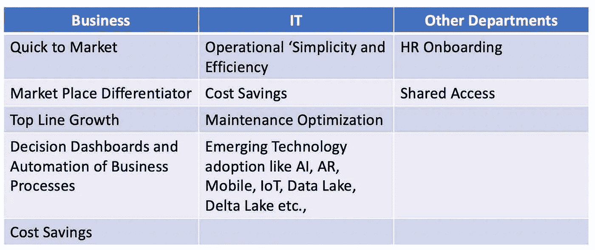

# AWS 系列#1:迁移前光标

> 原文：<https://medium.com/nerd-for-tech/aws-series-1-migration-68e4dff861b9?source=collection_archive---------12----------------------->

# AWS 迁移练习:

1.  **前置/准备:试卷练习和审核:**

*   云分析和选择
*   云战略

**2。迁移练习:**

类似于[业务案例](/nerd-for-tech/aws-series-1-business-case-for-cloud-how-to-pitch-to-your-management-and-why-is-it-important-pa-8c6d42b30a8b)说服管理层，下面是业务的迁移练习和批准。

# 云分析和选择:

在制定迁移战略和计划之前，云分析和选择是必不可少的第一步。云分析和选择

## *内部——组织*:

## *外部—云提供商*:

# 云战略:

云的核心是业务，尽管云是一个技术项目。业务绩效和盈利能力应该是您的云决策的核心。

*   ***云分析*** 就是发现内部和外部关于什么是当前的，什么是预期的——论文练习。
*   ***云战略*** 涵盖了什么，以及为什么—呼吁采取行动。
*   **云迁移计划**涵盖内容、方式和时间。

## 关键因素:

1.  业务基线和风险偏好——心态变化。
2.  云计算基线
3.  监管、客户管辖基线
4.  服务策略和；/或者选择正确的部署模式—混合/私有/公共；PAAS / IAAS / SAAS。
5.  财务模式—资本支出与 OPEX
6.  原则—本地优先与云优先和云适合。
7.  清点(或)调整、区分优先级、选择云计划。(1)评估所选服务对云的价值(2)评估所选云计划的准备情况，包括安全性、合规性、数据和安全性。
8.  识别技术债务，概述 IT 服务
9.  安全基线
10.  支持并与业务保持一致
11.  退出策略
12.  云如何让您的组织受益
13.  概述并排列你的目标
14.  IT 现状和差距分析—就绪性评估。
15.  定义你移动的云目标状态(1)。(2)私有/公共(3)策略变化(4)要测量的指标。
16.  沟通、认同和融资策略
17.  获得云提供商的完整路线图(1)清晰的路线图(2) IT 支持游戏计划(3)冠军

## 将所有云计算优势列为贵组织云计算战略的一部分:

下面是一个示例列表，包括贵组织特有的云战略优势。这对于构建业务案例也很有用。这有助于最终衡量组织是否能够实现它想要实现的目标。

组织范围的云优势

总列表:

1.  更快地访问基础设施
2.  更大的可扩展性和弹性
3.  高可用性
4.  更快上市
5.  更高的性能
6.  地理范围
7.  将资本支出转移到 OPEX
8.  IT 效率
9.  成本节约
10.  维护优化
11.  顶级的资源、应用程序和数据库基础架构。

下篇: [AWS 系列，迁移](https://luxananda.medium.com/aws-series-1-migration-ffc2363a6419)。