# AWS 系列#1:迁移

> 原文：<https://medium.com/nerd-for-tech/aws-series-1-migration-ffc2363a6419?source=collection_archive---------8----------------------->

# AWS 迁移练习:

请参考文章[的第 1 部分，阅读关于迁移前指标](/p/68e4dff861b9)的内容。

1.  **前期光标/准备:纸质练习和审批:**

*   云分析和选择
*   云战略

**2。迁移练习:**

与[业务案例](/nerd-for-tech/aws-series-1-business-case-for-cloud-how-to-pitch-to-your-management-and-why-is-it-important-pa-8c6d42b30a8b)相似，为了说服管理层，下面是业务部门的迁移练习和批准。

# AWS 云迁移步骤:

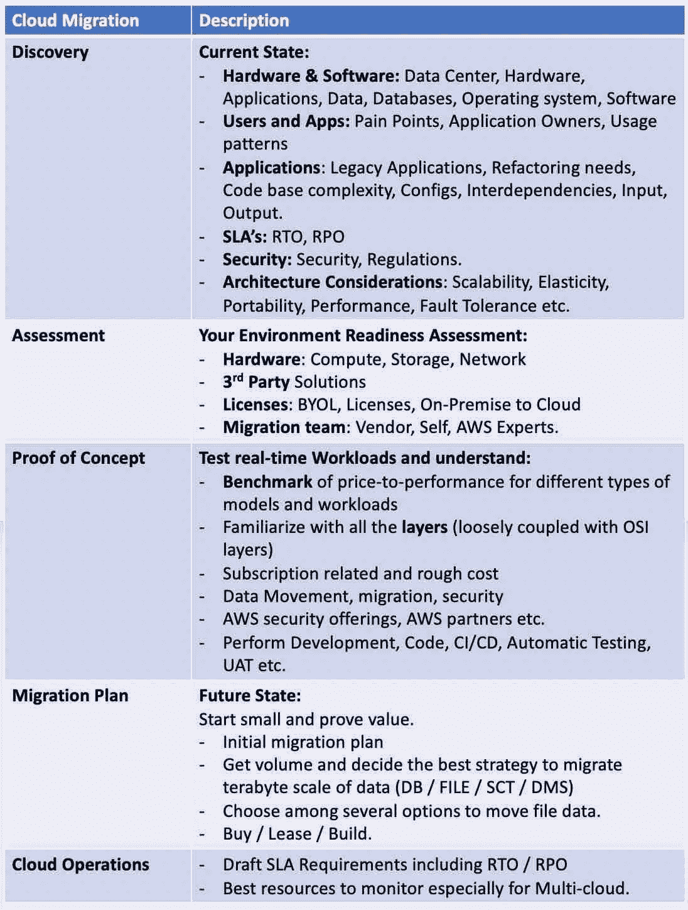

# 便于迁移的 AWS 服务:

迁移阶段应该包括 AWS 服务，以促进平稳迁移。

*   **业务案例:** [AWS 迁移评估员](https://aws.amazon.com/migration-evaluator/)

参考:AWS。安装迁移评估器安装程序。

*   **就绪** : [AWS 迁移就绪评估](https://docs.aws.amazon.com/whitepapers/latest/aws-migration-whitepaper/assessing-migration-readiness.html)。6 个因素——业务、人员、治理、平台、安全性、运营和通过大约 70 个问题..

参考:AWS

*   **迁移自动化&治理** — [AWS 服务目录](https://aws.amazon.com/servicecatalog/?aws-service-catalog.sort-by=item.additionalFields.createdDate&aws-service-catalog.sort-order=desc)。

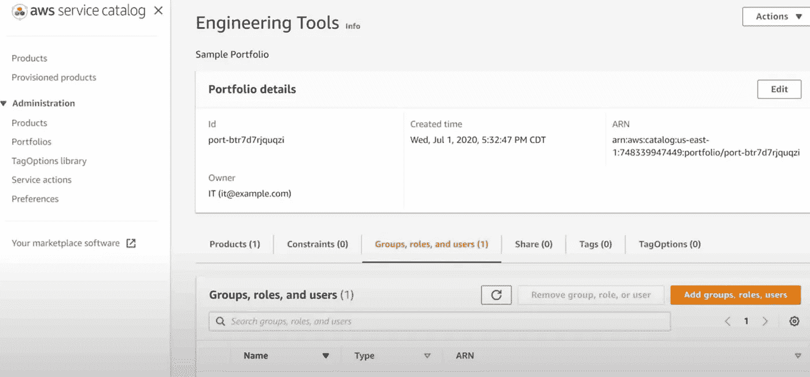

参考:AWS

*   **跟踪** : AWS 迁移中心

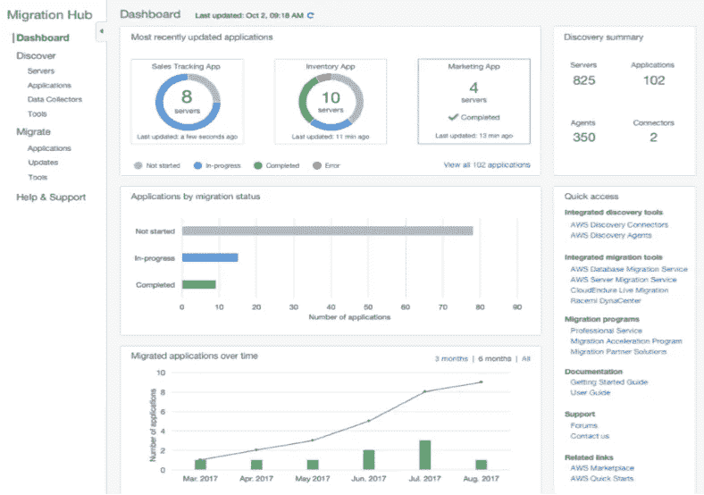

参考:AWS。AWS 迁移中心。

2. ***服务器和数据库迁移*
*-*** [云忍](https://www.cloudendure.com)安 AWS 公司(第三方)- [AWS 服务器迁移服务](https://aws.amazon.com/server-migration-service/)

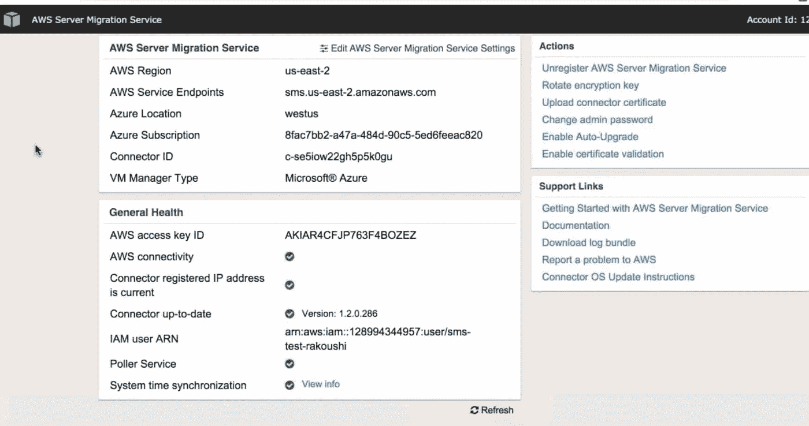

参考:AWS

- [AWS 数据库迁移服务](https://aws.amazon.com/dms/)

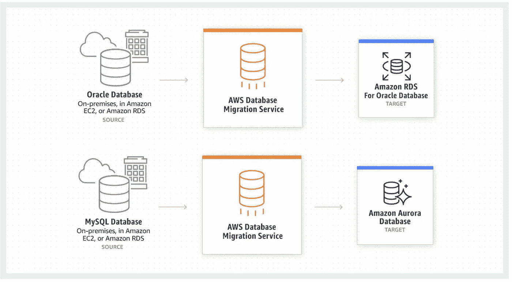

参考:AWS

# AWS 迁移方法:

AWS 迁移方法包括 7 R。(1)重新定位(2)重新托管(3)重新搭建平台(4)重新采购(5)重构(6)淘汰(7)保留。

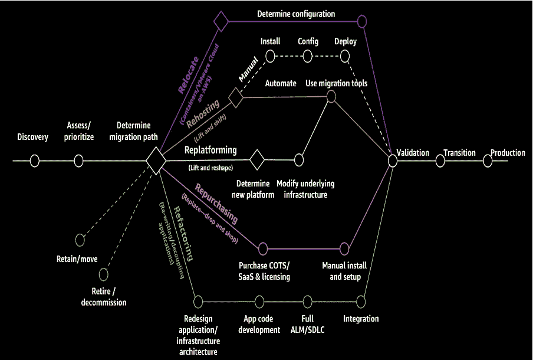

资料来源:AWS

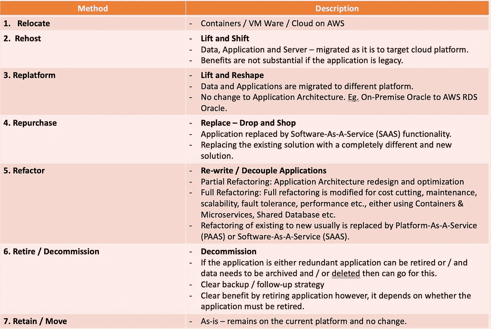

# AWS 迁移计划:

## 1.我们要迁移什么—组件级

*   比如，报告/分析、移动应用、后端和前端应用(库/代码)、数据(模式/代码和数据)
*   数据迁移行动手册

## 2.每个组件的集成点是什么

*   上游/下游依赖性
*   使用/公开的 API
*   现有整体架构
*   包括从 1 开始的点数。

## 3.确定每个组件的方法

1.  当前架构针对每一层和组件的目标状态架构，例如基础架构、网络、安全、采购、流、存储、接收、处理、数据库、机器学习、大数据、监控和消息传递、备份和存储、负载平衡。—画出来。
2.  已经准备好目标状态架构和架构考虑事项，包括多 AZ、可伸缩性、容错性、弹性、可扩展性、可移植性、性能等。,

决定 7 R 的哪种迁移方法(将在本文后面讨论):

1.  具体到应用——API 的微服务，容器。手机 App，后端和前端。
2.  具体到报告-共享方法(比如使用数据块-增量共享等。)
3.  具体到数据-历史-方法和当前或持续-方法。

# AWS 架构良好的框架:

实施云(无论是新云还是迁移云)的最佳方式是遵循 [AWS 良好架构的框架](https://aws.amazon.com/blogs/apn/the-5-pillars-of-the-aws-well-architected-framework/)。设计良好的框架由五个支柱组成，是 AWS 云迁移的设计原则/最佳实践。

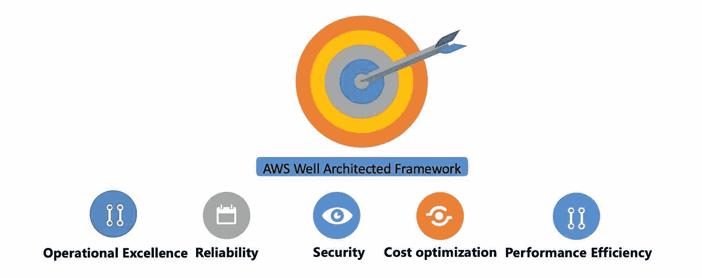

这包括，

## 1.卓越运营:

*   基础设施作为代码
*   做出频繁的、微小的和可逆的改变
*   经常改进操作程序
*   预见失败
*   从运营失败中吸取教训。

## 2.安全性

*   自动化安全性
*   实现强大的安全身份基础
*   启用可追溯性
*   在所有层应用安全性
*   让人们远离数据
*   为安全事件做准备。

## 3.可靠性

*   故障自动恢复和测试恢复程序
*   横向扩展以提高总工作负载可用性
*   停止猜测容量
*   管理自动化中的变化

## 4.性能效率

*   将先进技术大众化
*   几分钟内走向全球
*   使用无服务器架构
*   多做实验
*   考虑机械同情

## 5.成本优化

*   实施云财务管理
*   采用一种消费模式
*   衡量整体效率
*   停止在无差别的重物上花钱
*   分析支出并确定其属性

# 12 因素应用程序:

https://12factor.net[的 12 因素应用是一种构建软件即服务(SAAS)的方法。](https://12factor.net)

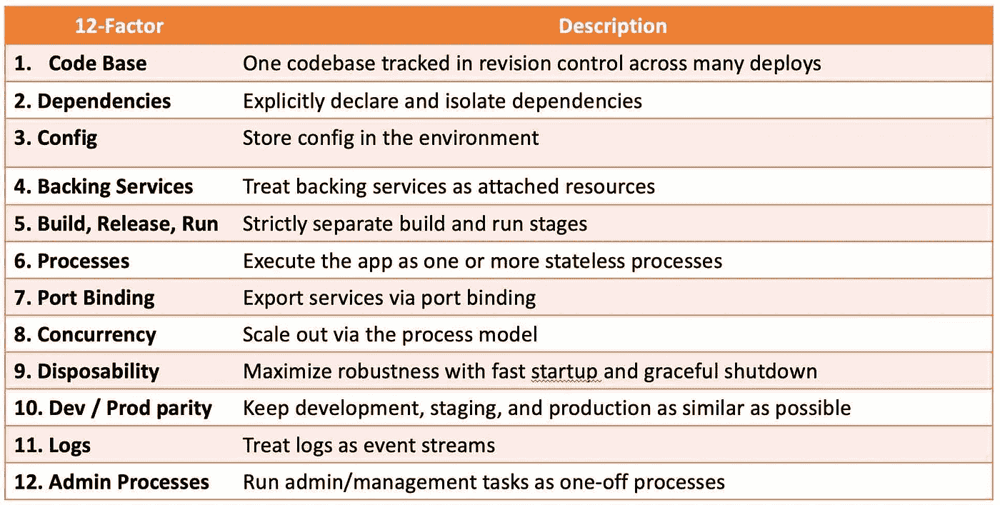

来源:https://12factor.net

# 常见的 AWS 迁移问题:

常见的 AWS 迁移问题没有单一的清单。问题可能因公司而异，体验也可能不同，但是通过适当的云分析、战略和计划，可以对问题进行规划并减轻问题。

***技术:***

1.  **应用**

*   遗留应用程序和错综复杂的链接以及与所有上游和下游系统的集成必须被识别、简化和实现，不能遗漏任何一个。
*   未使用的应用程序标识，其中遗留应用程序已有几十年的历史。
*   在云和内部并行运行应用程序

2.**数据**

*   数据仓库:无法加载数据和重新测试，因为代码会移动几个版本，重新运行将在不同的时间点提供不同的可报告数据。历史必须原样移植，只能测试新数据。
*   数据冗余、精确到小数点后一位的数据正确性、海量数据的比较具有挑战性。

3.**分析**

*   如果机器学习和分析最初使用不同的版本运行，随着时间的推移，如果已经升级，同一应用程序将不得不经历数据的提升和转移以及应用程序的重新平台化。

***人:***

1.  忙于功能项目的用户。用户不太热衷于迁移工作正常且没有损坏的东西。
2.  迁移和实施解决方案的专业知识。

***流程:***

1.  云安全、治理和开发人员特定的治理。

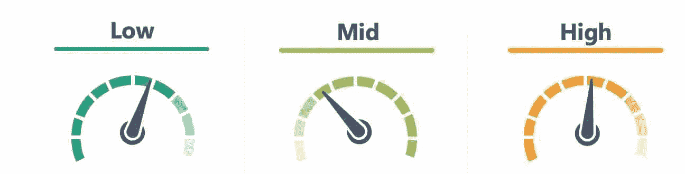

贵公司的迁移复杂性如何

最重要的是，在整个/部分组织的每个迁移阶段之后，记下所有的学习成果并继续以此为基础，这样就不会重复同样的错误，并且应该集中维护，整个组织都可以访问。

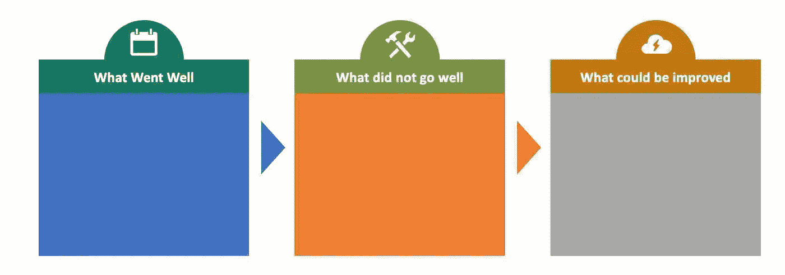

**下篇:** AWS 云系列#2:安全层，云治理相关。