# AWS 系列#2: AWS 安全层—登录

> 原文：<https://medium.com/nerd-for-tech/aws-series-2-deep-dive-aws-security-layer-login-cdf48a7d2e3c?source=collection_archive---------13----------------------->

# **AWS 登录** : IAM、Cognito、Secrets Manager、MFA、单点登录

经过广泛的分析后，您的组织必须已经决定采用哪种云部署模式以及使用哪种云模式，无论是多云还是独立云，以及部署选项，如仅 IAAS 或仅 SAAS 或多种服务的混合(最有可能是设计)，您的下一个逻辑步骤是使用特定云提供商的登录区，创建用户并开始在云上工作。

# 身份和访问管理(IAM):

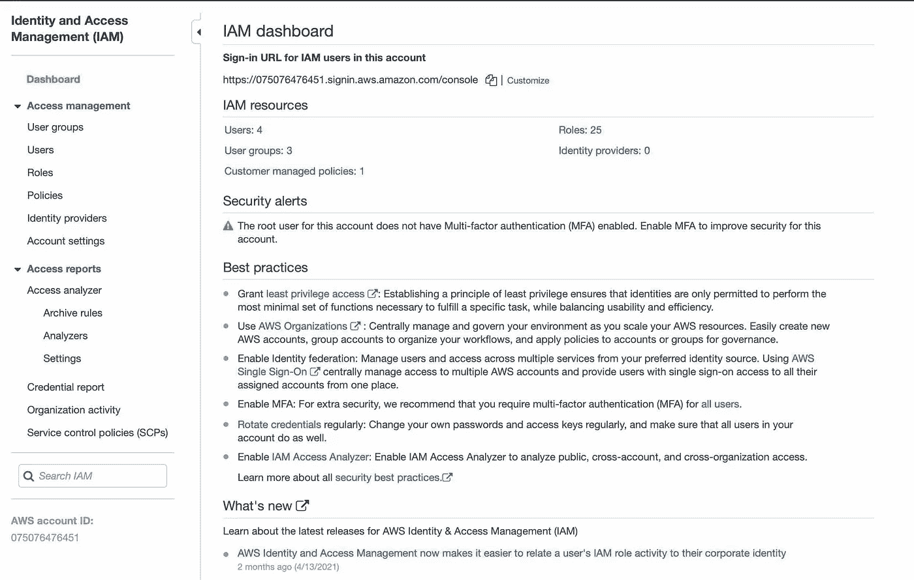

参考:AWS

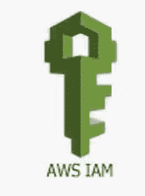

身份访问管理(IAM)是您进入机场登上航班触摸云之前的第一道防线和安全点！让我们更深入地研究一下第一个安全接触点。

**将涵盖哪些内容:**

我是什么？为什么我需要 IAM？您将如何访问它—工具？访问管理的一部分是什么？IAM 和合规管理？IAM 的好处？它是如何工作的？IAM 的进步？IAM 持有哪些认证？IAM 未实施的风险？实施 IAM 的挑战？如果我是管理员，我如何获得用户和使用和违规的报告？它是如何启用和禁用用户的？关键术语。

**认证和授权:**

IAM 是一个 Web 服务，可以帮助您安全地访问 AWS 资源。IAM 身兼数职，它的主要工作是“**认证**”和“**授权**”。

身份验证->登录/登入

授权->检查访问资源的权限

**认证:**

它是对试图访问“AWS 资源”的“主体”的身份进行确认的过程。

主体是可以对 AWS 资源执行操作的实体。主体可以是 AWS 用户，也可以是被授权登录 AWS 的联合用户，或者是附加了 IAM 角色的用户，或者是具有凭据的 AWS 应用程序。

IAM 是 AWS 验证这一原则进入云前提的第一个检查点。即。，使用有效的登机牌，您可以进入安检点，一旦完成，您就可以前往登机口。

IAM 支持多种形式的身份验证

1.用户名和密码

2.基于 MFA 的认证

3.AWS 密钥

4.访问密钥和会话令牌

5.单点登录

6.联合身份验证(AD | LinkedIn | FB | Google)

7.应用程序|处理登录

**授权:**

这是一个“许可”的过程，允许你访问你应该访问的“AWS 资源”。

每个用户都将拥有一组预定义的权限，这些权限可以是单独提供的，也可以是与某个角色相关联的。在更大的组织中，假设你有 5000 个资源——首先，你必须挖掘用户并给他们授权。

组织的 10 个不同 AWS 帐户。以下是作业的综合清单。

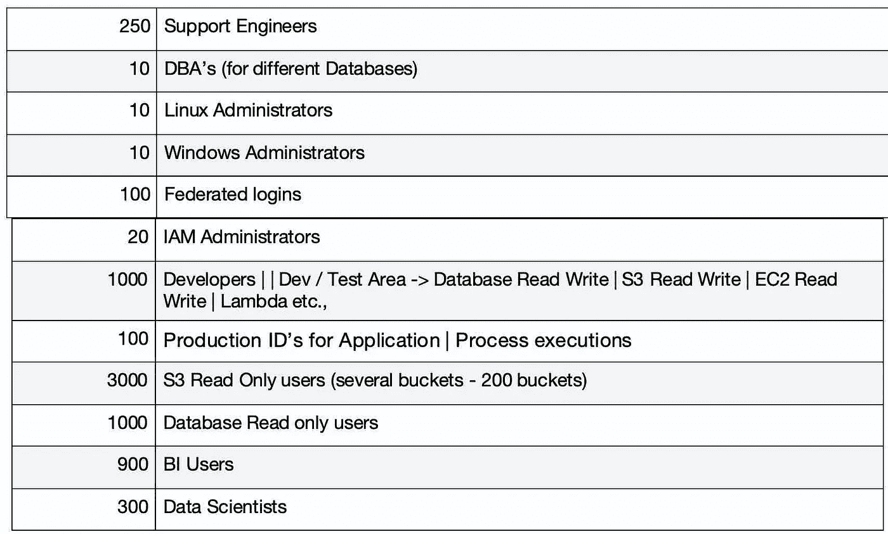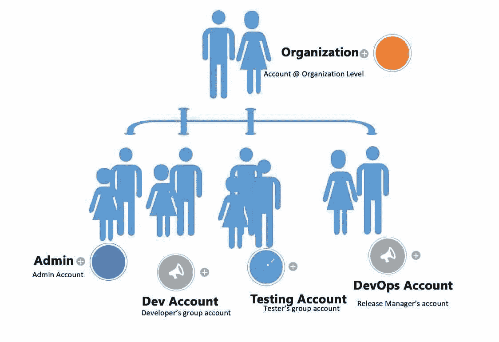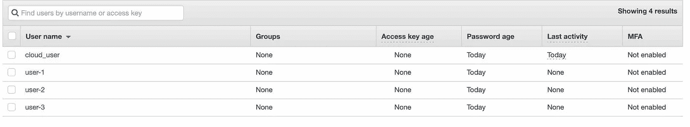

您创建组并将用户分配到这些组—使用 UI /编辑 JSON 文件。

对于上面的场景，你不能给单个用户分配“授权”，这个列表将是无穷无尽的。与任何其他工具一样，IAM 为您提供了创建“角色”的能力，这将使您能够定义权限，并允许您将这些权限作为角色附加到单个用户。因此，在创建角色之前，您需要做的第一个也是主要的活动是创建“主题或角色”——确定组织中的用户，并查看他们将需要什么样的访问权限。中小型企业需要 10- 20 个以上的职位，大型企业大约需要 150 个或更多(猜测)。

为了能够存储 employees | users，您将创建组，用户将从该组继承权限。

简单来说，它是这样工作的:**用户- >组- >策略- >角色**。

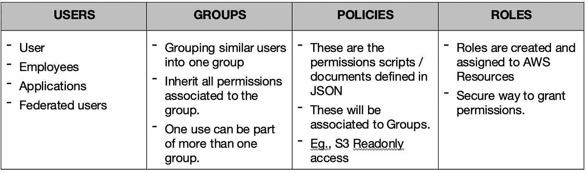

**IAM 功能**

1.  对 AWS 平台的集中控制
2.  共享访问您的 AWS 帐户
3.  粒度权限
4.  联合身份验证(AD | LinkedIn | FB | Google)
5.  密码轮换策略
6.  基于令牌的临时登录
7.  支持兼容的 PCI DSS

**工具执行**

为了执行所需的操作，IAM 提供了一套标准的工具，用于密码管理、定义和附加角色、创建和删除用户等。,

对于管理员和，只需使用 Root ID 访问 AWS 控制台登录。创建用户。

**合规和 IAM:**

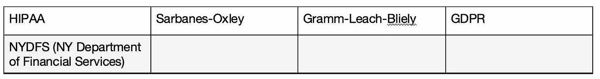

**IAM 是如何实现的**

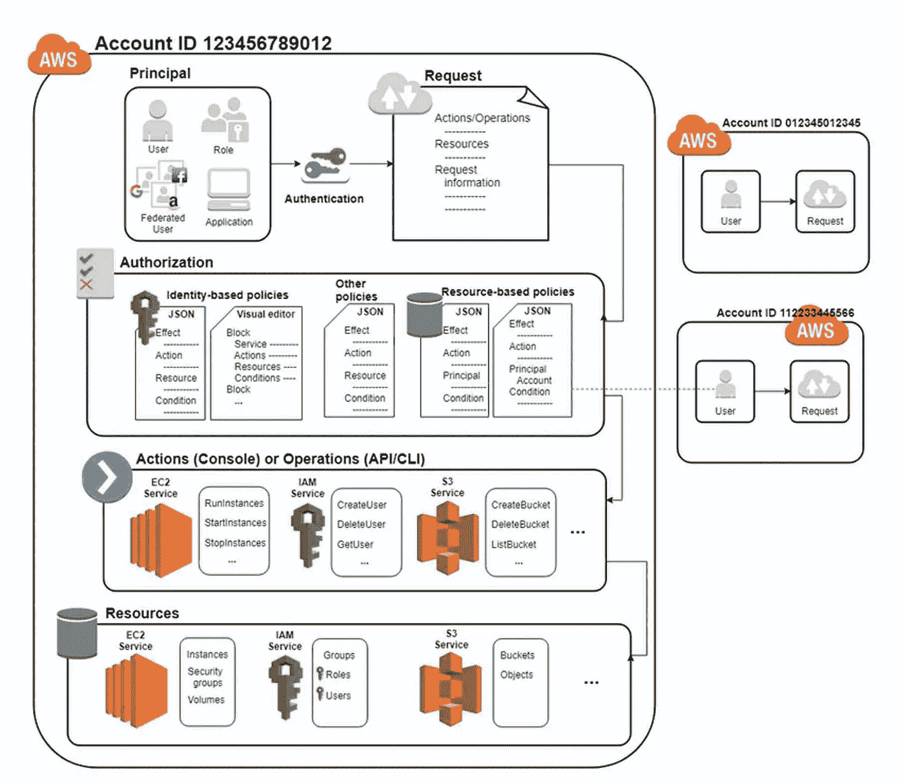

参考:AWS

**关键词:**

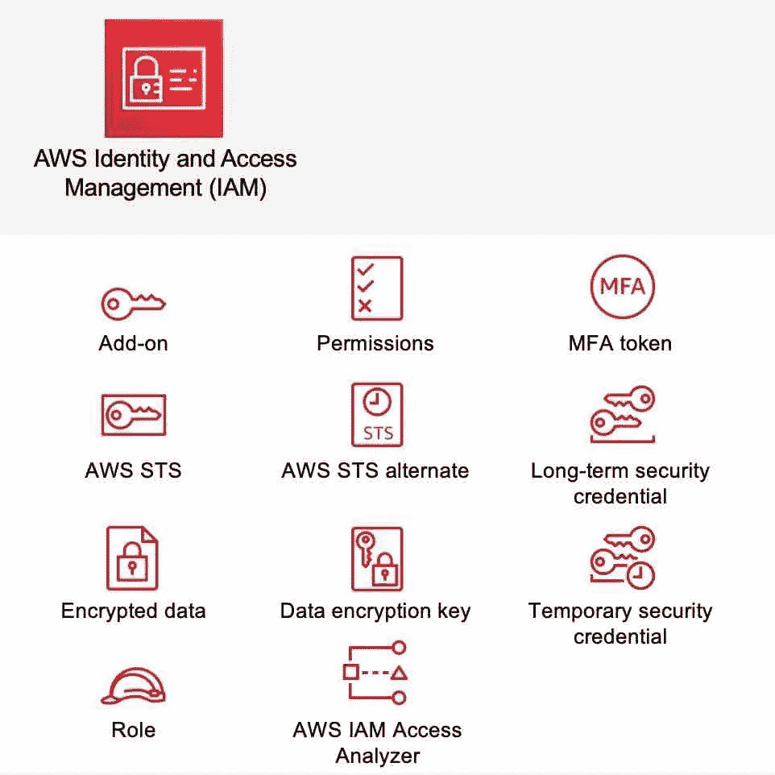

1.  存取管理
2.  活动目录
3.  生物认证
4.  环境感知网络访问
5.  取消资源调配
6.  数字身份
7.  权利
8.  身份生命周期管理
9.  身份即服务(IDAAS)
10.  轻型目录访问协议(LDAP)
11.  多因素身份认证(MFA)
12.  特权账户管理
13.  基于风险的身份认证(RBA)
14.  安全主体
15.  单点登录(SSO)
16.  用户行为分析

**IAM 厂商:** Okta | Atos | OneLogin 等。

**IAM 和 AWS 服务:**我们将会看到如何使用 IAM 组/策略/角色。

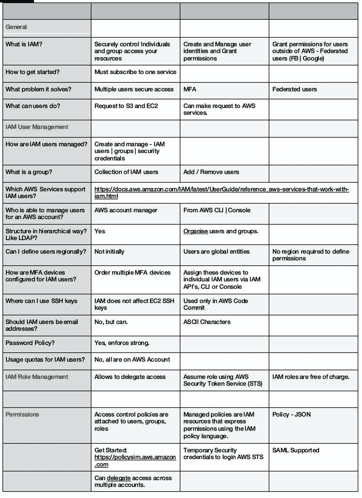

# **认知到:**

这是唯一的认证方式吗？嗯，Amazon Cognito 不是在 AWS 服务上而是为 AWS 服务 ie 处理认证。，用于您构建的 Web 应用程序和移动应用程序。它做两件事

1.处理认证

2.数据存储在本地，供以后脱机同步

有两个关键组件

1.用户池:用户池是用户目录，提供注册和登录选项。

2.身份池:允许您授予用户对其他 AWS 服务的访问权限。它用于存储用户身份。

为您的 web 和移动应用程序提供授权、认证和用户管理。

简单的用户身份和数据同步服务，帮助您安全地管理和同步移动设备上用户的应用数据

可以使用社交登录(FB 或 Google)创建唯一身份，并支持未经授权的客人

**AWS 定义**

Amazon Cognito Federated Identities 是一个 web 服务，它向移动设备和其他不受信任的环境提供限定范围的临时凭证。它唯一地标识设备，并在应用程序的整个生命周期中为用户提供一致的身份。

使用 Amazon Cognito 联合身份，您可以启用一个或多个第三方身份提供商(脸书、谷歌、登录 Amazon 或登录 Apple)或 Amazon Cognito 用户池的身份验证，您还可以选择支持来自您的应用程序的未经身份验证的访问。Cognito 为每个用户提供一个惟一的标识符，并充当 OpenID 令牌

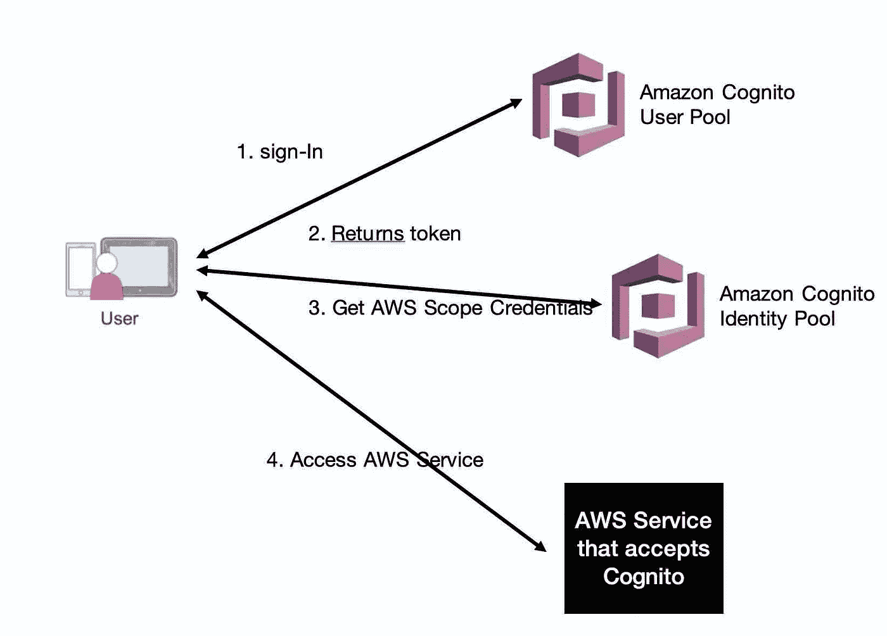

**添加注册和签到**

借助 Cognito 用户池，您可以轻松、安全地将注册和登录功能添加到您的移动和 web 应用中，这是一项完全托管的服务，可扩展至支持数亿用户。

**授权您的用户访问 AWS 服务**

通过 Cognito 身份池，您的应用程序可以为匿名访客用户或已登录的用户获取访问 AWS 服务的临时凭据。

# MasterofFineArts 美术硕士

为了提高安全性，配置多因素身份验证(MFA)有助于保护您的 AWS 资源。MFA 必须设置为 IAM 的一部分，这是重要 IAM 配置的 5 个清单之一。

什么是 MFA？

*   虚拟 m4a 设备
*   U2F 安全密钥
*   硬件 MFA 设备
*   基于 SMS 文本消息的 MFA

停用 MFA 设备—如果您以 IAM 用户身份登录多因素身份验证(MFA)设备时遇到问题，请联系您的管理员寻求帮助。

配置 MFA 保护的 API 访问—使用 IAM 策略，您可以指定允许用户调用的 API 操作。在某些情况下，您可能需要额外的安全性，要求用户使用 AWS 多因素身份验证进行身份验证

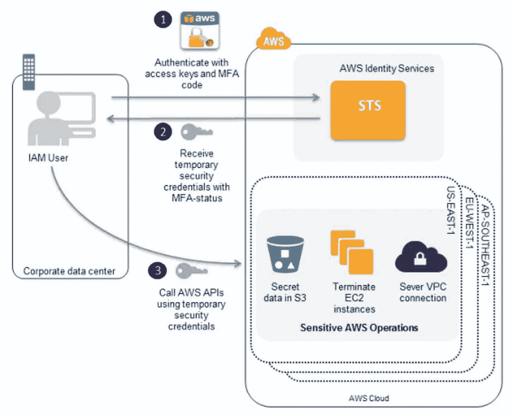

参考:AWS

**AWS 单点登录**

集中管理对多个 AWS 帐户和业务应用程序的访问，并为用户提供从一个位置对其分配的所有帐户和应用程序的单点登录访问

跨客户的 AWS 组织。

集中维护和配置所有必要的账户配置

您可以创建和管理 AWS SSO 的身份存储

*   优势
    通过 SSO 集中管理访问权限
    在 AWS SSO 中创建用户或连接到您现有的身份系统在一个位置访问帐户和应用程序
    易于使用

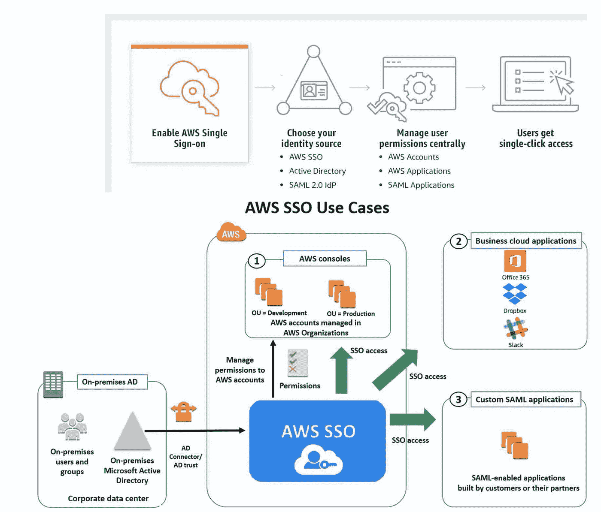

参考:AWS

## 参考拉克什米·文卡特什的文章

上一篇文章:[安全路线图。](https://luxananda.medium.com/aws-series-2-cloud-security-roadmap-c53df433a243)

母篇: [AWS。系列。](/nerd-for-tech/aws-series-multi-part-series-on-aws-cloud-and-related-guidelines-c7c2437f1639)