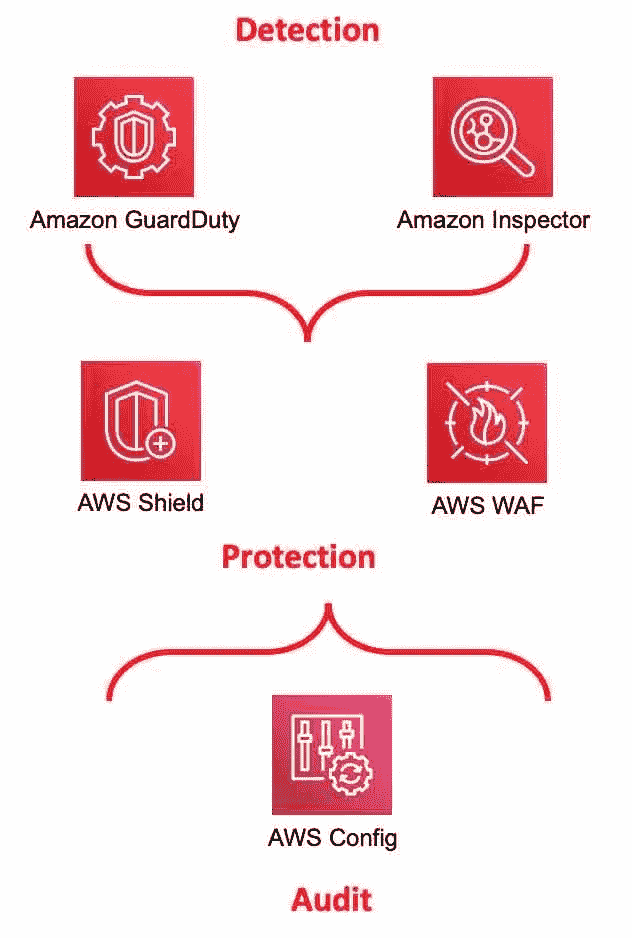
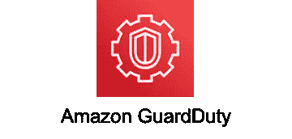
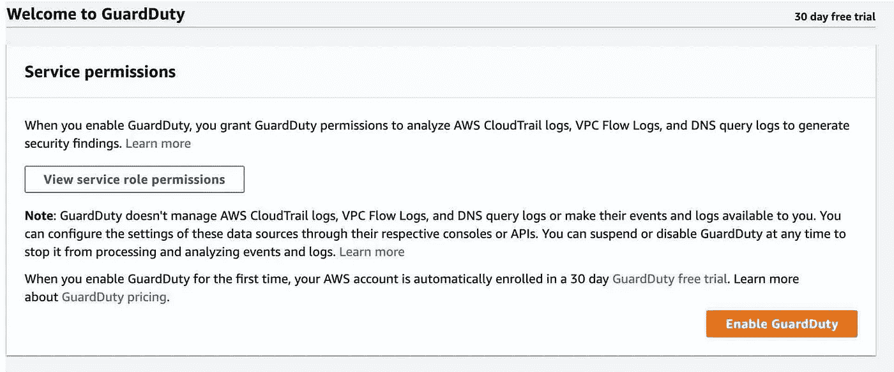
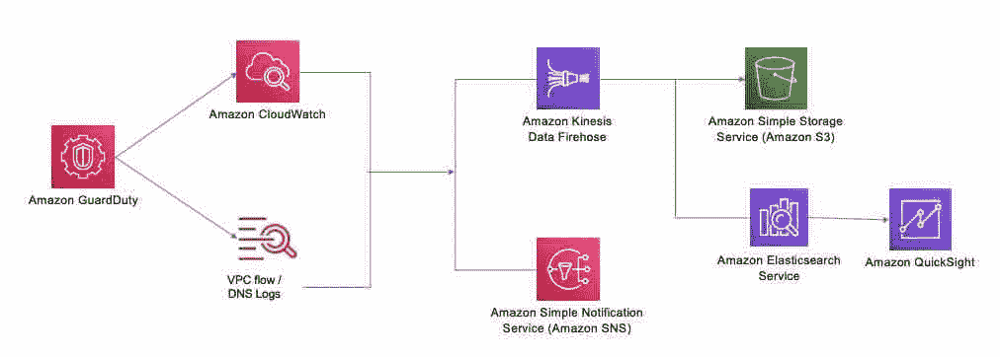
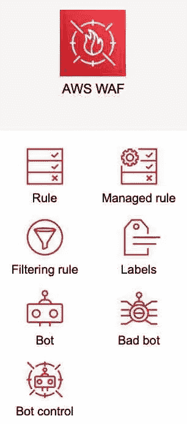
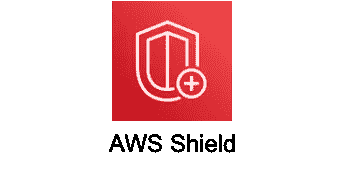
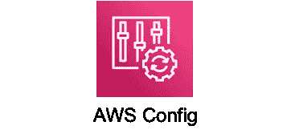
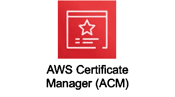
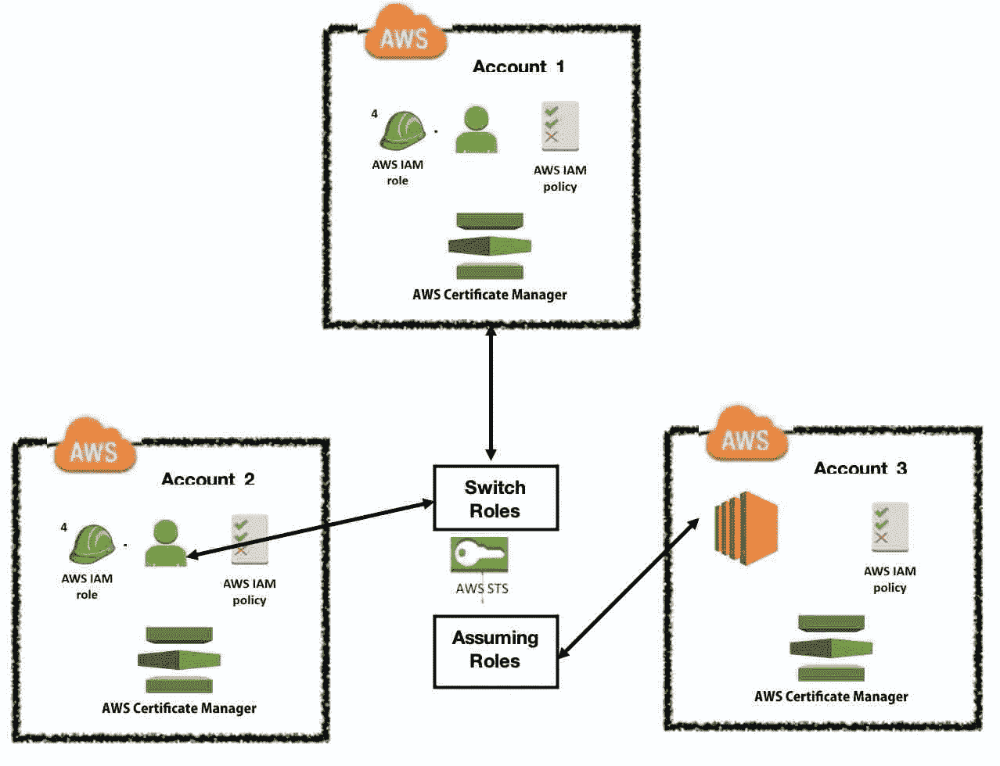

# AWS 系列#2: AWS 安全层—网络和 Web 应用程序检测和保护

> 原文：<https://medium.com/nerd-for-tech/aws-series-2-deep-dive-aws-security-layer-network-web-apps-a629f60631ef?source=collection_archive---------4----------------------->

# **AWS 守卫职责:**

**Guard Duty 是一种智能威胁检测，用于保护您的 AWS 帐户、工作负载和数据(存储在 AWS S3)** 。**它不是一种防御机制，而是一种检测，使其他服务能够保护，如 Shield 或 WAF。**它不影响性能，因为它独立于其他服务运行，并且不作为关键路径中服务的一部分运行。这不是免费服务，费用取决于您想要分析的所有日志和数据点。每个组织都应该有一个清晰的体系结构来收集日志，实现智能威胁检测，并有一个适当的机制来读取日志并将摘要发送给有权处理该信息的相关人员，并且必须将清晰的管理摘要发送给最高管理层。守卫任务必须始终启用，并且不得关闭—如果启用并运行，守卫任务将持续分析日志(请参考下面的日志类型),并且可以使用 Kibana / Splunk /任何其他 ML 算法进一步分析日志。

守卫职责支持 3 C

*   **持续** - >持续监控您的 AWS 环境，并就任何恶意活动向您发出警报。
*   **综合** - >分析多个数据源，包括云试验事件和 VPC 日志流。
*   **可定制** - >通过添加自己的威胁列表和可信 IP 地址进行定制。

你可以简单地启用守卫任务。

警卫值班可持续监控的数据来源:

1.  VPC 流量测井
2.  DNS 日志
3.  事件日志
4.  AWS 云试用 S3 事件日志
5.  AWS 云试用管理事件日志等。

它还找出并列出恶意 IP 地址和域或任何未授权用户的意外访问者，以及您/您的组织的 AWS 环境中可能发生的任何恶意活动，如 EC2 实例或 API 调用等。

## 日志分析:

亚马逊守卫职责调查结果可以使用 Kibana 或任何 ML 算法进行分析。

收集不同类型的日志很好，但这只是输入，您如何利用这些输入来获得洞察力、识别威胁并进而改善您的安全协议非常重要。每个组织都必须有内部和/或基于产品的日志分析，以提供可操作的见解和摘要。负责组织安全的团队必须建立实时日志分析，并应具备清晰的威胁检测算法和向最高管理层和相关机构的自动报告。这些算法不是写一次就能一直运行的，它需要不断改进。这种有效的日志分析是提高组织安全架构的有效方法。

1.  [基巴纳测井分析(ELK 堆栈)](https://www.elastic.co/logstash)
2.  [Splunk 日志分析](https://splunkbase.splunk.com/app/3790/)
3.  [数据狗日志分析](https://www.datadoghq.com/product/log-management/)
4.  [用于日志分析的 AWS ElastiSearch 解决方案](https://aws.amazon.com/log-analytics/)

以上不是唯一的列表，还有几个产品和服务涵盖了支持有效监控和消息传递并提供可操作见解的多云日志分析。

# **AWS 网络应用防火墙(WAF):**

WAF 是一个网络应用防火墙。它**有助于保护您的 web 应用程序**或 API 免受常见的 web 攻击，这些攻击可能

*   影响可用性
*   危害安全
*   消耗过多的资源

通过启用阻止常见攻击模式的安全规则，您可以控制到达应用程序的流量，这些攻击模式包括

- SQL 注入

-跨站点脚本。

-将定义的模式过滤为规则

managed WAF 的管理规则，由 AWS 或 AWS marketplace 卖家管理的一组预先配置的规则。WAF 的管理规则解决了 OWASP 十大安全风险等问题。AWS WAF 按使用量付费基于配置的规则数量。

也可以作为 CloudFront CDN 解决方案的一部分进行部署，CloudFront CDN 解决方案是一种应用程序负载平衡器，可以保护您的 web 服务器或运行在 EC2、Amazon API 网关上的源服务器。

如上图所示，AWS WAF 保护 web 应用程序免受常见的 web 攻击。在 5 分钟内为 Amazon CloudFront 发行版、应用程序负载平衡器和/或 Amazon API Gateway stages 设置保护。

**主要优势:**

*   针对 Web 攻击的敏捷防护
*   **如果攻击者进入服务器并破坏服务器，WAF 会处理。如果攻击者以暴力的方式使服务器过载，DDoS 的目的是让服务器瘫痪，那么 SHIELD 就是你的防御手段。**
*   可与 AWS CloudWatch 集成
*   可以在非 AWS 托管的网站上使用
*   AWS WAF Bot 针对 Bot 流量提供保护
*   使用托管规则节省时间
*   提高网络流量可见性
*   易于部署和维护
*   可以部署在不同的服务上，如 CloudFront (CDN)、应用负载平衡器(ALB)、API 网关、AppSync 等。
*   AWS WAF 符合 HIPPA 标准
*   基于不同点的基于速率的规则(速率限制算法)可以配置为 WAF 的一部分，同样可以用于 DDoS。
*   CDN 自定义错误页面可以通过 WAF 进行配置
*   快速配置和管理 WAF 规则
*   WAF 的实时指标存储在 Amazon CloudWatch 上，您可以配置到期策略

**WAF 中的相关服务:**

*   AWS Shield Advanced —受管分布式最终服务(DDoS)保护服务，可保护在 AWS 上运行的应用程序。
*   AWS 驱动程序—使用驱动程序存储由 web ACLs 分析的请求的完整日志，以进行进一步分析。
*   AWS 防火墙管理器—安全管理服务，允许您集中配置和管理防火墙规则。
*   AWS CloudWatch —使用 CloudWatch 以日志、指标和事件的形式收集监控和操作数据。

# AWS 盾

AWS Shield 管理 **DDoS 保护**(分布式拒绝服务)保护。用于保护在 AWS 上运行的应用程序的服务。AWS Shield 提供始终在线的检测和自动内联缓解措施，可最大限度地减少应用程序宕机和延迟。**如果攻击者进入服务器并中断服务器，WAF 将负责处理。如果攻击者以蛮力的方式让服务器过载，DDoS 就会重点摧毁这些服务器——SHIELD 就是你的防御手段。**

***两层 AWS 屏蔽***

1.  标准
2.  先进的

***AWS 屏蔽标准:***

*   提供网络和传输层保护
*   免费自动保护
*   抵御针对您的网站或应用程序的最常见、频繁发生的网络和传输层 DDoS 攻击。
*   与 CloudFront 或 53 号公路一起使用时提供全面保护。

***AWS 盾高级:***

*   对于 EC2，ELB，CloudFront，全球加速器，53 号公路
*   标准+针对大型和复杂 DDoS 的额外检测和缓解响应时间(DRT)和
*   针对 Amazon EC2、ELB、CloudFront、AWS 全球加速服务和 Amazon 53 路由更改中与 DDoS 相关的峰值提供保护。
*   可在全球所有 Amazon CloudFront、AWS 全球加速器、Amazon 53 路由边缘位置获得。

# AWS 检查员

AWS 检查器是另一种检测机制，可帮助分析运行的操作系统实例上的任何已知漏洞。它会尝试针对非预期的网络访问进行检测。由于它会主动检测 OS 实例，因此无论它用作应用程序服务器、web 服务器还是数据库服务器，都必须将它安装在正在运行的实例(如 EC2 实例)上。

# AWS 配置:

根据对检测(守卫职责、AWS 检查员)和保护(AWS 屏蔽、AWS WAF)的讨论，审核并记录 AWS 服务和资源的合规性调查结果势在必行。没有拒绝规则，因此 AWS 配置并不禁止您执行任何操作，但是，它只是审核，以便其他保护和检测服务可以使用它。

# ACM- AWS 证书管理器

当您发布 AWS 网页或者将数据从一个云提供商传输到另一个云提供商，或者将数据从 ETL 传输到数据库时，您必须通过安全的通道来完成。公认的行业标准认证之一是公共/私有 SSL / TLS X.509 认证。AWS 的证书管理器使您能够使用证书管理器续订或升级证书，它充当一站式服务，而不是在需要时去提供商那里续订证书。ACM (AWS 证书管理器)可以跨帐户、单个或多个域名、通配符域或它们的组合工作。ACM 通配符证书可以保护无限数量的子域。您可以导出私有 ACM 证书和 ACM 密钥，并在任何地方使用它们。

它提供两种服务:

1.  AWS 证书管理器(ACM) —适用于需要安全 web 访问的客户。
2.  ACM 私有 CA —为企业客户构建公钥

简而言之，ACM 使您能够**提供、管理和部署 SSL / TLS 证书**。

***用法 1:启用 ACM 到您的网站***

参考:AWS

***用法 2:在多账户环境中使用 ACM***

**STS 在这里的作用是什么:**

AWS 安全令牌服务(STS)是一种 web 服务，使您能够请求

(1)临时性

(AWS 身份和访问管理(IAM)用户或您验证的用户(联合用户)的有限权限凭证。

ACM 与 STS 一起工作。

主要优势:

1.  使您能够提供私有和公共 SSL
2.  私有、公共、导入的证书都是可能的。所有证书都受到安全保护。
3.  无需手动处理续订—直接使用 ACM，续订可以在 AWS 内部进行。
4.  使用 ACM 非常简单——只需启用并请求 SSL / TSL 证书。
5.  您可以将 ACM 与多个 AWS 服务配合使用，如弹性负载平衡器(ELB)、CloudFront (CDN)、API Gateway、Elastic Beanstalk、CloudFormation 等。
6.  颁发证书前的 DNS 或域验证。
7.  同一证书可以跨多个证书使用。
8.  您可以使用 lambda 来检查和验证证书，并在 AWS 中进行更新。

参考 [AWS 多部分系列文章](/nerd-for-tech/aws-series-multi-part-series-on-aws-cloud-and-related-guidelines-c7c2437f1639)。