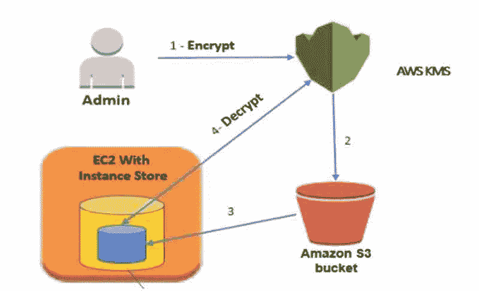
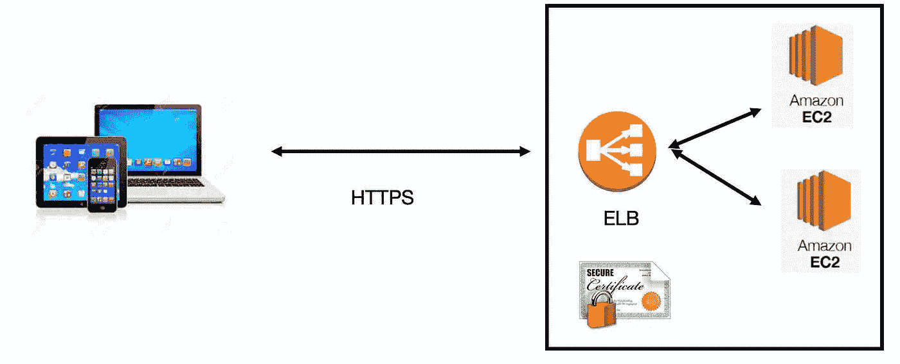
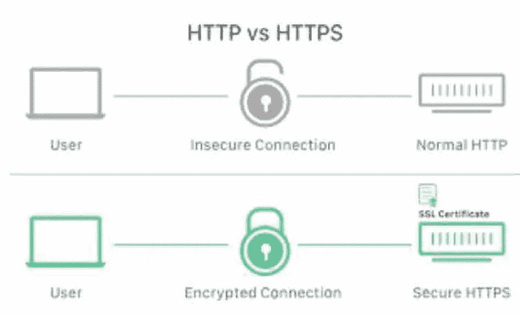
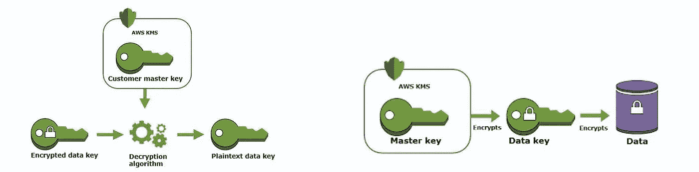
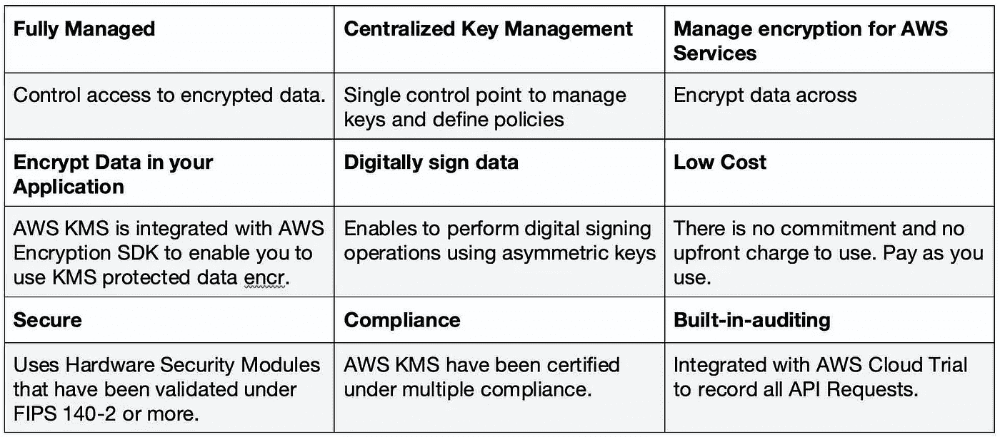

# AWS 系列#2:安全层—数据

> 原文：<https://medium.com/nerd-for-tech/aws-series-2-security-layer-data-bb97789e8cb?source=collection_archive---------11----------------------->

# 数据:静态加密(针对 EBS/EFS 卷、加密、S3 证券交易所)、传输加密、KMS TDE(CMK)

# ***加密静态数据***

您可以创建一个加密的文件系统，这样您的所有数据和元数据都将在静态时使用行业标准的 AES-256 加密算法进行加密。加密和解密是自动和透明地处理的。加密和解密是自动和透明地处理的，因此您不必修改您的应用程序。

参考:AWS

**1。** **管理键**

1.亚马逊 EFS 对管理加密文件系统的加密密钥的 AWS KMS 感兴趣。

2.亚马逊 EFS 使用 XTS 模式的高级加密标准算法和 256 位密钥(XTS-AES-256)。

3.AWS KMS 以加密格式将您的主密钥存储在高度耐用的存储器中

4.使用加密的亚马逊 EFS 文件系统对于安装文件系统的客户端是透明的。

5.AWS。KMS 密钥策略控制对加密密钥的访问

**2。** **创建加密文件系统**

1.AWS 管理控制台、AWS CLI、亚马逊 EFS API 或 AWS SDKs。

**3。** **使用加密文件系统**

1.加密对 I/O 延迟和吞吐量的影响极小。加密和解密。对用户、应用程序和服务是透明的。

**4。** **对静态数据实施加密**

1.您的组织可能需要对符合特定分类或与特定应用程序、工作负载或环境相关的所有数据进行加密。

**5。** **检测未加密文件系统**

1.创建一个 Amazon CloudWatch 警报来监控 CreateFileSystem 的 CloudTrail 日志。

*   对于法规遵从性至关重要，可确保没有有效密钥的任何用户/应用程序都无法读取保存在磁盘上的敏感数据
*   一些法规遵从性要求，如 PCI DSS 和 HIPAA(主要是个人信息),要求静态数据在其整个生命周期内进行加密。
*   为此，AWS 提供静态数据选项和密钥管理来支持加密过程。
    例如，加密 EBS 卷
*   使用 AES-256 加密为服务器端加密(SSE)配置 S3 存储桶
*   RDS 支持透明数据加密(TDE)
*   默认情况下，实例存储(临时存储)不加密
*   AWS Glue、RDS 和多种其他服务支持静态加密。
*   基于 Linux 的加密
*   磁盘和文件系统加密
*   Linux dm-crypt 基础设施
*   管理密钥——亚马逊 EFS 与 KMS 整合，管理加密文件系统。
*   AWS KMS 还支持其他 AWS 服务的加密，例如
*   亚马逊简单存储(AWS S3)
*   亚马逊弹性块存储(EBS)
*   亚马逊 RDS
*   亚马逊极光
*   亚马逊红移
*   亚马逊工作邮件
*   亚马逊工作区等。,
*   使用亚马逊高级加密标准算法，XTS 模式，256 位密钥(XTS-AES-256)
*   3 个重要问题
*   钥匙存放在哪里？
*   钥匙用在哪里
*   谁能使用钥匙
*   您可以使用 AWS 管理控制台、CLI、EFS API 或 SDK 创建加密的文件系统
*   加密对 I/O 延迟和吞吐量的影响极小
*   通过 Amazon cloudwatch alarm 监控 CreateFileSystem 的 CloudTrial 日志

# **传输中的加密**

您可以装载一个文件系统，以便使用传输层安全性 1.2 (TLS，以前称为安全套接字层[SSL])和行业标准 AES-256 密码对传输中的所有 NFS 流量进行加密。TLS 是一组行业标准加密协议，用于加密通过网络交换的信息。

*   AWS 为移动数据提供安全套接字层(SSL)
*   您可以安装一个文件系统，以便使用具有 AES-256 加密的行业标准的 TLS 对传输中的所有 NFS 流量进行加密。
*   您可以使用 AWS Glue 中的安全配置为爬网程序、ETL 作业和开发端点配置加密设置。
*   您可以通过 Glue catalog 中的设置启用 AWS Glue catalog 加密。
*   如果您的组织受制于要求在传输过程中对数据和元数据进行加密的公司或法规政策，建议在访问文件系统的每个客户端上设置传输加密。

**SSL/TLS:**

参考:AWS

SSL 代表安全套接字层(SSL) —确保互联网连接安全可靠

避免中间人攻击

加密客户端和服务器之间的数据，使其无法读取 TLS

传输层安全性(TLS)是 SSL 证书的更新和更高级版本

SSL 和 TLS 是用于在联网计算机之间建立认证的
和加密的连接的协议。
·一个密钥对——由私钥和公钥组成

*   私钥—保持安全

公钥—通过证书广泛分发

任何传输中的数据都由 SSL 保存。它不是特定的，而是 HTTPS 的嵌入式服务。

# **透明数据加密**

*   Amazon RDS 支持使用 TDE 来加密运行 MS SQL / Oracle 的数据库实例上存储的数据
*   TDE 会在数据写入存储之前自动加密数据，并在从存储中读取数据时自动解密数据。
*   在 RDS 选项组中指定 TDE
*   TDE 用于需要加密敏感数据的场景
    ，是一个持久选项。
*   性能将受到 TDE 的影响。即使加密了一个数据库，未加密数据库的性能也会降低。

# 密钥管理服务(KMS)

密钥管理服务(KMS)的主要功能是使创建“**加密密钥**”变得容易，并控制它们在应用程序中的各种 AWS 服务中的使用。切记这是重要的“**数据加密**策略之一。

参考:AWS

*好处:*

*   AWS 密钥管理服务使您可以轻松创建加密密钥，并在应用程序中的各种 AWS 服务中控制它们的使用。
*   这是一项安全且有弹性的服务，它使用已通过 FIPS 140–2 验证或正在验证的硬件安全模块来保护您的密钥
*   与 AWS CloudTrial 集成，为您提供所有密钥使用的日志，以帮助满足您的监管和合规需求。

# 数据丢失防护(DLP): Amazon Macie

亚马逊 Macie 是一项数据隐私和安全服务。它使用 AI / ML 算法和模式匹配来发现和保护敏感数据。它使用简单，可以很容易地启用。报酬基于 S3 存储桶的数量和贵组织处理的数据量。它帮助您识别/检测敏感数据类型，包括 PII(个人身份信息，如姓名、信用卡号等。)从海量的数据中。在不断增长的 PII 列表中识别新模式和信息的挑战是通过部署在 Macie 中的高效机器学习算法实现的。由于它是完全托管的，组织只需要使用它来识别和保护敏感的海量数据。Macie 可以发送警报和/或发现，可以通过 aWS 管理控制台直接搜索和过滤，并发送到 Amazon event bridge/cloud watch events。

好处:

1.  从大量数据中检测敏感数据
2.  数据安全状况的可见性
3.  易于设置和管理，因为它是自我管理的。

母商品: [AWS 多件系列](/nerd-for-tech/aws-series-multi-part-series-on-aws-cloud-and-related-guidelines-c7c2437f1639?source=your_stories_page-------------------------------------)，