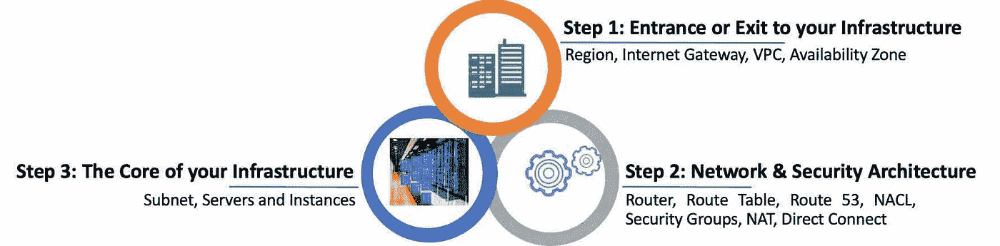

# AWS 系列# 3:3 步基础架构和网络层

> 原文：<https://medium.com/nerd-for-tech/aws-series-3-the-3-step-infrastructure-network-layer-6564287dc5f7?source=collection_archive---------3----------------------->

# **基础设施&网络层**

一旦定义并实施了安全路线图，下一个合乎逻辑的步骤就是设置基础设施和网络层。一旦设置好了，就万事俱备了。该层可以设置为一个 3 步流程

3 步基础设施和网络层

## 步骤 1:基础设施的网关