# AWS 系列:关于 AWS 云及相关指南的多部分系列

> 原文：<https://medium.com/nerd-for-tech/aws-series-multi-part-series-on-aws-cloud-and-related-guidelines-c7c2437f1639?source=collection_archive---------3----------------------->

在这个由多个部分组成的 AWS 系列中，我打算用简单的术语涵盖 AWS 的一般方面、云的业务案例、一些必要的深入探讨、迁移策略、AllOps、设计框架的安全性、参考体系结构和/或演示等。我正在建立一个多层的乐高积木方法(结合 OSI / TCP/IP 层),并将在对这些乐高积木进行分类后添加几个参考架构(用于 Web、批处理、移动、数据湖、大数据、机器学习等)。在此过程中，我还将讨论不同规模的组织对云的采用，构建可扩展的云，以及如何最好地使其持久，同时将其扩展到与其他云提供商的交流，以实现组织对基于聚合云/多云的采用。

***层:***

我采用分层方法来设计 AWS 云。这些层基本上分为 4 组:( 1)必备堆栈;( 2)输入堆栈;( 3)处理堆栈;( 4)输出堆栈。

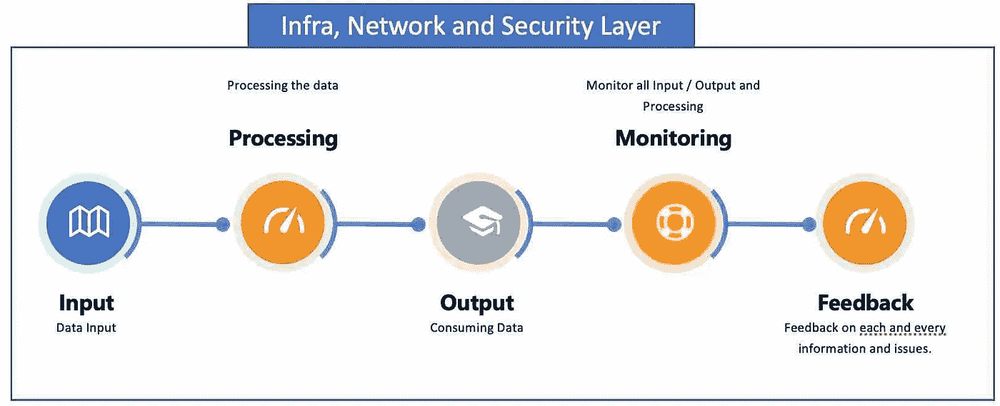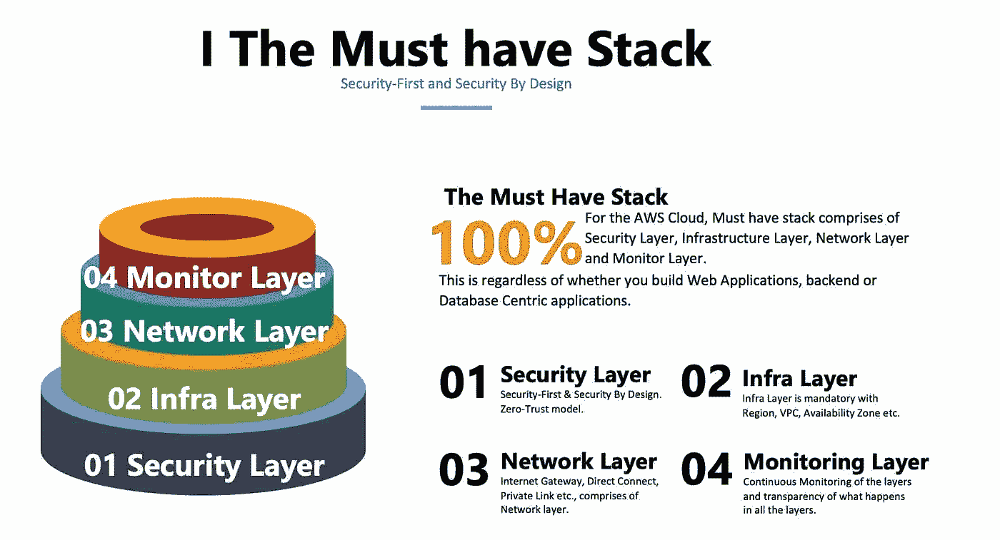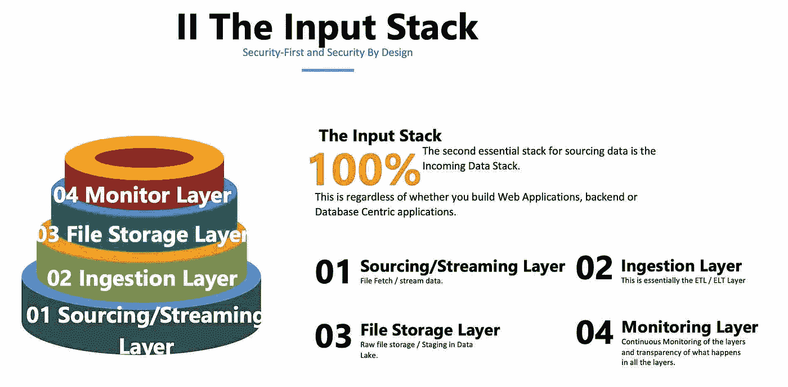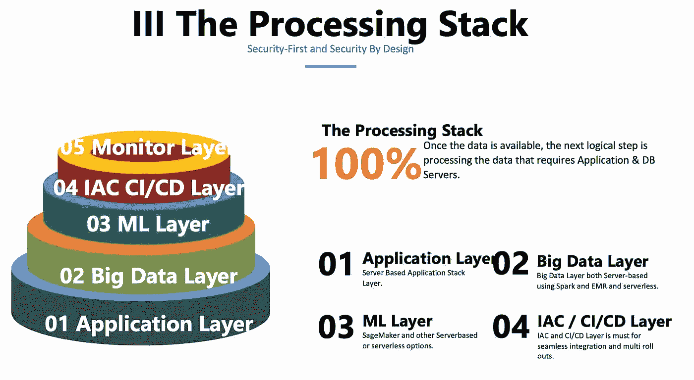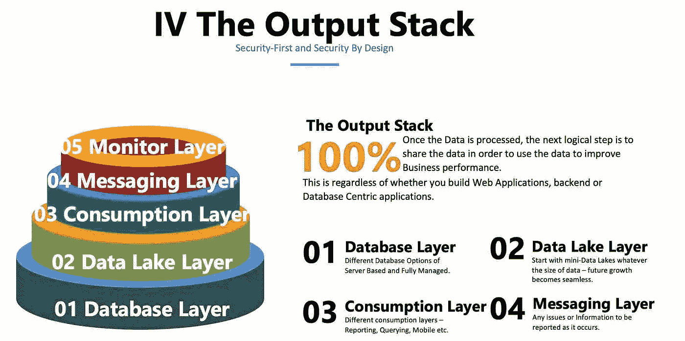

AWS 云系列包括松散映射到 OSI 层的。

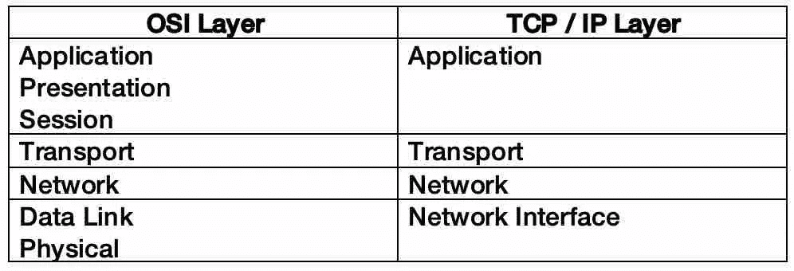

OSI 和 TCP / IP 层

# **第一部分**:云模型

## 1.了解并深入探究云模型

**型号:** IAAS / PAAS / SAAS /无服务器

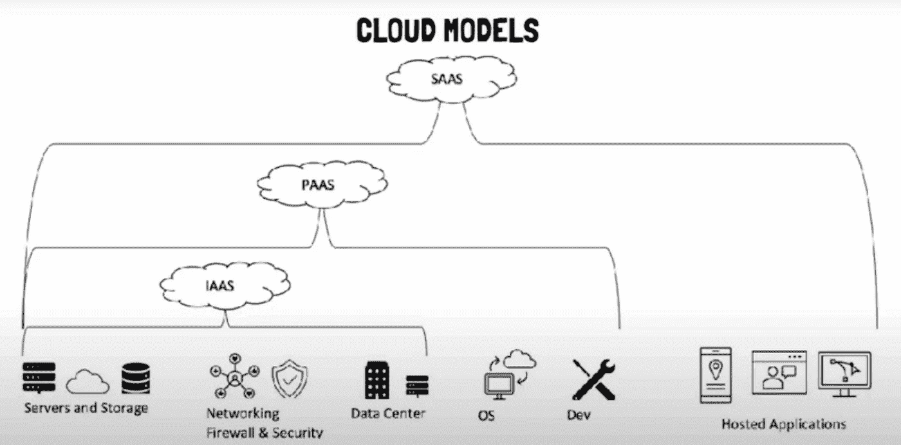

**部署模式**:公有云、聚云、多云、私有云、混合云、第三方专用数据中心、共享云服务。

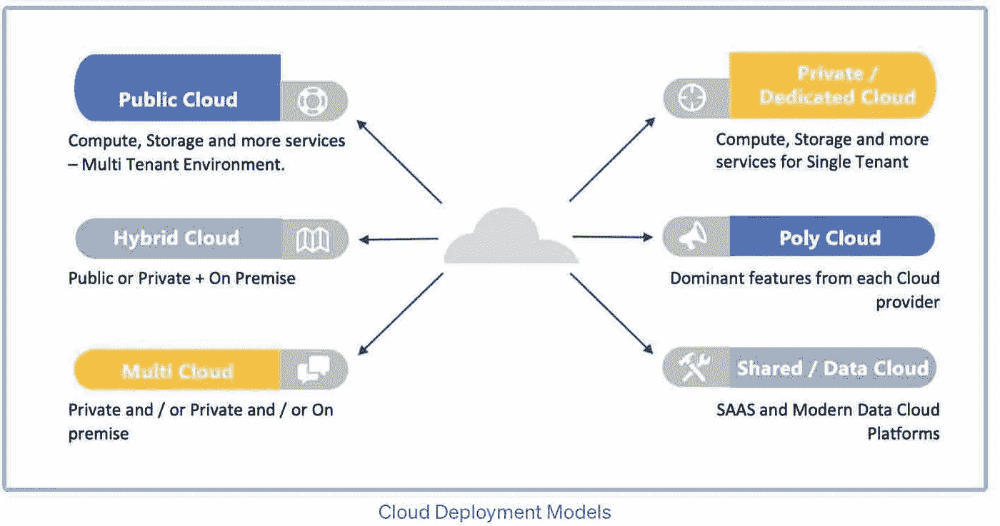

## 2.各种云模型的主要区别

## 3.不同云模型的迁移、SLA 和允许

## 4.为云提供业务案例，以及为什么它很重要？

> *链接到文章的第 1 部分:*
> 
> [**云模型**](/nerd-for-tech/1-cloud-series-the-iaas-paas-saas-8faa46124722?source=your_stories_page-------------------------------------)
> 
> [**业务案例为云**](/nerd-for-tech/aws-series-1-business-case-for-cloud-how-to-pitch-to-your-management-and-why-is-it-important-pa-8c6d42b30a8b?source=your_stories_page-------------------------------------)
> 
> **云部署模式(**[**part 1**](/nerd-for-tech/aws-series-1-cloud-deployment-models-public-private-poly-multi-cloud-part-1-d405a94d5d1a?source=your_stories_page-------------------------------------)**&**[**part 2**](/nerd-for-tech/aws-series-1-cloud-deployment-models-public-private-poly-multi-cloud-part-2-995f9a03c9e?source=your_stories_page-------------------------------------)**)**
> 
> **AWS 云迁移(******&**[**迁移**](https://luxananda.medium.com/aws-series-1-migration-ffc2363a6419?source=your_stories_page-------------------------------------) **)****

# **第 2 部分:安全层**

**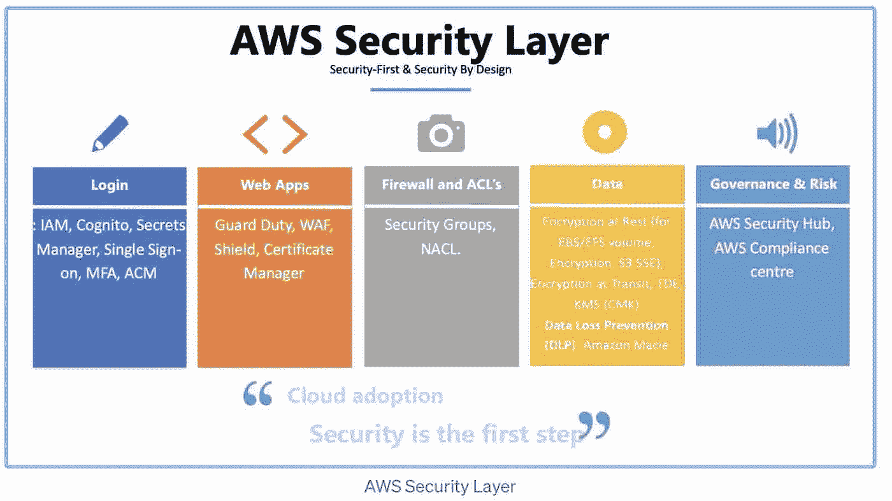**

**本节讨论以下内容**

## **1.对安全架构的理解和深入探究**

****登录** : IAM，Cognito，Secrets Manager，单点登录，MFA，ACM**

****网络应用**:守卫职责、WAF、盾牌、证书管理器**

****数据**:静态加密(针对 EBS/EFS 卷、加密、S3 上证)、传输中加密、KMS TDE(CMK)**

****防火墙/ACL:**安全组，NACL。**

****数据丢失防护(DLP)** :亚马逊 Macie**

****治理&风险** : AWS 安全中心、AWS 合规中心**

## **2.如何为您的组织构建安全设计框架和安全第一的方法。**

**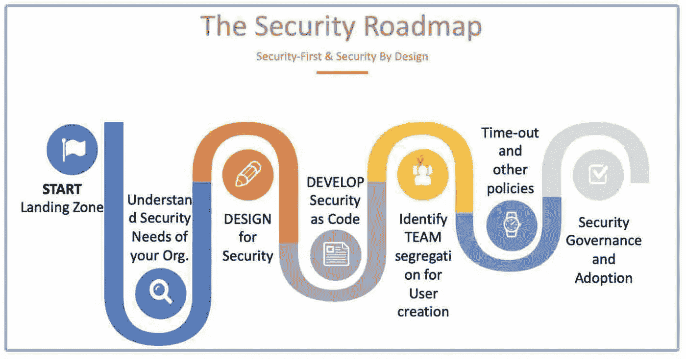**

## **3.组织需要多少安全层**

> **链接到文章的第 2 部分:**
> 
> **[AWS 系列#2:云安全路线图](https://luxananda.medium.com/aws-series-2-cloud-security-roadmap-c53df433a243?source=your_stories_page-------------------------------------)**
> 
> **[AWS 系列#2: AWS 安全层—登录](https://luxananda.medium.com/aws-series-2-deep-dive-aws-security-layer-login-cdf48a7d2e3c?source=your_stories_page-------------------------------------)**
> 
> **[AWS 系列#2: AWS 安全层—网络& Web](/nerd-for-tech/aws-series-2-deep-dive-aws-security-layer-network-web-apps-a629f60631ef) 应用**
> 
> **[AWS 系列#2: AWS 安全层—数据](/nerd-for-tech/aws-series-2-security-layer-data-bb97789e8cb)**
> 
> **[AWS 系列#2: AWS 安全层—防火墙](https://luxananda.medium.com/raws-series-2-security-layer-firewall-15432b8d63e)**

# **第 3 部分:基础设施和网络层**

**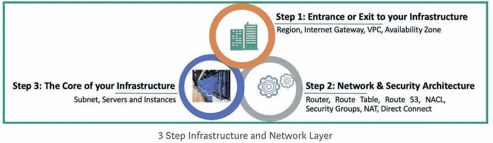**

## **1.了解并深入探究基础架构和网络层**

****以下&网络**:地区，VPC，可用区**

****请求/响应** : CloudFront，Route 53，API Gateway**

****链接:**直接连接|专用链接| VPC 专用网关**

****网关:**互联网网关、存储网关、中转网关、VPC 客户网关**

****负载均衡器**:阿尔布/ ELB / CLB**

## **2.如何为您的组织设计跨不同区域和客户的负载平衡**

# **第 4 部分:源和流层**

## **1.了解和深入探究采购和流层**

****采购:** SFTP，DMS & SCT**

****流媒体** : Kinesis 数据流、Kinesis 消防水管、Kinesis 数据分析、Kinesis 视频、MSK(托管服务 Kafka)、SQS**

## **2.使用流式传输的分布式系统架构**

## **3.您应该如何为您的组织选择流媒体服务**

# **第 5 部分:摄入层**

## **1.对摄食层的理解和深入探究**

****ETL:** 粘合 ETL，数据管道，使用 Step 函数的 ETL**

## **2.您应该如何为您的组织选择摄取层**

# **第 6 部分:数据堆栈层**

## **1.理解和深入了解数据库层**

**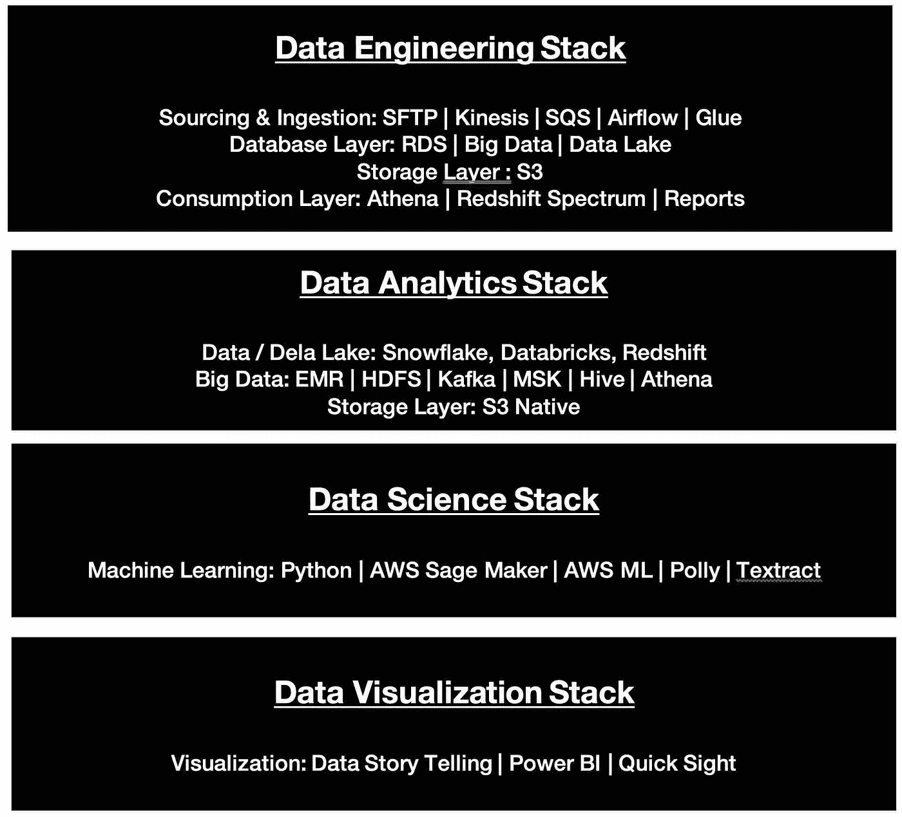**

**数据堆栈@ AWS**

## **第 6a 部分:数据库层**

## ****RDBMS:** RDS，红移，雪花(托管)**

****图形数据库:**海王星**

****NoSQL:** DynamoDB，文档 DB，弹性缓存**

****查询/分析:**红移光谱，雅典娜，弹性搜索**

## **第 6b 部分:数据湖层**

## **1.理解和深入了解数据库层**

**来源和流层、数据湖、查询、可视化**

## **第 6c 部分:大数据层**

****集合:** Kinesis、卡夫卡| MSK、绿草(物联网核心)、AWS 雪球、SQS、DMS、直连**

****存储** : EMR FS，S3，S3 冰川，迪纳摩 DB，Elasticache**

****处理** : EMR HDFS，Lambda，AWS ML / Sage Maker，Glue，EMR，数据管道。**

****分析:**雅典娜，Elastisearch，红移**

****可视化** : QuickSight**

**安全:IAM，KMS**

## **第 6d 部分:数据科学层**

**Amazon Sage Maker、Amazon ML、Rekognition、Polly、Texteract、日志分析**

## **2.您的组织应该选择哪个数据堆栈@ AWS？**

**数据是中心，所有应用程序都是围绕数据构建的，以促进业务的绩效和决策制定。**

# **第 7 部分:配置、路径和 IAC 层**

## **1.了解并深入探究配置和 IAC 层**

**AWS 配置，云形成，Terraform(第三方)，Ansible，AWS 系统管理器**

## **2.代码形式的云计算和基础设施**

# **第 8 部分:应用层**

## **1.对应用层的理解和深入探究**

****基于服务器:** EC2 | EC2 映像构建器**

****无服务器:**λ|步进功能，弹性豆茎**

****DevOps / CI/CD 层:** CloudGuru，Cloud9，代码构建，代码提交，代码部署，代码管道。**

****DataOps、MLOps / AIOps** :在使用第三方解决方案的 AWS 上。**

****架构模式:**事件驱动(微服务)、基于时间等。,**

****集装箱:** ECS，EKS| ECR，ELK，Fargate**

# **第 9 部分:消费层**

## **1.对消费层的理解和深度挖掘**

****Web 应用交付:** CloudFront**

****手机应用:**放大**

****数据库/查询:**数据库层，Quicksight**

****档案:**数据湖(S3)，达美股份(Databricks integrated)**

# **第 10 部分:备份和恢复层**

## **1.了解和深入了解备份和恢复层**

**亚马逊 S3 冰川自动气象站备份**

## **2.为您的组织备份和恢复应用程序服务器和数据库服务器—最佳方法。**

## **3.作为备份和恢复选项的多云。**

# **第 11 部分:消息传递层**

## **1.了解和深入了解消息传递层**

**社交网络、SES、PinPoint、亚马逊连接**

## **2.对于您的组织来说，哪一层是最好的消息传递层**

## **3.如何跨分布式架构和多云/混合云架构实现消息传递。**

# **第 12 部分:监控层**

## **1.对监控层的理解和深入探究**

**云监控、云追踪、可信顾问、计算优化、AWS 检查员**

## **2.如何为微服务设计模式|容器架构启用分布式跟踪和监控？**

## **3.如何实现跨多云/混合云的监控。**

# **摘要**

**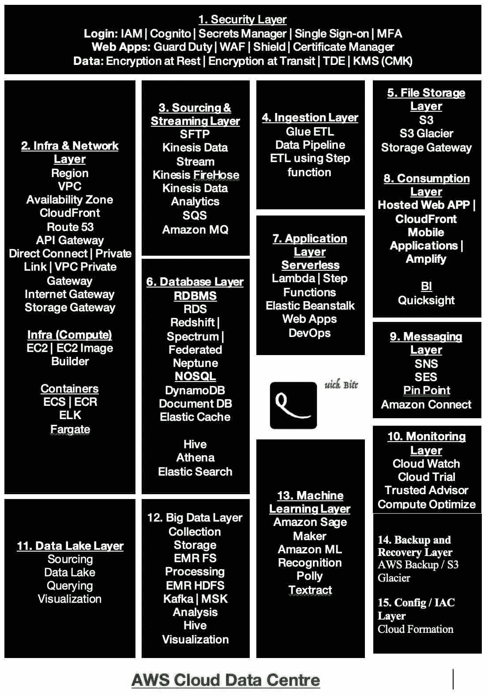**

**链接到 [Azure 系列多部分](https://luxananda.medium.com/azure-series-multi-part-series-on-azure-cloud-and-related-guidelines-f40128ac3037)母文章。**

**其他文章请查看并订阅**luxananda.medium.com****