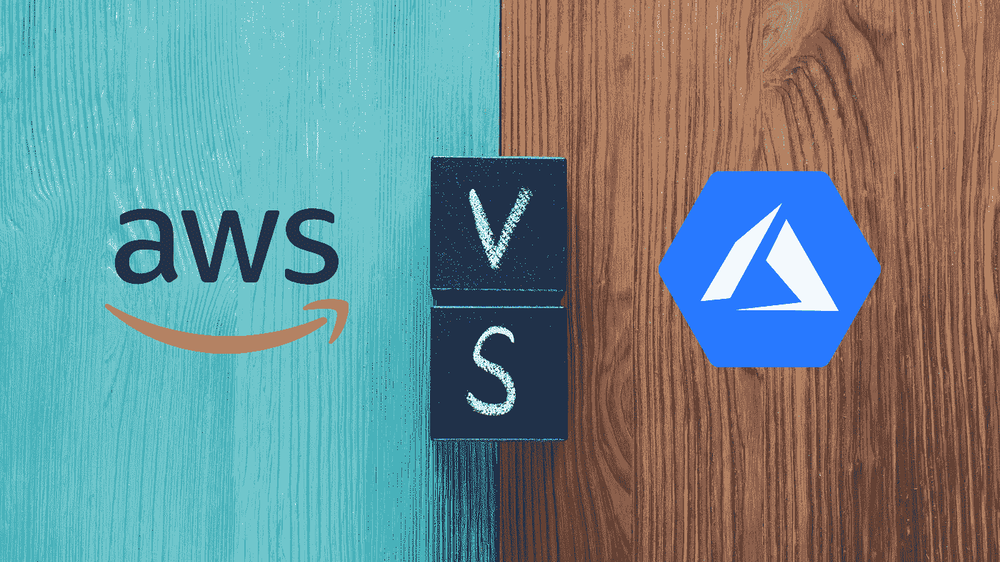

# AWS 与 Azure—2021 年的主要区别

> 原文：<https://medium.com/nerd-for-tech/aws-vs-azure-key-differences-in-2021-5b7143d785dc?source=collection_archive---------3----------------------->

云计算已经展现了它的潜力，并在 2021 年成为一个家喻户晓的名字。随着疫情的出现，云计算的采用进一步增加。一项研究表明，云计算在 2020 年经历了 [6.3%](https://www.gartner.com/en/newsroom/press-releases/2020-07-23-gartner-forecasts-worldwide-public-cloud-revenue-to-grow-6point3-percent-in-2020) 的增长，并且仍然继续显示出有希望的增长。企业已经意识到远程工作将成为新的规范，不再不愿将其数据和工作负载推送到云中。

说到云，市场上有相当多的好提供商。最流行的是亚马逊的 AWS 和微软的 Azure。AWS 和 Azure 都在竞争中遥遥领先，提供多样化的服务，让企业迷上了它们。Synergy group 和 Canalysn 的研究表明，AWS 和 Azure 合计占全球云基础设施服务总支出的 50%。由于投资和创新正在涌入这两个平台的开发，这一趋势预计将进一步上升。

现在最大的问题是你选择哪一个。

当然要看需求和预算。大多数企业都需要一个能够在其分配的预算内提供所有必需服务的提供商，并且还需要一些能够进一步帮助他们工作的附加服务。

在这篇文章中，我们从多个方面对这两个平台进行了广泛的比较，帮助你决定适合你的平台。

**目录**

1.  流行
2.  云类型
3.  定价模型
4.  虚拟化
5.  内容交付网络
6.  安全性
7.  负载平衡
8.  大数据和人工智能集成
9.  裁决

# 流行

AWS 在 2021 年本季度的收入比上一季度增加了 [37%](https://www.statista.com/statistics/422273/yoy-quarterly-growth-aws-revenues/) ，明显领先于其他全球云提供商平台。此外，在采用方面，中小型企业更倾向于将 AWS 作为首选。

另一方面，Azure 在 2021 年本季度的收入比去年同期增长了惊人的 23 %,并计划在全球开设更多数据中心。

# 云类型

AWS 是一种虚拟私有云。虚拟私有云是托管在公共云中的隔离且安全的私有云。另一方面，Azure 是一个虚拟网络(Vnet)。VNet 是你通往 Azure 私有云的门户。VNet 与您在自己的数据中心运行的私有网络是一样的，但是它结合了 Azure 的可伸缩性、集成和可用性特性。

# 定价模型

AWS 支持按小时付费的定价模式，即按小时向用户收取服务费。Azure 支持按需付费模式，这种模式只根据资源的使用情况向用户收费。这更像是你的公用事业账单(如电费)，根据电力/资源消耗向你收费。

# 虚拟化

虚拟化是云计算的关键，这两家提供商在很大程度上接受了虚拟化。AWS 使用 EC2(弹性计算云),它基本上是一种 web 服务，为用户提供云中可扩展的计算能力。借助 EC2 虚拟化，您可以掌控环境、处理器种类、操作系统、存储、网络和购买模式。

Azure 使用虚拟机来提供虚拟环境，以在云中部署和存储应用程序，测试新的操作系统，并在最初没有打算的操作系统上运行软件应用程序。它为高负载数据提供了很好的可伸缩性，尤其是在产品发布活动开始时。用户请求和内容传递从边缘服务器进行，这减少了到源服务器的流量，为用户提供了无缝的数据体验。

# 内容交付网络

AWS 利用 Amazon Cloudfront，这是一个快速的内容交付网络，在安全的环境中以低延迟和更快的速度在全球范围内传输数据、视频和 API。亚马逊 Cloudfront 提供了先进的安全措施，包括字段级加密和 HTTPS 支持，以在世界各地传输数据。

Azure 内容交付网络为开发人员提供了一个强大的交付网络，通过在世界各地的 PoPs(存在点)节点缓存数据来处理高带宽内容。

# 安全性

AWS 支持集中访问权限的方法，其中使用单个凭证来访问整个系统中的资源。

Azure 支持基于角色的访问方法，其中访问权限被限制为选择角色。例如，管理员、超级管理员和网络管理员。

权限的集中访问比基于角色的访问更安全，因为在后者中，由于少数人可以访问，可能会出现数据泄漏，这会给组织带来很大的损失。

# 负载平衡

AWS 使用弹性负载平衡在单个或多个可用性区域内的多个 EC2 实例、IP 地址和虚拟容器之间重定向和分发流量。弹性负载平衡提供安全性和可伸缩特性，使您的应用程序具有容错能力。它提供了四种类型的负载平衡器，每种都有其特定的用途。

1.  应用负载平衡器
2.  网络负载平衡器
3.  经典负载平衡器
4.  网关负载平衡器

Azure 使用 Azure 负载平衡在一组后端服务器和资源之间分配大量流量。Azure 负载平衡器支持从 TCP 和 UDP 连接到云应用程序的入站和出站流量。它还利用健康探测来跟踪实时流量重定向状态。Azure 负载平衡器使用以下负载平衡器来平衡入站和出站流量-

1.  公共负载平衡器
2.  内部(私有)负载平衡器

# 大数据和人工智能集成

对于大数据、数据分析和其他颠覆性技术集成而言，AWS 是一个更加成熟的云环境。Azure 在处理大数据方面相对不太成熟，但它的服务在不断进步，而且仍在改进。AWS 和 Azure 都在他们的云环境中嵌入了简单的 AI 和 ML 分析。

# 裁决

如果一个组织需要与 Windows 集成的最佳 PaaS(平台即服务)提供商，那么 Azure 应该是你的首选。但是，如果您正在寻找 IaaS(基础设施即服务)提供商以及一套用于处理云资源的多样化工具，那么 AWS 就是不二之选。

*原载于*[*https://www . partech . nl*](https://www.partech.nl/nl/publicaties/2021/09/aws-vs-azure---key-differences-in-2021)*。*