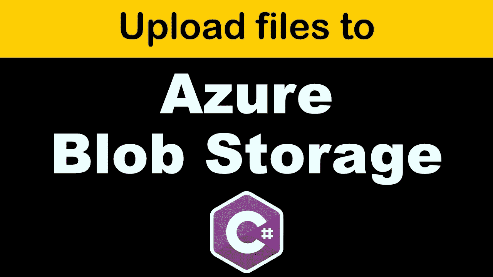

# ☁️ Azure Blob 存储—使用上传/下载/删除文件。NET 5.0 Web API

> 原文：<https://medium.com/nerd-for-tech/azure-blob-storage-upload-download-delete-file-s-using-net-5-0-web-api-978237a6b0e8?source=collection_archive---------1----------------------->

使用将文件上传到 Azure Blob 存储。Net 5.0 Web API

今天在这篇文章中，我们将看到如何使用 Azure blob 存储和 ASP.Net 核心 5.0 Web API 来上传/下载和删除云中的文件。