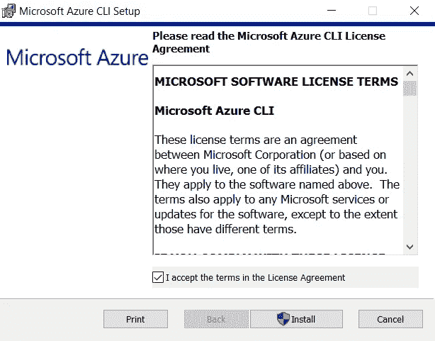
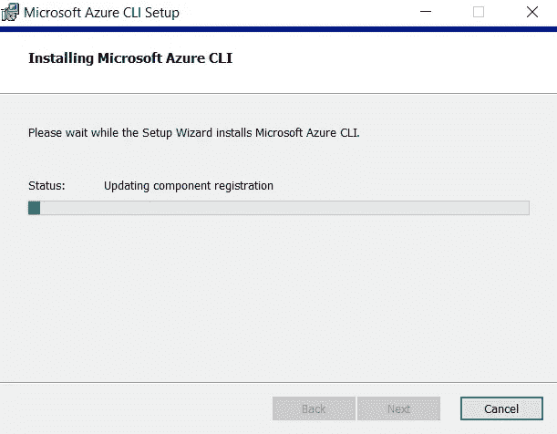
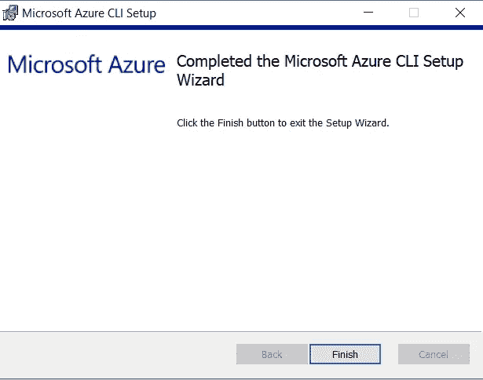
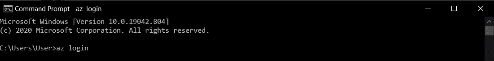
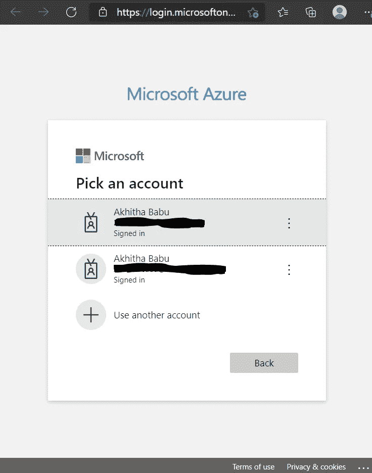
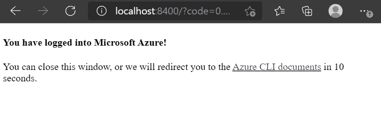
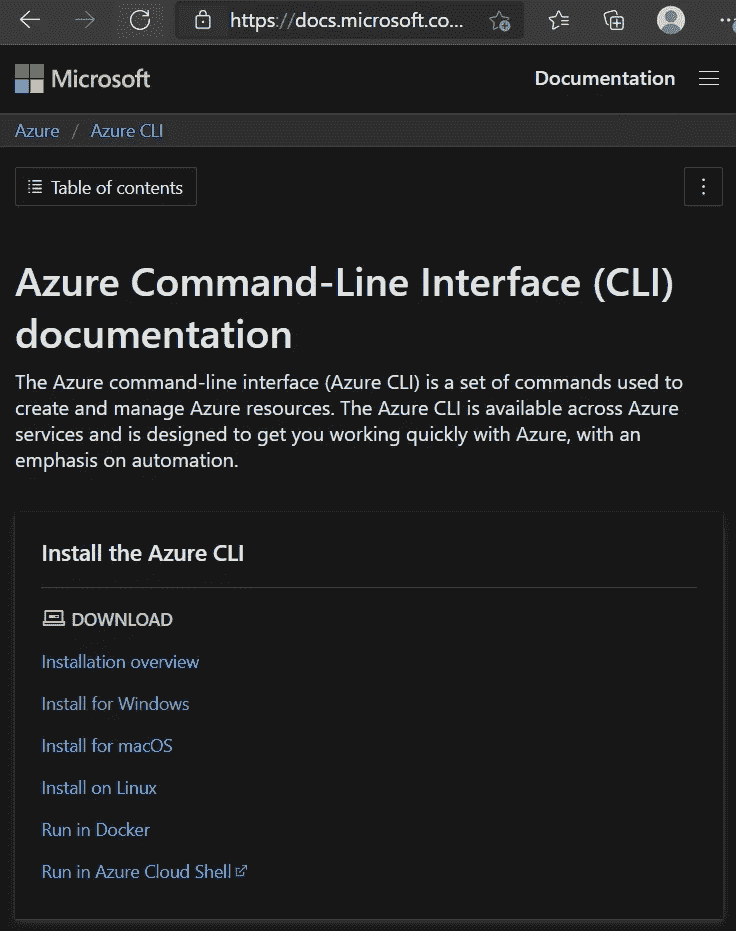
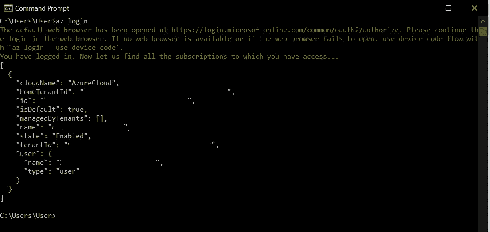

# 用于 Windows 的 Azure CLI 工具

> 原文：<https://medium.com/nerd-for-tech/azure-cli-tools-for-windows-56a45a5ac359?source=collection_archive---------14----------------------->

## 安装或更新用于 Windows 的 Azure 命令行界面工具


照片由[奥克萨·洛克萨](https://unsplash.com/@oxaroxa?utm_source=medium&utm_medium=referral)在 [Unsplash](https://unsplash.com?utm_source=medium&utm_medium=referral) 拍摄

# 先决条件:

*   一个 Microsoft Azure 帐户。

使用这个[链接](https://azure.microsoft.com/en-in/free/search/?&ef_id=Cj0KCQiA1pyCBhCtARIsAHaY_5f0sPbdUFAe5Kf2ljdq5RFL4gMXDz-o75fwJRuBq7jMLxnPA3JyXq4aAkL-EALw_wcB:G:s&OCID=AID2100054_SEM_Cj0KCQiA1pyCBhCtARIsAHaY_5f0sPbdUFAe5Kf2ljdq5RFL4gMXDz-o75fwJRuBq7jMLxnPA3JyXq4aAkL-EALw_wcB:G:s)创建一个免费的。

[](https://azure.microsoft.com/en-in/free/search/?&ef_id=Cj0KCQiA1pyCBhCtARIsAHaY_5f0sPbdUFAe5Kf2ljdq5RFL4gMXDz-o75fwJRuBq7jMLxnPA3JyXq4aAkL-EALw_wcB:G:s&OCID=AID2100054_SEM_Cj0KCQiA1pyCBhCtARIsAHaY_5f0sPbdUFAe5Kf2ljdq5RFL4gMXDz-o75fwJRuBq7jMLxnPA3JyXq4aAkL-EALw_wcB:G:s) [## 立即创建您的 Azure 免费帐户| Microsoft Azure

### 开始享受 12 个月的免费服务和 200 美元的点数。立即使用 Microsoft Azure 创建您的免费帐户。

azure.microsoft.com](https://azure.microsoft.com/en-in/free/search/?&ef_id=Cj0KCQiA1pyCBhCtARIsAHaY_5f0sPbdUFAe5Kf2ljdq5RFL4gMXDz-o75fwJRuBq7jMLxnPA3JyXq4aAkL-EALw_wcB:G:s&OCID=AID2100054_SEM_Cj0KCQiA1pyCBhCtARIsAHaY_5f0sPbdUFAe5Kf2ljdq5RFL4gMXDz-o75fwJRuBq7jMLxnPA3JyXq4aAkL-EALw_wcB:G:s) 

或者使用这个[链接](https://azure.microsoft.com/en-in/account/)创建一个。

[](https://azure.microsoft.com/en-in/account/) [## 登录 Azure-帐户和计费| Microsoft Azure

### 管理您的 Microsoft Azure 帐户。登录门户以配置您的服务并跟踪使用和计费情况。

azure.microsoft.com](https://azure.microsoft.com/en-in/account/) 

# 安装或更新

MSI 可分发组件用于在 Windows 上安装或更新 Azure CLI。在使用 MSI 安装程序之前，您不需要卸载当前版本，因为 MSI 会更新任何现有版本。

*   [微软安装程序(MSI)](https://docs.microsoft.com/en-us/cli/azure/install-azure-cli-windows?tabs=azure-cli#tabpanel_CeZOj-G++Q_azure-cli)
*   [带有命令](https://docs.microsoft.com/en-us/cli/azure/install-azure-cli-windows?tabs=azure-cli#tabpanel_CeZOj-G++Q_azure-powershell)的微软安装程序(MSI)

当安装程序询问是否可以对您的电脑进行更改时，单击`Yes`

# Azure CLI 当前版本

下载并安装当前版本的 Azure CLI。

[Azure CLI 的当前版本](https://aka.ms/installazurecliwindows)

# Azure CLI 测试版

Azure CLI 的测试版支持所有命令，并将与当前发布的版本保持同步。有关安装说明，请参见[安装 Azure CLI 测试版](https://docs.microsoft.com/en-us/cli/azure/install-azure-cli-beta)。

# 设置 Azure CLI

*   打开下载的文件。
*   勾选复选框`I accept the terms in the License Agreement`
*   然后点击`Install`



*   等到绿色充满了酒吧。
*   然后点击`Next`



*   点击`Finish`



# 运行 Azure CLI

你现在可以从 Windows 命令提示符或 PowerShell 中使用`az`命令运行 Azure CLI。PowerShell 提供了一些在 Windows 命令提示符下无法使用的制表符补全功能。要登录，运行 [az login](https://docs.microsoft.com/en-us/cli/azure/reference-index#az-login) 命令。

*   运行`login`命令。
*   Azure CLI

`az login`



*   如果 CLI 可以打开您的默认浏览器，它会打开并加载 Azure 登录页面。

> 否则，在[https://aka.ms/devicelogin](https://aka.ms/devicelogin)打开浏览器页面，并输入终端显示的授权码。
> 
> 如果没有可用的网络浏览器或网络浏览器无法打开，请使用设备代码流和 az 登录-使用-设备代码。

*   在浏览器中使用您的帐户凭据登录。

> 要了解有关不同身份验证方法的更多信息，请参见[使用 Azure CLI 登录](https://docs.microsoft.com/en-us/cli/azure/authenticate-azure-cli)。

[](https://docs.microsoft.com/en-us/cli/azure/authenticate-azure-cli) [## 使用 Azure CLI 登录

### Azure CLI 有几种身份验证类型。最简单的入门方式是使用 Azure Cloud Shell…

docs.microsoft.com](https://docs.microsoft.com/en-us/cli/azure/authenticate-azure-cli) 

*   等到页面被重定向。



*   结束后，您可以在浏览器中看到这个页面。



*   同时在 Windows 命令提示符下，您也可以看到以下详细信息。



# 解决纷争

如果你遇到了这里没有提到的问题，[在 GitHub 上提出问题](https://github.com/Azure/azure-cli/issues)。

# 代理阻止连接

如果因为您的代理阻止连接而无法下载 MSI 安装程序，请确定您的代理配置正确。对于 Windows 10，这些设置在`Settings > Network & Internet > Proxy`窗格中管理。请联系您的系统管理员了解所需的设置，或者您的计算机可能是配置管理的或需要高级设置的情况。

**重要**

这些设置也是从 PowerShell 或命令提示符使用 CLI 访问 Azure 服务所必需的。在 PowerShell 中，您可以使用以下命令来完成此操作:

```
(New-Object System.Net.WebClient).Proxy.Credentials = `
  [System.Net.CredentialCache]::DefaultNetworkCredentials
```

为了获取 MSI，您的代理需要允许 HTTPS 连接到以下地址:

*   `[https://aka.ms/](https://aka.ms/)`
*   `[https://azcliprod.blob.core.windows.net/](https://azcliprod.blob.core.windows.net/)`

# 从计算机上卸载

***如果您发现了 bug，请将*** [***文件发出***](https://github.com/Azure/azure-cli/issues) ***。***

## 方法 1:

您可以从 Windows“应用和功能”列表中卸载 Azure CLI。要卸载:

`Start > Settings > AppsWindows 8 and Windows 7Start > Control Panel > Programs > Uninstall a program`

## 方法二:

在此屏幕上，在程序搜索栏中键入 Azure CLI。要卸载的程序被列为 Microsoft CLI 2.0 for Azure。选择该应用程序，然后点击`Uninstall`按钮。

# 进一步阅读

Azure CLI 功能和常用命令。

[](https://docs.microsoft.com/en-us/cli/azure/get-started-with-azure-cli) [## Azure CLI 入门

### 欢迎使用 Azure CLI！本文介绍了 CLI，并帮助您完成常见任务。脚本和上的注释…

docs.microsoft.com](https://docs.microsoft.com/en-us/cli/azure/get-started-with-azure-cli) 

# 参考:

[](https://docs.microsoft.com/en-us/cli/azure/install-azure-cli-windows?tabs=azure-cli) [## 安装适用于 Windows 的 Azure CLI

### 对于 Windows，Azure CLI 是通过 MSI 安装的，这使您可以通过 Windows 命令提示符访问 CLI…

docs.microsoft.com](https://docs.microsoft.com/en-us/cli/azure/install-azure-cli-windows?tabs=azure-cli)