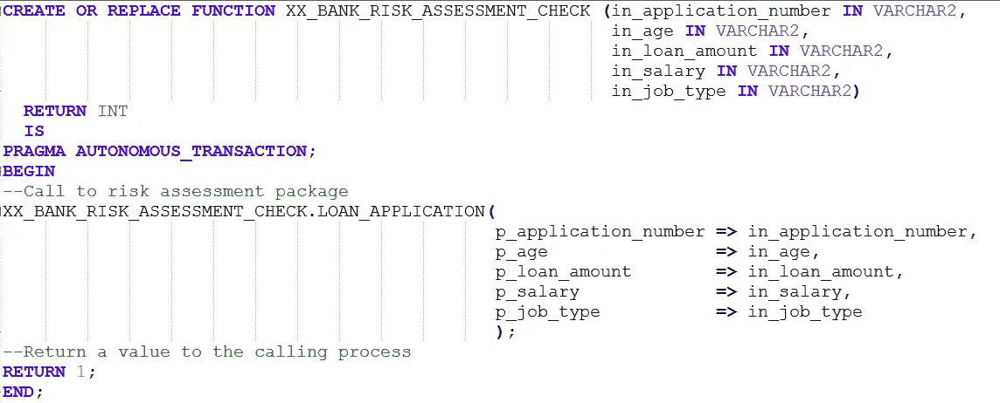
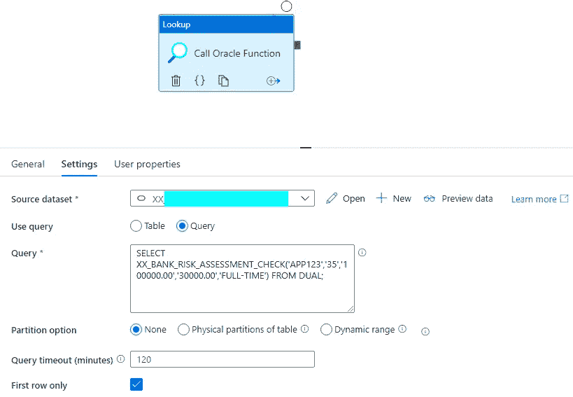
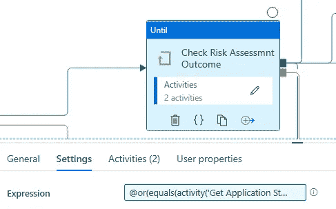
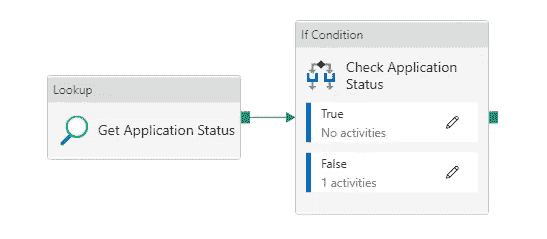
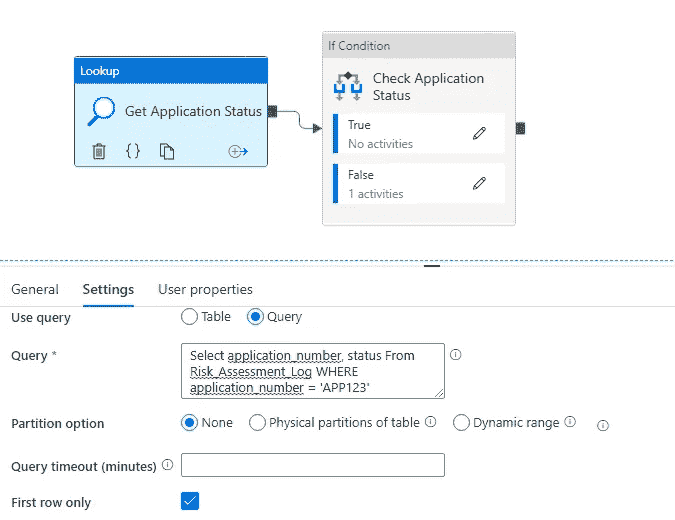
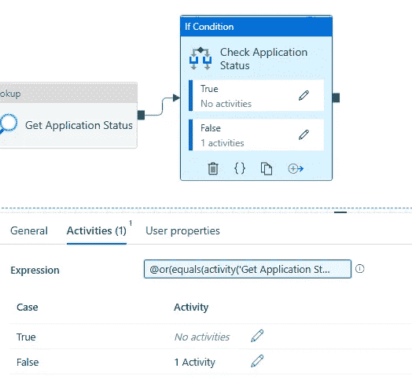
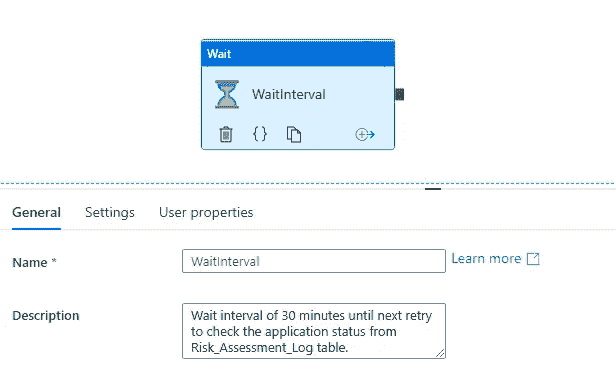

# Azure 数据工厂——以 Oracle 为源的数据工程管道

> 原文：<https://medium.com/nerd-for-tech/azure-data-factory-data-engineering-pipelines-with-oracle-as-source-5688f1cc7c90?source=collection_archive---------7----------------------->

Azure 数据工厂是 Azure 云空间中几乎所有数据工程和数据编排的首选产品。尽管有许多连接器/链接服务可用于不同的源，但其中一些缺乏开箱即用的关键特性。Oracle 连接器就是这样一种连接器。

在本文中，我们将讨论 Oracle 连接器缺少的一个关键特性，以及如何构建数据工程管道来帮助弥合这一差距。本文旨在帮助那些使用 Oracle 数据库作为源代码并希望在 Oracle 中执行某些流程作为数据工程管道的一部分的开发人员。

Oracle 连接器/链接服务对于“复制”和“查找”活动是高度可靠的。对于“存储过程”活动来说，情况并非如此。这是因为，连接器缺乏执行 Oracle 存储包/过程的能力。已经有相当多的请求发布到产品团队，但看起来这个功能可能不会很快可用。

对此有什么解决办法？

用 Oracle 的术语来说，就是 PRAGMA 自治 _ 事务。是的，正是自主事务有助于弥合这一差距。

让我们开始行动，看看这是如何在一个场景的帮助下工作的。

**场景:**一家银行希望对他们每天收到的贷款申请进行风险评估。假设银行正在使用 Oracle 数据库，并且他们将自己的定制逻辑编写为 Oracle 数据库中的存储包。该银行还使用数据湖存储和数据块来训练一个 ML 模型，其结果来自这个 Oracle 存储包。

在这种情况下，银行不希望在其他地方重写定制的复杂逻辑，而是希望尽可能多地重用 Oracle 对象以节省时间和成本。

让我们假设执行风险评估的 Oracle 存储包的名称为 XX_BANK_RISK_ASSESSMENT_CHECK。LOAN _ APPLICATION(p _ APPLICATION _ number = >，p_age = >，p_loan_amount = >，p_salary = >，p_job_type = >)。存储的包捕获所有可能的异常和每个步骤的详细日志，作为带有日期和时间戳的自定义 Oracle 表中执行的一部分。在我们的案例中，关键字段将是申请号和风险评估结果。

**解决方案:**在数据工厂中调用这个存储包的步骤如下:

步骤 1:创建一个 Oracle 函数，作为这个存储包的包装器。该函数应该创建为 PRAGMA 自治事务，如下所示。这是为了确保存储过程可以通过函数调用，但作为一个单独的事务。

在 Oracle 数据库中创建的 Oracle 函数

步骤 2:在数据工厂的控制流中包含一个查找活动。因为 Oracle 函数可以作为 SELECT 语句的一部分，所以现在我们可以通过查找活动查询中的 Oracle 函数调用存储的包作为自治事务。

*查询*:从 DUAL 中选择 XX _ BANK _ RISK _ ASSESSMENT _ CHECK(' app 123 '，' 35 '，' 100000.00 '，' 30000.00 '，'全日制')；

从数据工厂调用 Oracle 函数

步骤 3:添加一个 Until 操作来检查应用程序状态是否有结果。这就是日志表派上用场的地方。始终确保包含一个日志表，该表将作为 Oracle 存储包/过程的一部分捕获所有详细信息。表中的日志详细信息可以是每个贷款申请级别的，也可以是基于业务用例的所有申请的汇总级别。在这种情况下，我们将认为它是针对每个贷款申请的。

直到在“调用 Oracle 函数”查找活动之后执行的活动

*表达式*:[@或](http://twitter.com/or) (equals(activity('获取应用状态'). output.firstRow.STATUS，'成功')，equals(activity('获取应用状态'). output.firstRow.STATUS，'失败'))。

Until 活动将包含一个查找活动和一个 If 条件活动。查找活动将在日志表中查询贷款申请的最终状态，If 条件将检查申请结果。

Until 活动中的活动

查找活动，

*查询*:从 Risk_Assessment_Log 中选择 application_number，status，其中 application _ number = ' APP123

查找活动中的查询

如果条件活动，

If 条件的表达式

*表达式*:[@或](http://twitter.com/or) (equals(activity('获取应用状态'). output.firstRow.STATUS，'成功')，equals(activity('获取应用状态'). output.firstRow.STATUS，'失败'))。

> *注意:*在我的例子中，If 条件活动和 Until 活动的表达式是相同的。

## **可能的结果**

假设存储的包在 Oracle 中成功完成，并根据贷款申请号更新了状态为(成功或失败)的日志表。

如果 If Condition 活动评估为 True condition，它将不会执行任何进一步的任务，因为在此阶段我们已经有了贷款申请的结果。它会将控制转移到 Until 活动，在这种情况下，Until 活动将依次退出，并继续进行数据管道中的下一个活动。

如果应用程序状态尚不可用，它将进入错误模式并执行等待。

在错误条件下要执行的等待间隔活动

在等待活动完成之后，Until 活动将再次执行，以检查贷款申请的最终状态。Until 活动将一直执行，直到它对退出条件的评估为 true。

您可以根据用例将 Until 活动定制为在一定数量的计数后出错。如果是这种情况，您将需要使用一个变量并增加变量的计数，而不是等待活动。

我希望这篇文章能有所帮助，并为使用 Oracle 数据库的数据工程师提供急需的信息。该模板可以从我的 GitHub 存储库 https://GitHub . com/Sri Nath-param/data-engineering/tree/main/data-factory-pipelines-Oracle-stored-packages-or-procedures-call 下载

# 让我们学习，帮助别人学习！