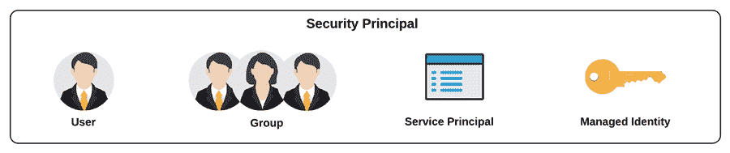
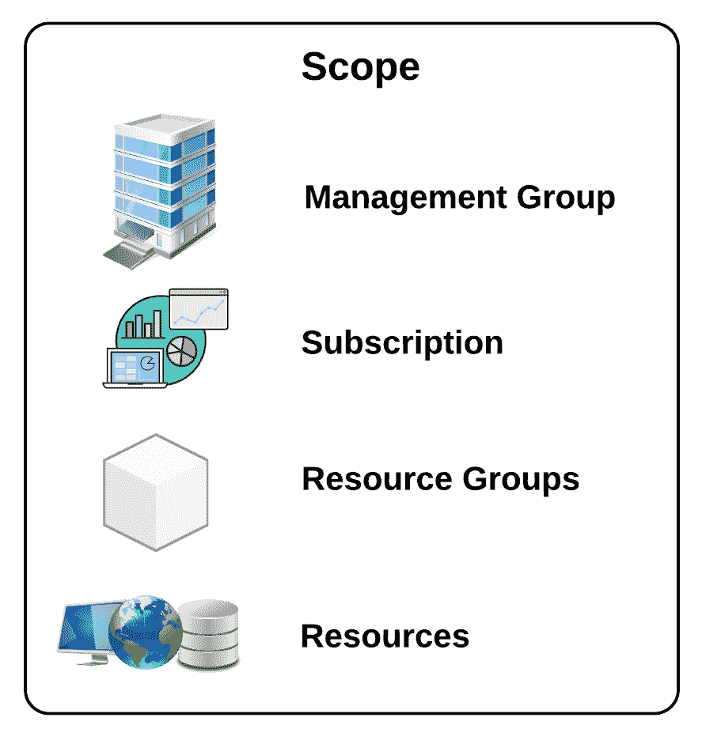
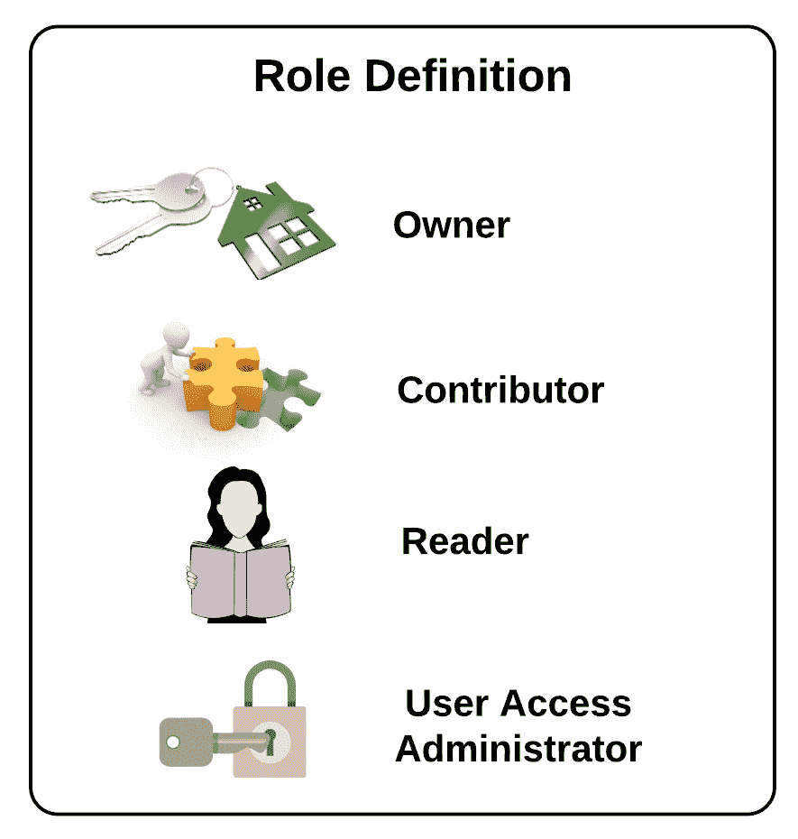
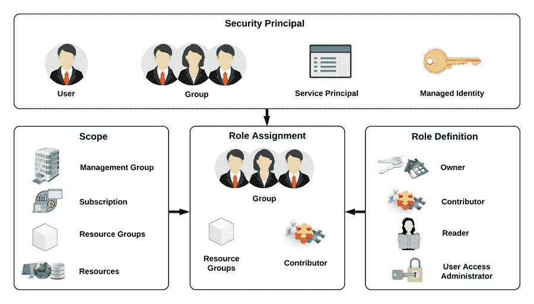

# Azure 基于角色的访问控制(RBAC)

> 原文：<https://medium.com/nerd-for-tech/azure-role-based-access-control-rbac-3997842ee815?source=collection_archive---------10----------------------->

在我们之前的帖子中，您已经了解了云的基本概念，并简要了解了最受欢迎的云服务提供商之一——[微软 Azure](https://www.partech.nl/nl/publicaties/2020/07/what-is-azure) 。在这篇文章和随后的文章中，我们将深入 Azure，了解它的一些核心特性和服务。

假设您组织的 IT 基础设施已经托管在 Azure 中，您的基础设施的下一个重要方面是确定谁可以访问什么，以及我如何在 Azure 中无缝地实现它。这就是 Azure 基于角色的访问控制(RBAC)派上用场的地方，这是 Azure 的内置功能，也是我们今天的主题。我们将详细解释**什么是 Azure RBAC** 以及它如何帮助管理你的 Azure 服务的访问控制。

# 目录

1.  什么是蔚蓝 RBAC
2.  RBAC 的主要概念
3.  角色分配
4.  RBAC 的实际执行
5.  最后的想法

# 1.什么是蔚蓝 RBAC？

Azure RBAC 是一个内置的授权系统，有助于 Azure 资源的访问管理。通常，RBAC 用于根据组织内个人的角色来限制网络访问。它允许用户访问完成工作所需的信息，并限制他们访问不属于他们的信息。

现在我们已经定义了什么是 RBAC，让我们了解一些基本的 Azure 术语，我们将在我们的帖子中使用。

## 1.1 Azure 订阅

Azure 订阅是 Azure 资源的一个逻辑捆绑包，它作为该服务中存在的资源的单个计费单位。一个 Azure 订阅只能映射到一个帐户。但是，一个帐户可以有多个订阅。

## 1.2 资源提供者

资源提供者通常提供可以在订阅中使用的资源。它们还描述了适用于每种资源的操作。大多数资源提供者都自动注册到订阅。如果没有，用户可以在需要时注册它们。

## 1.3 资源组

资源组是资源集合的中央单元，可以被视为一个实体。它有助于自动供应、监控，并有助于集中控制所有资源成员。

# 2.RBAC 的主要概念

下面是 RBAC 的三个主要概念。

## 2.1 安全负责人(谁需要访问)

它指的是需要访问 Azure 资源的实体。该实体可以是:

*   用户(在 Azure Active Directory 中拥有个人资料的人)
*   组(加入 Azure Active Directory 的一组用户)
*   服务主体(代表 Azure 服务或应用程序用来访问 Azure 资源的身份)
*   托管身份(允许 Azure 资源向 Azure Active Directory 标识其自身，而不要求其提供任何显式凭据)

## 2.2 范围(访问什么)

一旦我们决定了谁需要访问资源，下一步就是找出他们需要访问什么。

范围提供了安全主体可以访问的资源或资源组。例如，访问特定资源组中的应用服务。

在 Azure 中，范围可以定义如下:

1.  管理组，
2.  订阅，
3.  资源组，以及
4.  资源

让我们用一个例子来理解上面的内容。

假设我们在开发(Dev)、质量保证(QA)、试运行和生产区域部署我们的解决方案。现在，他们想算出维护每个地区的成本，因此他们可以在地区级别创建订阅，即 4 个地区 4 个订阅。

为了维护跨订阅的访问、策略和合规性，将在**管理组**(订阅组)级别定义范围。类似地，为了在一个订阅中维护相同的策略集，范围将在**订阅**级别定义。资源组和资源也是如此。

## 2.3 角色定义(如何访问)

角色定义是安全主体能够在定义的范围内执行的权限/操作的集合。换句话说，角色定义决定了安全主体可以完成的操作类型(读、写和删除)。

Azure 有将近 140 多个内置角色。但是，四个基本的内置角色如下:

1.  **所有者**(对该范围具有完全访问权限的安全负责人，有权将访问权限委托给他人)，
2.  **贡献者**(拥有与角色“所有者”相似的所有权限。但是，他们不能将访问权限委托给其他人)，
3.  **阅读器**(可以查看现有 azure 资源)，
4.  **用户访问管理员**(允许管理用户访问管理资源)。

Azure 允许我们创建自定义角色，当内置角色不适合或不特定于组织的需求时，这可能会派上用场。

# 3.角色分配

RBAC 是关于角色的。为了实现 RBAC，必须创建角色分配。角色分配只不过是为特定范围的安全主体定义角色的过程。可以通过创建或删除角色分配来授予或撤销访问权限。

Azure 还允许你有多个角色分配。这里需要注意的重要一点是，在多角色分配中，会考虑角色分配中可用的最高权限，而较低权限角色的效果会被取消。

例如:

*   角色分配 1-将参与者角色分配给用户的订阅。
*   角色分配 2-将读者角色分配给同一用户订阅中的资源。

在这种情况下，贡献者的较高特权将应用于用户的整个订阅，这将取消读者角色的效果。类似地，为了排除安全主体在定义的范围内执行的一组操作，Azure 提供了拒绝分配。拒绝分配会阻止安全主体执行某些操作，即使存在授予其访问权限的角色分配。简而言之，拒绝分配优先于角色分配。

让我们考虑一个例子，一个开发人员可以访问所有区域(管理组)来更新或修改所有资源(角色分配)。但是，在生产区域(订阅之一)中，设置了一个规则(拒绝分配)，该规则不允许开发人员更新该订阅中的任何资源。

# 4.RBAC 的实际执行

假设我们开始在云中构建基础设施，并为以下角色招募了候选人:*云架构师、数据库管理员、开发人员、测试人员和产品负责人*。让我们看看 RBAC 如何帮助我们有效地工作。

***云架构师*** —负责云采用计划、云应用设计以及云管理和监控的个人或团队。云架构师的责任是提供云系统中要遵循的标准和要采用的最佳实践。因此，我们使用 RBAC 来确保云架构师能够访问所有订阅，并有权创建、读取、更新和删除资源。

***数据库管理员*** —在所有订阅中部署的数据库上工作的特定组。因此，我们使用 RBAC 来为数据库管理员提供 *contributor* 对跨订阅部署的数据库的访问。

***开发人员*** —对于开发人员，我们使用 RBAC 来确保范围仅限于他们的工作区域(可以是一个订阅或一个资源组),并且有权执行 CRUD 操作。

***测试人员和产品负责人*** —我们使用 RBAC 向测试人员和产品负责人提供*读者*权限，以了解他们所需的范围。

因此，Azure 帮助组织定义对系统有贡献的个人或团体的角色。

# 5.最后的想法

访问管理是云治理的重要组成部分，应该给予最高优先级。它有助于定义一组规则来指导组织利用和控制云资源，以遵守数据安全的行业标准。实现适当级别的 RBAC 有助于实现安全的 Azure 环境和独立的安全主体。

*原载于*[*https://www . partech . nl*](https://www.partech.nl/nl/publicaties/2020/07/azure-role-based-access-control-rbac)*。*