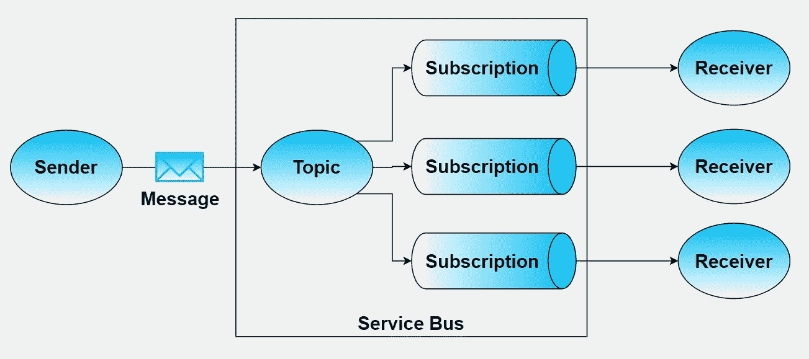
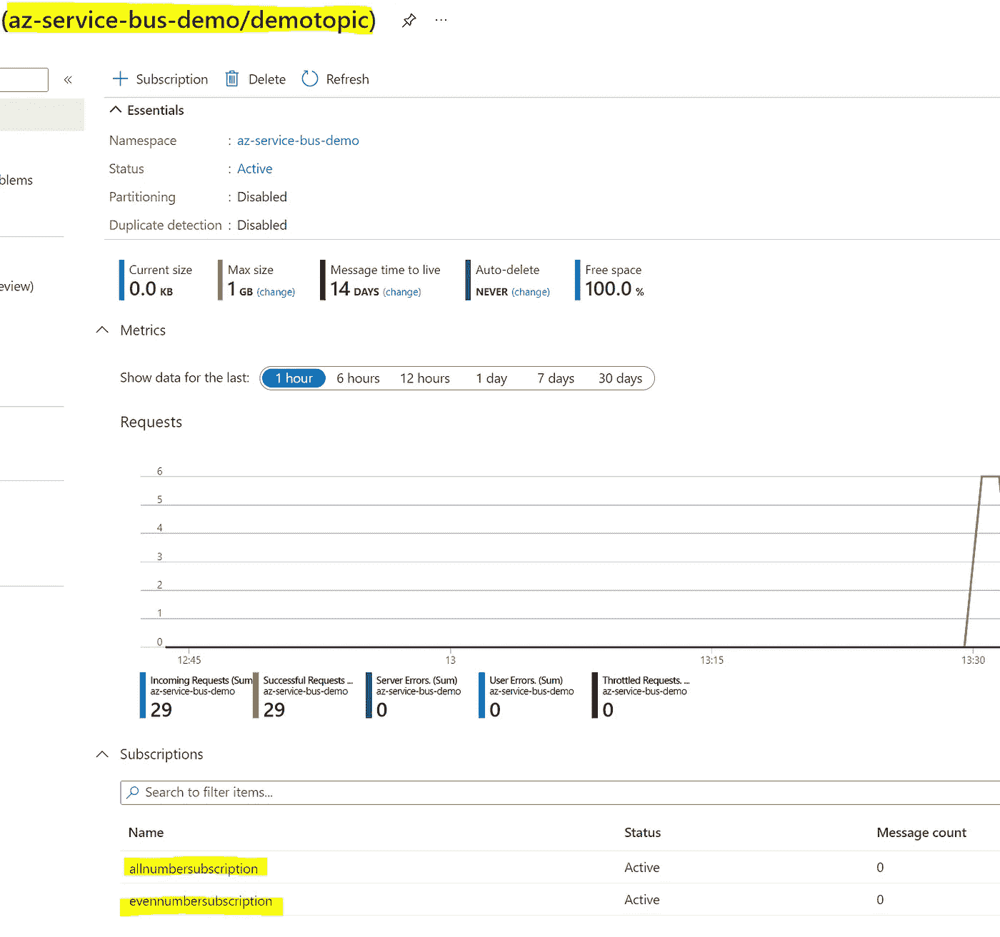
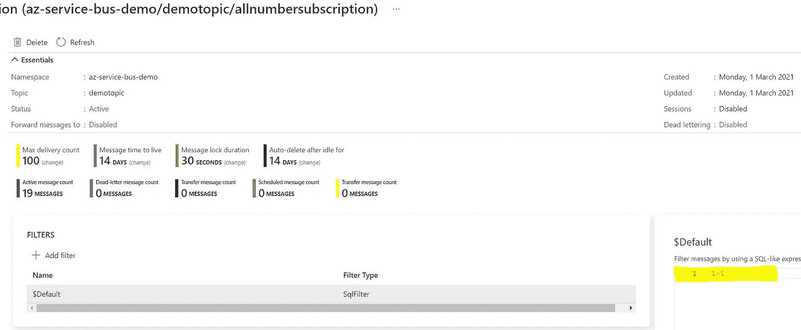
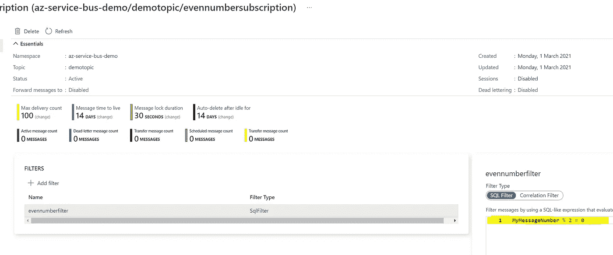
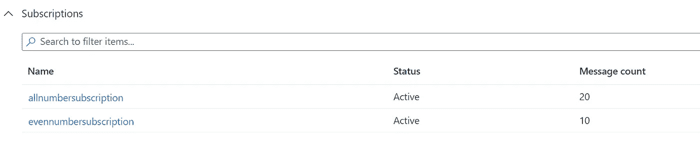
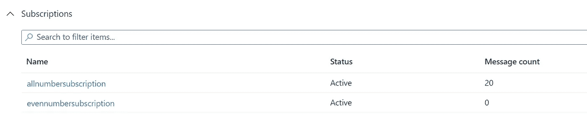
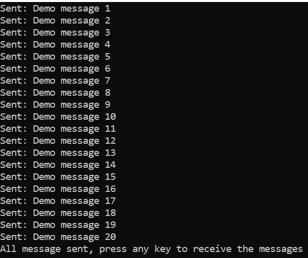
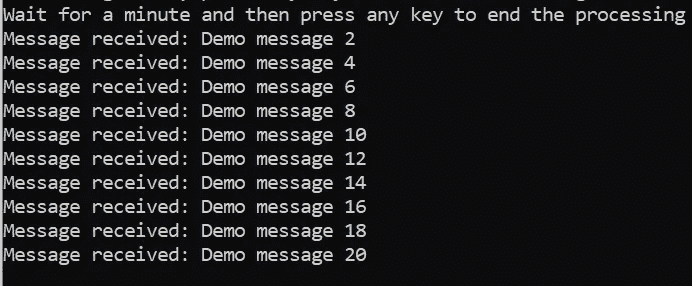

# Azure 服务总线—发布/订阅模式

> 原文：<https://medium.com/nerd-for-tech/azure-service-bus-publish-subscribe-pattern-178dd44baa36?source=collection_archive---------5----------------------->

帕特里克·亨德利在 [Unsplash](https://unsplash.com/collections/2469754/bus?utm_source=unsplash&utm_medium=referral&utm_content=creditCopyText) 上拍摄的照片

这篇文章是我写的关于使用 Azure 服务总线队列在单个发送者和单个接收者之间发送和接收消息的前一篇[博客](https://csmithblog.medium.com/azure-service-bus-queue-storage-5780feb17d7c)的继续。在这里，我将扩展 FIFO 队列功能，描述如何使用发布和订阅模式实现一对多关系，其中多个接收者可以订阅接收相同的消息。

所有示例代码都是使用 C#编写的。NET 核心，可以在我的 [GitHub](https://github.com/chrissmKainos/azure-service-bus-demo) 中找到。

# 这是如何工作的？

消息从发送者`Publisher`发送到 Azure 服务总线主题。主题与队列非常相似，主要区别在于单个主题可以包含一个或多个订阅，消息将传递到这些订阅。可以对每个订阅应用过滤器，以管理它们从主题接收的消息，并且通常会根据消息内容或属性进行过滤。最后，一个或多个接收者`consumers`可以`subscribe`订阅以接收消息。这实现了我们的一对多模式。

Azure 服务总线—发布/订阅

# Azure 门户安装程序

出于演示应用的目的，我使用 Azure 门户创建了一个主题`demotopic`，包含两个订阅者`allnumbersubscription & evennumbersubscription`。

Azure 门户—主题

*   `allnumbersubscription` 该订阅包含一个默认过滤器，它将查看从主题发送到订阅的所有消息。

Azure 门户—使用默认过滤器的订阅

*   `evennumbersubscription` 该订阅包含一个基于名为`MyMessageNumber`的消息属性的自定义过滤器，只允许从属性值为偶数的主题发送消息。

Azure 门户—带有自定义过滤器的订阅

# 演示应用程序

正如已经提到的，我将使用 C#作为我的演示应用程序的语言选择。我已经扩展了我在 Azure Service Bus 上的第一篇博客中使用的应用程序，允许使用队列或发布/订阅模式。

## AppSettings

这是演示应用程序的配置文件。它包含一个布尔标志`UseTopic`，用于指示是否要使用主题来代替队列。我们将其设置为 true，以表明我们希望使用主题和发布/订阅方法。该文件中的其他设置是服务总线的连接字符串，以及已经用 Azure portal 创建的队列、主题和订阅的名称。

appsettings —配置文件

## 程序类

我们项目的主文件，它负责从`appsettings.json`文件中读取配置值，并设置将被传递到`SendMessagesAsync` 和`ReceiveMessagesAsync`中的所需参数。由于我们已经在配置文件中将`UseTopic`设置为真，参数将被设置为值`DemoTopicName`和`DemoSubscriptionName`。

Program —启动处理的主类

## 发送者类别

在`Sender.cs`类中，有三个主要任务正在执行，都在 SendMessagesAsync 方法中:

1.  创建一个`ServiceBusClient`，从 config 传入连接字符串。这个客户端在 Azure 中为我们提供了到服务总线的连接。
2.  创建一个与客户端相关联的`ServiceBusSender`。我们从 config 中传递主题名称，以确保连接到正确的主题。
3.  使用`SendMessageAsync`实际发送消息。进行此调用后，该消息将在链接到该主题的已过滤订阅中可用。

请注意，在第 18 行，我向正在发送的消息添加了一个新的应用程序属性。该属性包含一个键-值对，键是在订阅过滤器`evennumberfilter`中使用的名称，值被设置为循环索引。此属性提供筛选器所需的数据，以确保订阅仅接收偶数。

所有用于连接和发送的代码都是使用已安装的 NuGet 包`Azure.Messaging.ServiceBus`提供给我们的功能来执行的，这可以从第 3 行的 using 语句中看出。

Sender 负责发送消息的类

该代码简单地迭代 SendMessageAsync 调用，向服务总线主题发送 20 条消息。一旦被主题接收，消息就被分发到主题订阅。我们可以看到过滤器已经将所有 20 条消息发送给了`allnumbersubscription`订阅，但是只有 10 条消息(那些偶数的)被发送给了`evennumbersubscription`订阅。

Azure 门户—订阅概述，包含消费前的消息计数

## 接收器类别

在`Receiver.cs`类中我们有三种方法:

1.  MessageHandler
    该事件处理程序处理从订阅收到的每条消息，并调用`CompleteMessageAsync`将消息标记为完成，这将告诉服务总线删除该消息。
2.  ErrorHandler
    这是 ServiceBusProcessor 所需的默认错误处理程序。
3.  ReceiveMessageAsync
    该方法具有以下职责:

*   创造一个`ServiceBusClient`。与发送方一样，config 中的连接字符串作为参数传入，以确保我们的客户端连接到 Azure 中正确的服务总线。
*   创建一个`ServiceBusProcessor`，给定主题名称、要订阅的订阅名称和默认处理器选项作为参数。处理器为我们提供了使用事件处理程序处理消息的能力。
*   将两个事件处理程序分配给处理器事件。
*   使用`StartProcessingAsync`调用开始处理消息。当从订阅收到消息时，将调用 MessageHandler 并处理消息。
*   使用`StopProcessingAsync`调用停止消息处理。

Receiver 负责接收和处理订阅的类

运行完这段代码后，我们可以再次查看 Azure 门户来检查我们的订阅。如您所见，第一个订阅`allnumbersubscription`仍然包含 20 条消息，因为没有接收者订阅或处理其中的消息。第二个订阅`evennumbersubscription`，现在有 0 条消息，因为我们的 receiver 类订阅、处理了这些消息并将它们标记为完成。

Azure 门户—订阅概述，包含使用后的消息计数

# 控制台窗口输出

运行应用程序时，控制台窗口会提供一些调试消息。它显示了正在发送的 20 条消息，然后只有那些包含偶数的消息被已经订阅了`evennumbersubscription`的接收者处理:

发送到主题的消息

从订阅收到的消息

# 摘要

在这篇博客中，我展示了如何使用 Azure 门户快速创建一个包含带有过滤器的多个订阅的服务总线主题，并使用门户查看订阅前后处理中的消息计数。我还提供了一些 C#代码示例，说明如何在一个非常轻量级的应用程序中连接到订阅并处理消息。

希望我在这里写的东西对你有所帮助，并推动你自己去看看 Azure Service Bus。

感谢您的阅读，如果您能给这篇文章一个赞并分享，我将不胜感激。