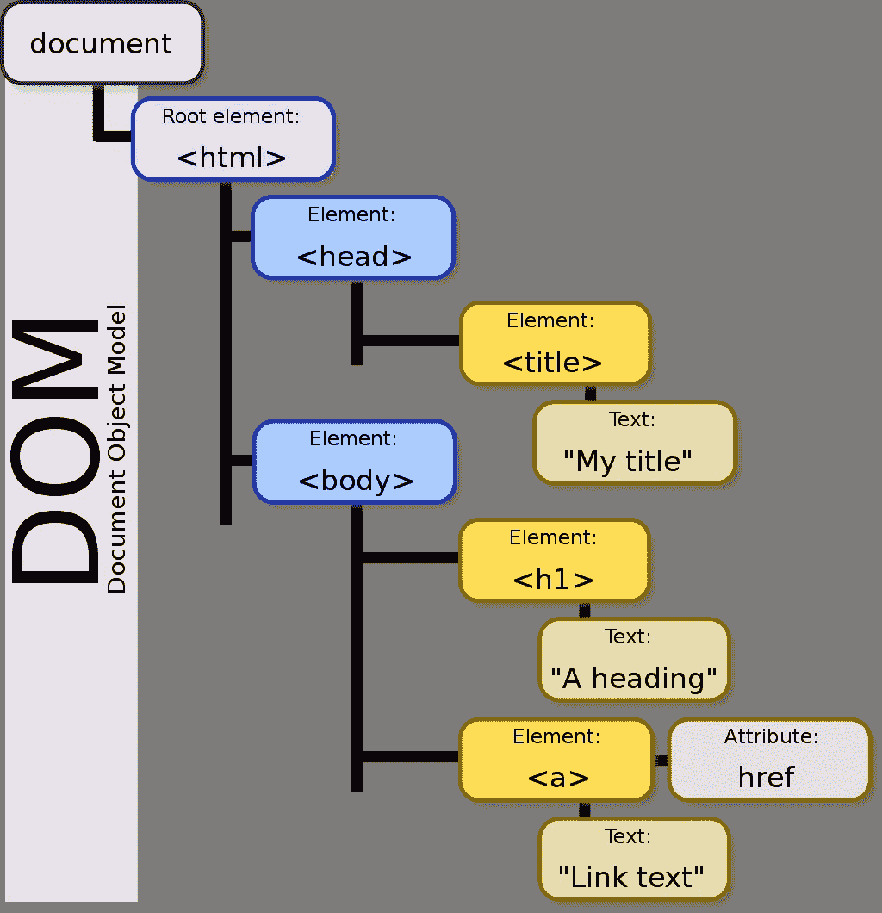

# 返璞归真:倒带，反应！

> 原文：<https://medium.com/nerd-for-tech/back-to-basics-rewind-react-aaf96639e9ea?source=collection_archive---------13----------------------->

## 反应堆基础复习

当我经历毕业后找工作的过程时，我想回到基础，以此来巩固我在过去四个月中学到的知识。在我命名为“回归基础”的这个系列中，我着眼于广泛的主题，并将其分解到核心。也许它可以帮助另一个程序员经历一个新兵训练营或任何需要它的人的复习。

让我们回顾反应！

在这篇文章中，我将回顾一下**反应**的基本原理。我将分解核心概念，这些概念可以被视为对 JavaScript 库的回顾或介绍。

# 什么是反应？

直接从官方文件上撕下来的:

> React 是一个用于构建用户界面的 JavaScript 库。

需要指出的是，React 实际上是一个 JavaScript 库，而*不是*框架。取决于你和谁交谈，这可能是一个激烈辩论的话题。然而，React 的魅力在于它提供了比框架更多的灵活性。React 具有模块化、关注点分离，甚至允许您在单个应用程序中反复重用组件。您可以在 web 应用程序中自由使用 React 的数量。

React 用于构建用户界面。它是 UI 库，是构建 UI 组件的工具。我们告诉 React 我们希望 UI 的每个组件应该如何外观、更新和呈现。这就是为什么我们说 React 是声明性的。它引入了虚拟 DOM 的概念。当我们用 React 编写代码时，我们不会直接改变屏幕上的内容。相反，我们操纵虚拟 DOM。让我们打破这个概念！

# 虚拟 DOM &和解的过程

在我们开始之前，让我们先定义一下什么是 **DOM** 。 **DOM *又名*文档对象模型**是构成 HTLM 或 XML 文档的结构和内容的数据的面向对象表示。每个元素的样式、结构和内容都可以用 JavaScript 这样的脚本语言来操作。

那么，为什么 React 让我们与虚拟 DOM 而不是真实的 DOM 进行交互呢？

嗯，DOM 操作很慢。频繁地修改和更新 DOM 会影响性能。让我们看看 DOM 的层次结构。

## DOM 树

DOM 的层次结构被组织成一个树形结构，如图所示。所有元素和对象都表示为**节点**。每个节点都有自己的属性和方法。节点可以有一个父节点，也可以有许多子节点。

当我们改变一个元素时，DOM 会更新该元素，但也会重新呈现它的所有子元素。

网页可能很复杂，由许多 UI 组件组成。因此，重新渲染越来越多组件的过程可能会非常缓慢。

大多数网页都是动态的单页应用程序，其中包含成千上万的`
`和许多与之相关的事件处理程序。想象一下，在所有这些< div >中寻找你需要更新的元素。最重要的是，遍历它的所有子对象来重新渲染它们。这不仅在调试时难以管理，而且非常耗时且效率低下。这就是虚拟 DOM 的用武之地！

## **虚拟 DOM**

**虚拟 DOM** 只是实际 DOM 的一个表示，UI 保存在内存中。它和真实的 DOM 有相同的属性，但是它没有能力直接改变所看到的东西。因此，您可以将它视为真实 DOM 的轻量级副本。

## **对账**

React 用来对真实 DOM 进行更改的过程被称为**协调**。

当呈现元素时，React 元素树虚拟表示将被保存在内存中。当 react 组件的状态发生变化或者添加了新元素时，会有一个带有必要更新的新版本的虚拟 DOM。React 然后会挖掘出它保存在内存中的旧版本的虚拟 DOM。在那里，React 使用**差分算法**来比较新版本和快照。

## 差分算法

**“Diffing”**是指检查虚拟 DOM 的 to 版本之间的差异的过程。

React 通过实现启发式 O(n)算法来实现这一点。(时间复杂度加成事实！).

它这样做基于两个假设。在 React 文档中，它声明:

> 1.两种不同类型的元素会产生不同的树。
> 
> 2.开发者可以用一个`key`道具提示哪些子元素在不同的
> 渲染中是稳定的。

现在，行为可以根据根元素的类型而变化。有兴趣的可以在这里了解更多[！](https://reactjs.org/docs/reconciliation.html#the-diffing-algorithm)

通过计算差异，React pin 指出实际 DOM 中需要更新哪些子树。React 将只对真正 DOM 上的那些子树进行修改。这就是为什么它更快更有效。更新虚拟 DOM 是即时的，React 通过将 DOM 更新限制在一定数量的对象上，减少了 DOM 操作的时间。因此，性能明显更好。

**反应组分**

React 就是把 UI 分解成组件！每一个都是独立的，可以自由地重复使用。React 组件的核心基本上是 JavaScript 函数，这些函数返回 React 元素，这些元素详细说明了应该在浏览器上显示什么。

每个组件都会收到一个属性列表，我们称之为**道具**。它们可以作为第一个参数传递给其他组件。它本质上是一个填充了属性和相应值的对象。

有两种类型的组件:函数组件和类组件。

**功能组件**定义为:

正如你所看到的，功能组件几乎就是 JavaScript 函数！

**类组件:**

类组件的定义略有不同。一个明显的区别是`render()`函数。在你回来之前不要忘记渲染！

那我用哪个呢？嗯，如果一个组件需要跟踪它的数据(即状态)，那么它必须被定义为一个类组件。功能组件*无法*处理状态，并且*无法*访问[反应生命周期方法](/codex/the-lifecycle-of-a-react-component-8e01332a068d)。

如果状态不重要，您应该使用功能组件，因为它们更容易阅读和测试。然而，在 React 16.8 中，React 团队向世界介绍了 [React Hooks](https://reactjs.org/docs/hooks-intro.html) 。它们允许功能组件拥有与类组件相同的能力，而无需编写它们！它肯定会变得越来越流行，但我会在以后的文章中更多地谈论它，因为我正在学习它:)

# 反应+ JSX

在这两个例子中，我都返回了看起来像 HTML 的内容，但是不要被愚弄了。那是 **JSX，*不是 HTML 也不是 JavaScript。*** JSX 是 JavaScript 的语法扩展，它让我们能够生成 React 元素。这些元素以类似于 HTML 的语法编写，但是具有 JavaScript 的强大功能。然后通过编译器进行翻译。

在上面的例子中，标题标签`<h1> Welcome! </h1>`实际上是`React.createElement(“h1”, null, “ Welcome! “)`。我们可以通过使用 JSX 并在之后翻译它来避免反复写`React.createElement()`。

关于 JSX 的另一个很酷的事情是你可以在你的代码中的任何地方使用 JavaScript，只要它写在花括号内！

# 结论

React 的基本概念就是这样！我希望你喜欢这篇文章，我希望这在某种程度上帮助了你！下一集再见。

# 参考

*   [反应文件](https://reactjs.org/)
*   [React 完整介绍](https://jscomplete.com/learn/complete-intro-react) —强烈推荐！
*   [反应生命周期](/codex/the-lifecycle-of-a-react-component-8e01332a068d) —我的文章:)