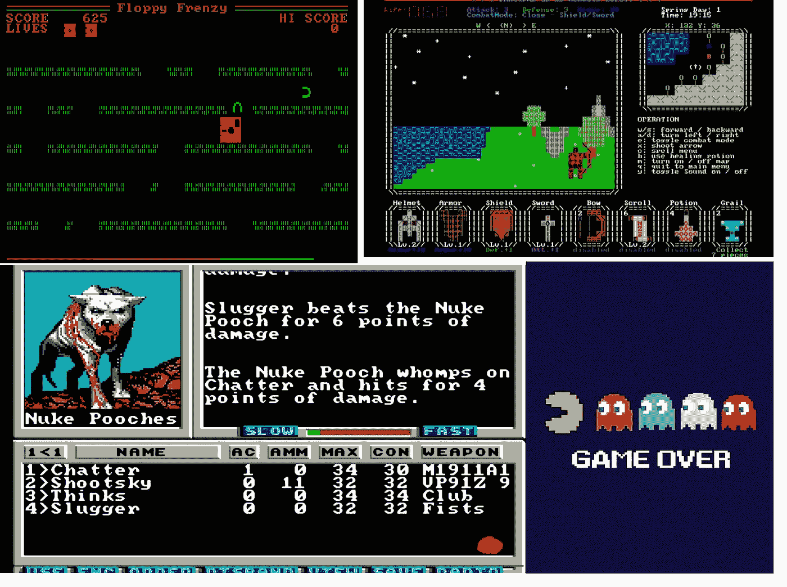
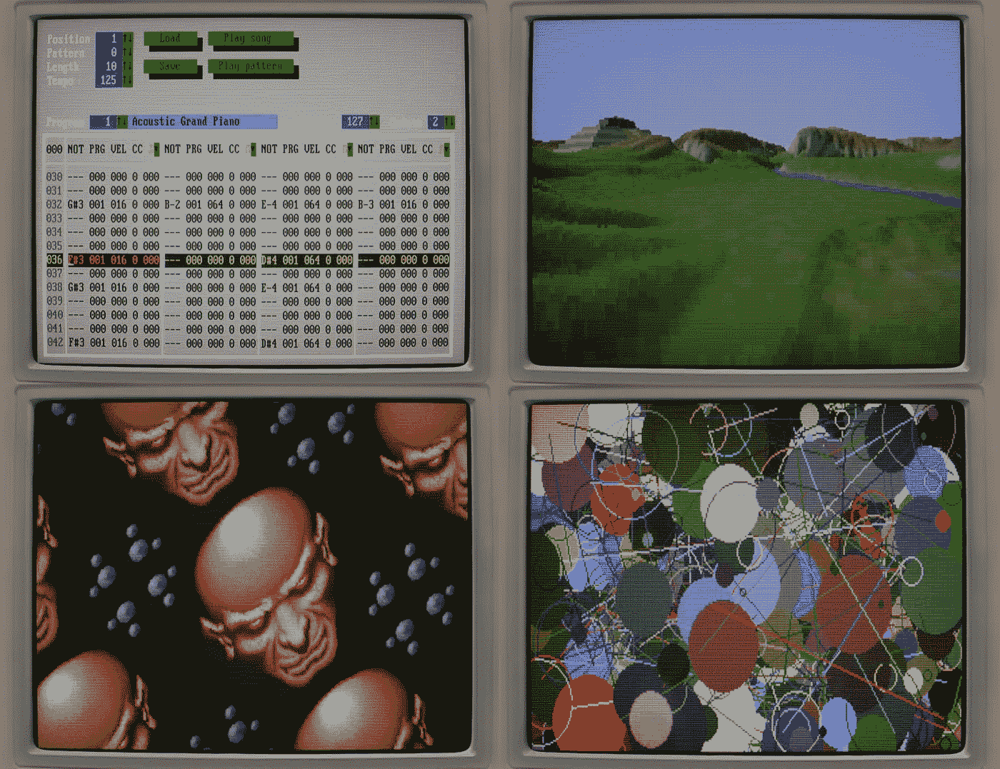
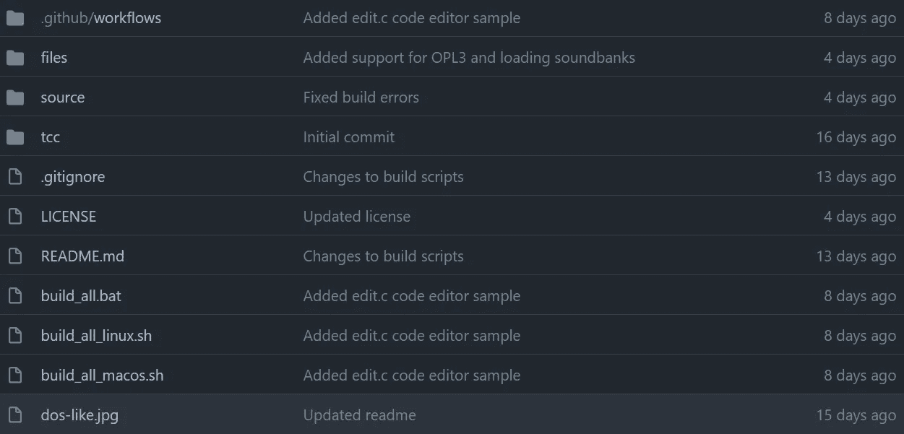
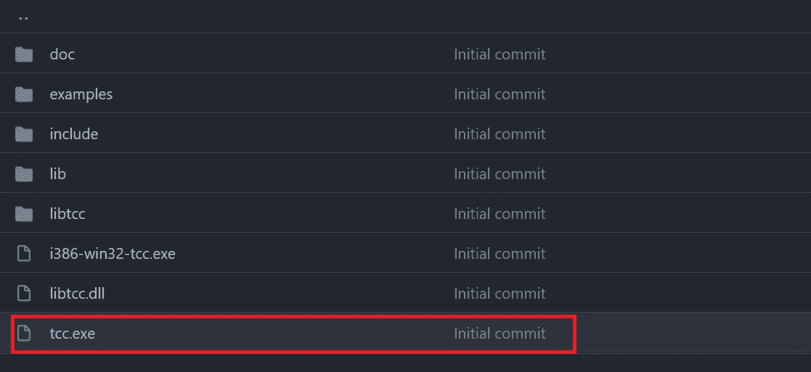
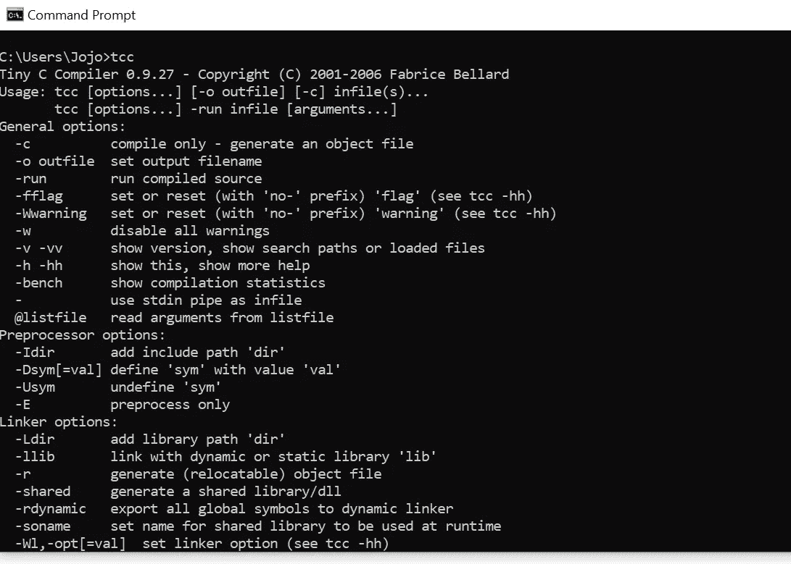
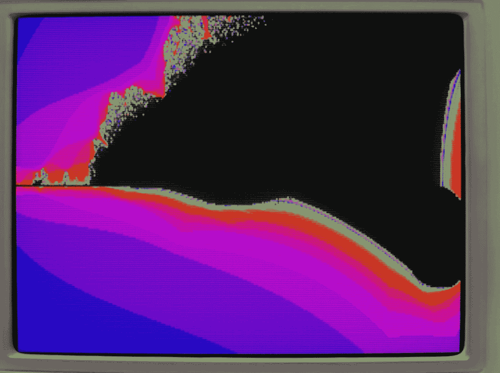

# 用 C 语言回到 90 年代

> 原文：<https://medium.com/nerd-for-tech/back-to-the-90s-with-c-813912228f39?source=collection_archive---------6----------------------->

还记得那些 80 年代和 90 年代的复古游戏吗！



来源:[https://blog . archive . org/2019/10/13/2500-more-ms-dos-games-playable-at-the-archive/](https://blog.archive.org/2019/10/13/2500-more-ms-dos-games-playable-at-the-archive/)、【https://www.lifewire.com/best-ms-dos-games-4058702】T2、[https://boing boing . net/2021/08/27/find-out-about-new-dos-games-at-dos-haven . html](https://boingboing.net/2021/08/27/find-out-about-new-dos-games-at-dos-haven.html)

这些 DOS 游戏会让你们中的一些人非常怀旧。有游戏机和所有东西的美好旧时光。今天，我将向你介绍一个由 Mattias Gustavsson 编写的令人惊叹的 C 库，它可以让你创建这些令人惊叹的复古风格游戏。

*“DOS-like 是一个编程库/框架，有点像一个小型游戏引擎，用于编写与 90 年代初的 MS-DOS 产品类似的游戏和程序。但“类 dos”不是编写能在真正的 DOS 机上运行的代码，而是编写能在 Windows、Mac 和 Linux 等现代平台上运行的程序，但它试图重现旧 DOS 程序的外观、感觉和声音。”*

*   [马蒂亚斯·古斯塔夫松](https://itch.io/profile/mattiasgustavsson) ( **图书馆链接:**[https://mattiasgustavsson.itch.io/dos-like](https://mattiasgustavsson.itch.io/dos-like))

以下是您可以从该网站创建的一些示例片段:



来源:[https://github.com/mattiasgustavsson/dos-like](https://github.com/mattiasgustavsson/dos-like)

现在，让我们开始探索图书馆。事实上，它非常容易安装。首先克隆这个 GitHub 回购:[https://github.com/mattiasgustavsson/dos-like](https://github.com/mattiasgustavsson/dos-like)

目录结构应该如下所示:



编译器位于 **tcc** 文件夹中。



“tcc.exe”是最重要的文件。(*我只涉及 Windows 安装*)你应该把它添加到路径中，这个路径应该像 **path/tcc**

这里的 path 是存储库被克隆的位置。如果 tcc 路径设置正确，您可以在命令提示符下键入 tcc。您应该会看到类似这样的内容:



这意味着库安装正确

现在让我们看几个示例程序。这里作者已经收录了一些例子:[https://github . com/mattiasgustavsson/dos-like/tree/main/source](https://github.com/mattiasgustavsson/dos-like/tree/main/source)

基于 mandelbrot 的例子，我为燃烧的船分形写了程序:

```
// Burning Ship fractal inspired by Port of mandelbrot tutorial code by Lode Vandevenne 
// [https://lodev.org/cgtutor/juliamandelbrot.html#Mandelbrot_Set_](https://lodev.org/cgtutor/juliamandelbrot.html#Mandelbrot_Set_)#include <math.h>
#include <stdlib.h>
#include "dos.h"int main(int argc, char *argv[])
{
  setvideomode( videomode_320x200 );
  setdoublebuffer(1);
  for( int i = 0; i < 32; ++i ) setpal( i, 0, 0, 31 - i );  
  int w = 320;
  int h = 200;//each iteration, it calculates: newz = oldz*oldz + p, where p is the current pixel, and oldz stars at the origin
  double pr, pi;           //real and imaginary part of the pixel p
  double newRe, newIm, oldRe, oldIm;   //real and imaginary parts of new and old z
  double zoom = 1, moveX = -0.5, moveY = 0; //you can change these to zoom and change position
  int maxIterations = 255;//after how much iterations the function should stop
  double zoomSpd = 0.005f;
  for( ; ; ) {
    //loop through every pixel
    for(int y = 0; y < h; y++)
    for(int x = 0; x < w; x++)
    {
      //calculate the initial real and imaginary part of z, based on the pixel location and zoom and position values
      pr = 1.5 * (x - w / 2) / (0.5 * zoom * w) + moveX;
      pi = (y - h / 2) / (0.5 * zoom * h) + moveY;
      newRe = newIm = oldRe = oldIm = 0; //these should start at 0,0
      //"i" will represent the number of iterations
      int i;
      //start the iteration process
      for(i = 0; i < maxIterations; i++)
      {
        //remember value of previous iteration
  if (newRe < 0)
    {
    oldRe = -newRe;
    }
  else{
    oldRe = newRe;
  }
        if (newIm < 0)
    {
    oldIm = -newIm;
    }
  else{
    oldIm = newIm;
  }
        //the actual iteration, the real and imaginary part are calculated

        newRe = oldRe * oldRe - oldIm * oldIm + pr;
        newIm = 2 * oldRe * oldIm + pi;
        //if the point is outside the circle with radius 2: stop
        if((newRe * newRe + newIm * newIm) > 4) break;
      }
      //draw the pixel
      putpixel(x, y, ( i + 32 ) & 255 );
      if( keystate( KEY_ESCAPE ) || shuttingdown() ) exit(0);
    }
    swapbuffers();
    zoom += zoomSpd;
    moveX -= 0.0050109f / zoom;
    zoomSpd *= 1.005;
  }return 0;
}
```

这会产生如下结果:



这是另一个做一些简单图形工作的示例程序。这里我们跟着鼠标指针画圆。


```
#include <stdlib.h>
#include "dos.h"
#include <windows.h>//author: Ujjayanta
int main(int argc, char **argv[]){

 setvideomode(videomode_320x200);

 int x, y;
 POINT xypos;GetCursorPos(&xypos);

 while(!shuttingdown())
 {
  GetCursorPos(&xypos);
  for(int i =0 ; i<5;i++){
   x = xypos.x;
   y = xypos.y;
   setcolor(rand()%256);
   circle(x%320,y%200,4);
  }
  for(int i =0 ; i<5;i++){
   x = xypos.x;
   y = xypos.y;
   setcolor(rand()%256);
   circle(0,0,4);
  }

  if( keystate( KEY_ESCAPE ) ) break;

 }

    return 0;
}
```