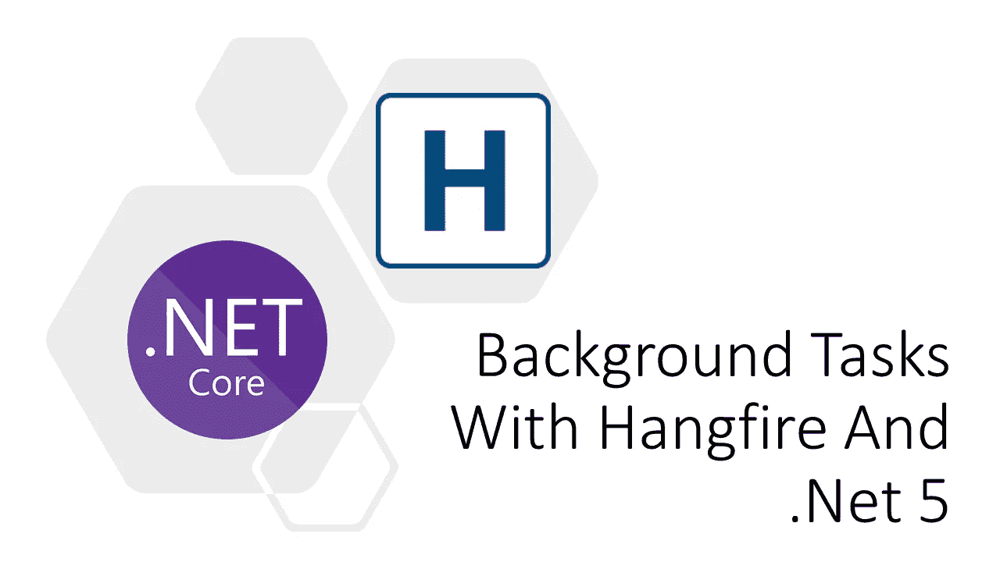
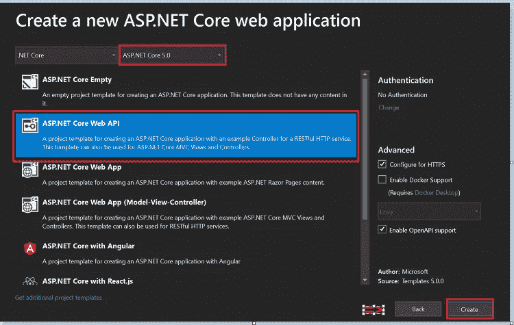
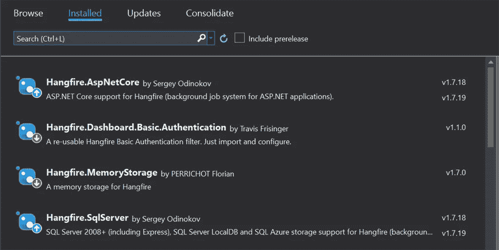
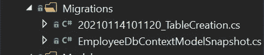
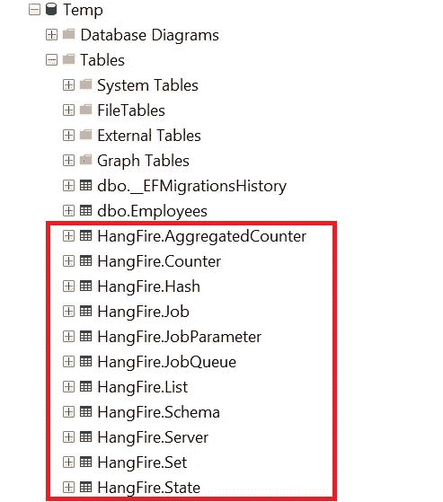
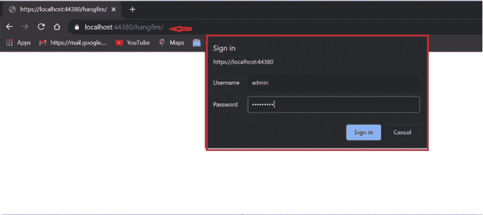
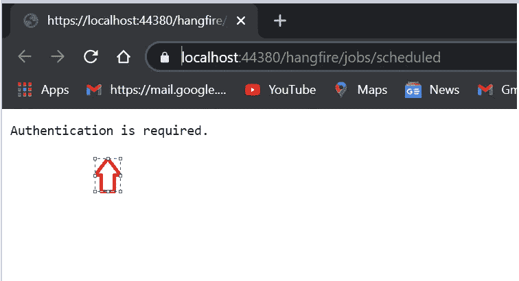

# Hangfire 和。网络 5

> 原文：<https://medium.com/nerd-for-tech/background-tasks-made-easy-with-hangfire-and-net-5-46bbd3b5ac91?source=collection_archive---------1----------------------->

与...交火。Net 5.0

在这篇文章中，我们将学习绞刑。Net 库，使我们的后台任务和工作更容易在 ASP.NET 5.0。众所周知，其新推出的框架于 11 月正式发布。在这里我分享了为[T3 安装 SDK 的链接。net 5](https://dotnet.microsoft.com/download/dotnet/5.0)

**先决条件**

1.  什么是 Hangfire，为什么我需要后台任务。
2.  设置和配置 Hangfire
3.  保护 Hangfire 仪表板。
4.  悬火保留时间。
5.  SQL 数据库的持久性。

# 什么是 Hangfire，为什么我们需要使用它？

Hangfire 是一个. Net 库，有助于在中创建后台任务并简化作业。Net 应用程序。它支持所有类型的任务，如“一劳永逸”和“重复”以及连续作业。你可以在这里了解更多: [*Hangfire*](https://www.hangfire.io/)

**为什么我需要后台任务？**

当您需要执行某项操作或安排某项任务在特定时间执行时，后台任务非常重要。使用后台任务，流程可以在后台继续运行，用户不能等待逐步流程。

**绞刑中的不同工种**

**重复作业** —每 5 分钟运行一次后台任务，并将数据插入数据库。

**一劳永逸** —当我们运行应用程序时，该作业仅运行一次。

**连续作业** —当我们想在那个时候一个接一个地运行作业时，这很有用，这样它就会一个接一个地执行。

**重复作业** —每 5 分钟运行一次后台任务，并将数据插入数据库。

**计划任务** —如果您想要计划一项任务在特定时间运行。

**GitHub**

 [## JayKrishnareddy/Hangfire

### 背景工作-绞刑。净 5。通过在…上创建帐户，为 JayKrishnareddy/Hangfire 的发展做出贡献

github.com](https://github.com/JayKrishnareddy/Hangfire) 

# 设置和配置 Hangfire

使用创建和设置项目模板。网络 5

模板

为了配置 Hangfire，我们需要安装 hangfire 相关的包。下面是帮助配置和设置身份验证以及在 SQL 中存储作业相关信息的 4 个包。

NuGet 包管理器

在这个项目中，我使用后台任务将数据插入数据库——hang fire 和代码优先方法。

**型号**

模型文件夹

**员工。cs**

**AppDbContext**

ApDbContext 文件夹

**employeed context . cs**

**appsettings.js**

在启动文件中配置连接字符串和 Hangfire 以及服务注入。

**Startup.cs**

然后，我们必须在包管理器控制台中使用下面的迁移命令来创建表。

在目标项目中创建迁移文件夹和迁移脚本。

PM >添加-迁移“迁移名称”

迁移文件夹

下一个命令执行迁移脚本并在数据库中创建一个表

PM >更新-数据库

**服务业**

服务文件夹

**EmployeeService.cs**

**IEmployeeService.cs**

服务注入已经在启动时完成了。cs 文件

1.  服务。add transient<iemployeeservice employeeservice="">()；</iemployeeservice>

# 保护悬挂式仪表板

为了确保 hangfire 仪表盘的安全，我们设置了登录验证，以便访问 hangfire 仪表盘。我在 appsettings.js 文件中硬编码了用户名和密码，以使用 startup.cs 中的用户名和密码

**appsettings.js**

**Starup.cs**

# 悬火保留时间

通常，在后台运行的 hangfire 作业将持续 24 小时。为了避免这种情况，我必须在仪表板中启用基本设置，以持续该作业至少 1 周。

**Startup.cs**

1.  全局配置。配置。使用 SqlServerStorage(配置。GetConnectionString("myconn "))。WithJobExpirationTimeout(TimeSpan。from days(7))；

# SQL 数据库的持久性

Hangfire 有一个选项，可以将所有与工作相关的信息存储在数据库中。为此，我们不需要任何东西，我们必须在启动时配置这个设置。它会自动创建所有表格，我们可以在这些表格中看到作业状态和相应的信息。

**Startup.cs**

1.  服务。AddHangfire(c = > c . usesql server storage(Configuration。get connectionstring(" my conn "))；

SQl 自动生成的 hangfire 表

上面这组表是在我们配置设置并指向数据库时自动创建的。

**创建后台任务**

**Job.cs**

有 4 种类型的工作是我们最常使用的。我已经在 startup.cs 文件中创建了所有 4 个作业。

**Starup.cs**

**运行应用程序**

默认情况下，swagger 端点将打开。现在在 URL 中输入 hangfire，去掉 swagger。由于我们已经设置了身份验证机制，它将要求输入用户名和密码。

Hangfire —身份验证

如果你试图在没有登录的情况下访问。

认证错误

如果您单击“jobs”并成功，我们将看到作业执行状态及其时间，还可以在控制面板中看到历史图表。

完整的悬挂式仪表盘

我们可以在选项卡和菜单中看到我们的计划作业和重复作业，我们还可以选择删除您不想再看到的特定作业。

我希望这篇文章能帮助你尽可能容易地创建后台任务！

*支持我*

继续学习…！