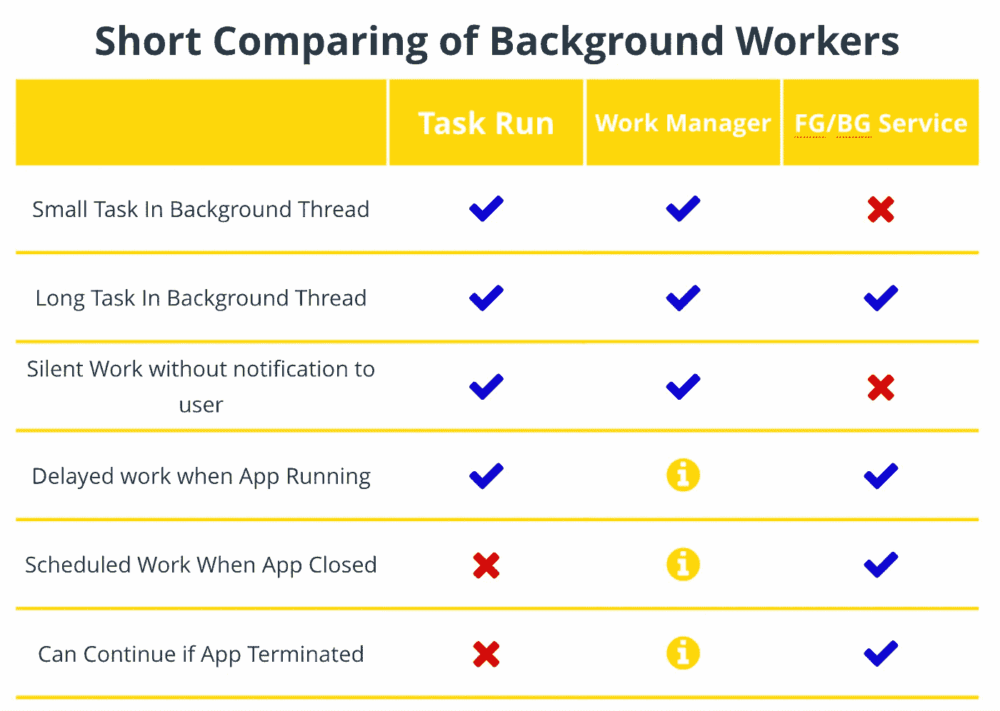
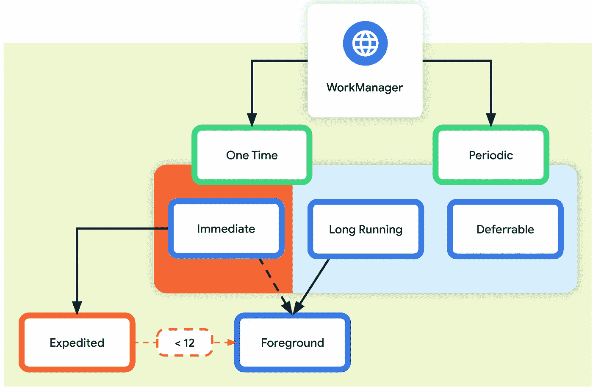

# Xamarin.Forms 中的背景工作。第 1 部分— Xamarin。机器人

> 原文：<https://medium.com/nerd-for-tech/background-work-in-xamarin-forms-part-1-xamarin-android-63f629e73f9?source=collection_archive---------0----------------------->

## 如果我们需要在后台运行一些工作，我们应该选择什么？它应该是一个工人，服务或简单的任务运行。网？让我们来了解一下！

光荣属于乌克兰！荣耀归于英雄

大家好👋！！！有时，我们的移动应用程序必须做一些工作，而不是在 UI 线程中，一些长或短的工作，定期或一次性的工作，我们需要确保它不会被暂停或当应用程序终止时它可以完成。Android 和 iOS 系统为所有这些工作提供了完全不同的方式，这取决于我们希望在后台工作期间分配什么资源。在本文中，我们将只关注 Android。对于 iOS，我们将回到本文的第二部分，这将很快发表。

在本文中，我们将看看并比较在后台运行工作的下一种方法，我们将尝试面对每种方法的优缺点:

*   任务。跑--。Net 在后台线程中运行工作的本机方式
*   worker——在原生 Android 应用中持续工作的推荐解决方案
*   服务——一个可以在后台执行长时间运行操作的[应用组件](https://developer.android.com/guide/components/fundamentals#Components)

这里我们有多种选择，取决于我们工作的数量和不同程度，我们可以注册多个接口并运行多个服务/工作者。但是对于我们的例子，我们将有一个与 work `Func<Task>`的通用接口，并且我们将使用来自 MvvmCross 的 IoC 容器用于 Xamarin。表单 NuGet 包。

在 Android 中，我们将在后台做什么并不重要，所以让我们假设我们的`Task`将检查数据库，并尝试在我们有互联网连接的情况下推送不同步的更改。再说一次，展示这部分代码太简单了，所以想象一下，我们用所有坚实的原则以正确的方式这样做，等等。

当应用程序关闭或终止时，ℹ️工作管理器可能会运行计划的/重复的工作，但 Android 系统不保证这一点🤨🧐，是的，这不是保证，实际上从来没有为我预期的工作，但我发现在 StackOverflow 有人工作。

# Android 后台/前台服务

在我们开始之前，让我给你一个官方文档的[链接](https://developer.android.com/guide/components/services)，我们准备好了。

首先，让我们定义一个将启动后台服务的普通工人。是的，它可以是同一个类，也可以是两个不同的类。在我的例子中，服务将通过注册为 Singleton 的 DI 和接口连接两个不同的类。在您的代码中，这可以是从本机服务和您的全局接口继承的一个接口和一个实现；由你决定😋

服务本身如果`SDK < 26`可以是后台，如果 SDK 更高可以是前台。但是每个服务都需要构建一个通知块，它将向用户显示它实际在做什么。在我的例子中，我使用 AppResources RESX 文件来保存所有本地化的字符串。

首先，我们需要用适当的`Activity Flag`(在我们的例子中是`ActivityFlags.NoUserAction`)来创建和意图。然后用`Notification Builder`我们需要从 Android 资源中设置带有图标和颜色的标题和描述文本。

 [## ActivityFlags 枚举(Android。内容)

### 枚举由几种类型返回并作为几种类型的参数的值。

docs.microsoft.com](https://docs.microsoft.com/en-us/dotnet/api/android.content.activityflags?view=xamarin-android-sdk-12) 

如果 SDK 是`26`或以上，我们还需要`Notification Channel`，在这里我们可以设置灯光、震动、重要性等选项。

# 带有工作管理器的 Android Worker

[https://developer . Android . com/topic/libraries/architecture/work manager](https://developer.android.com/topic/libraries/architecture/workmanager)

这项工作与任务很相似。在大多数情况下，当我们需要在后台立即进行一些工作时，运行。但是，如果我们需要创建重复性工作或一些特定的长时间工作，这是推荐的解决方案。

[工作管理器处理三种类型的持续工作](https://developer.android.com/topic/libraries/architecture/workmanager):

*   **立即**:必须立即开始并尽快完成的任务。可能会加快。
*   **长时间运行**:可能运行更长时间的任务，可能超过 10 分钟。
*   **可推迟的**:在稍后时间开始并可以定期运行的计划任务。

从`doWork()`返回的`[Result](https://developer.android.com/reference/androidx/work/ListenableWorker.Result)`通知工作管理器服务工作是否成功，以及在失败的情况下，是否应该重试工作。

*   工作顺利完成。
*   `Result.InvokeFailure()`:工作失败。
*   `Result.InvokeRetry()`:工作失败，应根据其[重试策略](https://developer.android.com/topic/libraries/architecture/workmanager/how-to/define-work#retries_backoff)在其他时间重试。

添加一些日志程序来获取在不同设备上使用的真实应用程序的一些结果，并记录我们的员工实际上是如何工作的，这真的很有用。此外，你可能想知道— *为什么我在等待* `*task*`？因为我们已经在由 Android 操作系统管理的后台线程中，并且与`async/await`时有问题，所以我想只在`work result`结束时才返回它。

为了运行我们的工作，我们在周期性工作的情况下设置了所需的启动约束和间隔。有关结果政策和我们员工可观察状态的更多信息，请点击此处:

[https://developer . Android . com/topic/libraries/architecture/work manager/how-to/States-and-observation](https://developer.android.com/topic/libraries/architecture/workmanager/how-to/states-and-observation)

# 旧好任务->运行

这是一个跨平台的实现，如果你只需要在应用程序运行时在后台任务中运行一些代码，那么`Task.Run`是一个完美的解决方案。我觉得没什么好解释的，只是补充一下，如果你因为某种原因想要等待，你可以很容易地将`void`改为`Task`

感谢阅读；我希望它对你有用。请在 Medium 上关注我，同时也关注我的 [Twitter 账户](https://twitter.com/bbenetskyy)

