# Xamarin.Forms 中的背景工作。第 2 部分— Xamarin.iOS

> 原文：<https://medium.com/nerd-for-tech/background-work-in-xamarin-forms-part-2-xamarin-ios-ff22037a7b60?source=collection_archive---------0----------------------->

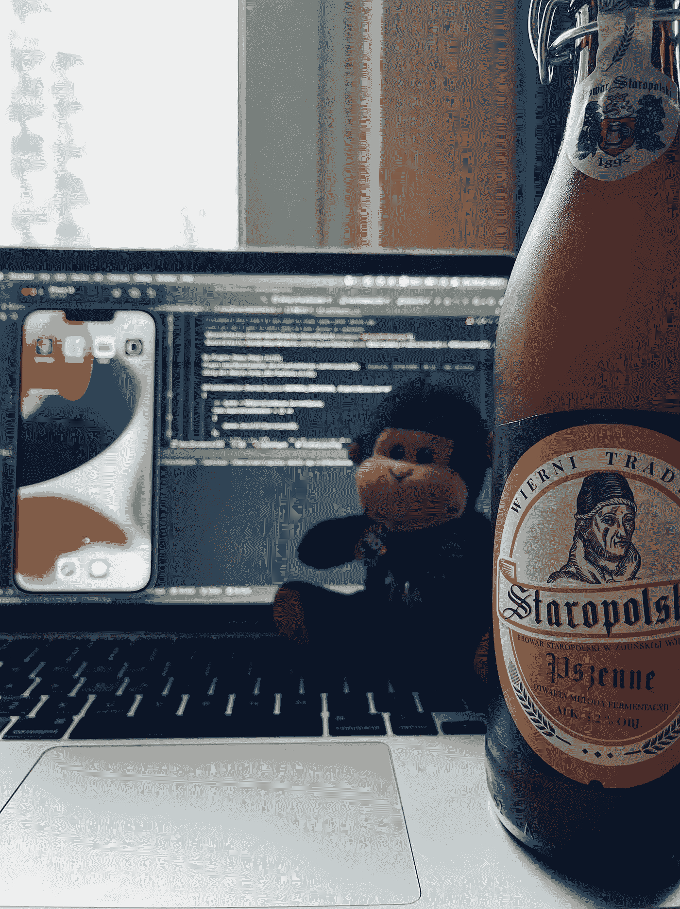

## 这一次，我们将讨论在 iOS 设备上运行后台程序的可能解决方案。我们将触及位置更新和区域监控，因为这是最常见的情况。

大家好👋！！！正如副标题中提到的，我们将触及位置更新和区域监控，因为这是最常见的情况，但其他更新，如后台推送通知、音频或 AirPlay 将不会被涵盖，因为这是非常具体的用法，更适合设备在自己单独的博客帖子中使用。

 [## Xamarin.Forms 中的背景工作。第 1 部分— Xamarin。机器人

### 如果我们需要在后台运行一些工作，我们应该选择什么？它应该是一个工人，服务或简单的任务运行…

medium.com](/nerd-for-tech/background-work-in-xamarin-forms-part-1-xamarin-android-63f629e73f9) 

任务。运行—本机。Net 运行后台任务的方式已经在第 1 部分很好地介绍过了，我想刚刚提到的是，它为 iOS 提供了同样的可能性，以及同样的优点和局限性。这里要提一点很重要的是，在 iOS 应用被隐藏后不久，它就停止执行所有后台任务。这就是为什么如果你想确保你已经完成了你的工作或者你的任务可能需要一些值得注意的时间，你需要使用`BGTaskScheduler`。

这两部分的所有源代码都可以从 GitHub 获得:

 [## GitHub-bbenetskyy/IOs-BG-worker

### 此存储库已由所有者存档。它现在是只读的。此时您不能执行该操作。你…

github.com](https://github.com/bbenetskyy/ios-bg-worker) 

# 用`BGTaskScheduler`运行原生后台任务

在我们开始之前，我需要提一下，我们将实现在博客的 [Part #](/nerd-for-tech/background-work-in-xamarin-forms-part-1-xamarin-android-63f629e73f9) 1 中创建和使用的 [IBackgroundWorker](https://gist.github.com/bbenetskyy/1ae9beb57705bf281a7418d329d95a53) 。请到那里复制它的定义。

为了展示它是如何工作的，我将创建重复的工作。后台工作将什么都不得到，并在被调用时记录到屏幕时间。

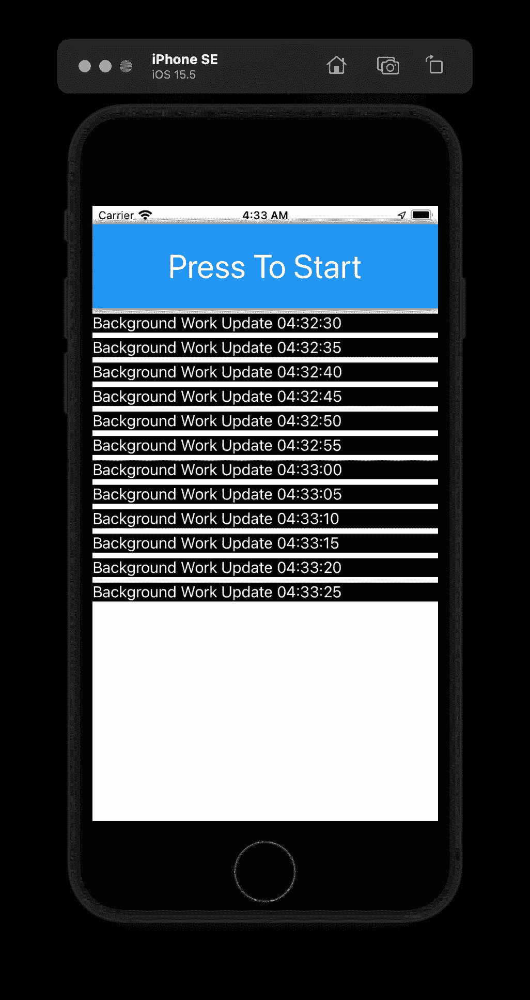

背景工作更新

为了达到这个目的，我们需要给`NSTimer -> CreateRepeatingScheduledTimer`设置一些冷却时间。对于这个例子，我将使用 5 秒，但苹果公司建议使用 5 到 15 分钟进行这样的重复，但如果你的任务需要更多的执行时间或更长的延迟，30 分钟也可以。

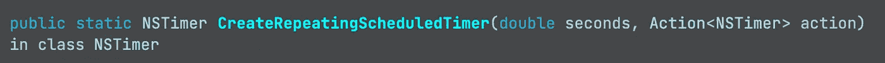

`CreateRepeatingScheduledTimer definition`

作为一个动作，我们将通过一个超时回调来传递我们将要创建`taskId`的函数，以确保我们完成该任务。

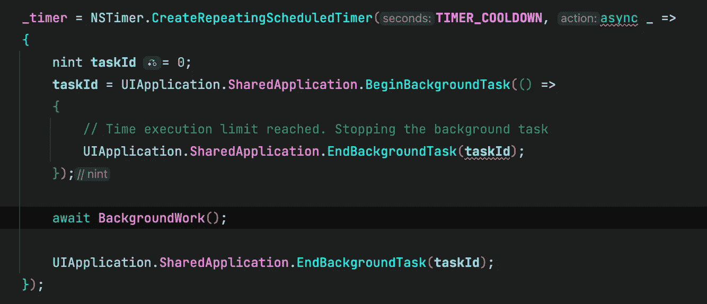

NSTimer 的设置

下一步是在`info.plist`文件中注册我们的背景模式和背景标识符

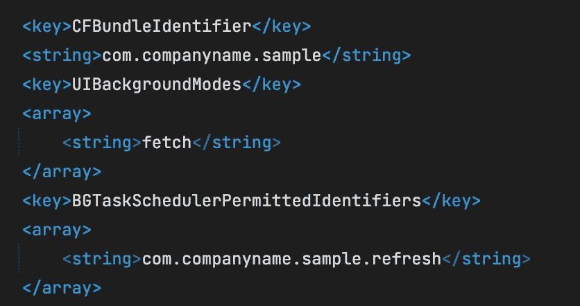

后台任务更新的 info.plist 设置

下一步是在`AppDelegate -> FinishedLaunching`内部注册我们的后台工作人员。这里我们需要在共享任务调度器内部注册由我们的`CFBundleIdentifier`新建的`NSOperationQueue`。在共享应用程序中，设置最小的后台获取时间间隔。这里推荐使用 iOS 提供的`UIApplication.BackgroundFetchIntervalMinimum`。

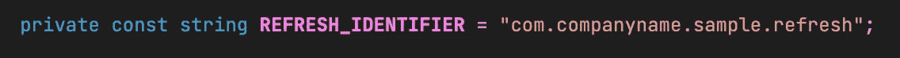

刷新标识符常数

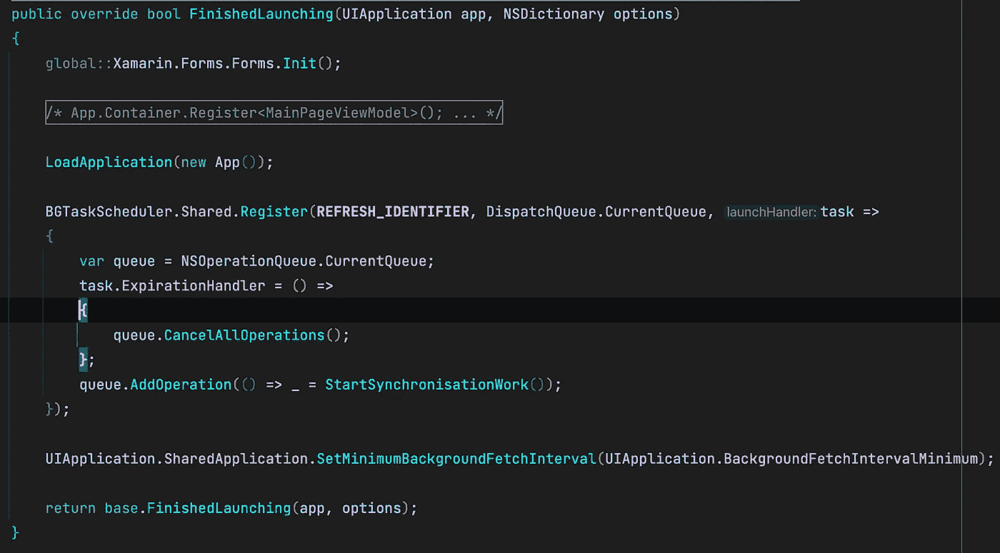

AppDelegate FinishedLauching 方法

我们的启动处理程序任务将询问我们的后台工作程序是否有任何可用的工作，如果有任何可用的工作，就运行它。当我们的应用程序隐藏时，所有这些都将在后台执行。

> 但是如果你完全关闭你的应用程序，iOS 系统将不会调用你的后台工作，因为你需要寻找一些自定义推送通知或类似的解决方法。

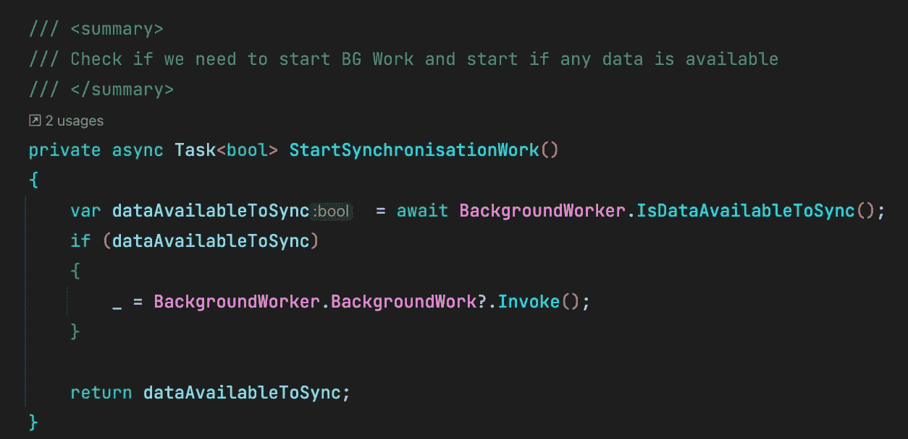

开始后台同步工作

后台工作器实现

[您可以在存储库中找到 AppDelegate 代码。](https://github.com/bbenetskyy/ios-bg-worker/blob/master/sample/sample/sample.iOS/AppDelegate.cs)

我们需要做的最后两件事是:

1.  当系统执行 Fetch 时，我们需要返回任何新数据是否可用的信息。

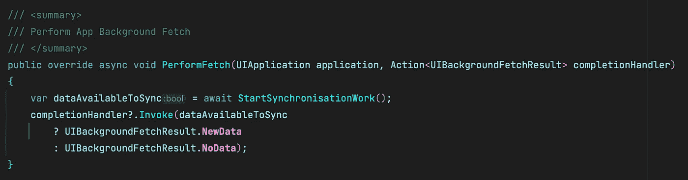

执行提取方法

2.向后台调度程序提交一个关于我们共享的后台工作程序的请求，这是我们在`FinishedLaunching`方法中设置的

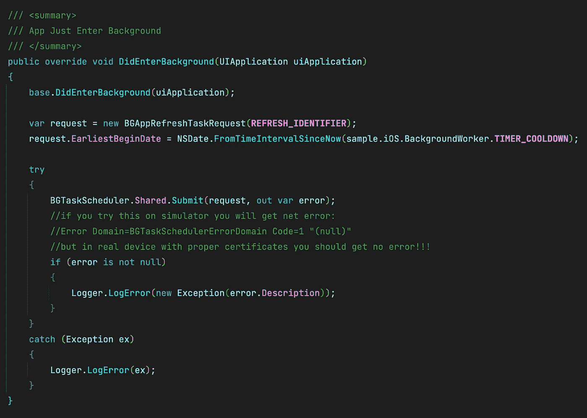

确实进入了后台方法

# iOS 中的位置更新

这次我们从`info.plist`设置开始。我们需要设置位置使用描述和多一个背景模式

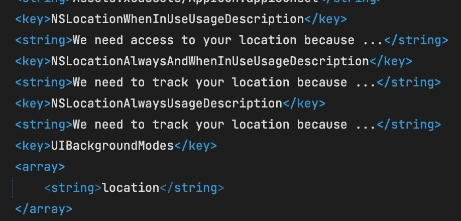

info.plist 后台位置更新和区域监控设置

这里重要的是，如果我们想在后台接收位置更新，设置并稍后请求`Location Always`

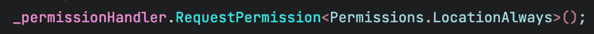

请求位置总是权限

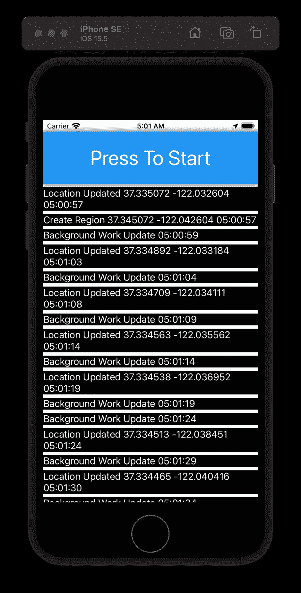

位置和区域工作更新

现在我们可以通过在`CLLocationManager`订阅事件`LocationsUpdated`来设置位置更新。

为此，我们需要:

1.  创建`CLLocationManager`的实例
2.  禁用自动位置暂停
3.  除了我们的许可请求之外，如果系统版本高于 8(所以每次🤪)
4.  而如果系统版本高于 9(所以每次🤪)我们需要允许后台位置更新
5.  之后，如果位置服务可用，我们可以设置所需的精度并订阅位置更新
6.  做完这些后，我们可以开始更新位置了🤩

您可能注意到了，我检查了上次执行时间，并且每隔一段时间(延迟)才运行一次自己的事件。如果您想接收任何位置更新(如果您在高速公路上，每秒钟会发生多次事件)，只需移除那个`if`就可以了。

与之前的模拟器截图相比，下面是模拟`Freeway Drive`的效果:

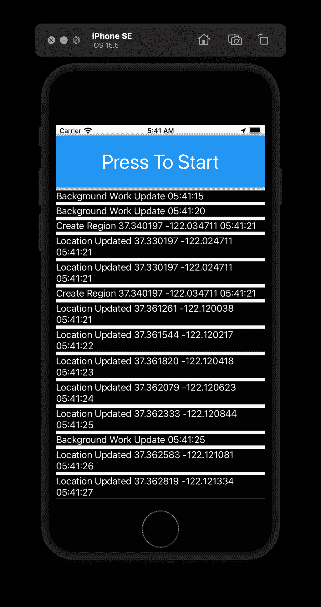

随时更新位置，没有任何延迟

# iOS 中的区域监控

令人惊讶的是，这里几乎和我们的位置更新一样，相同的权限，相同的信息列表修改。所以让我们立即进入肉的部分😝。

1.  创建`CLLocationManager`的实例
2.  禁用自动位置暂停
3.  除了我们的许可请求之外，如果系统版本高于 8(所以每次🤪)
4.  而如果系统版本高于 9(所以每次🤪)我们需要允许后台位置更新
5.  之后，如果定位服务可用并且**监控服务可用**
6.  我们可以设置所需的精度并订阅`region`事件
7.  做完这些后，我们可以开始更新位置了🤩

这就是我想在这两个博客帖子中涵盖的所有内容😆关于在 Android 和 iOS 中运行一些常见的后台任务。希望这些能帮助你决定什么时候使用`.Net Task.Run`，什么时候使用本地解决方案。

